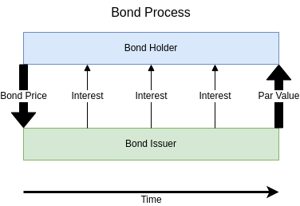
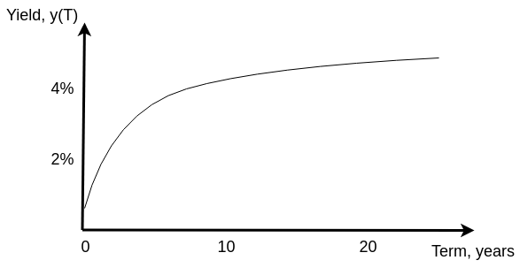

# Bonds

- [Bonds](#bonds)
  - [Introduction](#introduction)
  - [Bond Pricing Model](#bond-pricing-model)
  - [Yield to Maturity](#yield-to-maturity)
  - [Yield Curves](#yield-curves)
    - [Discount and Spot Rate Curves](#discount-and-spot-rate-curves)
    - [Building a Yield Curve](#building-a-yield-curve)

## Introduction

- Bonds can be regarded as a *debt instrument*, whereby the "owner" of the bond is also the "owner" of a debt. Debt can therefore be traded on the bond and money markets.
- Bonds are created when a **bond issuer** first offers bonds for sale on a market. These bonds are then purchased by **bond holders** (also known as **bond buyers** ).
- The price of the bond represents the amount loaned to the bond issuer by the bond holder - i.e. the debt.
- The price of a bond (i.e. the principal of the loan) is called the **par value** or **face value**.

  

- Bonds can be bought and sold after issue on the markets and will have a **market value** - this is rarely the same as the par value.

## Bond Pricing Model

- There will be specified points of time in the future where interest will be paid. These can be denoted as $t_1$, $t_2$, ... , $t_N$.
- The interest payments, commonly called **coupons**, made at these points in time can be denoted $c_1$, $c_2$, ... , $c_N$.
  - *N.B. The **coupon rate** is the annualised interest rate that a bond pays, allowing for bonds with different periodic interest payments to be compared.*
- The payment $c_N$ at time $t_N$ is the par value.
- The bond holder receives this stream of payments and the bond can be valued through [discounted cash flow analysis](2_interest-rates.md#discounted-cash-flow-analysis).
- The value of the bond $P$, is the present value of the coupons and par value:

$$P = \sum_{i=1}^{N}d(t_i)c_i$$

- The bond value $P$ is the **dirty price** as it has not taken into account the accrued interest from the earliest coupon $c_1$. Bonds on the secondary market do not trade at the dirty price.

## Yield to Maturity

- A bond's yield is a measure of its return on investment and can be measured in different ways.
- A simple measure of yield is the coupon rate paid by the security.
- The **current yield** is the annual coupon value divided by the price of the bond.
- The most commonly used yield is the **yield to maturity**, defined as a specific interest rate $y$, at which the market price of a bond would be recovered if all payments were discounted by it.
- With coupons $c_1$ to $c_J$ paid at times $T_1$ to $T_J$ (assuming that $C_J$ is the par value paid at time $T_J$), we can define the market value of a bond for an annually compounded yield to maturity $P$, as follows:

$$P = \sum_{j=1}^{J}\frac{c_j}{(1 + y)^{T_j}}$$

- For a periodically compounded yield to maturity $y$, with $m$ periods per year, the bond price is as follows:

$$P = \sum_{j=1}^{J}\frac{c_j}{(1 + \frac{y}{m})^{mT_j}}$$

## Yield Curves

- A yield curve quantifies the relationship between the return of a fixed income security and its term.
- On any single yield curve, the different instruments displayed should be *equivalent* (have the same credit quality), differing only by maturity. For example, yields on US Treasury Bonds should not be displayed on the same yield curve as yields for highly distressed corporate bonds.

  

- **N.B.** The commonly referenced US Treasury yield curve is constructed using yields to maturity and is ***not*** a spot rate curve.

### Discount and Spot Rate Curves

- Discount curves are one of the primary application of yield curves.
- A discount curve is the relation between time $T$ and the discount factor $d(T)$, which corresponds to discounting back from any value of $T$.
- A continuously compounded **spot rate curve** is a special kind of yield curve where the discount factor for a continuously compounded interest rate is used for the yield curve $y(T)$:
$$d(T) = e^{-y(T)T}$$
- For a term $T$, the present value of 1 USD paid at time $T$ can be represented as $d(T)$.
  - Similarly, a spot rate $y(T)$ can be defined as the interest rate a credit issuer would charge for a loan over a term $T$ (even if there is no such instrument currently trading on the markets).
  - The corresponding spot rate curve $y(T)$ can also be expressed in terms of the discount curve $d(T)$:
$$y(T) = -\frac{log(d(T))}{T}$$

### Building a Yield Curve

- For $N$ fixed income securities with maturities at times $T_{1}, T_{2}, ..., T_{N}$, the yields are calculated from the respective market prices as: $y(T_{1}), y(T_{2}), ..., y(T_{N})$.
- The times $T_{1}$ to $T_{N}$ are known as the **tenors** and are usually the maturities or expiration dates of the traded calibration instruments.
- Interpolation is used to extend the yield curve from a finite set of tenors to the entire interval $T_{1}$ to $T_{N}$.
