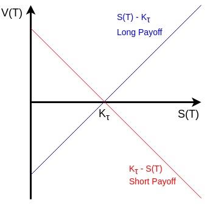
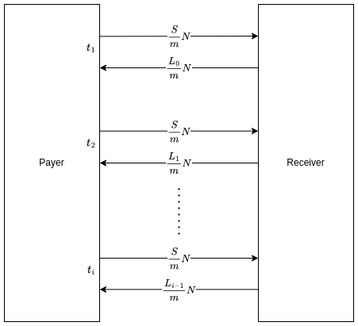

# Forwards, Futures, and Swaps

- [Forwards, Futures, and Swaps](#forwards-futures-and-swaps)
  - [Derivatives Introduction](#derivatives-introduction)
    - [Derivative Products](#derivative-products)
    - [Derivative Markets](#derivative-markets)
    - [Assumptions](#assumptions)
  - [Forwards](#forwards)
    - [Settlement](#settlement)
    - [Payoffs](#payoffs)
    - [Pricing Contracts on an Underlying Asset with No Income](#pricing-contracts-on-an-underlying-asset-with-no-income)
    - [Cash and Carry Arbitrage](#cash-and-carry-arbitrage)
      - [Zero Coupon Bond Example](#zero-coupon-bond-example)
      - [Stock (No Dividends) Example](#stock-no-dividends-example)
      - [Asset Paying a Known Income Example](#asset-paying-a-known-income-example)
    - [Pricing Forward Contracts](#pricing-forward-contracts)
      - [Underlying Asset with Known Income](#underlying-asset-with-known-income)
      - [Underlying Asset with Known Yield](#underlying-asset-with-known-yield)
      - [Underlying Asset with Dividends](#underlying-asset-with-dividends)
    - [FX Forwards](#fx-forwards)
      - [Pricing FX Forwards](#pricing-fx-forwards)
      - [Interest Rate Parity Relationship](#interest-rate-parity-relationship)
      - [Example 1: Euros and US Dollars](#example-1-euros-and-us-dollars)
      - [Example 2: Australian Dollars and US Dollars](#example-2-australian-dollars-and-us-dollars)
  - [Futures](#futures)
    - [Futures Exchanges and Products](#futures-exchanges-and-products)
    - [Futures Prices](#futures-prices)
      - [Convergence of Futures Prices to Spot Prices](#convergence-of-futures-prices-to-spot-prices)
      - [Futures Prices versus Forward Contract Prices](#futures-prices-versus-forward-contract-prices)
    - [Futures Marking to Market (Settlement)](#futures-marking-to-market-settlement)
      - [Marking to Market Example](#marking-to-market-example)
      - [Margin Accounts](#margin-accounts)
      - [Futures Settlement versus Forwards Settlements](#futures-settlement-versus-forwards-settlements)
    - [Futures Hedging](#futures-hedging)
      - [Cash Market Exposure](#cash-market-exposure)
      - [Risk Management using Futures Hedging](#risk-management-using-futures-hedging)
      - [Futures Hedging Example 1: Oil Refinery](#futures-hedging-example-1-oil-refinery)
      - [Basis Risk](#basis-risk)
        - [Commodity Basis Risk](#commodity-basis-risk)
        - [Basis Risk Example](#basis-risk-example)
      - [Futures Hedging Example 1: FX Futures](#futures-hedging-example-1-fx-futures)
      - [Futures Hedging Example 2: Copper Futures](#futures-hedging-example-2-copper-futures)
    - [Speculation and Leverage](#speculation-and-leverage)
      - [Speculation Example](#speculation-example)
  - [Forward Interest Rates](#forward-interest-rates)
    - [Simple Interest](#simple-interest)
    - [The LIBOR Curve](#the-libor-curve)
      - [LIBOR Curve Example](#libor-curve-example)
      - [Applying Arbitrage Principals to Construct the LIBOR Curve](#applying-arbitrage-principals-to-construct-the-libor-curve)
    - [Forward Rate Agreements](#forward-rate-agreements)
      - [FRA Example](#fra-example)
      - [FRA Valuation](#fra-valuation)
        - [FRA Valuation Example](#fra-valuation-example)
  - [Eurodollar Futures](#eurodollar-futures)
    - [Eurodollar Futures Contract Specification](#eurodollar-futures-contract-specification)
    - [Eurodollar Futures Example 1: Contract Futures Rate Calculation](#eurodollar-futures-example-1-contract-futures-rate-calculation)
    - [Eurodollars Futures Example 2: Marking to Market](#eurodollars-futures-example-2-marking-to-market)
  - [Swaps](#swaps)
    - [Interest Rate Swaps](#interest-rate-swaps)
      - [Usages of Interest Rate Swaps](#usages-of-interest-rate-swaps)
      - [Swap Cash Flows](#swap-cash-flows)
      - [Interest Rate Swaps Example](#interest-rate-swaps-example)
    - [Pricing Swaps](#pricing-swaps)
      - [Fair Swap Rate](#fair-swap-rate)
    - [Swaps Example 1: Interest Rate Swap](#swaps-example-1-interest-rate-swap)
    - [Swaps Example 2: Hedging Interest Rate Rises](#swaps-example-2-hedging-interest-rate-rises)
  - [Building the LIBOR Curve using Money Market Instruments](#building-the-libor-curve-using-money-market-instruments)
    - [LIBOR Curve Bootstrapping Example](#libor-curve-bootstrapping-example)
      - [Deposits: out to 3 months](#deposits-out-to-3-months)
      - [Futures: 6 months out to 18 months](#futures-6-months-out-to-18-months)
      - [Swaps: 2 years out to 4 years](#swaps-2-years-out-to-4-years)

## Derivatives Introduction

- Derivatives are financial products or assets whose structure and value is derived from another asset.
- The base asset is called the **underlying asset** (generally referred to as the underlying).
- The derivative is linked to the underlying through revenues paid to the holder of the derivative product - these revenues are known as **payoffs**.
  - The payoffs of a derivative are generally determined by the price of the underlying asset at a set point during the derivative contract's life - often the expiration date of the contract.
  - Arbitrage is the main tool for linking the derivative's value to its underlying.
- The price of the underlying asset is referred to as the **cash price** or **spot price** to distinguish it from the price of its derivatives.
- The underlying asset is traded on the **cash market**, assuming it is a cash product (not always the case).
- The profit and loss is the change in the value of an investment or financial position(s) and is usually shortened to **P&L**.

### Derivative Products

- **Forwards**/**futures**: contracts that lock in a price that two parties will exchange an asset for at a set future date.
- **Options**: contracts that give one party the right, but not the obligation, to exchange an asset.
- **Swaps**: contracts that allow two parties to exchange cash flows or liabilities from two different financial instruments. Interest rate swaps are the most common, facilitating a swap between a floating interest rate and a fixed one.

### Derivative Markets

- Markets can be divided into **over the counter (OTC)** or on organised **exchanges**.
- OTC markets consist of deals between two counterparties that make private deals within financial regulations (little price transparency).
- Exchanges, such as the Chicago Mercantile Exchange (CME), allow for more standardised products and regulated trading which are visible to all market participants (price transparency).
- Generally, exchange-traded products are much more liquid than OTC products and have a less exposure to **counterparty credit risk** (risk of one counterparty failing to meet their obligations).
  - The exchange acts as a counterparty to every deal made with its clients and are subject to strict regulations.
  - With OTC deals, there is always a major concern than one counterparty will default.
- OTC markets allow for more customisable deals to be made between broker-dealers and clients, or between broker-dealers themselves.
- Following the 2008 financial crisis, there has been a push to move OTC products onto exchanges.

### Assumptions

- Transactions costs are zero.
- Unlimited investing and borrowing at the risk-free rate.
- No restrictions on short selling assets.

## Forwards

- A forward contract is an agreement between a buyer and seller where the seller agrees to sell an asset to the buyer at a set point in the future at a price agreed upon entering into the contract.
- By definition, forward contracts are traded on OTC markets and are often highly customised.
- Generally, one of the counterparties is a financial institution or dealer, whilst the other counterparty is an end user of another dealer.
- Forwards are usually used to hedge against changes in price.
- Terminology:
  - **Long position**: position of the buyer
  - **Short position**: position of the seller
  - **Expiration date or expiry**: agreed date on which the transaction will take place
  - **Forward price**: the agreed transaction price
- The **underlying asset** will be the asset that is traded at the forward contract's expiration date.
- The forward contract is priced such that the value is 0 at the time of entering into the contract.

### Settlement

- At the expiration date, forward contracts can be **settled by delivery** or by **cash settlement**.
- Settlement by delivery involves the seller exchange the underlying asset for the contract price with the buyer.
- In a cash settled deals, the party with the negative cash position at the expiry compensates the other party with cash.
- Due to the customised nature of the deals, forward contracts are illiquid securities and are usually held until expiry.

### Payoffs

- The revenue a particular counterparty earns from a derivative contract is referred to as the **payoff**.
- With forward contracts, neither the long position nor the short position receive any payment from the contract until the expiry date.
  - Therefore at expiration, the values of the long and short positions in a forward contract are equal to the long and short payoffs respectively.
- The payoff for a long position in a forward contract can be modelled as follows:
  - Using the following notation:
    - $S(t)$ as the price of the underlying asset at time $t$.
    - $K_{\tau}$ as the forward price for expiry $\tau$.
    - $T$ as the expiration (expiry date).
    - $V(t)$ as the value of the long position at time $t$.
  - At expiration of the contract, the underlying is transferred to the long position from the short position - the long position receives an asset (cash flow) with value $S(T)$.
  - The long position must pay the short position the forward price $K_{\tau}$ to receive the asset - this should be deducted from the value received in order to calculate the long position's payoff.
$$V(T) = S(T) - K_{\tau}$$
- Similarly, the short position's payoff is:
$$-V(T) = K_{\tau} - S(T)$$
- Graphically, this can be represented as follows:

    

### Pricing Contracts on an Underlying Asset with No Income

- The value of the **long position**, $V(T) = S(T) - K_{\tau}$, can be calculated by using the Law of One Price and constructing a portfolio which models the payoff at time $t = T$.
  - $S(T)$ can be modelled by holding the underlying asset in the portfolio.
  - $-K_{T}$ can be modelled as a cash payment (debt) discounted at time $t = 0$. This discounted (absolute) value is calculated by $e^{-rT}K_{T}$.
  - The future value of this debt at time $t$ can then be calculated by $e^{rt}\left(e^{-rT}K_{T}\right)$.
  - The value of this portfolio at time $t$ is modelled as follows:
$$V(t) = S(t) - e^{rt}\left(e^{-rT}K_{T}\right)$$
$$\boxed{V(t) = S(t) - e^{-r(T-t)}K_{T}}$$
- This model can be validated by showing that at time $t = T$, the value of the portfolio is equal to $S(T) - K_{T}$:

```math
\begin{aligned}
V(T) &= S(T) - e^{-r(T-T)}K_{T} \\
&= S(T) - e^{0}K_{T} \\
&= S(T) - K_{T} \\
\end{aligned}
```

- Using the Law of One Price, the value of the forward contract $V(t)$ at any time $t < T$ must be equal to the value of the portfolio.
- Similarly, the payoff of the **short position** can be modelled as:
$$\boxed{-V(t) = e^{-r(T-t)}K_{T} - S(t)}$$
- The forward price $K_{T}$ is set such that the value of the forward contract at $t = 0$ will be zero: $V(0) = 0$ and can be calculated as follows:
$$V(0) = S(0) - e^{-r(T-0)}K_{T} = 0$$
$$\Longrightarrow S(0) - e^{-rT}K_{T} = 0$$
$$\therefore S(0) = e^{-rT}K_{T}$$
$$\boxed{K_{T} = e^{rT}S(0)}$$

### Cash and Carry Arbitrage

- Forward prices may be deduced from two arbitrage strategies: the cash and carry arbitrage, and the reverse cash and carry arbitrage.
- Recall the forward price, $K_{T} = e^{rT}S(0)$, where $S(t)$ is the underlying spot price, $r$ is the risk-free rate and $T$ is the expiration date of the forward contract.
- If $K_{T} > e^{rT}S(0)$, a **cash and carry arbitrage** can be constructed and therefore this inequality will never be present. The portfolio can be constructed as follows:
  - Take a short position in the forward contract.
  - Borrow $S(0)$ in cash at the risk-free rate and purchase the underlying with the proceeds.
  - The portfolio has three components:
    1. the short forward position
    2. the underlying asset
    3. a debt of $S(0)e^{rt}$ at time $t$
  - This portfolio is held until time $T$, at which point the short forward position (1) is exited by transferring the underlying asset (2) to the long forward position (counterparty) for the  contract price $K_{T}$.
  - The debt of $S(0)e^{rT}$ (3) can be repaid, leaving a **profit** of $K_{T} - e^{rT}S(0)$.
- Similarly $K_{T} < e^{rT}S(0)$ will lead to a **reverse cash and carry arbitrage** by constructing the following portfolio:
  - Take a long position in the forward contract.
  - Take a short position in the underlying and invest the proceeds $S(0)$ at the risk-free rate.
  - The portfolio has three components:
    1. the long forward position
    2. the short position in the underlying asset
    3. a cash holding of $S(0)e^{rt}$ at time $t$
  - This portfolio is held until time $T$, at which point the forward contract price $K_{T}$ is paid to exit the long forward position (1). This then delivers the underlying asset which is used to exit the short position in the underlying asset (2).
  - The cash holding of $S(0)e^{rT}$ (3) is left, leaving a **profit** of $e^{rT}S(0) - K_{T}$.
- The **cost of carry** in the cash and carry portfolio was only the risk-free rate $r$; however, there will generally be other financing charges and costs associated with storage, transportation and holding. Additionally any income from holding the underlying asset such as dividends or convenience yields should be considered.
- For the reverse cash and carry arbitrage, the **cost of carry** is reversed due to the short position in the underlying asset so any charges are received as income.

#### Zero Coupon Bond Example

- Take a forward contract on zero-coupon bond maturing in 1 year and a risk-free interest rate of 3.5%.
- If the bond currently has a market price of 925 USD, the forward price for a 6 month forward contract on this bond can be calculated as follows:
  - Assume the risk-free rate, $r = 0.035$, is continuously compounded.
  - The value of the underlying $S$ at $t = 0$ is $925 \text{ USD}$
  - The forward contract expiration $T$ is $0.5$
  - Taking the formula for the forward price a $K = e^{rT}S(0)$, the price of a 6 month forward contract on this bond is calculated as $e^{0.035 \times 2} \times 925 \Longrightarrow 941.33 \text{ USD}$
- If one bond dealer offers a forward price of 950 USD, a riskless profit can be obtained as follows:
  - Borrow 925 USD and buy the underlying bond.
  - Enter into a short position in the forward contract with forward price 950 USD.
  - This creates a portfolio with the following components:
    1. the short forward position
    2. the bond
    3. a debt valued at $e^{0.035t}(925)$ at time $t$.
  - This portfolio is held for 6 months, by which time the debt is worth 941.33 USD (this is also the fair forward price that was calculated).
  - The short position in the forward contract can be exited by selling the bond for 950 USD.
  - This leaves a profit of $950 - 941.33 = 8.67 \text{ USD}$
- If another bond dealer offers a forward price of 935 USD, a riskless profit can be obtained as follows:
  - Enter into a short position in the underlying bond and receive 925 USD in cash to invest at the risk-free rate.
  - Enter into a long position in the forward contract with forward price 935 USD.
  - This creates a portfolio with the following components:
    1. the long forward position
    2. the short position in the underlying bond
    3. a cash investment valued at $e^{0.035t}(925)$ at time $t$.
  - This portfolio is held for 6 months, by which time the cash investment is worth 941.33 USD.
  - This cash investment can be used to exit the forward contract and buy the bond for the price of 935 USD.
  - The short position in the underlying bond can fulfilled using the purchased bond.
  - This leaves a profit of $941.33 - 935 = 6.33 \text{ USD}$

#### Stock (No Dividends) Example

- Take a stock which does not pay dividends and is currently trading for 150 USD.
- The price of a forward contract in 9 months time, assuming a risk-free interest rate of 4%, can be calculated as follows:
  - Using the formula $K = e^{rT}S(0)$ where $r$ is the risk free interest rate ($4\%$), $T$ is the length of the contract ($0.75$), and $S(0)$ is the current price of the stock ($150 \text{ USD}$), the forward price is $K = e^{0.04 \times 0.75} \times 150 = 154.57 \text{ USD}$.
- The value of the forward contract in 3 months $V(0.25)$, given the value of the stock in 3 months $S(0.25)$ is $130 \text{ USD}$, can be calculated as follows:
  - $V(0.25) = S(0.25) - e^{-r(T-0.25)}K \Longrightarrow V(0.25) = 130 - e^{-0.04(0.75 - 0.25)}(154.57) = -21.51 \text{ USD}$
  - The negative value indicates that a long position in this forward contract would lose money.
- The value of the forward contract in 3 months $V(0.25)$, given the value of the stock in 3 months $S(0.25)$ is $170 \text{ USD}$, can be calculated as follows:
  - $V(0.25) = S(0.25) - e^{-r(T-0.25)}K \Longrightarrow V(0.25) = 170 - e^{-0.04(0.75 - 0.25)}(154.57) = 18.49 \text{ USD}$
  - The positive value indicates that a long position in this forward contract would make money.
- Remember, a long position in a forward contract locks in a price to buy an asset.
  - If the value of the underlying asset goes down, the forward contract loses money as the asset is could be bought at a cheaper price on the market.
  - If the value of the underlying asset goes up, the forward contract makes money as the asset is being bought at a cheaper price than the current mark price.

#### Asset Paying a Known Income Example

- Let $I$ be the present value, at the inception of the contract ($t = 0$), of the known income paid by the asset during the life of the forward contract.
  - **N.B. generally $I(t)$ denotes the present value at time $t$ of the income provide by an asset between $t$ and $T$.**
- Considering arbitrage, the forward price can be calculated as:
$$\boxed{K_{T} = (S(0) - I)e^{rT}}$$
- This relationship can be proven using the *cash and carry arbitrage* as well as the *reverse cash and carry arbitrage*.
- First consider the case where $K_{T} > (S(0) - I)e^{rT}$ and construct an arbitrage portfolio as follows:
  - Take a short position in the forward contract.
  - Borrow S(0) in cash at the risk-free rate and purchase the underlying asset.
  - This gives a portfolio of:
    1. the short forward position
    2. the underlying asset
    3. the debt valued at $S(0)e^{rt}$ at time $t$.
  - This portfolio is held until time $T$, accruing the income paid by the asset, and will consist of the following:
    1. the short forward position
    2. the underlying asset
    3. the debt valued at $S(0)e^{rT}$
    4. the accrued income valued at $Ie^{rT}$
  - The short forward position can be exited by exchanging the underlying asset for $K_{T}$ in cash.
  - By rewriting the initial case as $K_{T} + Ie^{rT} > S(0)e^{rT}$ and calculating the total cash holding at time $T$ to be $K_{T} + Ie^{rT}$, it can be shown that an arbitrage profit will be retained once the debt of $S(0)e^rT$ is repaid.
- Now consider the case where $K_{T} < (S(0) - I)e^{rT}$ and construct an arbitrage portfolio as follows:
  - Take a long position in the forward contract.
  - Take a short position in the underlying asset in return for $S(0)$ in cash which is invested at the risk-free rate.
  - This gives a portfolio of:
    1. the long forward position
    2. the short position in the underlying asset
    3. the cash holding valued at $S(0)e^{rt}$ at time $t$.
  - This portfolio is held until time $T$
  - By rewriting the initial case as $K_{T} + Ie^{rT} < S(0)e^{rT}$ and calculating that the value of the cash holding at time $T$ to be $S(0)e^{rT}$, it can be shown that the there will be sufficient cash funds to:
    1. pay the forward contract price $K_{T}$ in return for the underlying asset which can be used to exit the short position.
    2. pay the future value of the accrued income calculated as $Ie{rT}$ to the owner of the underlying asset.
  - This inequality leads to an arbitrage profit equal to $S(0)e^{rT} - \left(K_{T} + Ie^{rT}\right)$.

### Pricing Forward Contracts

#### Underlying Asset with Known Income

- Extending the notation for the value of a forward contract (long position) to: $V(t;K,T)$ where $K$ is the forward price and $T$ is the expiration date.
  - The fair forward price for a forward contract, as per the prevailing market conditions at time $t$, can be denoted as $K_{T}(t)$.
  - In previous examples $K_{T}(t=0)$ was used, denoted as just $K_{T}$.
  - This means that $V(t;K_{T}(t),T) = 0$ by definition given the value of the forward contract at the time of initiation will be 0.
- It has been shown that a forward contract on an underlying asset that pays no income is valued as: $K_{T}(t) = e^{r(T-t)}S(t)$ and for an asset paying known income with a present value $I$ between $t$ and $T$, the forward contract is valued as $K_{T}(t) = (S(t)-I(t))e^{r(T-t)}$.
- The general notation for the value of a forward contract at time $t$ is:
$$V(t;K_,T) = (K_{T}(t) - K)e^{-r(T-t)}$$
- This formula can be proven using arbitrage as follows:
  - At time $t$, enter into 2 forward positions:
    1. a long position in a forward contract expiring at time $T$ with contract price $K$.
    2. a short position on a forward contract also expiring at time $T$ and with contract price $K_{T}(t)$.
  - At a time $\tau$ where $t \leq \tau \leq T$, the value of the two forward positions is calculated as $V(\tau;K,T) - V(\tau;K_{T}(t),T)$.
  - At time $T$ when both forward contracts expire, the value of the contracts will be $V(T;K,T) - V(T;K_{T}(t),T) \equiv S(T) - K - (S(T) - K{T}(t)) \equiv K_{T}(t) - K$.
  - If the value of the forward contracts at time $T$ is equal to $K_{T} - K$ then, by the law of one price, the value at time $t$ will be equal to the discounted value of this cash value: $(K_{T}(t) - K)e^{-r(T-t)}$.
  - This leads to $V(t;K,T) - V(t;K_{T}(t),T) = (K_{T}(t) - K)e^{-r(T-t)}$ and given $V(t;K_{T}(t),T) = 0$ by definition, this can be simplified to $V(t;K,T) = (K_{T}(t) - K)e^{-r(T-t)}$ as above.
- Using the forward price for an asset paying a known income $K_{T}(t) = (S(t)-I(t))e^{r(T-t)}$ and substituting in $(K_{T}(t) - K)e^{-r(T-t)}$ leads to:
$$V(t) = \left((S(t) - I(t))e^{r(T-t)} - K\right)e^{-r(T-t)}$$
$$\boxed{ V(t) = S(t) - I(t) - Ke^{-r(T-t)}}$$

#### Underlying Asset with Known Yield

- For an underlying with price $S(t)$ and a dividend yield $y$, where all dividends are reinvested and an initial allocation $e^{-yT}$, the value of a position at time $t$ can be calculated as $e^{-yT}e^{yt}S(t) \equiv e^{-y(T-t)}S(t)$ as shown in the [dividend yields](./4_equities.md#dividends) section.
  - At time $t = T$ the position will therefore have a value of $S(T)$ and at time $t = 0$ the value (initial investment) will be equal to $e^{-yT}S(0)$.
- The forward contract price on this underlying asset can be derived using the replicating portfolio method as follows:
  - A long position in the forward contract will have a payoff $S(T) - K_{T}$.
    - $S(T)$ can be represented by an allocation of $e^{-yT}$ in the underlying asset given the value of this position at time $T$ will be equal to $S(T)$.
    - $K_{T}$ can be replicated by a debt of $e^{-rT}K_{T}$, borrowed at the risk-free rate $r$.
  - At time $t = 0$, the portfolio will consist of:
    1. an allocation of $e^{-yT}$ in the underlying asset
    2. a debt of $e^{-rT}K_{T}$
  - At time $t$ the allocation of the underlying asset will be worth $e^{-y(T-t)}S(t)$ and the debt will be worth $-e^{rT}e^{-rT}K_{T} \equiv -e^{-r(T-t)}K_{T}$.
  - The value of the portfolio at time $t$ is therefore calculated as $\boxed{V(t) = e^{-y(T-t)}S(t) - e^{-r(T-t)}K_{T}}$.
    - This portfolio replicates the forward payoff because at time $t = T$, the portfolio will be $V(T) = S(T) - K_{T}$ and by the Law of One Price, $V(T)$ is the value of the contract at any time $t \leq T$.
  - At time $t = 0$, the value of the portfolio is calculated as $V(T) = e^{-y(T)}S(0) - e^{-r(T)}K_{T}$ and given the value of the forward contract at time $t = 0$ must equal 0, the forward price $K_{T}$ can be calculated as follows:
$$V(0) = 0$$
$$e^{-y(T)}S(0) - e^{-r(T)}K_{T} = 0$$
$$e^{-y(T)}S(0) = e^{-r(T)}K_{T}$$
$$e^{-y(T)+r(T)}S(0) = K_{T}$$
$$\boxed{K_{T} = e^{(r-y)T}S(0)}$$

- The cost of carry is represented by $r - y$ which is the finance charge net the income paid by the asset.
- If the underlying asset was a commodity, the yield $y$ could be represented by $y = c - s$ where $c$ is the convenience yield and $s$ is the rate of storage cost. Hence the cost of carry would be $r + s - c$ and the forward price would be calculated as $K_{T} = e^{(r+s-c)T}S(0)$
- This formula could also have been demonstrated using the cash and carry arbitrage.

#### Underlying Asset with Dividends

- Take a stock that is currently trading for 247 USD and pays dividends of 5 USD in 2 months, 5 months and 8 months time.
- The price of a forward contract in 9 months time, assuming a risk-free interest rate of 1.5%, can be calculated as follows:
  - Calculate the present value at time $t = 0$ of the stream of dividend payments: $I(0) = e^{-0.015(\frac{2}{12})}(5) + e^{-0.015(\frac{5}{12})}(5) + e^{-0.015(\frac{8}{12})}(5)$ which equals $14.91 \text{ USD}$.
  - The price of the forward contract is then calculated using $K_{T} = (S(0) - I)e^{rT} \Longrightarrow K = (247 - 14.91)e^{(0.015)(075)} = 234.72 \text{ USD}$
- The value of a position at time $t$ is calculated by $V(t) = S(t) - I(t) - Ke^{-r(T-t)}$ where $I(t)$ is the present value of the remaining dividend payments between time $t$ and the end of the contract at time $t = T$.
- A short position in 3 months, when the underlying share price is 220 USD, is calculated by negating the value of the position as follows:
  - $-V(t) = Ke^{-r(T-t)} - S(t) + I(t)$ where $I(0.25) = e^{-0.015(\frac{2}{12})}(5) + e^{-0.015(\frac{5}{12})}(5)$ as the dividends will be paid 2 months and 5 months after this point in time.
  - The present value of the remaining dividends is therefore $I(0.25) = 9.96 \text{ USD}$ which leads to the value of the short position in 3 months: $-V(0.25) = (234.72)e^{-0.015(0.75-0.25)} - 220 + 9.96 = 22.93 \text{ USD}$

### FX Forwards

- Foreign Exchange forward contracts will lock in a particular exchange rate between two currencies at the contract expiration date.
- The notation used for foreign currencies is explained [here](1_introduction.md#foreign-currencies-fx) and uses $r_{f}$ for the foreign currency risk-free rate and $r_{d}$ or just $r$ for the domestic risk-free rate.
- It is also assumed that any holding of foreign currency is invested at $r_{f}$ and so foreign currency holding can be modelled to be assets that pay a known yield $y = r_{f}$.

#### Pricing FX Forwards

- Let S(t) be the spot exchange rate at time $t$, so that $S(t)$ is the price in the domestic currency for 1 unit of the foreign currency.
- $K_{T}$ is the forward price (or exchange rate) for a contract that expires at time $t = T$.
- Using the formula derived for [pricing a forward contract fo an asset with known yield](#underlying-asset-with-known-yield), the FX forward rate for a contract expiring at time $T$ is given by:

$$\boxed{K_{T} = e^{(r_{d}-r_{f})T}S(0)}$$

#### Interest Rate Parity Relationship

- The theory for pricing FX forwards in known independently in foreign currency economics as the interest rate parity relationship and can be derived using the cash and carry arbitrage.
- Take a situation where a forward rate $K_{T}$ is being offered such that $K_{T} > e^{(r_{d}-r_{f})T}S(0)$.
- This inequality can be rewritten as $Ke^{r_{f}T}\frac{1}{S(0)} > e^{r_{d}T}$.
- Multiplying through by a notional amount of 1000 USD to give:
  
```math
\underbrace{K}_{\text{conversion of foreign currency back to domestic at forward rate}} \times \underbrace{e^{r_{f}T}}_{\text{investing foreign currency holding at foreign risk-free rate}} \times \underbrace{\frac{1000}{S(0)}}_{\text{conversion of 1000 USD to foreign currency at } t = 0} > \underbrace{1000e^{r_{d}T}}_{\text{value at time } T \text{ of a 1000 USD debt borrowed at time } t = 0}
```

- In other words, this inequality implies that that the seller of this FX forward contract can make a riskless profit by:
  1. borrowing 1000 USD at the domestic risk-free rate
  2. converting this cash to a foreign currency
  3. investing the converted cash at the foreign risk-free rate
  4. converting the foreign cash back to domestic cash at the expiry, using the contracted rate $K_{T}$
- Similarly, if $K_{T} < e^{(r_{d}-r_{f})T}S(0)$ then an arbitrage profit can be constructed by:
  1. borrowing 1000 units of the foreign currency at the foreign risk-free rate
  2. converting this cash to the domestic currency
  3. investing the converted cash at the domestic risk-free rate
  4. converting the domestic cash back to foreign cash at the expiry, using the contracted rate $K_{T}$
- These inequalities cannot be present so $K_{T} = e^{(r_{d}-r_{f})T}S(0)$.

#### Example 1: Euros and US Dollars

- Using a spot EUR/USD exchange rate of 1.20 USD, a domestic USD risk-free rate of 5% and a Eurozone risk-free rate of 8%, the price of a 6 month EUR/USD FX forward contract can be calculated as follows:
  - Allocating the standard notation as: $S(0) = 1.20 \text{ USD}$, $r_{d} = 5\%$, $r_{f} = 8\%$, $T = 0.5$.
  - Using $K_{T} = e^{(r_{d}-r_{f})T}S(0)$ and substituting in the values: $K_{T} = e^{(0.05-0.08)(0.5)}(1.2)$, the fair forward rate is $1.1821 \text{ USD}$.
- If a forward contract in this example had a price of 1.21 USD, an arbitrage profit could be obtained as follows:
  1. Borrow a notional amount of 1000 USD and convert into EUR at the spot rate of 1.20 USD to give 833.33 EUR.
  2. Enter a forward contract to convert EUR to USD in 6 months time at a rate of 1.21 USD.
  3. Invest the 833.33 EUR at the foreign risk-free rate of 8% for 6 months to give a cash value of $(833.33)e^{(0.08)(0.5)} = 867.34 \text{ EUR}$.
  4. The 867.34 EUR can be converted back into USD at a rate of 1.21 USD to give 1049.48 USD.
  5. After 6 months, the debt from borrowing 1000 USD will be valued at $(1000)e^{(0.05)(0.5)} = 1025.32 \text{ USD}$
  6. This leaves an arbitrage profit of $1049.48 - 1025.32 = 24.16 \text{ USD}$
- Similar, if the forward contract price was 1.15 USD then an arbitrage profit could be obtained as follows:
  1. Borrow a notional amount of 1000 EUR and convert into USD at the spot rate of 1.20 USD to give 1200 EUR.
  2. Enter a forward contract to convert USD to EUR in 6 months time at a rate of 1.15 USD.
  3. Invest the 1200 USD at the domestic risk-free rate of 5% for 6 months to give a cash value of $(1200)e^{(0.05)(0.5)} = 1230.38 \text{ USD}$.
  4. After 6 months, the debt from borrowing 1000 EUR will be valued at $(1000)e^{(0.08)(0.5)} = 1040.81 \text{ EUR}$ which can be paid off using USD, converted at the forward rate of 1.15 USD. At this exchange rate, 1196.93 USD will be needed to pay off the 1040.81 EUR debt.
  5. This leaves an arbitrage profit of $1230.38 - 1196.93 = 33.45 \text{ USD}$

#### Example 2: Australian Dollars and US Dollars

- Using a spot AUD/USD exchange rate of 0.75 USD, a domestic USD risk-free rate of 4% and an Australian risk-free rate of 6%, the price of a 2 month AUD/USD FX forward contract can be calculated as follows:
  - Allocating the standard notation as: $S(0) = 0.75 \text{ USD}$, $r_{d} = 4\%$, $r_{f} = 6\%$, $T = \frac{1}{6}$.
  - Using $K_{T} = e^{(r_{d}-r_{f})T}S(0)$ and substituting in the values: $K_{T} = e^{(0.04-0.06)(\frac{1}{6})}(0.75)$, the fair forward rate is $0.7475 \text{ USD}$.
- The value of the forward contract in 1 month time ($t=\frac{1}{12}$) when the exchange rate ($S(t)$) is 0.71 USD can be calculated by:

```math
\begin{aligned}
&\boxed{{V(t) = e^{-r_{f}(T-t)}S(t) - e^{-r_{d}(T-t)}K_{T}}} \\
&\text{Where } K_{T} = 0.7475 \\
V(t) &= e^{-0.06(\frac{2}{12}-\frac{1}{12})}(0.71) - e^{-0.04(\frac{2}{12}-\frac{1}{12})}(0.7475) \\
&= 0.03855 \text{ USD}
\end{aligned}
```

## Futures

- A futures contract is very similar to a forward contract in the sense that it is a contract between a buyer and a seller to sell a specific asset at a fixed time in the future at a price which is agreed when the contract is initiated.
- The differences between a futures contracts and a forward contracts is that futures contracts are traded on exchanges and forward contracts are private deals between two counterparties, traded over-the-counter (OTC).
- Futures contracts will closely track the cash price and are therefore used for a number of reasons:
  - provide exposure to the underlying asset
  - risk management purposes
  - speculation on the underlying assets
  - leverage
- Examples of futures exchanges include the Chicago Mercantile Exchange (CME) and its subsidiaries: Chicago Board of Trade (CBOT), New York Mercantile Exchange (NYMEX).

### Futures Exchanges and Products

- Exchanges are responsible for creating futures contracts and therefore dictate the exact specification (expiry dates, delivery, etc.) and underlying assets for these contracts.
- Futures Contracts are available on the following underlying assets:
  - **Agricultural commodities**: wheat, corn, live cattle, dairy, orange juice, etc.
  - **Energy commodities**: crude oil, natural gas, power, etc.
  - **Metals**: gold, nickel copper, etc.
  - **Equities**: indices, single stocks
  - **Fixed income**: US Treasury notes and bonds, interest rates
  - **Foreign Currencies**
- The underlying assets will need to adhere to certain requirements to be accepted - both qualitatively (e.g. the grade of wheat, the maturity of bonds, etc.) and quantitatively (e.g. 10,000 bushels of corn, 100,000 USD bond face value etc.)
- The **delivery month** is the month when the delivery of the underlying asset must take place and will often be used to distinguish different futures contract - e.g. 'the March corn futures contract'.
- Certain assets will also need a **delivery location** specified in the contract too.
- Some ambiguities are left in a futures contract so the seller (short position) in the contract has optionality over the time and location to deliver the underlying asset.
- Only a small fraction of futures contracts are held until expiry and most will be terminated or closed out prior to expiry by the long position holder entering into a short position on the contract - the exchange will then terminate both positions.

### Futures Prices

- Similar to forward contracts prices, futures prices are denoted by $K_{T}(t)$ and futures contracts will have 0 value when being entered into.
- The futures prices are decide by supply and demand forces on futures exchanges and therefore $K_{T}(t)$ represents the market price observed at time $t$.
- The market for the underlying asset will clearly have an effect on the futures market and, in simple terms, the futures prices are expected to represent the market's expectation for the future spot price.
  - This can be expressed in quantitative terms as $`K_{T}(t) = E(S(T)| \mathcal{F}_{t})`$ where $E(\cdot|\mathcal{F}_{t})$ represents an expectation conditional on the knowledge available at time $t$.
  - Arbitrage opportunities would be present if the futures price systematically underestimated or overestimated the spot price at the expiration of the futures contract.
  - For spot prices $S(t)$ and for a cost of carry $c$, futures price at time $t$ are expected to have the following relationship:
$$\boxed{K_{T}(t) \approx e^{c(T-t)}S(T)}$$
- Futures prices will also consider a risk premium that hedgers are willing to pay for protection from price risk and will agree to less favourable futures prices.
  - The futures price will be an overestimate or underestimate depending on whether the hedgers in the market are net long or short in their positions.
- The general consensus is that a futures price will be determined by a combination of both the predicted spot price at the futures expiration and the risk premium that hedgers are willing to pay.
- It should be noted that the current spot price does not usually determine the futures prices, and in some markets it is the futures prices that actually drive the current spot price.
- **The futures price may be quoted for a single unit where as the contract size will be for a specified number of units**.
  - E.g. Crude oil futures are quoted per barrel of oil but the contract size for a NYMEX oil futures is 1000 barrels. Futures positions are therefore calculated by multiplying the futures contract price by the contract size and then by the number of contracts.
- As shown, the delivery process for futures contracts is a critical process for relating the spot price to the futures price.

#### Convergence of Futures Prices to Spot Prices

- As time $t$ approaches the expiration date $T$, the futures price and spot price will come together (converge).
- During the delivery month, the futures price must equal (or be very close to) the spot price: $K_{T}(T) = S(T)$.
- This relationship can be validated using the arbitrage argument:
  - Taking the case of $K_{T}(T) > S(T)$ in the expiration/delivery month, an arbitrage profit can be realized as follow:
    1. take a short position in the futures contract, receiving $K_T(T)$
    2. purchase the underlying asset at the spot price, paying $S(T)$
    3. immediately make delivery on the futures contract and receive an arbitrage profit of $K_T(T) - S(T)$
  - For the opposite case where $K_{T}(T) < S(T)$, an arbitrage profit can be obtained in a similar way:
    1. take a long position in the futures contract, paying $K_{T}(T)$
    2. receive the underlying asset at delivery of the futures contract
    3. sell the underlying asset on the spot market, receiving $S(T)$ and obtaining an arbitrage profit of $S(T) - K_{T}(T)$

#### Futures Prices versus Forward Contract Prices

- The basic financial structure between forwards and futures is the same; however, the institutional differences between them will lead to price differences.
- Denoting a futures price as $K_{T}(t)$ and a forwards price as $F_{T}(t)$ at time $t$, there will rarely be a case where $K_{T}(t) = F_{T}(t)$ due to the following reasons:
  - the difference in price transparency between the less visible over-the-counter (OTC) forwards market and the publicly visible futures exchanges.
  - the presence of counterparty credit risk for forward contracts (futures exchange acts as counterparty for futures contracts which reduces the counterparty credit risk to almost zero).
  - futures positions will be **marked to market** or settled everyday so there will be cash flow between counterparties (by contrast, cash flow only occurs for forwards at the expiration of the contract).
- In most markets, prices for forwards and futures are closely aligned due to the potential for arbitrage opportunities if large price differences are observed.

### Futures Marking to Market (Settlement)

- The days between the start and expiration of a futures contract can be denoted by $t_{1}, t_{2},...,t_{N} \equiv T$.
- Between day 1 ($t_{1}$) and day 2 ($t_{2}$), the futures price will change from $K_{T}(t_{1})$ to $K_{T}(t_{2})$.
- Taking the case where $K_{T}(t_{2}) < K_{T}(t_{1})$:
  - The seller of the futures contract would  be in the **superior** position and the buyer of the futures contract in the **inferior** position.
  - As part of the daily settlement process at the end of day 2, the exchange would demand a cash payment from the long position holder for an amount equal to $K_{T}(t_{1}) - K_{T}(t_{2})$ and give this amount to the short position holder.
- Similarly for the case where $K_{T}(t_{2}) > K_{T}(t_{1})$:
  - The seller of the futures contract would be in the **inferior** position and the buyer of the futures contract in the **superior** position.
  - As part of the daily settlement process at the end of day 2, the exchange would demand a cash payment from the short position holder for an amount equal to $K_{T}(t_{2}) - K_{T}(t_{1})$ and give this amount to the long position holder.
- The cash flows at settlement between $t_{i}$ and $t_{i+1}$ will be calculated for the actual futures position by:
$$\text{Number of Contracts} \times \text{Contract Size} \times (K_{T}(t_{i+1})-K_{T}(t_{i}))$$

#### Marking to Market Example

- The COMEX Silver futures contract which has a contract size of 5000 ounces.
- If two long positions in the futures contract were taken, the settlement cash flows can calculated by $2 \times 5000 \times (K_{T}(t_{i+1})-K_{T}(t_{i}))$ using the following example settlement prices :
  - $K_{T}(t_{1}) = 16.20 \text{ USD/ounce}$
  - $K_{T}(t_{2}) = 16.50 \text{ USD/ounce}$
  - $K_{T}(t_{3}) = 16.15 \text{ USD/ounce}$
  - $K_{T}(t_{4}) = 16.00 \text{ USD/ounce}$
- On day $t_{2}$ the cash flow will be $2 \times 5000 \times (16.50 - 16.20)) = 3000 \text{ USD}$ so the long position will be credited by this amount (exchange will deliver a cash payment to the account).
- On day $t_{3}$ the cash flow will be $2 \times 5000 \times (16.15 - 16.50)) = -3500 \text{ USD}$ so the long position will be debited by this amount (exchange will demand a cash payment from the account).
- On day $t_{4}$ the cash flow will be $2 \times 5000 \times (16.00 - 16.15)) = -1500 \text{ USD}$ so the long position will be debited by this amount (exchange will demand a cash payment from the account).

#### Margin Accounts

- When a new futures position is opened, the investor must deposit an **initial margin** in cash in a margin **account** with the exchange.
- The margin account is used during the exchange's settlement process, depositing or withdrawing amounts as required.
- The balance of the margin account must not fall below a set level - known as the **maintenance margin**. This is smaller the the initial margin amount.
- The exchange will issue a **margin call** if the balance falls below the maintenance margin requirement.
- The main purpose of margin accounts is to ensure futures investors are able to meet the requirements for the daily settlement process - i.e. this is the exchange protecting itself against counterparty credit risk.
- Using the [marking to market example](./7_forwards_futures_swaps.md#marking-to-market-example) and assuming a initial margin requirement of 3,500 USD and a maintenance margin requirement of 3,000 USD, the flows into and out of the margin account can be shown as follows:
  - A long position in 2 contracts requires a margin deposit of $2 \times 3500 \text{ USD} = 7000 \text{ USD}$, i.e. the starting balance of the margin account.
  - On day two, 3000 USD is deposited into the account leading to a balance in the margin account of 10, 000 USD.
  - On day three, 3500 USD is withdrawn from the account leading to a balance in the margin account of 6,500 USD. This is above the maintenance margin requirement of $2 \times 3000 \text{ USD} = 6000 \text{ USD}$.
  - On day four, 1500 USD is withdrawn from the account leading to a balance in the margin account of 5,000 USD. This is now below the maintenance margin requirement and an additional 2,000 USD will be need to be deposited to reach the initial margin requirement of 7000 USD. Otherwise, the positions will be closed.

#### Futures Settlement versus Forwards Settlements

- First consider the [cash settlement](./7_forwards_futures_swaps.md#settlement) process for forward contracts.
  - The long position in a forward contract is obligated to receive/pay the forward payoff at the expiration date.
  - The [forward payoff](./7_forwards_futures_swaps.md#payoffs) amount will be equal to $S(T) - K$ and can be modelled as a cash flow where, if the payoff is negative, the long position holder must pay the short position holder.
- In the settlement process of a futures contract, the long position holder has the obligation to receive a stream of daily cash flows over the duration of the contract: $[K_{T}(t_{2}) - K_{T}(t_{1})], [K_{T}(t_{2}) - K_{T}(t_{1})], ... , [K_{T}(T) - K_{T}(t_{N-1})]$.
  - Given that futures contracts can be terminated before delivery, a futures position can be viewed as an obligation to receive/pay daily amounts up until the expiration or termination of the contracts.
- With a forward contract, no cash payments are made until the contract expiry when the transaction takes places for the contract forward price.
- The modelling methods used to derive the forward price and contract value ([cash and carry arbitrage](./7_forwards_futures_swaps.md#cash-and-carry-arbitrage) and replication arguments) are therefore not applicable to futures contracts.

### Futures Hedging

#### Cash Market Exposure

- As discussed, the futures prices are strongly linked to the spot prices of their underlying assets:
  - The futures price and spot price converge together at expiration: $K_{T}(T) = S(T)$
  - There is an approximate relationship that relates the futures price at time $t$ to the spot price: $K_{T}(t) \approx e^{c(T-t)}S(t)$ where $c$ is the cost of carry.
    - This is due to arbitrage opportunities becoming present with any large deviations from this approximation.
    - Any resulting arbitrage opportunities being taken will force the prices closer together.
- Exposure to the cash market can therefore be obtained by taking a futures position and can be proven as follows:
  - Taking an initial case where the cost of carry $c$ can assumed to be zero: $c = 0$, the futures contract price is equal to the underlying spot price: $K_{T}(t) = S(t)$.
  - Through the settlement process, the value of a long futures position will following the change in value of the underlying spot price: $K_{T}(t_{2}) - K_{T}(t_{1}) = S(t_{2}) - S(t_{1})$ per unit.
  - This change in value will be scaled up if the contract size is $C$ units and the position size is $J$ contracts: $JC(K_{T}(t_{2}) - K_{T}(t_{1})) = JC(S(t_{2}) - S(t_{1}))$.
  - For a long position of J futures contracts, the daily profit and losses will exactly match the profit and losses of holding JC units of the underlying asset.
  - A short position of J futures contracts would be exposed to reversed value changes: $JC(K_{T}(t_{1}) - K_{T}(t_{2})) = JC(S(t_{1}) - S(t_{2}))$.

#### Risk Management using Futures Hedging

- Price risk in an asset can be controlled through hedging with futures contracts due to the exposure futures contracts have to the underlying asset's cash market.
- A **long cash position** can be hedged with a **short futures position**, and similarly, a **short cash position** can be hedged with a **long futures position**.
- For a cash position containing $N$ units of an asset at a price per unit of $S(t)$, the number of futures contracts of contract size $C$ required to hedge the entire position would be $J = \frac{N}{C}$.
  - For the case that $\frac{N}{C}$ is not an integer, $J$ would be rounded up to the nearest integer.
- A futures position that fully hedges a cash position is called a **unitary hedge**.
- Denote the value of a portfolio containing the underlying assets and futures positions required for the cash position to be unitary hedged as $W(t)$.
  - For a position that is long $N$ units of the underlying asset (cash position) and short $J$ futures contracts (futures position) the portfolio value is: $W(t) = NS(t) + \text{ Short Futures Position Value}$.
  - The 1-day change in the portfolio value is therefore:

```math
\begin{aligned}
\Delta W(t) &= \Delta \text{Cash} + \Delta \text{Futures} \\
&= N \Delta S(t) - JC \Delta K_{T}(t) \text{ where } J = \frac{N}{C} \\
&= N \Delta S(t)- N \Delta K_{T}(t) \\
&= N(S(t_{2}) - S(t_{1}))- N(K_{T}(t_{2}) - K_{T}(t_{1})) \text{ where } K_{T}(t_{2}) - K_{T}(t_{1}) = S(t_{2}) - S(t_{1}) \\
&= N(S(t_{2}) - S(t_{1}))- N(S(t_{2}) - S(t_{1})) \\
\therefore \boxed{\Delta W(t) = 0}
\end{aligned} \\
```

- As shown, any changes in the price of a underlying asset, in this idealised scenario, has no effect on the value of a unitary hedged portfolio.
  - This is known as a **perfect hedge**.

#### Futures Hedging Example 1: Oil Refinery

- In the current month, June, an oil refinery is planning for the number of barrels required for the month of October.
- The refinery expects to refine a total of 2 millions barrels of oil in October and wants to control its price risk through futures hedging.
- The current spot price for WTI is 55 USD per barrel.
- The cost of carry is assumed to be 0 so the futures price is equal to the spot price: $K_{T}(t) = S(t) = 55 \text{ USD}$.
- The contract size for the NYMEX WTI crude oil futures contract is 1000 barrels.
- Given that the refinery needs 2 million barrels (i.e. the refinery is short), the refinery will need to take a long position in $\frac{2000000}{1000} = 2000$ futures contracts to hedge the price of WTI.
- The November futures contract will be chosen as the hedging instrument as it delivers from the 1st November, ensuring complete coverage of October.
- The portfolio value is equal to the long futures position plus the short cash position (i.e. the need for the barrels of oil).
- For a spot price in October of 60 USD per barrel, the change in the value of the position is therefore:

```math
\begin{aligned}
\Delta W(t) &= \Delta \text{Cash} + \Delta \text{Futures} \\
&= -2000000\Delta S(t) + (2000)(1000) \Delta K_{T}(t) \\
&= (-2000000)(60 - 55) + (2000)(1000)(60 -55) \\
&= 0 \\
\end{aligned}
```

- This is an example of a **perfect hedge** and is unrealistic in practice due to the cost of carry rarely being equal to 0.

#### Basis Risk

- The **basis** is the difference between the spot and the futures prices and is denoted $b(t)$ (or $b_{T}(t)$ if explicitly denoting the futures expiry).
$$b(t) = S(t) - K_{T}(t)$$
- By assuming the cost of carry to be 0 in previous examples, the spot and futures price were assumed to be equal: $S(t) = K_{T}(t)$, and so the basis $b(t)$ was also assumed to be 0.
- Assuming a non-zero cost of carry, $c \not ={0}$, and using the formula from [futures prices](#futures-prices): $K_{T}(t) = e^{c(T-t)}S(t)$, the basis can be calculated by:
$$b(t) = S(t) - e^{c(T-t)}S(t)$$
$$b(t) =  \left(1 - e^{c(T-t)} \right)S(t)$$
- Using a [Taylor Series](https://mathworld.wolfram.com/TaylorSeries.html) approximation and more specifically the [Maclaurin Series](https://mathworld.wolfram.com/MaclaurinSeries.html) for $e^{x} = 1 + x + \frac{1}{2}x^{2} + \frac{1}{6}x^{3} + \frac{1}{24}x^{4}...$ where $x = c(T-t)$, the basis risk can be approximated by:
$$e^{c(T-t)} = 1 + c(T-t) + \text{error (H.O.T.)}$$
- Assuming the error (higher order terms) will be small for short-dated contracts or for low cost of carry:
  $$b(t) = [1-(1+c(T-t))]S(t)$$
  $$b(t) = -c(T-t)S(t)$$

##### Commodity Basis Risk

- For a commodity, the cost of carry $c$ is calculated by adding the interest rate $r$ and the storage costs $s$ and subtracting the convenience yield $y$:
$$c = r + s - y$$
- The basis can then be calculated by:

```math
\begin{aligned}
b(t) &= -(r+s-y)(T-t)S(t) \\
&= - \underbrace{r(T-t)S(t)}_{ \text{Finance}} - \underbrace{s(T-t)S(t)}_{ \text{Storage}} + \underbrace{y(T-t)S(t)}_{ \text{Convenience}}
\end{aligned}
```

- As discussed in [futures price](#futures-prices), the arbitrage relationship $K_{T}(t) = e^{c(T-t)}S(t)$ is only an approximation as prices will fluctuate around this assumption in practice due to the forces of supply and demand.
  - For a commodity, the futures price $K_{T}(t)$ will fluctuate from the spot price $S(t)$ through the forces of supply and demand in combination with the finance, storage and convenience factors associated with the cost of carry.
- In summary, the basis for a commodities futures will be determined by:
  - Interest charges/rates
  - Local storage and transportation costs
  - Locally determined convenience yields
  - Fluctuations driven by supply and demand driven

##### Basis Risk Example

- Taking a long position in $N$ units of an asset asset hedged with a short futures positions in $N$ units, the change in value of the combined position between $t_{1}$ and $t_{2}$ can be denoted as $\Delta W(t)$:

```math
\begin{aligned}
\Delta W(t) &= \Delta [\text{Cash Value}] + \Delta [\text{Futures Value}] \\
&= N \Delta S - N \Delta K_{T} \\
&= N(S(t_{2}) - S(t_{1})) - N(K_{T}(t_{2}) - K_{T}(t_{1})) \\
&= N(S(t_{2}) - K_{T}(t_{2})) - N(S(t_{1}) - K_{T}(t_{1})) \\
&= Nb(t_{2})- Nb(t_{1}) \\
\Delta W(t) &= \underbrace{N}_{\text{Position Size}} \times \underbrace{(b(t_{2}) - b(t_{1}))}_{\text{Basis Change}}
\end{aligned}
```

- In the case of a unitary hedge, i.e. purchasing enough futures contracts to completely offset the cash position in the underlying asset, the price risk is therefore replaced with basis risk.
- Basis risk is a lot smaller than price risk so from a risk management perspective, this is a good trade-off.
- A perfect unitary hedge is not achievable in practice due to the existence of futures basis and other market complexities, but futures hedging is still an effective tool for reducing price risk.

#### Futures Hedging Example 1: FX Futures

- For a US base exporting company which is due to receive a payment of 1 million EUR in November when the current month is May, the risk of adverse moves in the EUR/USD exchange rate can be mitigated using futures assuming the following EUR/USD rates in this scenario:

|          |   Spot   | December Futures |
|----------|:--------:|:----------------:|
| May      | 1.15 USD |     1.18 USD     |
| November | 1.02 USD |     1.03 USD     |

- The CME EUR/USD futures contract has a contract size of 125,000 EUR and are sold for delivery in December.
  - The December futures contract, which delivers from 1st December, is needed so that there is coverage for the whole month of November.
  - Therefore, a short position in 8 EUR/USD December futures contracts would be needed to fully hedge the risk (unitary hedge).
- Taking the EUR/USD exchange rate change from 1.15 USD in May to 1.02 USD in November, the cash position has decreased in value by $(1000000)(1.15-1.02) = 130,000 \text{ USD}$.
- The futures basis in May is long the spot and short the futures: $1.15 - 1.18 = -0.03 \text{ USD}$
- In November, the futures basis is $1.02 - 1.03 = -0.01 \text{ USD}$
- The combined position has therefore profited by:
  
```math
\begin{aligned}
\Delta W(t) &= N(b(t_{2})- b(t_{1})) \\
&= (1000000)(-0.01- (-0.03)) \\
&= 20,000 \text{ USD}
\end{aligned}
```

#### Futures Hedging Example 2: Copper Futures

- A copper mining company anticipates a volatile copper market and wants to hedge their price risk for the fall (autumn).
- The company is currently April and the company predicts it will be producing about 15,000 metric tonnes of copper in October and November.
- Around 10,000 tonnes of copper will need coverage using futures contracts.
- The CME copper futures contract has a contract size of 25,000 pounds (around 11 metric tonnes) and trades for delivery every month for the next year.
- It can be assumed that 1 metric tonne is 2204.62 pounds (lbs).
- The number of futures contracts required to cover 10,000 tonnes would be $frac{10000}{11} \approx 900$ and these contracts should expire no earlier than December.
- Assuming the company takes a short position in 900 December copper futures contracts and that the following conditions are true in this scenario:

|         |   Spot   | December Futures  |
| ------  |:--------:|:-----------------:|
|  April  | 3.05 /lb |      3.11 /lb     |
| November| 3.15 /lb |      3.16 /lb     |

- If, at the end of November, the company has produced 16,000 tonnes of copper in the last two months, the combined position's value can be calculated as follows:
  - The cash position can be calculated to have increased by $16000 \times 2204.62 \times (3.15-3.05) = 3,527,392 \text{ USD}$
  - The futures position can be calculated to have decreased by $900 \times 25000 \times (3.16 - 3.11) = 1,125,00 \text{ USD}$. This is a loss because the company has taken a short position in these futures contracts.
  - The overall position is therefore worth $3,527,392- 1,125,00 = 2,402,392 \text{ USD}$.
- The futures hedging has reduced the income received by the copper produced.
- In general, when the cash market moves in a market participants favour, the futures hedge actually reduces this benefit.

### Speculation and Leverage

- Futures can be used for risk management by offsetting/reducing exposure to a position as discussed in [futures hedging](#futures-hedging), but they can also be used for speculation by obtaining exposure to an asset and therefore increasing risk.
- An investor can obtain long exposure to crude oil under the speculative belief that the price will rise by either buying the outright position in the cash market (buying oil) or by taking a long futures position.
  - As shown in [cash market exposure](#cash-market-exposure), the futures position provides the same exposure to the underlying asset price as the equivalent cash position (actually holding the asset).
- Opting to gain exposure through futures is normally preferred as futures markets are generally much more liquid (easier to buy/sell) than the cash market and for some assets, such as commodities, there are considerable costs/complications with taking cash positions (e.g. storage, insurance and transportation).
- Futures contracts also provide **leverage**, allowing participants to multiply their buying power and obtain a much larger exposure on the financial market.
  - Instead of buying the underlying asset on the cash market for a certain amount, long futures positions can be maintained  through depositing smaller amounts in [margin accounts](#margin-accounts), leveraging the amount of exposure to the underlying asset.
  - For example to speculate on the crude oil market by gaining exposure to 1000 barrels of crude oil, an investor would need to buy 1000 barrels of the underlying asset (at 65 USD per barrel this would be 65,000 USD) or the investor can take a long futures position as follows:
    - One futures contract of NYMEX WTI has a contract size of 1000 barrels and could be obtained by posting margin of about 3000 USD in a futures exchange margin account.
    - An investment of 3000 USD in the futures market gives an investor the same exposure as 65,000 USD in the cash market.

#### Speculation Example

- A speculator wants to take a long position on 25 million JPY. The choices are taking a cash position or taking a long position in the CME JPY/USD futures contract.
- The CME JPY/USD futures contract has a contract size of 12.5 million JPY so two futures contracts would be required to gain exposure to 25 million JPY.
- Assume the following scenario for spot and futures prices, assuming exposure is obtained through a 3 month JPY/USD futures contract with a margin requirement of 4000 USD per contract:

|             |     Spot   | 3 Month Futures |
| ----------- |:----------:|:---------------:|
|      T(0)   | 0.009 USD  |  0.0090895 USD  |
| T(2 months) | 0.0097 USD | 0.00970035 USD  |

- At time 0, To obtain a cash position of 25 million JPY, an investment of $0.009 \times 25000000 = 225,000 \text{ USD}$ would be required, whereas the futures position of two futures contract would only required $2 \times 4000 = 8000 \text{ USD}$ to be posted into a margin account as the initial investment.
- In two months time, the cash position has profited by $(25000000)(0.0097-0.009) = 17,500 \text{ USD}$ and the futures position has increased by $(2)(12500000)(0.00970035-0.0090895) = 17,486 \text{ USD}$.
- The net return on the cash position is $\frac{17500}{225000} = 7.78\%$ and on the futures position is $\frac{17486}{8000} = 219\%$.
  - From the point of view of net return, the futures position offers the better choice for the speculator.
- This scenario shows a favourable movement in prices for the speculator; however, if the market had moved the against the speculator by the same amount, the speculator would have made a net loss of 7.78% on the cash position and a 219% net loss on the futures position (i.e. more than the initial investment in your futures position).
  - Margin would also require posting into the margin account during the daily settlement if the market moved against the speculator, requiring more investment over the 2 month period.

## Forward Interest Rates

- A forward interest rate is an interest rate on a loan that is agreed ahead of a loan term starting in the future.
- The [London Inter-Bank Offered Rate (LIBOR)](./2_interest-rates.md#libor) is often used as a benchmark when setting a forward interest rate.
  - $L(t,T_{1},T_{2})$ denotes the simple LIBOR forward interest rate that can be secured at time $t$ for a loan held from time $T_{1}$ to time $T_{2}$
  - This is calculated using prevailing spot rates for the [LIBOR Curve](#the-libor-curve) and [applying arbitrage principals](#applying-arbitrage-principals-to-construct-the-libor-curve).
- The compounding convention for LIBOR rates is generally T_{2} - T_{1} (simple compounding).

### Simple Interest

- Simple interest is similar to [periodically/discretely compounded interest](./2_interest-rates.md#periodic-compounding), but the interest is only calculated/charged once over the loan term.
- If $L$ is the interest rate charged over a loan term $\tau \equiv t_{2} - t_{1}$, assuming that $t_{2} > t_{1}$, on a notional value $N$, then the total interest charged is $\tau LN \equiv (t_{2} - t_{1})LN$.
- With simple interest, no compounding (interest on interest) occurs because the compounding period is 1.

### The LIBOR Curve

- The London Inter-Bank Offered Rate (LIBOR) is a short-term interest rate published daily that represents the rate at which major banks would loan money to other major banks for loan terms (tenors) up to 1 year.
- As of June 2023, LIBOR has been transitioned out and replaced with other benchmarks, the most common being [SOFR](./2_interest-rates.md#sofr) for USD. The references to LIBOR here are used for illustrative purposes.
- Various interest rate derivatives allow the LIBOR interest rates to be extended beyond the 1 year tenor, forming a spot rate curve known as the LIBOR (spot) curve.
  - For example, the market prices of EUR/USD futures and interest rate swaps are commonly bootstrapped to an interest rate curve up to around the 30 year tenor.
  - Recall from [Discount and Spot Rate Curves](./3_bonds.md#discount-and-spot-rate-curves) that a spot curve is comprised of the implied discount factors.
- The LIBOR discount curve is therefore the curve of discount factors implied by the spot LIBOR rates up to the 1 year tenor, together with market observed EUR/USD futures prices and swap rates.
  - The EUR/USD futures and (LIBOR) swaps are interest rate derivatives, linked to the current short term LIBOR rates.
  - Longer term interest rates can be derived from the short-term LIBOR by applying arbitrage principles to these interest rate derivatives.
- To express interest rates, yield curves, and discount factors observed on the markets, the following notation is used:
  - $P(t,T)$ denotes the price at time $t$ of a zero-coupon bond maturing at time $T$.
    - As a default assumption, all zero-coupon bonds have a 1 USD face value so that $P(t,T)$ is the present value at time $t$ of the 1 USD paid at time $T$.
    - $P(t,T)$ is therefore a *forward starting* discount factor (the discount factor that will be observed at time $t$).
    - $P(0,T)$ is the discount curve observed "today" and can be related to the d(t) in [Discount Factors](./2_interest-rates.md#discount-factors) by $P(0,T) = d(T)$.
    - Similarly, the discount curve observed on date $t$ is denoted $P(t,T)$.
    - The notation $P(t,T)$ will be used to denote both discount factors and zero-coupon bond prices, which are numerically equal albeit conceptually different.
  - $T - t$ represents the tenor, time to maturity, term of the loan etc.
  - $P(t,T) = e^{-(T-t)y(t,T)}$ denotes the relationship between the continuously compounded LIBOR spot rate $y(t,T)$ and the LIBOR discount factor $P(t,T)$, extending the derivation from [Discount and Spot Rate Curves](./3_bonds.md#discount-and-spot-rate-curves).
  - $P(t,T)=\frac{1}{1+(T-t)L(t,T)}$ denotes the relationship between the simple interest spot LIBOR rate $L(t,T)$ and the discount factor.
  - $y(T)$ and $L(T)$ represent the continuously compounded and simple interest LIBOR spot rates respectively as if they are observed "today", i.e. $y(0,T)$ and $L(0,T)$.
    - The discount factors are therefore equal to:
      - $P(0,T) = e^{-Ty(T)}$
      - $P(0,T) = \frac{1}{1+TL(T)}$

#### LIBOR Curve Example

- For a 6 month LIBOR discount factor of 0.98, the continuously compounded 6 month LIBOR spot rate can be calculated as follows:

```math
\begin{aligned}
P(t,T) &= e^{-(T-t)y(t,T)} \\
P(0,T) &= e^{-(T)y(T)} \\
log(P(0,T)) &= -(T)y(T) \\
y(T) &= - \frac{log(P(0,T))}{T} \\
&= - \frac{log(0.98)}{\frac{6}{12}} \\
&= 0.0404 \\
&= \boxed{4.04\%}
\end{aligned}
```

- Similarly, the simply compounded 6 month LIBOR spot rate can be calculated as follows:

```math
\begin{aligned}
P(t,T) &= \frac{1}{1+(T-t)L(t,T)} \\
P(0,T) &= \frac{1}{1+(T)L(T)} \\
P(0,T)+TP(0,T)L(T) &= 1 \\
L(T) &= \frac{1 - P(0,T)}{TP(0,T)} \\
&= \frac{1 - 0.98}{\frac{6}{12}(0.98)} \\
&= 0.0408 \\
&= \boxed{4.08\%}
\end{aligned}
```

#### Applying Arbitrage Principals to Construct the LIBOR Curve

- Future interest rates can be locked in by applying arbitrage principles on spot rates that exist on today's market.
- Arbitrage principals acts on tangible, traded assets and given interest rates are not assets themselves, an equivalent collection of assets must be used.
  - Bonds can be used to apply arbitrage principals to interest rates, and more specifically, zero-coupon bonds.
- The following two portfolios both replicate a 1 USD payment received at time $T_{2}$:
  1. A zero-coupon bond maturing at time $T_{2}$
  2. A forward contract expiring at time $T_{1}$ on a bond maturing at time $T_{2}$, together with a zero-coupon bond expiring at time $T_{1}$ that has a $P(t,T_{1},T_{2})$ face value.
     - $P(t,T_{1},T_{2})$ is the cost at time $T_{1}$ of a zero-coupon bond maturing at time $T_{2}$ so to replicate the 1 USD payment at $T_{2}, a zero-coupon bond maturing at time $T_{1}$ with a face value of $P(t,T_{1},T_{2})$ is required.
     - This is essentially discounting the forward price at time $T_{1}$ of the zero-coupon bond, maturing at time $T_{2}$, back to time $t$ as zero-coupon bond prices are numerically the same as discount factors.
- The price of the two portfolios must be the same due to the Law of One Price, so the following applies, still assuming a 1 USD payment at $T_{2}$:

```math
\begin{aligned}
\overbrace
{
\underbrace{P(t,T_{1})}_{\text{Price at time } t \text{ of zero-coupon bond maturing at }T_{1} \text{with face value} P(t,T_{1},T_{2})} 
\times 
\underbrace{P(t,T_{1},T_{2})}_{\text{Price at time } T_{1} \text{ of zero-coupon bond maturing at }T_{2}} 
}^{\text{Price at time } t \text{ of zero-coupon bond maturing at }T_{2}}
&= \underbrace{P(t,T_{2})}_{\text{Price at time } t \text{ of zero-coupon bond maturing at }T_{2}}
\end{aligned}
```

$$P(t,T_{1},T_{2}) = \frac{P(t,T_{2})}{P(t,T_{1})}$$

- Recalling the relationship between a simple interest spot rate $L(t,T)$ and a discount factor or zero-coupon bond price $P(t,T)$ from [the LIBOR curve](#the-libor-curve):
 $$P(t,T)=\frac{1}{1+(T-t)L(t,T)}$$
- The forward interest rate is defined to have the same relationship to the forward price that the spot interest rate $L(t,T)$ has to the cash price:

 ```math
 \begin{aligned}
 \text{Forward Price} &= \frac{1}{1+(T_{2}-T_{1})L(t,T_{1},T_{2})} \\
 \Longrightarrow \frac{P(t,T_{2})}{P(t,T_{1})} &= \frac{1}{1+(T_{2}-T_{1})L(t,T_{1},T_{2})} \\
1 + (T_{2}-T_{1})L(t,T_{1},T_{2}) &= \frac{P(t,T_{1})}{P(t,T_{2})} \\
L(t,T_{1},T_{2}) &= \frac{P(t,T_{1})}{(T_{2}-T_{1})P(t,T_{2})} - \frac{1}{(T_{2}-T_{1})} \\\\
L(t,T_{1},T_{2}) &= \frac{P(t,T_{1}) - P(t,T_{2})}{(T_{2}-T_{1})P(t,T_{2})}
\end{aligned}
```math

- The forward interest rate $F(t,T_{1},T_{2})$ can be determined at time $t$ in terms of the observable bond prices at time $t$.
  - The bond prices $P(t,T_{1})$ and $P(t,T_{2})$ which are listed on markets at time $t$ reflect the prevailing structure of interest rates at time $t$.
  - The principles of arbitrage can then be applied to imply the forward interest rate F(t,T_{1},T_{2}) from the structure of interest rates at time $t$.

##### Applying Arbitrage Principles Example

- Taking the current spot LIBOR rates (simple interest) for a 2 year tenor as 4% and a 4 year tenor as 7%, the forward interest rate on a loan starting in 2 years and maturing in 4 years can be calculated by first using the bond prices as follows:


```math
\begin{aligned}
& L(0,2) = 4\% = 0.04 \\
& L(0,4) = 7\% = 0.07 \\
& P(t,T) = \frac{1}{1+(T-t)L(t,T)} \\
\Longrightarrow P(0,2) &= \frac{1}{1+(2-0)(0.04)} = \boxed{0.9259 \text{ USD}} \\
\Longrightarrow P(0,4) &= \frac{1}{1+(4-0)(0.07)} = \boxed{0.7813\text{ USD}} \\
\end{aligned}
```

- Then the forward interest rate can then be calculated from these bond prices:

```math
\begin{aligned}
L(t,T_{1},T_{2}) &= \frac{P(t,T_{1}) - P(t,T_{2})}{(T_{2}-T_{1})P(t,T_{2})} \\
L(0,2,4) &= \frac{P(0,2) - P(0,4)}{(4-2)P(0,2)} \\
&= \frac{0.9259 - 0.7813}{(2)(0.7813)} \\
&= 0.0925 \\
&= \boxed{9.25\%}
\end{aligned}
```

### Forward Rate Agreements

- Forward rate agreements (FRA) are contracts that mandate a certain amount (principal) can be either borrowed or lent over a specified term in the future with an interest rate agreed at the contract's inception.
- FRAs are cash settled over-the-counter (OTC) products and normally no borrowing/lending occurs.
  - Only interest rate payments are exchange at the expiration of the contract.
- Conceptually, the borrower in an FRA contract has a long position (i.e. they are the buyer of a forward contract) and the right to borrow money at a specified future date is the underlying asset with the agreed interest rate being the contracted price.
- Using the same notation as for forward contracts, the contracted rate is denoted $K$ and the contracted principal is denoted $N$ with the loan term defined as times $T_{1}$ (inception) to $T_{2}$ (expiration).
- The borrower is therefore agreeing to pay $K \times (T_{2}-T_{1}) \times N$ at the contract expiration $T_{2}$, assuming a simple interest rate $K$.
- The economic value of the FRA contract, at its expiration $T_{2}$, is the difference between the market value of the underlying asset and the contracted price $K$.
- Taking $L(T_{1},T_{2})$ as the simple interest spot LIBOR rate at the expiration data, the market value of the underlying asset is therefore the amount needed to borrow the principal amount $N$ between times $T_{1}$ and $T_{2}$:
$$L(T_{1},T_{2}) \times (T_{1} - T_{2}) \times N$$
- After borrowing a principal amount $N$ at a forward agreed rate of $K$, the borrow could lend the money at time $T_{1}$ with the current market interest rate of $L(T_{1},T_{2})$.
- In doing so, the payoff for the borrower is, as stated, the difference between the amount that would be received for lending a principal amount $N$ at the current market's interest rate $L(T_{1},T_{2})$ less the principal amount $N$ borrowed at time $T_{1}$ at a forward rate $K$:
$$L(T_{1},T_{2})(T_{2}-T_{1})N - K(T_{2} - T_{1})N$$
$$(T_{2}-T_{1})(L(T_{1},T_{2}) - K)N$$
- Essentially, the borrower is taking a fixed interest rate payment $K$ and **swapping** it for a floating interest payment $L(T_{1},T_{2})$, whilst the lender is **swapping** a floating interest payment for a fixed one.
- In this hypothetical example, the borrower would pay/receive an amount ($L(T_{1},T_{2}) - K$ at time $T_{2}$, i.e. the principal amount $N$ does not actually need to be transferred as part of the contract.
- In practice however, FRAs are cash settled where the counterparties exchange the discounted value of the interest rate payments at contract expiration $T_{1}$:

```math
\begin{aligned}
P(T_{1},T_{2}) &= \frac{1}{1+(T_{2}-T_{1})L(t,T)} \\\\
\text{Borrow pays/receives } \Longrightarrow P(T_{1},T_{2}) &= \frac{(T_{2}-T_{1})(L(T_{1},T_{2}) - K)N}{1+(T_{2}-T_{1})L(t,T)} \\\\
\text{Lender pays/receives } (-P(T_{1},T_{2})) \Longrightarrow P(T_{1},T_{2}) &= \frac{(T_{2}-T_{1})(K - L(T_{1},T_{2}))N}{1+(T_{2}-T_{1})L(t,T)}
\end{aligned}
```

- To is important the note that the purpose of an FRA is **not** to borrow or lend money, but to gain or mitigate exposure to fixed/variable interest rates.

#### FRA Example

- Taking an FRA which has an expiry in 1 year on a 3 month loan for a 5 million USD principal amount with an agreed interest rate of 3%. Assuming a 3 month spotLIBOR rate of 2.1%, the amount paid/received by the borrower can be calculated as follows:

```math
\begin{aligned}
P(T_{1},T_{2}) &= \frac{(T_{2}-T_{1})(L(T_{1},T_{2}) - K)N}{1+(T_{2}-T_{1})L(t,T)} \\\\
&= \frac{(\frac{3}{12})(0.03 - 0.021)(5000000)}{1+(\frac{3}{12})(0.021)} \\\\
&= \boxed{11,191 \text{ USD}}
\end{aligned}
```

- Given this value of 11,191 USD is positive, the borrower will receive this amount at the contract expiration.

#### FRA Valuation

- Recalling that a payment $L(T_{1},T_{2})(T_{2}-T_{1})N - K(T_{2} - T_{1})N$ at time $T_{2}$ can be discounted to time $T_{1}$ to become the payoff that the borrow receives at $T_{1}$ in a forward rate agreement between $T_{1}$ and $T_{2}$ (assuming the contract expiration is $T_{1}$):
$$P(T_{1},T_{2}) = \frac{(T_{2}-T_{1})(L(T_{1},T_{2}) - K)N}{1+(T_{2}-T_{1})L(t,T)}$$
- The payoff to the borrower is effectively the discounted value of an exchange of interest payments that would be made at time $T_{2}$.
  - The fair value of a forward rate agreement can be calculated by constructing a portfolio replicating these exchange of interest rate payments using arbitrage principles.
- The $K(T_{2} - T_{1})N$ component of the payment at time $T_{2}$ is a fixed payment that can be replicated by borrowing the discounted value at time $t$ to give the following component of the replicating portfolio (negative because this a debt):
$$-P(t, T_{2})(T_{2} - T_{1})KN$$
- The floating component of the payment is $L(T_{1},T_{2})(T_{2}-T_{1})N$ which is based on the spot LIBOR rate $L(T_{1}, T_{2})$ that is observed at time $T_{1}$ but unknown at time $t$ can be replicated as follows:
  1. Taking a long position in a zero-coupon bond expiring at time $T_{1}$ with a face value of $N$.
  2. Taking a short position in a zero-coupon bond expiring at time $T_{2}$ with a face value of $N$.
     - Shorting a bond essentially means borrowing the discounted value of the face value of $N$ with an obligation to pay back $N$ at time $T_{2}$ - simply put, this is a debt that requires a payment of $N$ at time $T_{2}$.
- The replication portfolio has three components: essentially, two debts and one zero-coupon bond.
- At the FRA expiry, time $T_1$, the following happens:
  - The zero-coupon bond matures and a payment of $N$ is received.
  - This value of $N$ is invested at the prevailing spot LIBOR rate $L(T_{1},T_{2})$ from time $T_{1}$ to time $T_{2}$
- At time $T_{2}$, the following then happens:
  - The investment made at time $T_{1}$ matures and pays out $(1 + (T_{2} - T_{1})L(T_{1},T_{2}))N$ with the interest earned at the spot LIBOR rate $L(T_{1},T_{2})$.
  - Payment $N$ is required for the debt from taking a short position in the zero-coupon bond which matures at $T_{2}.
  - Once the payment is made $(1 + (T_{2} - T_{1})L(T_{1},T_{2}))N - N = (T_{2} - T_{1})L(T_{1},T_{2})N$ remains which is the same as the floating payment in the FRA.
- Discounting the value of the positions in the zero-coupon bonds with face $N$ leads to $P(t,T_{1})N$ for the long position on the zero-coupon bond expiring at time $T_{1}$ and a discounted value of $-P(t,T_{2})N$ for the short position on the zero-coupon bond expiring at time $T_{2}$ (a debt).
- By applying the Law of One Price to this 3-component portfolio, The value of the FRA at time t from the borrower's perspective, is therefore:

```math
\begin{aligned}
\boxed{V_{\text{FRA}}(t) = P(t,T_{1})N -P(t,T_{2})N - P(t, T_{2})(T_{2} - T_{1})KN} \\
\end{aligned}
```

- The value of the lender's position is the negative of this value.
- THe forward rate $K$ at time $t$ time will be such that the value of the FRA at time $t$ will be 0.
- Setting $V_{\text{FRA}}(t) = 0$ and solving for $K$:

```math
\begin{aligned}
0 &= P(t,T_{1})N -P(t,T_{2})N - P(t, T_{2})(T_{2} - T_{1})KN \\
P(t, T_{2})(T_{2} - T_{1})KN  &= P(t,T_{1})N -P(t,T_{2})N \\
P(t, T_{2})(T_{2} - T_{1})K  &= P(t,T_{1}) -P(t,T_{2}) \\\\
&\boxed{K  = \frac{P(t,T_{1}) -P(t,T_{2})}{P(t, T_{2})(T_{2} - T_{1})}}
\end{aligned}
```

- This value of K is exactly the same as the forward LIBOR rate $L(t, T_{1}, T_{2})$ which is logical given this was derived using arbitrage principals.

##### FRA Valuation Example

Taking a 5-year LIBOR spot rate of 3.5% and a 6-year LIBOR spot rate of 4% (both simple interest), the market value today of a forward rate agreement for a 1-year term and expiring in 5 years on a principal of 2,000,000 USD with a contracted rate of 6% can be calculated from the borrowers perspective as follows:

```math
\begin{aligned}
V_{\text{FRA}}(t) &= P(t,T_{1})N -P(t,T_{2})N - P(t, T_{2})(T_{2} - T_{1})KN \\\\
P(t,T)=\frac{1}{1+(T-t)L(t,T)} \Longrightarrow V_{\text{FRA}}(t) &= \frac{N}{1+(T_{1}-t)L(t,T_{1})} - \frac{N}{1+(T_{2}-t)L(t,T_{2})} - \frac{(T_{2} - T_{1})KN}{1+(T_{2}-t)L(t,T_{2})} \\\\
t=0 \Longrightarrow V_{\text{FRA}}(0) &= \frac{2000000}{1+(5)(0.035)} - \frac{2000000}{1+(6)(0.04)} - \frac{(6 - 5)(0.06)(2000000)}{1+(6)(0.04)} \\\\
V_{\text{FRA}}(0) &= \boxed{-7550 \text{ USD}}
\end{aligned}
```

- The fair value of the contracted rate can be calculated as follows:

```math
\begin{aligned}
K  &= \frac{P(t,T_{1}) - P(t,T_{2})}{P(t, T_{2})(T_{2} - T_{1})} \\\\
P(t,T)=\frac{1}{1+(T-t)L(t,T)} &\Longrightarrow P(t,T_{1}) = \frac{1}{1 + (5)(0.035)} = 0.851 \\\\
&\Longrightarrow P(t,T_{1}) = \frac{1}{1 + (6)(0.04)} = 0.806 \\\\
K  &= \frac{0.851 - 0.806}{0.806(6 - 5)} \\\\
&= 0.0558 \\
&= \boxed{5.58\%}
\end{aligned}
```

## Eurodollar Futures

- The Eurodollar futures contract that is traded on exchanges, such as the Chicago Mercantile Exchange and can be considered as the futures equivalent of a forward rate agreement.
- There is a close link between the Eurodollar futures contract and the 3-month spot LIBOR rate, such that the Eurodollar futures is designed to mimic a futures contract with a 3-month LIBOR Certificate of Deposit (CD) as the underlying.
- As with other interest rate derivatives, the Eurodollar futures contract is designed to hedge/gain exposure to interest rates.
  - Taking a long position in the Eurodollar futures contract implies taking a short position in interest rates and therefore taking a short position in the Eurodollar futures contract implies taking a long position on interest rates.

### Eurodollar Futures Contract Specification

- The futures contract is designed to approximately act as a futures contract with a 1,000,000 USD deposit at the 3-month LIBOR rate as the underlying.
- The exact specification of the Eurodollars futures contract are as follows:
  - The contract price is defined as being 100% minus the contracted futures interest rate %, such that $P=100(1-F(t,T,T+0.25))$ where $F(t,T,T+0.25)$ is the futures interest rate as a decimal at time $t$ for a term between $T$ and $T+0.25$.
  - The delivery of the contract is explicitly linked to the LIBOR curve as the price at expiration $T$ is quoted as $P=100(1-L(t,T+0.25))$ where $L(T,T+0.25)$ is the 3-month LIBOR rate at time $T$.
  - A 1 basis point change (0.01% or 0.0001) in the contracted futures rate implies a 25 USD change in the value of the contract as $1000000 \text{ USD} \times 0.0001 \times \frac{1}{4} = 25 \text{ USD}$, assuming that 3 months is a $\frac{1}{4}$ of a year.
    - Considering the [day count convention](./2_interest-rates.md#day-count-conventions), it is not correct to assume that the underlying is a 1,000,000 USD deposit at the 3-month LIBOR rate due to 3 months not being exactly a quarter of a year.
  - From day $t$ to day $t+1$, the change in the [mark to market](#futures-marking-to-market-settlement) of a long position in the Eurodollar futures contract is the change in value:

```math
\begin{aligned}
\text{Day t} &\Longrightarrow 1000000 + 1000000 \left(\frac{1}{4}F(t,T,T+0.25)\right) \\\\
\text{Day t + 1} &\Longrightarrow 1000000 + 1000000\left(\frac{1}{4}F(t+1,T,T+0.25)\right) \\\\
\Delta(t \rightarrow t+1) &= 1000000\left(\frac{1}{4}F(t+1,T,T+0.25)\right) - 1000000\left(\frac{1}{4}F(t,T,T+0.25)\right) \\\\
&= 1000000 \frac{1}{4} (F(t+1,T,T+0.25)- F(t,T,T+0.25)) \\\\
\end{aligned}
```

- Substituting in the 1 basis point cases, the change in the mark to market can be demonstrated to be 25 USD:
$$\Delta(t \rightarrow t+1) = 1000000 \frac{1}{4} (0.0001) = 25 \text{ USD}$$
- In simple terms, for every basis point rise in contracted futures rate the long position in the futures contract will see a 25 USD loss  and a short position will see a 25 USD gain during the settlement process.
- The contract is delivered on the expiration date with one final mark to market payment to the margin account.

### Eurodollar Futures Example 1: Contract Futures Rate Calculation

- Taking a Eurodollar futures contract which had a price yesterday of 98.1% and a price today of 97.8%, the futures rates on these days can be calculated as follows:

```math
\begin{aligned}
P &= 100-F(t,T,T+0.25) \\
F(t,T,T+0.25) &= 100 - P \\
\text{Yesterday} \Longrightarrow &= 100 - 98.1 = \boxed{1.9\%} \\
\text{Today} \Longrightarrow &= 100 - 97.8 = \boxed{2.2\%}
\end{aligned}
```

### Eurodollars Futures Example 2: Marking to Market

- Using the contracted prices from example 1, the change in margin account of an investor who has taken a short position in the Eurodollar futures contract can be calculated as follows:

```math
\begin{aligned}
\Delta(t \rightarrow t+1) &= 1000000\left(\frac{1}{4}F(t+1,T,T+0.25)\right) - 1000000\left(\frac{1}{4}F(t,T,T+0.25)\right) \\\\
&= 1000000 \frac{1}{4} (0.022- 0.019) \\\\
&= \boxed{750 \text{ USD}}
\end{aligned}
```

- The value is positive due to rises in the contracted rate benefiting the short position in the Eurodollars future position.

## Swaps

- Swaps are derivatives which involve two counterparties who agree to exchange cash flows with each other.
- Common examples of swaps includes:
  - **Interest Rate Swaps**: a fixed interest payment, on a certain notional value, is exchanged for a floating interest payment on the same notional value.
  - **Currency Swaps**: an interest payment in one currency is exchanged for an interest rate in another currency.
  - **Equity Swaps**: a fixed payment is exchanged for the return on some stock or stock index.
  - **Commodity Swaps**: a fixed payment is exchanged for a payment related to a commodity price.
- Historically, the swap market has been an over-the-counter (OTC) market with two main types of participants: **dealers** (investment banks, broker/dealers, etc.) and **end users** (non-financial businesses and individuals).
  - As with most OTC products, counterparty credit risk is a major concern for swaps that are traded over-the-counter.
- Following the 2008 financial crisis, global regulators transitioned swaps to become more standardised products that could be traded in exchange-like environments.
  - Many swaps are now centrally cleared which greatly reduces counterparty credit risk.
  - **Swap Execution Facilities** have been created as trading platforms for swaps and match counterparties together.
- The general direction of the swap market is heading, through regulatory intervention, towards an exchange traded market as opposed to an over-the-counter market.

### Interest Rate Swaps

- Interest rate swaps are the most common swap contract with the great majority of swaps being derivatives of interest rates.
- Most interest rates swaps will exchange a floating interest payment such as a LIBOR rate with a fixed interest rate that is set at the swap contract initiation.
- The counterparty paying the fixed rate is denoted as the **payer** and the counterparty paying the floating rate (and receiving the fixed rate) is denoted as the **receiver**.
- At the origination of an interest rate swap $t_{0}$, a notional value $N$ is set which represents the principal that the interest rate payments will be calculated upon (even though this principal is never exchanged between the counterparties).
- The contract will also specify a series of payment dates $\{t_{i}\}_{i=1}^{I}$ which are usually spaced by 3 or 6 month intervals.
- The fixed interest rate specified in the contract is denoted by $S$ and known as the **Swap Rate**.
- The observed market value on date $t_{i}$ of the floating interest rate is denoted $L_{i}$. **Note that** $L_{i}$ **is not the floating interest rate payment paid on date** $t_{i}$**, but the market observable interest rate on** $t_{i}$.
- The number of payments per year is denoted by $m$ and is usually 2 or 4 depending on whether the payments are semi-annually or quarterly.
- The floating rate $L_{i}$ is usually 3-month LIBOR if $m = 4$ or 6-month LIBOR if $m=2$.
- Generally, the compounding convention for LIBOR rates as well as the fixed swap rate is [simple interest](#simple-interest):
$$\text{Total Interest Rate Charged} = \tau LN$$
- To borrow a principal $N$ at a LIBOR rate $L_{i-1}$ (set on date $t_{i-1}$), the interest charged from date $t_{i-1}$ to $t_{i}$ (assuming the interest is paid at $t_{i}$) is:
$$(t_{i}-t_{i-1})L_{i-1}N$$
- On date $t_{i}$, the payer pays to the receiver $\frac{S}{m}N$ and the receiver pays the payer $\frac{L_{i-1}}{m}N$.
  - Note that the floating interest rate $L_{i-1}$ is the interest rate observed on the *previous* payment date.

#### Usages of Interest Rate Swaps

- Interest rate swaps are commonly used to reduce/gain exposure to varying interest rates.
- Banks prefer to charge floating rates on their loans so customers can use swaps to converting their flexible rate interest payments to fixed rate payments.

#### Swap Cash Flows



#### Interest Rate Swaps Example

- Two counterparties, A and B, enter into a 5-year swap contract where A is the payer and B is the receiver.
- The contracted notional amount is 10,000,000 USD and the swap fate (i.e. the fixed interest rate) is 3%.
- The payments are semi-annual and the floating interest rate is the 6-month LIBOR rate, defined in the table below.

|     Date    | 6-month LIBOR |
| ----------- |:-------------:|
|      $t$      |      2.8%     |
| $t$ + 6 months|      3.1%     |

- The first two cash flows in the swap contract can be calculated using the table below as follows:
  - The first payment is due 6 months after the contract origination at $t$ + 6 months:
    - A pays B the swap rate (fixed): $\frac{S}{m}N \Longrightarrow \frac{0.03}{2}10000000 = 150,00 \text{ USD}$
    - B pays A the LIBOR rate observed at the contract origination (floating): $\frac{L_{i-1}}{m}N \Longrightarrow \frac{0.028}{2}10000000 = 140,00 \text{ USD}$
    - The result is a net payment of 10,000 USD from A to B.
  - The second payment is due 12 months after the contract origination at $t$ + 12 months:
    - A pays B the swap rate (fixed) again: $\frac{S}{m}N \Longrightarrow \frac{0.03}{2}10000000 = 150,00 \text{ USD}$
    - B pays A the LIBOR rate observed at 6 months after the contract origination (floating): $\frac{L_{i-1}}{m}N \Longrightarrow \frac{0.031}{2}10000000 = 155,00 \text{ USD}$
    - The result is a net payment of 5,000 USD from B to A.
- The payment cycle would occur every 6 months for the duration of the contract - 5 years.

### Pricing Swaps

- In simple terms, a swap consists of two cash flows (payment streams) - the fixed interest payments (swap rate) and floating interest payments (LIBOR or similar).
- The value of a swap is the appropriate difference (long vs short position in the swap contract) between the two payment streams.
- The stream of fixed payments is called the **fixed leg** of the swap and its value is denoted $V_{\text{fixed}}$.
- The stream of floating payments is called the **floating leg** of the swap and its value is denoted $V_{\text{float}}$.
- Using the same notation as [interest rate swaps](#interest-rate-swaps), where the following notations applying:
  - $\{t_{j}\}_{j=0}^{J}$ represents the payment dates between the origination date $t_{j=0}$ and the final payment date $t_{j=J}$.
  - $S$ is the fixed rate (swap rate)
  - $L_{j}$ is the floating interest rate set at time $t_{j}$ (market observable rate)
  - $N$ is the notional amount
  - $m$ is the frequency og swap payment - i.e. there are $m$ payments per year
    - In most cases, it can be presumed that $t_{j} = \frac{j}{m}$; however, this is not applicable for this derivation.
  - $d(t)$ is the discount factor for time $t$, where $d(t)$ is the value today of a payment of 1 USD received at time $t$.
- The value of the fixed leg $V_{\text{fixed}}$ can be derived as follows:
  - As shown in [interest rate swaps](#interest-rate-swaps), the fixed payment each cycle is $\frac{S}{m}N$.
  - Therefore, the discounted value of the $j$'th fixed payment is $d(t_{j})\frac{S}{m}N$.
  - The value of $V_{\text{fixed}}$ is the sum of the discounted values of all the payments:

```math
\begin{aligned}
V_{\text{fixed}} &= \sum_{j=1}^{J}d(t_{j})\frac{S}{m}N \\\\
&= \frac{SN}{m}\sum_{j=1}^{J}d(t_{j})
\end{aligned}

```

- The value of the floating leg $V_{\text{float}}$ can now be derived as follows:
  - As shown in [interest rate swaps](#interest-rate-swaps), the $j$'th floating payment is $\frac{L_{j-1}}{m}N$.
    - The floating rate $L_{j-1}$ is observed on the market at time $t_{j-1}$ so is not known at the contract origination.
    - The value of the floating leg needs to be calculated by applying arbitrage principles to a replication portfolio that determines the value of the $j$'th floating payment at contract origination.
  - A replication portfolio for the $j$'th floating payment can be constructed as follows:
    - There will be 2 components in the portfolio, both initiated when the swap contract is originated:
      1. a loan maturing at time $t_{j}$ with a face value of $N$ (e.g. a short position in a zero-coupon bond with face value $N$ that matures at $t_{j}$)
      2. an investment maturing at time $t_{j-1}$ also with a face value of $N$ (e.g. a long position in a zero-coupon bond with face value $N$ that matures at $t_{j-1}$)
    - The portfolio behaves as follows:
      - At time $t_{j-1}$ , the investment matures and a cash payment of $N$ is received
      - The cash proceeds of the investment $N$ are reinvested at the floating interest rate $L_{j-1}$, which is observed on the market at time $T_{j-1}$.
      - This reinvestment is held from $t_{j-1}$ to $t_{j}$.
      - At time $t_{j}$ this investment is worth $N + N \frac{L_{j-1}}{m} \equiv (1 + \frac{L_{j-1}}{m})N$ assuming simple interest.
      - Also at $t_{j}$ the loan matures and a debt of $N$ is due to be paid.
      - The portfolio at $t_{j}$ is worth $(1 + \frac{L_{j-1}}{m})N - N \equiv \frac{L_{j-1}}{m}N$.
      - The $j$'th floating payment in the swap is also worth $\frac{L_{j-1}}{m}N$.
    - The Law of One Price can be applied which states that the cost of entering into this portfolio must also be the fair value (arbitrage price) of the $j$'th floating payment at the origination date of the swap contract $t_{j=0}$.
      - The cost to enter into the portfolio is the cost at time $t_{j=0}$ (discounted value) of the investment less the loan: $Nd(t_{j-1}) - Nd(t_{j}) \equiv N(d(t_{j-1}) - d(t_{j}))$
    - $V_{\text{float}}$ is the sum of all the floating leg payments:

```math
\begin{aligned}
V_{\text{float}} &= \sum_{j=1}^{J}N(d(t_{j-1}) - d(t_{j})) \\\\
&= N \sum_{j=1}^{J}(d(t_{j-1}) - d(t_{j})) \\\\
&= N [d(t_{0}) - d(t_{1}) + d(t_{1}) - d(t_{2}) + d(t_{2}) - d(t_{3}) +...+ d(t_{J-1}) - d(t_{J})] \\\\
&= N(d(t_{0}) - d(t_{J})) \\\\
d(t_{0}) = 1 \Longrightarrow &= N(1- d(t_{J}))
\end{aligned}
```

- For the payer (the counterparty that is paying the fixed swap rate), the value of the swap is:

```math
\begin{aligned}
V &= V_{\text{float}} - V_{\text{fixed}} \\\\
&= \boxed{N(1- d(t_{J})) - \frac{SN}{m}\sum_{j=1}^{J}d(t_{j})}
\end{aligned}
```

- For the receiver (the counterparty that is paying the floating swap rate), the value of the swap is:

```math
\begin{aligned}
V &= V_{\text{fixed}} - V_{\text{float}} \\\\
&= \boxed{\frac{SN}{m}\sum_{j=1}^{J}d(t_{j}) - N(1- d(t_{J}))}
\end{aligned}
```

#### Fair Swap Rate

- The fair swap rate is the value of the fixed rate $S$ in an interest rat swap that sets the swap contract to 0 at contract origination, i.e. $V = 0$.
- For the payer, the fair swap rate $S$ is:

```math
\begin{aligned}
V = N(1- d(t_{J})) - \frac{SN}{m}\sum_{j=1}^{J}d(t_{j}) \\\\
0 = N(1- d(t_{J})) - \frac{SN}{m}\sum_{j=1}^{J}d(t_{j}) \\\\
\frac{S}{m}\sum_{j=1}^{J}d(t_{j}) = (1- d(t_{J})) \\\\
\boxed{S = \frac{m(1- d(t_{J}))}{\sum_{j=1}^{J}d(t_{j})}} \\\\
\end{aligned}
```

### Swaps Example 1: Interest Rate Swap

- For a 1-year interest rate swap with quarterly payments on a notional value of 500,000 USD, the fixed rate can be calculated, using a term structure of discount factors: $d(0.25) = 0.982$, $d(0.5) = 0.975$, $d(0.75) = 0.965$, $d(1) = 0.952$, as follows:
  - Quarterly swap payments implies the frequency of payments $m=4$.
  - For a 1-year swap with $m=4$, there will be a total number of payments $J=4$.
  - The [fair swap rate](#fair-swap-rate) can be calculated as follows:

```math
\begin{aligned}
S &= \frac{m(1- d(t_{J}))}{\sum_{j=1}^{J}d(t_{j})} \\\\
&= \frac{4(1- 0.952)}{0.982 + 0.975 + 0.965+ 0.952} \\\\
&= 0.04956 \\\\
&= \boxed{4.956 \%} \\\\
\end{aligned}
```

- If the term structure of the discount factors was to change after 3 months to the following: $d(0.25) = 0.979$, $d(0.5) = 0.961$, $d(0.75) = 0.955$, the value of the position in 3 months from the payer's perspective can be calculated as follow:
  - Note that $d(0.75)$ is now the discount factor at $t_{J}$ given 3 months have passed

```math
\begin{aligned}
V &= V_{\text{float}} - V_{\text{fixed}} \\\\

&= N(1- d(t_{J})) - \frac{SN}{m}\sum_{j=1}^{J}d(t_{j}) \\\\
&= 500000(1- 0.955) - \frac{(0.04956)(500000)}{4}(0.979 + 0.961 + 0.955) \\\\
&= 225000 - 17935 \\\\
&= \boxed{4565 \text{ USD}}
\end{aligned}
```

### Swaps Example 2: Hedging Interest Rate Rises

- A corporation has issued a floating rate bond with a 5,000,000 USD face value which pays 6-month LIBOR plus 200 basis points (bps) and has a 1-year maturity.
  - 1 bps is equal to 0.01%
- The corporation can protect itself against interest rate increases using swaps as follows:
  - Enter into an interest rate swap as the payer (of the fixed rate).
  - The variable interest rate payments will then be swapped for fixed payments.
  - To fully cover the variable payments with fixed payments, the corporation must enter into a 1-year swap on a notion of 5,000,000 USD that makes semi-annual floating payments based on the 6-month LIBOR.
- The market swap rate, assuming the term term structure of discount factors: $d(0.5) = 0.996$, $d(1) = 0.989$, can be calculated as follows:

```math
\begin{aligned}
S &= \frac{m(1- d(t_{J}))}{\sum_{j=1}^{J}d(t_{j})} \\\\
&= \frac{2(1- 0.989)}{0.996 + 0.989} \\\\
&= 0.01108 \\\\
&= \boxed{1.108 \%} \\\\
\end{aligned}
```

- For a scenario where the 6-month LIBOR rate at swap origination is 0.8% and that 6 months later the 6-month LIBOR rate has risen to 1.7%, the effectiveness of this risk management strategy can be determined as follows:
  - Calculate the interest payments without taking a swap contract:
    - The interest payment made 6 months after origination would be: $\frac{0.008 + 0.02}{2} \times 5000000 = 70,000 \text{ USD}$
    - The interest payment made 12 months after origination would be: $\frac{0.017 + 0.02}{2} \times 5000000 = 92,500 \text{ USD}$
    - The total interest paid over the year would therefore have been 162,500 USD.
  - Calculate the interest payments made with the swap contract:
    - The interest payments made at 6 months and 12 months after origination would both be: $\frac{0.01108 + 0.02}{2} \times 5000000 = 77,700 \text{ USD}$
    - The total interest paid over the year would therefore have been 155,400 USD.
  - With the swap contract in place, the corporation would be $162500 - 155400 = 7,100 \text{ USD}$ better off.
    - The savings are almost negligible when compared to the 5,000,00 USD notional, but over a longer term, there may be more benefit to taking out a swap contract.

## Building the LIBOR Curve using Money Market Instruments

- As a recap, the [LIBOR curve](#the-libor-curve) is a spot rate curve which can be constructed by [applying arbitrage principals](#applying-arbitrage-principals-to-construct-the-libor-curve) to bond prices; however, this section will explore bootstrapping money market instruments to construct the LIBOR curve as follows:
  - **Tenors from today out to 3 months**: Discount factors can be derived from the cash LIBOR rates up to 3 months and then these discount factors can be used to calculated the spot rates.
  - **Tenors from 3 months out to 2-5 years**: Eurodollar futures rates can be used to calculate the spot LIBOR rates as th Eurodollar futures market is liquid and transparent (unlike [FRAs](#forward-rate-agreements) which are traded OTC). A convexity adjustment could be made to compensate for using futures rates instead of forwards rates if greater accuracy is needed.
  - **Tenors further out than 2-5 years**: Market swap rates can be used to calculate the discount factors and from these the spot rates can be calculated. As long as there's a sufficiently liquid swap market available, tenors can be calculated.

### LIBOR Curve Bootstrapping Example

#### Deposits: out to 3 months

- LIBOR rates are given in percentages.

| Tenor | Rate |
|:-----:|:----:|
|   1M  | 0.8  |
|   2M  | 1.0  |
|   3M  | 1.3  |

- The cash LIBOR rates for 1, 2, and 3 months can be denoted as follows:
$$L\left(\frac{1}{12}\right)=0.008, \space L\left(\frac{2}{12}\right)=0.01, \space L\left(\frac{3}{12}\right)=0.013$$
- Recalling that the relationship between the LIBOR rate and the discount factor for simple interest is $P(t,T)=\frac{1}{1+(T-t)L(t,T)}$, the discount factors (zero-coupon bond prices) can be calculated as follows:

```math
\begin{aligned}
P\left(0,\frac{1}{12}\right) &= \frac{1}{1+\left(\frac{1}{12}-0\right)0.008} = 0.99933 \\\\
P\left(0,\frac{2}{12}\right) &= \frac{1}{1+\left(\frac{2}{12}-0\right)0.01} = 0.99834 \\\\
P\left(0,\frac{3}{12}\right) &= \frac{1}{1+\left(\frac{3}{12}-0\right)0.013} = 0.99676
\end{aligned}
```

- Now recalling that [spot rates can be calculated from discount factors](./3_bonds#discount-and-spot-rate-curves) using:

```math
\begin{aligned}
y(T) &= -\frac{log(d(T))}{T} \\\\
\Longrightarrow y(T_{i}) &= -\frac{log(P(0,T_{i}))}{T_{i}} \\\\
y\left(\frac{1}{12}\right) &= -\frac{log(0.99933)}{\left(\frac{1}{12}\right)} = 0.00804 = \boxed{0.804 \%} \\\\
y\left(\frac{2}{12}\right) &= -\frac{log(0.99834)}{\left(\frac{2}{12}\right)} = 0.009968 = \boxed{0.997 \%} \\\\
y\left(\frac{3}{12}\right) &= -\frac{log(0.99676)}{\left(\frac{3}{12}\right)} = 0.01298 = \boxed{1.30 \%} \\\\
\end{aligned}
```

#### Futures: 6 months out to 18 months

- The contract price is defined in the [Eurodollar Futures Contract Specification](#eurodollar-futures-contract-specification) as being 100% minus the contracted futures interest rate %, such that $P=100(1-F(t,T,T+0.25))$ where $F(t,T,T+0.25)$ is the futures interest rate as a decimal at time $t$ for a term between $T$ and $T+0.25$.

| Tenor | Price |
|:-----:|:-----:|
|   6M  | 98.4  |
|   9M  | 98.0  |
|  12M  | 97.6  |
|  15M  | 97.3  |
|  18M  | 97.0  |

- Recalling from [applying arbitrage principals to construct the LIBOR curve](#applying-arbitrage-principals-to-construct-the-libor-curve) the formula for today's ($t=0$) price of a forward contract expiring at $T_{1} \equiv T$ for a bond maturing at time $T_{2} \equiv T+ \tau$:

```math
\begin{aligned}
\frac{P(t,T_{2})}{P(t,T_{1})} &= \frac{1}{1+(T_{2}-T_{1})L(t,T_{1},T_{2})} \\\\
\frac{P(0,T + \tau)}{P(0,T)} &= \frac{1}{1+(\tau)L(0,T,T + \tau)}
\end{aligned}
```

- The LIBOR rate $L(0,T_{1},T_{1} + \tau)$ can be substituted for a forward rate $F(0,T_{1},T_{1} + \tau)$ to give the formula for discount factor extension (i.e. the discount factor for $T + \tau$ when the discount factor at $T$ is known):

```math
\begin{aligned}
\frac{P(0,T + \tau)}{P(0,T)} &= \frac{1}{1+(\tau)F(0,T,T + \tau)} \\\\
\Longrightarrow P(0,T + \tau) &= P(0,T) \frac{1}{1+(\tau)F(0,T,T + \tau)} \\\\
\text{where} \Longrightarrow F \left(0,\frac{3}{12},\frac{6}{12} \right) &= 100 - 98.4 = 1.6 \% = 0.016 \\\\\
\text{where} \Longrightarrow P\left(0,\frac{3}{12}\right) &= 0.99676 \\\\
P\left(0,\frac{6}{12}\right) &= 0.99676  \frac{1}{1+\left(\frac{3}{12}\right)0.016} = 0.993
\end{aligned}
```

- A similar process can be applied for the other tenors out to 18 months:

```math
\begin{aligned}
\Longrightarrow F\left(0,\frac{6}{12},\frac{9}{12}\right) &= 100 - 98.0 = 2.0 \% = 0.02 \\\\
P\left(0,\frac{9}{12}\right) &= 0.988 \\\\
\Longrightarrow F\left(0,\frac{9}{12},\frac{12}{12}\right) &= 100 - 97.6 = 2.4 \% = 0.024 \\\\
P\left(0,\frac{12}{12}\right) &= 0.982 \\\\
\Longrightarrow F\left(0,\frac{12}{12},\frac{15}{12}\right) &= 100 - 97.3 = 2.7 \% = 0.027 \\\\
P\left(0,\frac{15}{12}\right) &= 0.975 \\\\
\Longrightarrow F\left(0,\frac{15}{12},\frac{18}{12}\right) &= 100 - 97.0 = 3.0 \% = 0.03 \\\\
P\left(0,\frac{18}{12}\right) &= 0.968 \\\\
\end{aligned}
```

- The spot rates can then be calculated from the discount factors using:

```math
\begin{aligned}
y(T_{i}) &= -\frac{log(P(0,T_{i}))}{T_{i}} \\\\
\Longrightarrow y\left(\frac{6}{12}\right) &= 0.01405 = \boxed{1.41 \%} \\\\
\Longrightarrow y\left(\frac{9}{12}\right) &= 0.01610 = \boxed{1.61 \%} \\\\
\Longrightarrow y\left(\frac{12}{12}\right) &= 0.01816 = \boxed{1.82 \%} \\\\
\Longrightarrow y\left(\frac{15}{12}\right) &= 0.02025 = \boxed{2.03 \%} \\\\
\Longrightarrow y\left(\frac{18}{12}\right) &= 0.02168 = \boxed{2.17 \%} \\\\
\end{aligned}
```

#### Swaps: 2 years out to 4 years

- Fixed swap rates are given in percentages.

| Tenor | Rate|
|:-----:|:---:|
|   2Y  | 2.3 |
|   4Y  | 2.7 |

- Recalling the formula for the [fair swap rate](#fair-swap-rate) for a swap contract with semi-annual payments ($m=2$):

```math
\begin{aligned}
S &= \frac{m(1- d(t_{J}))}{\sum_{j=1}^{J}d(t_{j})} \\\\
&= \frac{2(1- P(0,T_{J}))}{\sum_{j=1}^{J}P(0,T_{j})}
\end{aligned}
```

- If the 2-year swap rate $S$ is known and the discount factors from $T_{j=0}$ to $T_{j=J-1}$ are also known, then the discount factor $P(0,T_{J})$ where $T_{j=J} = 2$ can be calculated by substituing in the semi-annual payments $P\left(0,\frac{6}{12}\right)$, $P\left(0,\frac{12}{12}\right)$, $P\left(0,\frac{18}{12}\right)$:

```math
\begin{aligned}
S &= \frac{2(1- P(0,T_{J}))}{\sum_{j=1}^{J}P(0,T_{j})} \\\\
S(2) &= \frac{2(1- P(0,2))}{\sum_{j=1}^{J}P(0,T_{j})}
\end{aligned}
```