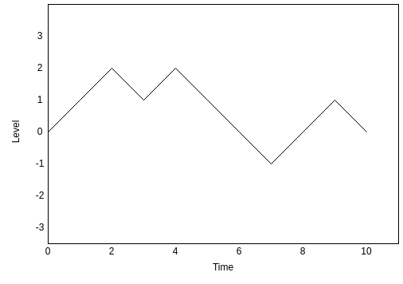

# Stochastic Processes

- [Stochastic Processes](#stochastic-processes)
  - [Introduction](#introduction)
  - [Formal Definitions](#formal-definitions)
  - [Time Series Statistics](#time-series-statistics)
  - [Fat-Tailed Distributions](#fat-tailed-distributions)
    - [Quantile-Quantile (Q-Q) Plots](#quantile-quantile-q-q-plots)
    - [Moments of a Distribution](#moments-of-a-distribution)
      - [Kurtosis](#kurtosis)
  - [Asset Return Measures](#asset-return-measures)
    - [Continuously-Compounded Returns](#continuously-compounded-returns)
    - [Asset Return Measures Example](#asset-return-measures-example)
  - [Stylized Facts of Asset Prices and Returns](#stylized-facts-of-asset-prices-and-returns)
    - [Volatility Clustering](#volatility-clustering)
    - [Asset Return Autocorrelation](#asset-return-autocorrelation)
    - [Fat Tails](#fat-tails)
  - [Random Walks](#random-walks)
    - [The Binomial Distribution](#the-binomial-distribution)
  - [Asset Pricing Models using Random Walks](#asset-pricing-models-using-random-walks)
  - [Brownian Motion](#brownian-motion)
    - [Brownian Motion with Drift](#brownian-motion-with-drift)
    - [Modelling Asset Prices using Brownian Motion](#modelling-asset-prices-using-brownian-motion)
  - [The Log-Normal Model](#the-log-normal-model)

## Introduction

- The pricing formulas for [forwards, futures and swaps](./7_forwards_futures_swaps.md) were derived by only using arbitrage principals.
  - These instruments are known as being **linear** - i.e. the [payoff](./7_forwards_futures_swaps.md#payoffs) has a linear correlation to the price of the underlying asset.
- [Options](./9_options.md), on the other hand, are known as **non-linear** as the price of the underlying asset does not have a linear correlation to the option payoff.
  - A model for the behaviour of the underlying asset that uses **stochastic processes** is therefore needed to price options.
- In simple terms, stochastic processes try to model 'random changes over time'. Other ways to describe stochastic processes include:
  - A random evolution
  - A random function
  - A collection of random paths
- A **Random Walk** is a stochastic process comprised of a succession *random steps* that are determined probabilistically.
  - As an [example](https://mathworld.wolfram.com/RandomWalk1-Dimensional.html), let the result of flipping a coin determine whether a person takes a step to the left or to the right. Flipping the coin every minute for 10 minutes would take the person on a 'random walk' comprised of a succession of randomly determined steps.
  - The probability of taking one specific path is $\left(\frac{1}{2}\right)^{10} = \frac{1}{1024}$ and because every path has the same probability of being taken, the total number of possible paths is 1024.
- Applying stochastic processes to finance can be done by denoting $S(t)$ as the price of an asset at time $t$ where $t \geq 0$. Whilst $S(0)$ is known, $S(t)$ will evolve over time and take a random/uncertain path such that $S(t)$ will be a collection of random values.
  - For times where $t \geq 0$, the value $S(t)$ is said to be a stochastic process.

    

## Formal Definitions

> A **stochastic process** is a family of random variables $X(t)$ indexed by a parameter $t$ that can be interpreted as time.

- Stochastic processes can be categorised as being **discrete-time** stochastic processes where the process evolves at specific/discrete times ($X_{1}$ at $t_{1}$, $X_{2}$ at $t_{2}$, etc.) and as **continuous-time** stochastic processes where the process continuously evolves over time where $t \geq 0$.
- Continuous-time stochastic processes are defined by specifying joint probability distribution for the random variables $X(t_{1})$, $X(t_{2})$,...etc. at arbitrary times $t_{1}$, $t_{2}$,...etc.
  - [Brownian motion](#brownian-motion), the random motion of particles suspended in a medium, is denoted as $W(t)$ and the following assumptions are made:
    - For times $t_{1} < t_{2} < t_{3}$, the random variables $W(t_{2}) - W(t_{1})$ and $W(t_{3}) - W(t_{2})$ are independent.
    - For any times $t_{1} < t_{2}$ the random variables can be modelled by a normal distribution with mean 0 and variance $t_{2} - t_{1}$, i.e. in notation form: $W(t_{2}) - W(t_{1}) \sim \mathcal{N}(0, t_{2} - t_{1})$.
  
> The **sample paths** of a stochastic process are the actual realized paths that could be followed by the process.

- In other words, a stochastic process could be regarded as being a probability distribution on the set of all sample paths.

> A **Random Walk** is a discrete time stochastic process and is defined as having $j$ steps where the $j$'th step is denoted $X_{j}$.

- The steps, a succession of $X_{j}$, are independent and identically distributed such that:
$$\text{Prob}(X_{j} = +1) = \frac{1}{2}$$
$$\text{Prob}(X_{j} = -1) = \frac{1}{2}$$
- The random walk of $n$ steps is therefore defined as:
$$S_{n} = \sum_{j=1}^{n}X_{j}$$
- In financial terms, $X(j) \equiv P(t_{j})$ could be the prices of a financial asset on a business day $t_{j}$ assuming $t_{1}$, $t_{2}$,... etc. are successive business days.

## Time Series Statistics

- For a time series: $...X(t_{0}), X(t_{0}+1), X(t_{0}+2),..., X(t_{0}+k)...$ where $X(t)$ is the price of an asset observed at time $t$ and $t_{0}$, $(t_{0}+1)$, $(t_{0}+2)$,...etc. are consecutive business days.
- The joint distribution of $(X(k), X(k+1),..., X(k+j))$ is said to be **strictly stationary** if the distribution only changes with $j$ and not $k$ - i.e. with the number of successive observations and not the point in time that these observations are made.
  - In simpler terms, the joint distribution of a set of observations in the time series is the same regardless of when or where in the time series the observation is made.
- This leads to the assumption that $X(k)$ has the same distribution as $X(1)$ and that $(X(k), X(k+1))$ has the same distribution as $(X(1), X(2))$ etc.
- In practice strict stationarity is reduced to **stationarity** so that this principle holds up only to *second moments* - i.e. only as far as *variance* and *covariance* are concerned.
- The **autocovariance** function of a time series $X(t)$ is defined to be: $\gamma (k,\mathcal{l}) \equiv \text{cov}(X(k),X(\mathcal{l})) \equiv E[(X(k) - E(X(k)))(X(\mathcal{l}) - E(X(\mathcal{l})))]$ for observations made at time $k$ and $\mathcal{l}$.
- The time series is *stationary* if its autocovariance function is **translation invariant** along with the expectation $E[X(k)]= \mu$ - i.e. $\mu$ is independent of $k$.
  - **Translation invariance** defines the observation to be independent of time, such that $\gamma (k+t,\mathcal{l}+t) = \gamma (k,\mathcal{l})$.
  - $\text{cov}(X(k),X(\mathcal{l}))$ only depends on the lag $\mathcal{l}-k$.
- *Stationarity* implies the following:
  - The covariance of any two successive observations is the same, such that $\text{cov}(X(0),X(1)) = \text{cov}(X(1),X(2)) = \text{cov}(X(2),X(3))=...= \text{cov}(X(k),X(k+1))$
  - The covariance is also equal where the lag between the observations is equal, such that $\text{cov}(X(0),X(5)) = \text{cov}(X(1),X(6))$ etc.
  - The variances are also equal for all observations, such that $\text{Var}(X(0)) = \text{Var}(X(1))=...= \text{Var}(X(k))$.
- The autocovariance function for the *stationary* case can therefore be denoted as $\gamma (k) \equiv \text{cov}(X(k),X(t+k))$ as this is independent of $t$.
- Given that, for a stationary time series, the covariance between two terms in the series only depends on the lag between, the **autocorrelation** function for a stationary time series is defined as $\rho(k) = \text{corr}(X(t),X(t+k)) = \frac{\gamma(k)}{\gamma(0)}$ which is also independent of $t$.
  - $\rho(0) = 1$ for any time series.
- The **sample autocovariance** and **sample autocorrelations** function, given a realized sample of a time series: $x(1)$, $x(2)$,...,$x(t)$,...,$x(N)$ with $N$ observations, are defined as follows:
  - The sample mean for this series will be $\bar{x} = \frac{1}{N} \sum_{i=1}^{N} x(i)$
  - The **sample autocovariance** function is $\hat{\gamma}(k) = \frac{1}{N} \sum_{i=1}^{N-k}(x(i)-\bar{x})(x(i+k)-\bar{x})$
  - The **sample autocorrelation** function is $\hat{\rho}=\frac{\hat{\gamma}(k)}{\hat{\gamma}(0)}$

## Fat-Tailed Distributions

- The density of a normal (Gaussian) distribution with mean $\mu$ and variance ${\sigma}^{2}$ is given by:
$$f(x) = \frac{1}{\sqrt{2 \pi {\sigma}^{2}}}e^{-\frac{(x- \mu)^{2}}{2 {\sigma}^{2}}}$$
- As $x \rightarrow \plusmn \infty$, the normal density (and the probability) will decay exponentially.
- **Fat-tailed** distributions are probability distributions with densities that decay to 0 slower than exponentially and typically, will decay algebraically by $\frac{1}{x^{k}}$.
  - For example, the density of the [Student T-Distribution](https://www.investopedia.com/terms/t/tdistribution.asp) with $\nu$ degrees of freedom decays by $\frac{1}{|x|^{\nu + 1}} \text{ as } x \rightarrow \plusmn \infty$.

  

- As shown, outlier values of x are much more likely with fat-tailed distributions.

### Quantile-Quantile (Q-Q) Plots

- Quantile-quantile (q-q) plots compare the quantile of one random sample to the quantile of another random sample.
- A normal q-q plot compares the quantiles of a sample against the theoretical quantiles of a normal (Gaussian) distribution.
- If a random sample $\{x_{i}\}_{i=1}^{N}$ is from a normal distribution, the its normal q-q plot will resemble a straight line.
- For a fat-tailed distribution, the q-q plot will deviate from resembling a straight line at the extreme/outlier values:

  

### Moments of a Distribution

- The idea of a distribution having [moments](https://en.wikipedia.org/wiki/Moment_(mathematics)) stem from mechanics and is used to describe the shape of a function's graph. If a function describe the mass density, the zeroth moment would be the total mass, the first moment would be the center of mass and the second momnent would be the moment of intertia.
- In statistics, distributions have the following moments:
  - **First moment** is the mean (expected value)
  - **Second moment** is the variance (spread of values around the mean) and the standard deviation in the square root of the variance
  - **Third moment** is the skewness (how symmetric/asymetric the distribution is around the mean)
  - **Fourth moment** is the kurtosis ('fatness' of the tails)

#### Kurtosis

- A high kurtosis indicates that a lot of the data is distributed in the tails, whereas a low kurtosis indicates fewer data points in the tails.
- As this is the fourth moment, kurtosis is more sensitive to extreme outliers than the second moment variance.
- The standard definition for kurtosis is a **normalized** version of the fourth moment and, for a mean $\mu$ and variance $\sigma$, is given by:
$$\text{Kurt}(X) = E \left[ \left( \frac{X - \mu}{\sigma} \right)^4 \right]$$
- For a normally distributed random variable, the kurtosis is 3 so **excessive kurtosis** is defined as $\text{Kurt}(X) - 3$ for a random variable $X$.

## Asset Return Measures

### Continuously-Compounded Returns

- The 1-period **continuously compounded return** or **log return** of an asset with price $P(t)$ at time $t$ is defined as:

```math
\begin{aligned}
r(t) &= \text{log} \left( \frac{P(t)}{P(t-1)} \right) \\\\
&= \text{log}(P(t)) - \text{log}(P(t-1))
\end{aligned}
```

- The $k$-period continuously compounded return between a time $t$ and a time $k$-periods before $t$ can therefore be defined as:

```math
\begin{aligned}
r_k(t) &= \text{log} \left( \frac{P(t)}{P(t-k)} \right) \\
&= \text{log}(P(t)) - \text{log}(P(t-k)) \\\\
\end{aligned}
```

- The period $k$ should be in the same unit of time as the value for $t$ - this is normally years of days when working with financial models.
- The continuously compounded return is the $\text{log}$ of the corresponding [gross return](./2_interest-rates.md#gross-return).
- The continuously compounded returns across a period from $t$ to $t-k$ can be written as the sum of all the intervals within the period as follows:

```math
\begin{aligned}
r_{k}(t) &= \text{log}(P(t)) - \text{log}(P(t-1)) \\
&+ \text{log}(P(t-1)) - \text{log}(P(t-2)) \\
&+ \text{log}(P(t-2)) - \text{log}(P(t-3)) \\
&+ ...  \\
&+ \text{log}(P(t-k+1)) - \text{log}(P(t-k)) \\\\

r_{k}(t) &\equiv r(t) + r(t-1) + r(t-2) + ... + r(t-k+1) \\\\
r_{k}(t) &= \sum_{i=0}^{k-1}r(t-i)
\end{aligned}
```

### Asset Return Measures Example

- The prices for a stock on 6 consecutive business days ($t=[1,6]$) are as shown in the table below:

| Time, $t$ | Price, $P(t)$|
|:---------:|:-------------:|
|     1     |      105      |
|     2     |      111      |
|     3     |      102      |
|     4     |      109      |
|     5     |      107      |
|     6     |      108      |

- The daily $\text{log}$ returns can be calculated as follows:

```math
\begin{aligned}
r(t) &= \text{log} \left( \frac{P(t)}{P(t-1)} \right) \\\\
r(2) &= \text{log} \left( \frac{P(2)}{P(1)} \right) = \text{log} \left( \frac{111}{105} \right) = \boxed{2.41 \%} \\\\
r(3) &= \text{log} \left( \frac{P(3)}{P(2)} \right) = \text{log} \left( \frac{102}{111} \right) = \boxed{-3.67 \%} \\\\
r(4) &= \text{log} \left( \frac{P(4)}{P(3)} \right) = \text{log} \left( \frac{109}{102} \right) = \boxed{2.88 \%} \\\\
r(5) &= \text{log} \left( \frac{P(5)}{P(4)} \right) = \text{log} \left( \frac{107}{109} \right) = \boxed{-0.80 \%} \\\\
r(6) &= \text{log} \left( \frac{P(6)}{P(5)} \right) = \text{log} \left( \frac{108}{107} \right) = \boxed{0.40 \%} \\\\
\end{aligned}
```

- The weekly $\text{log}$ return can be calculated as follows:

```math
\begin{aligned}
r_{k}(t) &\equiv r(t) + r(t-1) + r(t-2) + ... + r(t-k+1) \\\\
r_{f}(6) &= r(2) + r(3) + r(4) + r(5) + r(6) \\
&= 2.41 \% -3.67 \% + 2.88 \% - 0.80 \% + 0.40 \% \\
&= \boxed{1.22 \%}
\end{aligned}
```

## Stylized Facts of Asset Prices and Returns

### Volatility Clustering

- Asset prices exhibit distinct regimes of low, intermediate, and high volatility.
- Price volatility is different to returns volatility, e.g. a price increasing by 7% every day for a number of consecutive days would have a very volatile price but constant daily returns of 7%.
- In practice, volatile prices will imply volatile returns as returns are not systematically positive or negative (the mean is close to 0).
- Returns will oscillate between plus or minus the absolute return level and so the volatility regimes are easier to spot from the returns.
  - Additionally, the volatility of returns are given as a percentage of the price level, i.e. properly scaled unlike the price volatility which could be measured by a change in USD (a 5 USD change on an asset priced at 10 USD has much higher volatility than a 5 USD change in an asset priced at 500 USD).

### Asset Return Autocorrelation

- Raw returns series exhibit little to no autocorrelation. Correlation between returns at different times is essentially 0.
  - For an asset returns series $r(t)$, the sample autocorrelation function $\hat{\rho}(k) \approx 0$ for any $k \neq 0$.
- Absolute values of returns at different times exhibit considerable autocorrelation which decay slowly over time.
  - For a time series of absolute values of return $|r(t)|$, the autocorrelation function $\hat{\rho}(k) \neq 0$ for $k$ not too large, and $\hat{\rho}(k) \rightarrow 0$ as $k$ increases.

### Fat Tails

- The distribution of asset returns have much fatter tails than Gaussian distributions (i.e. excessive kurtosis).
- Return data over a longer time period, e.g. monthly will show significantly less evidence of a fat-tailed distribution.

## Random Walks

- Taking a random walk to be the movement of an autonomous particle which, depending on the outcome of flipping a coin, is able to move up (heads) or down (tails) 1 level.
  - The starting point is level 0.
  - The levels are assumed to be a range of integers $...,-2,-1,0,1,2,...$

  

- Let the probability of a move up (heads) be $p$ and the probability of a move down (tails) is $q=1-p$:

```math
\begin{aligned}
\text{Prob(move up)} &= p \\
\text{Prob(move down)} &= p = 1 - q
\end{aligned}
```

- Assume that each coin flip is independent of all the other flips such that previous flip has no influence on the next.
- Each $j$'th move is represented by a random variable $X_{j}$ such that:

```math
\begin{aligned}
\text{Prob}(X_{j} = +1) &= p \\
\text{Prob}(X_{j} = -1) &= q
\end{aligned}
```

- The sequence of random moves $X_{1}, X_{2},...,X_{j},...,X_{n}$ are independent and identically distributed such that $\text{Prob}(X_{1} = y_{1}, X_{2} = y_{2},...,X_{n} = y_{n}) \equiv \text{Prob}(X_{1} = y_{1}) \text{Prob}(X_{2} = y_{2})...\text{Prob}(X_{n} = y_{n})$ where $y_{i}=+1$ or $y_{i} = -1$.
- For example, the probability of 2 up moves followed by a down move is: 

```math
\begin{aligned}
\text{Prob}(X_{1} = +1, X_{2} = +1, X_{3} = -1) &= \text{Prob}(X_{1} = +1)\text{Prob}(X_{2} = +1)\text{Prob}(X_{3} = -1) \\
&= p \times p \times q \\
&= p^{2}q
\end{aligned}
```

- The position after $n$ moves is the sum of all the moves from $1$ to $n$, such that the discrete time stochastic process $S_{n}$ is the **random walk**:

```math
\begin{aligned}
S_{n} &= X_{1} + X_{2} +...+ X_{n} \\
&= \sum_{j=1}^{n}X_{j}
\end{aligned}
```

- The moves $X_{j}$ can follow any distribution for a random walk as long as they are independent and identically distributed.
- The distribution of $S_{n}$ at a time $n$ is evaluated as follow:
  - At time $n=1$ the position $S_{1}$ is equal to the move $X_{1}$ such that $S_{1}$ has the same distribution as $X_{1}$, denoted as: $\text{Prob}(S_{1}=1)=\text{Prob}(X_{1}=+1)=p$
  - At time $n=2$, the values for $S_{2}$ will be either $+2$, $0$ or $-2$.
    - The event $\{S_{2} = 2\}$ will result from a path consisting of $X_{1}=+1$ and $X_{2}=+1$ and have a probability of $\text{Prob}(S_{2}=2)=\text{Prob}(X_{1}=+1, X_{2}=+1)$. Because $X_{1}$ and $X_{2}$ are independent, $\text{Prob}(S_{2}=2)=\text{Prob}(X_{1}=+1)\text{Prob}(X_{2}=+1)=\boxed{p^{2}}$.
    - The event $\{S_{2} = 0\}$ can result from two paths: one consisting of $X_{1}=+1$ and $X_{2}=-1$, and a second consisting of $X_{1}=-1$ and $X_{2}=+1$. These path are mutually exclusive and so the probability of the event $\{S_{2} = 0\}$ occurring is $\text{Prob}(X_{1}=+1, X_{2}=-1) + \text{Prob}(X_{1}=-1, X_{2}=+1)=pq + qp = \boxed{2pq}$
    - The probability of the event $\{S_{2} = -2\}$ is calculated in a similar way to the probability of the event $\{S_{2} = +2\}$, such that $\text{Prob}(S_{2}=-2)=\text{Prob}(X_{1}=-1)\text{Prob}(X_{2}=-1)=\boxed{q^{2}}$
  - The distribution described here is the **binomial distribution** for 2 trials with a success probability of $p$.
- To continue evaluating the random walk positions for times greater than $n=2$, the [binomial distribution](#the-binomial-distribution) can be applied.

### The Binomial Distribution

- Take a range of Bernoulli random variables $Y_{1}$, $Y_{2}$,...,$Y_{n}$ which are all independent and distributed as the Bernoulli distribution:
$$\text{Prob}(Y_{j}=1)=p \text{ and } \text{Prob}(Y_{j}=0)=q=1-p$$
- Generally, $Y_{j}=1$ denotes success on the $j$'th trial, and similarly $Y_{j}=0$ denotes failure on the $j$'th trial with $p$ and $q$ denoting the probability of success and failure respectively.
- The total number of successes in $n$ trials is defined as $Z_{n}$ so, given $Y_{j}=0$ for a failure, this leads to:
$$Z_{n} = \sum_{j=1}^{n}Y_{j}$$
- $Z_{n}$ is the binomial distribution and the probability of having $k$ successes in $n$ trials (with condition $0 \leq k \leq n$) is given by:
$$\text{Prob}(Z_{n}=k) = \frac{n!}{k!(n-k)!}p^{k}q^{n-k}$$
- The binomial distribution is denoted $\text{bin}(k;n,p)$.
- Applying the binomial distribution to the [random walks](#random-walks) example where $n=2$ leads to the same probabilities:

```math
\begin{aligned}
\text{Prob}(S_{2}=2) &\equiv \text{Prob}(Z_{2}=2) = \text{bin}(2;2,p) = p^{2} \\
\text{Prob}(S_{2}=0) &\equiv \text{Prob}(Z_{2}=1) = \text{bin}(1;2,p) = 2pq \\
\text{Prob}(S_{2}=-2) &\equiv \text{Prob}(Z_{2}=0) = \text{bin}(0;2,p) = q^{2}
\end{aligned}
```

- The proof that the Binomial Distribution can be extended to find the distribution of random walk position $S_{n}$ is as follows.
- The Bernoulli random variable $Y_{j}$ can be related to the moves $X_{j}$ by $X_{j}=2Y_{j}-1$, so that $X_{j}=1$ when $Y_{j}=1$ and $X_{j}=-1$ when $Y_{j}=0$.
- The probabilities $p$ and $q$ remain the same between the random walks and binomial distribution, as well as the assumptions that the successive trials/moves are independent.

```math
\begin{aligned}
S_{n} &=  \sum_{j=1}^{n}X_{j} \\
S_{n} &=  \sum_{j=1}^{n}(2Y_{j}-1) \\
S_{n} &=  2\sum_{j=1}^{n}Y_{j}-\sum_{j=1}^{n}1 \\
S_{n} &=  2Z_{n}-n\\
\end{aligned}
```

- The random walks distribution $S_{n}$ will inherit a *shifted* binomial distribution from $Z_{n}$.
- For simpliciy, let $n=2m$ so that the values of $S_{n}$ will only be even integers ranging from $-2m$ to $2m$.

```math
\begin{aligned}
&\text{Prob}(S_{n}=2\mathcal{l}) = \frac{n!}{(m+\mathcal{l})!(m-\mathcal{l})!}p^{m+\mathcal{l}}q^{n-\mathcal{l}} \\
\text{for } &\mathcal{l} = -m,-m+1,...,m-1,m
\end{aligned}
```

## Asset Pricing Models using Random Walks

- The random walks described so far have been discrete time models with fixed unit increments (moves); therefore, assumptions will need to evaluated to decide whether random walks are a suitable model for modelling asset prices which evolve continuously in time by and move by differing amounts.
- Random walks may not be suitable for some pricing models and the following should be considered:
  - Can prices be modelled using discrete time intervals, e.g. daily closing prices or weekly/monthly averages.
  - Can the moves in price be modelled as multiple moves of a unit-size?
- Increasing the frequency of the moves and decreasing the unit-size of the move itself will produce a better model but increase the computational power.
- One obvious problem with random walks is that the value can become negative which, for most assets, is not possible in the real world.
- A more subtle problem is that the unit-size of the move up/down is the same regardless of the price level - this is due to the next move being independent of all previous moves.
  - In practice, this is not the case as a 1 USD move up/down on a stock is far more likely when it is valued at 100 USD($\plusmn1\%$) than when it is valued at 2 USD($\plusmn50\%$).
  - In other words, the random walk model discussed so far assumes that the chance of a 1% increase in the stock price is the same as a 50% increase.
  - However, the concept that each move is completely independent and any historical information has no effect on deciding the direction of the next move is a desirable property in a model as it corresponds to the [Efficient Market Hypothesis](https://www.investopedia.com/terms/e/efficientmarkethypothesis.asp) (EMH), a fundamental idea in financial economics.
    - EMH has supporting theoretical and empirical evidence but there is also strong empirical evidence against this hypothesis.
    - Generally, the concept EMH puts forward is used as a base case and modifications are made to account for the complexities of markets in the real world.
    - Similarly, the random walk model can be considered a base case that is modified to model the complexities of the real world.

## Brownian Motion

- To develop a more realistic model for pricing assets, whilst still retaining the properties of [random walks](#random-walks), a continuous time model must be derived.
  - This can be achieved by reducing the time step between moves (increasing the frequency of the moves) to a very small value.
  - The unit-size of the moves must also decrease with the time step in order to avoid causing the variance to go to infinity as follows:

```math
\begin{aligned}
\text{Let } \sigma^{2} = \text{Var}(X_{j}) \\
\lim_{m \to \infty} \text{Var}(S_{m}) &= \lim_{m \to \infty} \text{Var} \left(\sum_{j=1}^{m}X_{j} \right) \\
&= \lim_{m \to \infty} \sum_{j=1}^{m} \text{Var}(X_{j}) \text{ by independence} \\\\
&= \lim_{m \to \infty} m \sigma^{2} \\\\
&= \infty
\end{aligned}
```

- The moves $X_{j}$ of size 1 must be scaled down for the limit to be sensible. This can be done by dividing $X_{j}$ by a factor $\alpha$.
  - The [central limit theorem](https://www.investopedia.com/terms/c/central_limit_theorem.asp) suggests that $\alpha = \sqrt{m}$, such that:

```math
\begin{aligned}

\lim_{m \to \infty} \text{Var} \left(\sum_{j=1}^{m} \frac{X_{j}}{\sqrt{m}} \right) &= \lim_{m \to \infty} \sum_{j=1}^{m} \text{Var} \left( \frac{X_{j}}{\sqrt{m}} \right) \text{ by independence} \\\\
\text{With }\text{Var}(\alpha X) = \alpha^{2} \text{Var}(X) \Longrightarrow &= \lim_{m \to \infty} \sum_{j=1}^{m} \frac{1}{m} \text{Var} X_{j} \\\\
&= \lim_{m \to \infty} \frac{1}{m}  \sum_{j=1}^{m} \sigma^{2} \\\\
&= \lim_{m \to \infty} \frac{1}{m}  m \sigma^{2} \\\\
&= \sigma^{2} \text{ (a finite variance)}
\end{aligned}
```

- As shown, $\alpha = \sqrt{m}$ is the right scaling for the moves, and so, as the number of time-steps $m$ per unit time increases, a limit should be considered.
  - For any real time $t \geq 0$, the number of moves will be some integer close to $mt$.
- The scaled random walks, with a floor function $\lfloor mt \rfloor$, are therefore:
$$S_{t}^{(m)} = \sum_{j=1}^{\lfloor mt \rfloor} \frac{X_{j}}{\sqrt{m}}$$
- **Brownian motion** is a continuous time stochastic process which is conventionally denoted $W(t)$ and has the following properties:
  - $W(0) = 0$ with probability 1.
  - The sample paths of $W(t)$ are continuous with probability 1.
  - $W(s) - W(t)$ is independent of the move $W(r) -W(s)$ for $t < s < r$.
    - In other words, the displacement of the particle over any time interval only depends on the length of the interval and not on its location, and that the displacements over disjoint intervals are independent of each other.
  - $W(t) - W(s)$ is normally distributed with mean 0 and variance $|t-s|$ for any $t,s \geq 0$.
- Due to the central limit theorem, the distribution of any increment $S_{t_{2}}^{(m)} - S_{t_{1}}^{(m)}$ converges to a normal distribution as $m \rightarrow \infty$.
  - The independence of moves in the random walk passes to the independence of increments in the limit.
- The random walk converges to Brownian motion: $S_{t}^{(m)} \rightarrow W(t) \text{ as } m \rightarrow \infty$ in the sense of weak convergence of stochastic processes.

### Brownian Motion with Drift

- To be a suitable representation of asset prices, a model must be able to support a trend due to the bull and bear nature of markets.
- Brownian motion as a model has an expected value of 0 so needs modification to be useful in modelling asset prices.
- By adding a 'drift' term $\mu t$ that grows (linearly in the most basic implementation) in time to the Brownian motion model, a trend can be represented.
$$W(t; \mu , \sigma) = \mu t + \sigma W(t)$$
- The addition of the drift term does not provide any advantages over the random walk model as a drift term $\mu n$ could also be added to a random walks.

```math
\begin{aligned}
T_{n} &= \mu n + S_{n} \\\\
&= \mu n  + \sum_{j=1}^{n} X_{j}
\end{aligned}
```

### Modelling Asset Prices using Brownian Motion

- Recall that the most compelling advantage of the random walk model is the independence of the moves which provides an implementation of [Efficient Market Hypothesis](https://www.investopedia.com/terms/e/efficientmarkethypothesis.asp) (EMH).
  - Brownian motion preserves this independence through the incremental moves of the particles up until a tme $t$ have no influence on the moves after this time $t$.
- Brownian motion is a continuous time model and can be considered to be a continuous time version of the random walk model.
- The size of the move $W(t_{2}) - W(t_{1})$ between times $t_{1}$ and $t_{2}$ is not limited to a unit value in Brownian motion and large moves are less likely given $W(t_{2}) - W(t_{1})$ follows a normal distribution - this is an advantage over the random walk model which assumes a uniform size of move.
  - The larger the time increment from $t_{1}$ to $t_{2}$, the more likely a larger move $W(t_{2}) - W(t_{1})$.
  - The mean size for a move is 0.
- There are still some limitations to the Brownian motion model:
  - Asset prices could become negative with time.
  - The moves are insensitive to price level (e.g. a 1 USD increase in price when a stock is valued at 2 USD is just as likely as when the same stock is valued at 100 USD).
    - In other words, the volatility of prices are insensitive to the absolute price level, such that, regardless of the value of $W(t_{1})$, the variance of the move in price is always equal to the time difference $\text{Var}(W(t_{2}) - W(t_{2})) = t_{2} - t_{1}$.

## The Log-Normal Model

- The log-normal model aims to overcome the limitations of the Brownian motion model for asset pricing.
- The asset price is denoted $S(t)$ and changes in the logarithm of the asset price $\log (S(t))$ are denoted as $\psi (t)$.
  - It follows that $S(t) = e^{\psi (t)}$ and $\psi (t+1) = \psi (t) + \delta$ where $\delta$ is the increase in the logarithm of the asset price from $t$ to $t+1$.

```math
\begin{aligned}
S(t+1) &= e^{\psi (t+1)} \\
&= e^{\psi (t) + \delta} \\
&= e^{\psi (t)}e^{\delta} \\
&= S(t)e^{\delta}
\end{aligned}
```

- The asset price at $t+1$ is calculated by multiplying the asset price at $t$ by the factor $e^{\delta}$.
- The price jump is therefore: $S(t+1) -S(t) = e^{\delta}S(t) - S(t)$ and this holds regardless of the price level.