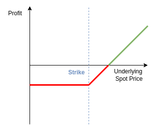
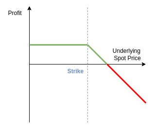
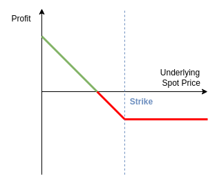
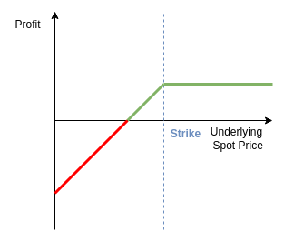

# Options

## Introduction

- Options are contracts between two counterparties that gives one counterparty *the right but not the obligation* to buy/sell a particular asset to/from the other counterparty at a price agreed to upon entering the contract.
  - An option to **buy** is called a **call**.
  - An option to **sell** is called a **put**.
  - The counterparty with the option is the **buyer** or **holder** and they will **exercise** the option upon deciding to buy or sell at the agreed price.
  - The counterparty which must accept the decision of the buyer is the **seller** or **writer** of the option.
- Option contracts will have a predefined **specification** that states the **underlying** asset, the **quantity** of that asset, the **type** (call/put), the **strike** price, and the **expiration** date of the contract.
  - The **strike price** is the price at which the underlying asset will be bought or sold should the option be exercised.
- The **option premium** is the price paid by the buyer of an option contract to the writer/seller, compensating the writer for the risks involved with issuing the associated rights.
  - Without an option premium, there would be an arbitrage opportunity as option buyers have no downside risk other than the price paid to enter into the option contract.
- There are different convention for exercising options with the two most common being:
  - **European options** can only be exercised at the expiration date.
  - **American options** can be exercised at any time between the contract origination and expiry.
- Options are written on stocks, indexes, currencies, commodities, interest rate products and on the futures contracts of these products (most commodity option contracts are options on futures).
- Options trade both over-the-counter (OTC) and on futures exchanges.
  - Similar to forward contracts, there is a large amount of counterparty credit risk on OTC options, whilst exchange traded options are margined and marked to market which minimises this risk.
- The following terminology is used for positions in options:
  - A **long position** is held by the option holder.
  - A **short position** is held by the option writer.
- There are 4 basic option positions that a market participant can take:
  1. a **long call** - buying the right to purchase an asset at a particular strike.
  2. a **long put** - buying the right to sell an asset at a particular strike.
  3. a **short call** - writing/selling the right to purchase an asset at a particular strike.
  4. a **short put** - writing/selling the right to sell an asset at a particular strike.
- The status of an option with regards to the underlying asset's spot price is denoted as **moneyness** and has the following terminology:
  - **In the money** if a call's strike is less than the underlying's spot or a put's strike is greater than the underlying's spot.
  - **Out the money** if a call's strike is greater than the underlying's spot or a put's strike is less than the underlying's spot.
  - **At the money** when the strike for either a call or put is equal to the underlying's spot.

### Basic Example: European Call

- An investor has paid a 10 USD premium for a European call with a strike price of 60 USD.
- The circumstances under which the option should be exercised:
  - If the underlying asset's spot price is greater than 60 USD, the option is likely to be exercised as it allows the buyer to purchase the asset at a cheaper price compared to the market.
- If the underlying asset's spot price is 75 USD at the option expiration, the net profit made by immediately selling the underlying asset on the market will be 5 USD ($75 - (60 + 10)$).
- If the underlying asset's spot price is 40 USD at the option expiration, the option buyer will not exercise the option and a net loss of 10 USD will be incurred.

### Assumptions

- Unless stated otherwise:
  - The options will be treated as european style.
  - The underlying assets will be a stock paying no dividends (i.e. no income).

## Option Payoffs

- The option payoff is central to valuing the option and uses the same principals as the [payoffs for derivatives contracts](./7_forwards_futures_swaps.md#payoffs) where the payoffs are equal to the revenue paid to a particular counterparty (either the long or short position).
- For European options which have a single expiration date, the option payoff will be equal to the option value at the time of the payoff (option expiration).
- The notation used for option pricing will extend the notation used so far:
  - $S(t)$ will be the price of the underlying asset at time $t$.
  - $K$ is the strike price.
  - $T$ is the expiration date.
  - The premium, when taking a long position in the call ($C$) or put ($P$), is denoted by any of the following:
    - $C(S(t))$ or $P(S(t))$ - dependent on the price of the underlying asset.
    - $C(S(t), t)$ or $P(S(t), t)$  - as above and also dependent on time $t$.
    - $C(S(t),t;K,T)$ or $P(S(t),t;K,T)$  - as above and also dependent on the strike $K$ and expiration date $T$.

### Long Call Payoff

- If an investor holds a long position in a European call option, then at the expiration date $T$, the investor has the right to buy the underlying asset at the strike price $K$.
- It only makes sense for the investor to exercise the option if the strike $K$ is less than the spot price of the underlying asset at the expiration date $S(T)$
- Assuming $S(T) > K$, the payoff from immediately selling the underlying asset at the expiration date is $S(T) - K$.
- If $S(T) \leq K$ then the option will not be exercised and the payoff will be 0.
- The long call payoff can be written as follows:

```math
\begin{aligned}
C(S(T), T) &=
\begin{cases}
S(T) - K &S(T) > K \\
0 &S(T) \leq K
\end{cases} \\\\
&=\text{max}\{0,S(T)-K\}
\end{aligned}
```

  

### Short Call Payoff

- The short call payoff is the negative of the [long call payoff](#long-call-payoff):
$$-C(S(T),T) = - \text{max}\{0,S(T)-K\}$$

  

### Long Put Payoff

- A long position in a European put provides the right to sell the underlying for the strike price $K$ at contract expiration $T$.
- Assuming $S(T) < K$, the payoff from buying the underlying asset at the spot rate and selling to the short position for $K$ at the expiration date is $K - S(T)$.
- If $S(T) \geq K$ then the option will not be exercised and the payoff will be 0.
- The long put payoff can be written as follows:

```math
\begin{aligned}
P(S(T), T) &=
\begin{cases}
K - S(T) &S(T) < K \\
0 &S(T) \geq K
\end{cases} \\\\
&=\text{max}\{0,K-S(T)\}
\end{aligned}
```

  

### Short Put Payoff

- The short put payoff is the negative of the [long put payoff](#long-put-payoff):
$$-P(S(T),T) = - \text{max}\{0,K-S(T)\}$$

  

## Arbitrage Bounds on Option Prices

- From the Law of One Price, the following equalities apply to option prices:
  - Call prices:
    - Less than or equal to the underlying price: $C(t) \leq S(t)$
    - Greater than or equal to the long forward position: $C(t) \geq S(t) -^{-r(T-t)}K$
  - Put prices:
    - Less than or equal to the discounted strike price: $P(t) \leq e^{-r(T-t)}K$
    - Greater than or equal to the short forward position: $P(t) \geq e^{-r(T-t)}K - S(t)$

### Arbitrage Inequality Example 1: Call Price Less Than Underlying Price

- To demonstrate that $C(t) \leq S(t)$ due to arbitrage principles, start by assuming that the opposite is true: $C(t) >S(t)$ at time $t$.
- The following arbitrage portfolio can be constructed:
  - Sell/write a call on a stock collecting cash for the price of the call $C(t)$.
  - Purchase the underlying stock, paying $S(t)$.
- This results in a cash of holding of $C(t) - S(t) > 0$ due to the (incorrect) earlier assumption.
  - This cash sum is invested at the risk free rate $r$.
- At the expiration of the call, the portfolio consists of:
  - A short position on the call.
  - A long position on the underlying stock.
  - A cash holding now worth $e^{-r(T-t)}(C(t) - S(t))$.
- If, at the expiration, the call is out of the money ($S(T) \leq K$) then the option will **not** be exercised and will expire worthless.
  - This results in a portfolio worth $e^{-r(T-t)}(C(t) - S(t)) + S(T) > 0$
- Alternatively, if the call is in the money ($S(T) > K$) at expiration, the option will be exercised and the long position in the underlying stock will be sold for the strike price $K$.
  - This results in a portfolio worth $K + e^{-r(T-t)}(C(t) - S(t)) > 0$
- In both these scenarios, a profit has been retained that is *risk-free* and therefore, if $C(t) > S(t)$, there will be an arbitrage opportunity.

### Arbitrage Inequality Example 2: Call Price Greater Than Long Forward Position

- Similar to example 1, assume that $C(t) \geq S(t) e-^{-r(T-t)}K$ is not true and that if $C(t) < S(t) -e^{-r(T-t)}K$ is true at time $t$, there will be to an arbitrage opportunity present.
- Rewrite this inequality as $C(t) + e^{-r(T-t)}K < S(t)$ for ease and construct the following arbitrage portfolio:
  - A short position on the underlying stock, receiving $S(t)$ in cash.
  - A long position on the call, paying $C(t)$.
  - Given the inequality, there will be a remaining cash sum equal to $S(t) - C(t)$ which can be invested at the risk-free rate $r$.
- Now rewrite the inequality as follows:

```math
\begin{aligned}
C(t) + e^{-r(T-t)}K &< S(t) \\
e^{r(T-t)}C(t) + K &< e^{r(T-t)}S(t) \\
K &< e^{r(T-t)}(S(t) - C(t)) \\
\end{aligned}
```

- The inequality now shows that the value of the remaining cash sum $S(t) - C(t)$ at time $T$, having been invested at the risk-free rate $r$, is greater than the strike price $K$.
- At the expiration of the call option $T$, the arbitrage portfolio contains the following:
  - The long call position.
  - The short position on the stock.
  - The cash investment with value $e^{r(T-t)}(S(t) - C(t))$.
- If, at the expiration, the call is out of the money ($S(T) \leq K$), which can be written as $S(T) < e^{r(T-t)}(S(t) - C(t))$ using the rearranged inequality, then the option will **not** be exercised and the underlying stock will be bought for $S(T)$ to close the short position in the underlying stock.
  - This results in a portfolio worth $e^{r(T-t)}(S(t) - C(t)) - S(T) > 0$
- Alternatively, if the call is in the money ($S(T) > K$) at expiration, the call option will be exercised by paying the strike price $K$ and using the underlying stock received to close the short position in the underlying stock.
  - This results in a portfolio worth $e^{r(T-t)}(S(t) - C(t)) - K > 0$

- In both these scenarios, a profit has been retained that is *risk-free* and therefore, if $C(t) < S(t) -e^{-r(T-t)}K$, there will be an arbitrage opportunity.
