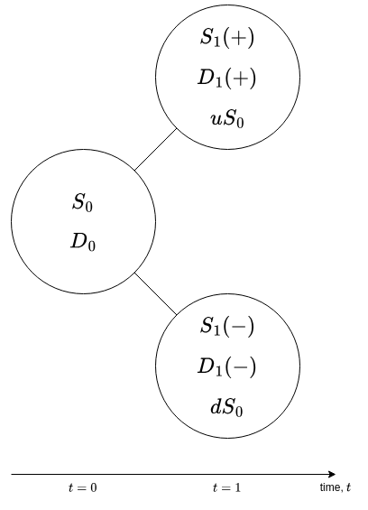

# Options

- [Options](#options)
  - [Introduction](#introduction)
    - [Basic Example: European Call](#basic-example-european-call)
    - [Assumptions](#assumptions)
  - [Option Payoffs](#option-payoffs)
    - [Long Call Payoff](#long-call-payoff)
    - [Short Call Payoff](#short-call-payoff)
    - [Long Put Payoff](#long-put-payoff)
    - [Short Put Payoff](#short-put-payoff)
  - [Arbitrage Bounds on Option Prices](#arbitrage-bounds-on-option-prices)
    - [Arbitrage Inequality Example 1: Call Price Less Than Underlying Price](#arbitrage-inequality-example-1-call-price-less-than-underlying-price)
    - [Arbitrage Inequality Example 2: Call Price Greater Than Long Forward Position](#arbitrage-inequality-example-2-call-price-greater-than-long-forward-position)
    - [Extending Option Bounds](#extending-option-bounds)
    - [Application of Option Bounds Example](#application-of-option-bounds-example)
    - [Arbitrage Bounds on American Style Options](#arbitrage-bounds-on-american-style-options)
      - [Intrinsic Value](#intrinsic-value)
      - [Bounds for American Calls](#bounds-for-american-calls)
      - [Bounds for American Puts](#bounds-for-american-puts)
  - [Put-Call Parity](#put-call-parity)
    - [Deriving the Put Call Parity Using Arbitrage principles](#deriving-the-put-call-parity-using-arbitrage-principles)
  - [The Binomial Model](#the-binomial-model)
    - [One-Step Binomial Model](#one-step-binomial-model)
      - [Example: One-Step Binomial Model](#example-one-step-binomial-model)
      - [The General Case for the One-Step Binomial Model](#the-general-case-for-the-one-step-binomial-model)
        - [One-Step Binomial Model Assumptions Recap](#one-step-binomial-model-assumptions-recap)
        - [One-Step Binomial Model General Case Derivation](#one-step-binomial-model-general-case-derivation)
      - [One-Step Risk Neutral Pricing](#one-step-risk-neutral-pricing)
        - [Example: One-Step Risk Neutral Pricing](#example-one-step-risk-neutral-pricing)
    - [Two-Step Binomial Model](#two-step-binomial-model)
      - [Asset Price Distribution in the Two-Step Binomial Model](#asset-price-distribution-in-the-two-step-binomial-model)
      - [Example: Two-Step Binomial Model](#example-two-step-binomial-model)
    - [The Full Binomial Model](#the-full-binomial-model)
    - [Call Pricing using the Binomial Model](#call-pricing-using-the-binomial-model)
  - [Binomial Model Approximation to a Log-Normal Model](#binomial-model-approximation-to-a-log-normal-model)
  - [The Black-Scholes Option Pricing Model](#the-black-scholes-option-pricing-model)
    - [Call options](#call-options)
    - [Put Options](#put-options)
    - [Limitations of the Black-Scholes Model](#limitations-of-the-black-scholes-model)
      - [Constant Interest Rates](#constant-interest-rates)
      - [Transaction Costs are Zero](#transaction-costs-are-zero)
      - [Fixed Volatility and Asset Returns following a Log-Normal Process](#fixed-volatility-and-asset-returns-following-a-log-normal-process)
      - [Continuous Portfolio Rebalancing (Delta Hedging)](#continuous-portfolio-rebalancing-delta-hedging)
    - [The Black-Scholes Theory in Practice](#the-black-scholes-theory-in-practice)
  - [Option Greeks](#option-greeks)
    - [Delta](#delta)
    - [Gamma](#gamma)
    - [Vega](#vega)
    - [Theta](#theta)
      - [Example: Theta and Time Decay](#example-theta-and-time-decay)
    - [Rho](#rho)
  - [Delta Hedging](#delta-hedging)
    - [Example: Delta Neutral Trading](#example-delta-neutral-trading)

## Introduction

- Options are contracts between two counterparties that gives one counterparty *the right but not the obligation* to buy/sell a particular asset to/from the other counterparty at a price agreed to upon entering the contract.
  - An option to **buy** is called a **call**.
  - An option to **sell** is called a **put**.
  - The counterparty with the option is the **buyer** or **holder** and they will **exercise** the option upon deciding to buy or sell at the agreed price.
  - The counterparty which must accept the decision of the buyer is the **seller** or **writer** of the option.
- Option contracts will have a predefined **specification** that states the **underlying** asset, the **quantity** of that asset, the **type** (call/put), the **strike** price, and the **expiration** date of the contract.
  - The **strike price** is the price at which the underlying asset will be bought or sold should the option be exercised.
- The **option premium** is the price paid by the buyer of an option contract to the writer/seller, compensating the writer for the risks involved with issuing the associated rights.
  - Without an option premium, there would be an arbitrage opportunity as option buyers have no downside risk other than the price paid to enter into the option contract.
- There are different convention for exercising options with the two most common being:
  - **European options** can only be exercised at the expiration date.
  - **American options** can be exercised at any time between the contract origination and expiry.
- Options are written on stocks, indexes, currencies, commodities, interest rate products and on the futures contracts of these products (most commodity option contracts are options on futures).
- Options trade both over-the-counter (OTC) and on futures exchanges.
  - Similar to forward contracts, there is a large amount of counterparty credit risk on OTC options, whilst exchange traded options are margined and marked to market which minimises this risk.
- The following terminology is used for positions in options:
  - A **long position** is held by the option holder.
  - A **short position** is held by the option writer.
- There are 4 basic option positions that a market participant can take:
  1. a **long call** - buying the right to purchase an asset at a particular strike.
  2. a **long put** - buying the right to sell an asset at a particular strike.
  3. a **short call** - writing/selling the right to purchase an asset at a particular strike.
  4. a **short put** - writing/selling the right to sell an asset at a particular strike.
- The status of an option with regards to the underlying asset's spot price is denoted as **moneyness** and has the following terminology:
  - **In the money** if a call's strike is less than the underlying's spot or a put's strike is greater than the underlying's spot.
  - **Out the money** if a call's strike is greater than the underlying's spot or a put's strike is less than the underlying's spot.
  - **At the money** when the strike for either a call or put is equal to the underlying's spot.

### Basic Example: European Call

- An investor has paid a 10 USD premium for a European call with a strike price of 60 USD.
- The circumstances under which the option should be exercised:
  - If the underlying asset's spot price is greater than 60 USD, the option is likely to be exercised as it allows the buyer to purchase the asset at a cheaper price compared to the market.
- If the underlying asset's spot price is 75 USD at the option expiration, the net profit made by immediately selling the underlying asset on the market will be 5 USD ($75 - (60 + 10)$).
- If the underlying asset's spot price is 40 USD at the option expiration, the option buyer will not exercise the option and a net loss of 10 USD will be incurred.

### Assumptions

- Unless stated otherwise:
  - The options will be treated as european style.
  - The underlying assets will be a stock paying no dividends (i.e. no income).

## Option Payoffs

- The option payoff is central to valuing the option and uses the same principals as the [payoffs for derivatives contracts](./7_forwards_futures_swaps.md#payoffs) where the payoffs are equal to the revenue paid to a particular counterparty (either the long or short position).
- For European options which have a single expiration date, the option payoff will be equal to the option value at the time of the payoff (option expiration).
- The notation used for option pricing will extend the notation used so far:
  - $S(t)$ will be the price of the underlying asset at time $t$.
  - $K$ is the strike price.
  - $T$ is the expiration date.
  - The premium, when taking a long position in the call ($C$) or put ($P$), is denoted by any of the following:
    - $C(S(t))$ or $P(S(t))$ - dependent on the price of the underlying asset.
    - $C(S(t), t)$ or $P(S(t), t)$  - as above and also dependent on time $t$.
    - $C(S(t),t;K,T)$ or $P(S(t),t;K,T)$  - as above and also dependent on the strike $K$ and expiration date $T$.

### Long Call Payoff

- If an investor holds a long position in a European call option, then at the expiration date $T$, the investor has the right to buy the underlying asset at the strike price $K$.
- It only makes sense for the investor to exercise the option if the strike $K$ is less than the spot price of the underlying asset at the expiration date $S(T)$
- Assuming $S(T) > K$, the payoff from immediately selling the underlying asset at the expiration date is $S(T) - K$.
- If $S(T) \leq K$ then the option will not be exercised and the payoff will be 0.
- The long call payoff can be written as follows:

```math
\begin{aligned}
C(S(T), T) &=
\begin{cases}
S(T) - K &S(T) > K \\
0 &S(T) \leq K
\end{cases} \\\\
&=\text{max}\{0,S(T)-K\}
\end{aligned}
```

  

### Short Call Payoff

- The short call payoff is the negative of the [long call payoff](#long-call-payoff):
$$-C(S(T),T) = - \text{max}\{0,S(T)-K\}$$

  

### Long Put Payoff

- A long position in a European put provides the right to sell the underlying for the strike price $K$ at contract expiration $T$.
- Assuming $S(T) < K$, the payoff from buying the underlying asset at the spot rate and selling to the short position for $K$ at the expiration date is $K - S(T)$.
- If $S(T) \geq K$ then the option will not be exercised and the payoff will be 0.
- The long put payoff can be written as follows:

```math
\begin{aligned}
P(S(T), T) &=
\begin{cases}
K - S(T) &S(T) < K \\
0 &S(T) \geq K
\end{cases} \\\\
&=\text{max}\{0,K-S(T)\}
\end{aligned}
```

  

### Short Put Payoff

- The short put payoff is the negative of the [long put payoff](#long-put-payoff):
$$-P(S(T),T) = - \text{max}\{0,K-S(T)\}$$

  

## Arbitrage Bounds on Option Prices

- From the Law of One Price, the following equalities apply to option prices:
  - Call prices:
    - Less than or equal to the underlying price: $C(t) \leq S(t)$
    - Greater than or equal to the long forward position: $C(t) \geq S(t) - e^{-r(T-t)}K$
  - Put prices:
    - Less than or equal to the discounted strike price: $P(t) \leq e^{-r(T-t)}K$
    - Greater than or equal to the short forward position: $P(t) \geq e^{-r(T-t)}K - S(t)$

### Arbitrage Inequality Example 1: Call Price Less Than Underlying Price

- To demonstrate that $C(t) \leq S(t)$ due to arbitrage principles, start by assuming that the opposite is true: $C(t) >S(t)$ at time $t$.
- The following arbitrage portfolio can be constructed:
  - Sell/write a call on a stock collecting cash for the price of the call $C(t)$.
  - Purchase the underlying stock, paying $S(t)$.
- This results in a cash of holding of $C(t) - S(t) > 0$ due to the (incorrect) earlier assumption.
  - This cash sum is invested at the risk free rate $r$.
- At the expiration of the call, the portfolio consists of:
  - A short position on the call.
  - A long position on the underlying stock.
  - A cash holding now worth $e^{-r(T-t)}(C(t) - S(t))$.
- If, at the expiration, the call is out of the money ($S(T) \leq K$) then the option will **not** be exercised and will expire worthless.
  - This results in a portfolio worth $e^{-r(T-t)}(C(t) - S(t)) + S(T) > 0$
- Alternatively, if the call is in the money ($S(T) > K$) at expiration, the option will be exercised and the long position in the underlying stock will be sold for the strike price $K$.
  - This results in a portfolio worth $K + e^{-r(T-t)}(C(t) - S(t)) > 0$
- In both these scenarios, a profit has been retained that is *risk-free* and therefore, if $C(t) > S(t)$, there will be an arbitrage opportunity.

### Arbitrage Inequality Example 2: Call Price Greater Than Long Forward Position

- Similar to example 1, assume that $C(t) \geq S(t) e-^{-r(T-t)}K$ is not true and that if $C(t) < S(t) -e^{-r(T-t)}K$ is true at time $t$, there will be to an arbitrage opportunity present.
- Rewrite this inequality as $C(t) + e^{-r(T-t)}K < S(t)$ for ease and construct the following arbitrage portfolio:
  - A short position on the underlying stock, receiving $S(t)$ in cash.
  - A long position on the call, paying $C(t)$.
  - Given the inequality, there will be a remaining cash sum equal to $S(t) - C(t)$ which can be invested at the risk-free rate $r$.
- Now rewrite the inequality as follows:

```math
\begin{aligned}
C(t) + e^{-r(T-t)}K &< S(t) \\
e^{r(T-t)}C(t) + K &< e^{r(T-t)}S(t) \\
K &< e^{r(T-t)}(S(t) - C(t)) \\
\end{aligned}
```

- The inequality now shows that the value of the remaining cash sum $S(t) - C(t)$ at time $T$, having been invested at the risk-free rate $r$, is greater than the strike price $K$.
- At the expiration of the call option $T$, the arbitrage portfolio contains the following:
  - The long call position.
  - The short position on the stock.
  - The cash investment with value $e^{r(T-t)}(S(t) - C(t))$.
- If, at the expiration, the call is out of the money ($S(T) \leq K$), which can be written as $S(T) < e^{r(T-t)}(S(t) - C(t))$ using the rearranged inequality, then the option will **not** be exercised and the underlying stock will be bought for $S(T)$ to close the short position in the underlying stock.
  - This results in a portfolio worth $e^{r(T-t)}(S(t) - C(t)) - S(T) > 0$
- Alternatively, if the call is in the money ($S(T) > K$) at expiration, the call option will be exercised by paying the strike price $K$ and using the underlying stock received to close the short position in the underlying stock.
  - This results in a portfolio worth $e^{r(T-t)}(S(t) - C(t)) - K > 0$
- In both these scenarios, a profit has been retained that is *risk-free* and therefore, if $C(t) < S(t) -e^{-r(T-t)}K$, there will be an arbitrage opportunity.

### Extending Option Bounds

- The value of an option will never be negative as options will become worthless when the underlying asset moves out of the money.
  - The largest possible loss for a long position on an option is the price paid to buy the option (the premium).
  - An option with a negative premium would present an immediate arbitrage opportunity.
- The following bounds can therefore also be added for option prices:
  - $C(S(t),t) \geq 0$
  - $P(S(t),t) \geq 0$
- This leads to a combined lower bound for options:
  - $C(S(t),t) \geq \text{max}\{0,S(t) - e^{-r(T-t)}K\}$
  - $P(S(t),t) \geq \text{max}\{0,e^{-r(T-t)}K - S(t)\}$

### Application of Option Bounds Example

- A 1-year call on a stock is currently trading at 65 USD.
- The strike price for this call is 45 USD and the risk-free rate is assumed to be 3%.
- If the call premium is currently 75 USD, there would be an arbitrage opportunity which could be exploited as follows:
  - Check the bounds for call prices to confirm the arbitrage opportunity:
    - Less than or equal to the underlying price: $C(t) \leq S(t)$
    - Greater than or equal to the long forward position: $C(t) \geq S(t) - e^{-r(T-t)}K$
    - Since the underlying stock price $S(t)$ is currently 65 USD which is less than the current 75 USD call price $C(t)$, there is an arbitrage opportunity present: $75 > 65$ so $C(t) > S(t)$
  - The call price is too expensive compared to the stock price, so a short position should be taken in the call option.
  - The cash received from selling the call option can be used to buy the stock, leaving a remaining cash sum of $C(t) - S(t) = 75 - 65 = 10 \text{ USD}$.
  - The remaining cash sum can be invested at the risk-free rate (3%) so after 1 year this remaining cash sum is equal to $e^{r(1)}(C(t) - S(t)) = e^{0.03(1)}(C(t) - S(t)) = 10.30 \text{ USD}$
  - If after 1 year, at the contract expiration, the strike price of the call is less than the spot price of the underlying stock, the call option will be exercised and the long position on the underlying asset will be exchanged for the value of the strike price.
    - This will give a risk-free profit of $K + e^{r(1)}(C(t) - S(t)) = 45 + 10.30 = 55.30 \text{ USD}$
  - If after 1 year, the value of the underlying stock is less than the strike price, the option will not be exercised.
    - This will give a risk-free profit of $S(T) + e^{r(1)}(C(t) - S(t)) = S(T) + 10.30$
  - A minimum of 10.30 USD will be received from exploiting this arbitrage opportunity - a risk-free profit.

### Arbitrage Bounds on American Style Options

- The bounds on american options are calculated for an underlying stock that does not pay dividends.
- The lower bounds for American options are the same as European Options as American style options have more 'optionality' than European style (i.e. American style has the option to be redeemed before the expiry).

#### Intrinsic Value

- The **intrinsic value** of an option is the value that can be recovered from exercising the option at some point in the life of the option.
  - European style options do not have an intrinsic value as they can only be exercised at expiry.
  - For American option holders, the decision to exercise the option will be based on whether the intrinsic value is more or less than the market value of the option.
- Similar to the [long call pay-off](#long-call-payoff) of a European style option, the intrinsic value of a call option is the payoff of the call at time $t$ where $t < T$:

$$C(S(t), t) =\text{max}\{0,S(t)-K\}$$

#### Bounds for American Calls

- An American style call will never be less than a European style call (assuming the same strike and expiry) because of the increased optionality that American options have.
- Denote $C_{A}(S(t), t)$ as the price of an American call, continue to denote a European call as $C(S(t), t)$ at time $t$.
- The lower bound for an American call is therefore:

```math
\begin{aligned}
C_{A}(S(t),t) &\geq C(S(t),t) \\
&\geq \text{max}\{0,S(t) - e^{-r(T-t)}K\} \\\\
\text{With } r > 0 \Longrightarrow \text{max}\{0,S(t) - e^{-r(T-t)}K\} &> \text{max}\{0,S(t)-K\} \\\\
\therefore C_{A}(S(t),t) &> \text{max}\{0,S(t)-K\} \\
&\equiv \text{call's intrinsic value}
\end{aligned}
```

- The market value of an American style call is always more than the intrinsic value.
  - This is because the intrinsic value is the amount that will be the realized from exercising the option early.

    
  - Therefore American options will never be exercised early as their market value (purple line) is greater than their intrinsic value (red and green) - selling the option on the market will return more than exercising the option.
- For an American call on a non-dividend paying stock, the early exercise functionality is essentially worthless as shown so an American option will be worth the same as a European style option.

#### Bounds for American Puts

- An American put can be exercised at any point during the life of the contract, the same as an American call.
- Since exercising a put option will always recover its intrinsic value, the value of an American put can never be less than this intrinsic value.
- Similarly, exercising a put option can never recover more than the strike price due to arbitrage opportunities.
- Therefore the price of an AMerican put $P_{A}(S(t), t)$ will satisfy the following conditions:
$$\text{max}\{0, K - S(t)\} \leq P_{A}(S(t), t) \leq K$$
- Unlike American calls, there are cases where exercising an American put early can be optimal.
  - This cannot be demonstrated using only arbitrage conditions and so a model for the underlying asset is required.

## Put-Call Parity

- Put-call parity is a fundamental concept in options pricing that establishes a relationship between the prices of European call and put options with the same strike price $K$ and expiration date $T$.
- A long call and a short put position is equal to the long forward position:

$$C(t) - P(t) = S(t) - e^{-r(T-t)}K$$

- This relationship can be shown diagrammatically as follows:

    

### Deriving the Put Call Parity Using Arbitrage principles

- The put-call parity relationship follows from the Law of One Price, and be derived using arbitrage principles.
- First assume that $C(t) - P(t) > S(t) - e^{-r(T-t)}K$
  - This inequality can be rewritten as $C(t) + e^{-r(T-t)}K > P(t) + S(t)$
  - A portfolio can be constructed as follows:
    - A short position on the call $C(t)$
    - A debt of $e^{-r(T-t)}K$
  - By taking these positions, $C(t) + e^{-r(T-t)}K$ will be received in cash.
  - Respecting the inequality, the following positions may also be taken, leaving a small amount of cash:
    - A long position on the put $P(t)$
    - A long position on the stock $S(t)$
    - The remaining cash is now equal to $C(t) + e^{-r(T-t)}K - P(t) - S(t) > 0$ and can be invested at the risk-free rate $r$.
  - At the expiration date $T$, the debt with original value $e^{-r(T-t)}K$ will have a value of $K$.
  - If $S(T) \leq K$, the call $C(T)$ will expire worthless and the put $P(T)$ will be exercised so a cash value of $K$ will be received in exchange for the long position in the underlying stock $S(T)$.
    - This cash received with value $K$ can be used to close the debt of the same value.
  - If $S(T) > K$, the call $C(T)$ will be exercised so the long position in the stock can be sold for $S(T) > K$ and the cash received will be used to close the debt position.
    - The put $P(T)$ will expire worthless.
  - In either case the positions are all closed and a risk-free profit of $e^{r(T-t)} \left(C(t) + e^{-r(T-t)}K - P(t) - S(t) \right) > 0$ is retained.
- Now assume that $C(t) - P(t) < S(t) - e^{-r(T-t)}K$
  - This inequality can be rewritten as $C(t) + e^{-r(T-t)}K < P(t) + S(t)$
  - A portfolio can be constructed as follows:
    - A short position on the put $P(t)$
    - A short position on the stock $S(t)$
  - By taking these positions, $P(t) + S(t)$ will be received in cash.
  - Respecting the inequality, the following position may also be taken, leaving a small amount of cash:
    - A long position on the call $C(t)$
    - The remaining cash $P(t) + S(t) - C(t) > e^{-r(T-t)}K$ can be invested at the risk free rate $r$
  - The inequality can be rewritten as $K < e^{r(T-t)} (P(t) + S(t) - C(t))$
  - At the expiration date $T$, the cash investment will have a value of $e^{r(T-t)} (P(t) + S(t) - C(t)) > K$.
  - If $S(T) \leq K$, the call $C(T)$ will expire worthless and the put $P(T)$ will be exercised so the underlying stock $S(T)$ will be bought for $K$ using the cash investment to close the short position in the put.
    - The short position in the underlying stock can now also be closed.
  - If $S(T) > K$, the call $C(T)$ will be exercised so the short position in the stock can be closed for $K$ using the cash investment.
    - The put $P(T)$ will expire worthless.
  - In either case the positions are all closed and a risk-free profit of $e^{r(T-t)} (P(t) + S(t) - C(t)) - K > 0$ is retained.
- If either of these inequalities are true, an arbitrage portfolio can be constructed leading to the conclusion that $C(t) - P(t) = S(t) - e^{-r(T-t)}K$ must be true.

## The Binomial Model

- Although mathematical simple, the binomial model is a powerful tool for pricing options and other derivatives.
- From the binomial model, the [Black-Scholes Option Pricing Model](#the-black-scholes-option-pricing-model) can be derived.

### One-Step Binomial Model

- In the one-step binomial model, there are only two states/times: $t=0$ at the start and $t=1$.
- Consider a stock with price $S_{0}$ at time $0$ and $S_{t}$ at time $t$ for $t=0,1$.
  - $S_{t}$ is the convention used to denote $S(t)$ in the binomial model - i.e. the price level $S$ is still a function of time $t$.
- At time $t=1$, assume the stock can only take two different values, denoted by $S_{1}(+)$ and $S_{1}(-)$ where $S_{1}(-) < S_{1}(+)$.
  - This assumption is relaxed in later steps.
- $S_{1}$ is a random variable with the probabilities of $S_{1}(+)$ and $S_{1}(-)$ as follows:
  - $\text{Prob}(S_{1}=S_{1}(+)) = p$
  - $\text{Prob}(S_{1}=S_{1}(-)) = q$
  - Given there are only two outcomes: $p + q = 1$
- A derivative asset $D$ is also considered which has the aforementioned stock as the underlying asset and a contract expiry at time $t=1$.
- The values that $D$ can take at time $t=1$, i.e. the payoff of the derivative, are determined by the value of the underlying stock.
  - $D_{1} = D_{1}(+)$ when $S_{1} = S_{1}(+)$
  - $D_{1} = D_{1}(-)$ when $S_{1} = S_{1}(-)$
- $D_{0}$ is the fair value of the derivative at time $t=0$ and must be determined using arbitrage principles.
  - To apply the arbitrage principles, assumed that a risk-free investment with interest rate $r$ can be introduced.
  - Also assume that the interest rate $r$ has the same implicit unit of time and compounding period that the time unit for the binomial model has.
  - Therefore a cash sum with value $K$ invested at the risk-free rate $r$ at time $t=0$ will be worth $K(1+r)$ at time $t=1$, regardless of the value of $S_{1}$



#### Example: One-Step Binomial Model

- A stock has an initial value ($t=0$) of 50 and at time $t=1$ the value of the stock has the following probabilities:
  - A value of 65 is $p > 0$
  - A value of 40 is $1-p > 0$
- A call option with strike price 55, expiring at time $t=1$ will have the following payoff values:
  - $D_{1}(+) = \text{max}\{0,65-55\} = 10$
  - $D_{1}(-) = \text{max}\{0,40-55\} = 0$
- Assuming a risk-free interest rate $r$ of 8%, the fair value of the call at time $t=0$ (i.e the premium, denoted as $D_{0}$) can be calculated using arbitrage principles as follows.
  - An arbitrage portfolio can be constructed by purchasing a portion of the underlying stock and a short position on the call.
  - Let $\Delta$ denote the allocation of the stock and $D_{t}$ the value of the call at time $t$.
  - The value of the portfolio at time $t$ is therefore: $V_{t} = \Delta S_{t} - D_{t}$
  - $\Delta$ can be calculated so that at time $t=1$, the value of the portfolio will be the same in both states: $D_{1}(+)$ and $D_{1}(-)$
    - Leading to: $\Delta S_{1}(+) - D_{1}(+) = \Delta S_{1}(-) - D_{1}(-)$
    - This can be rearranged and solved for delta: $\Delta  =  \frac{D_{1}(+)- D_{1}(-)}{S_{1}(+) - S_{1}(-)} = \frac{10 - 0}{65-40}=0.4$
  - A portfolio consisting of 0.4 shares of the stock and a short position in a call option has the same value in both states at time $t=1$.
  - The value can be calculated in either state and will be equal to $V_{t} = \Delta S_{t} - D_{t} = 0.4(65) - 10 = 16$.
  - Therefore $\text{Prob}(V_{1} = 16) = 1$ and the portfolio has the same payoff as an investment at the risk-free rate which has a final value of 16.
  - Discounting the value of $V_{1}$ from $t=1$ to $t=0$ gives $V_{0}$, the value of the portfolio at $t=0$.
    - Therefore: $V_{1} = V_{0}(1 + r) \Longrightarrow V_{0} = \frac{V_{1}}{1 + r} = \frac{16}{1+0.08} = 14.81$
    - At $t=0$, the following is true: $V_{0} = \Delta S_{0} - D_{0}$.
    - Rearranging to solve for $D_{0}$ gives: $D_{0}= \Delta S_{0} - V_{0} = 0.4(50) - 14.81 = 5.19$
  - The fair value of the call premium at time $t=0$ is 5.19, as calculated by arbitrage principles.
  - This technique of applying principles is a simple example of *delta hedging* the option with the underlying asset to create a 'riskless' portfolio.

#### The General Case for the One-Step Binomial Model

##### One-Step Binomial Model Assumptions Recap

- Recapping the arbitrage pricing technique in the [previous example](#example-one-step-binomial-model) which assumes the following:
  - The underlying stock price $S_{t}$ has an initial value $S_{0}$ at $t=0$ and has the following probability of taking values $S_{1}(+)$ and $S_{1}(+)$ at time $t=1$:
    - $\text{Prob}(S_{1}=S_{1}(+)) = p$
    - $\text{Prob}(S_{1}=S_{1}(-)) = q$
  - The probabilities have the following relationships:
    - $q=1-p$
    - $0 < p,q$
  - The risk-free interest rate $r$ is such that a cash investment at time $t=0$ with value $K$ will be worth $K(1+r)$ at time $t=1$.
- The following notation to relate $S_{0}$ with $S_{1}(+)$ and $S_{1}(+)$ can be added for completeness:
  - $S_{1}(+) = uS_{0}$
  - $S_{1}(-) = dS_{0}$
  - $0 < d < u$
  - Conceptually, $d < 1 < u$ can also be assumed as generally $S_{1}(-) < S_{0} < S_{1}(+)$
  - $u$ and $d$ are the *gross returns* in the $+$ and $-$ states respectively.
- Arbitrage principles require that $d < 1+r < u$ as the return on the stock cannot be more or less than the return on the risk-free interest rate $r$.
  - If $1+r \leq d$ a risk-free profit could be obtained by borrowing cash at the risk-free rate and purchasing the underlying stock.
  - Similarly, if $u \leq 1+r$, a risk-free profit could be obtained by taking a short position in the underlying stock and investing the proceeds at the risk-free rate.
- As with the [previous example](#example-one-step-binomial-model), assume that the derivative with value $D_{t}$ at time $t$ has the stock as the underlying asset, an initial value $D_{0}$, and the following states:
  - $D_{1} = D_{1}(+)$ when $S_{1} = uS_{0}$
  - $D_{1} = D_{1}(-)$ when $S_{1} = dS_{0}$
- The values denoted as $D_{1}(+)$ and $D_{1}(-)$ constitute the payoff of the derivative and are assumed to be known values.

##### One-Step Binomial Model General Case Derivation

- The fair price for $D_{0}$, the initial value at time $t=0$ of the derivative, can be determined using arbitrage principles for the general case as follows:
- Create an arbitrage portfolio with $\Delta$ positions in the underlying stock and a short position in the derivative.
- Choose a value for $\Delta$ that creates a riskless portfolio - where the value of the portfolio at time $t=1$ in both the $+$ and $-$ cases is the same.
- Denote the value function of the arbitrage portfolio as $V_{t} = \Delta S_{t} - D_{t}$ and then solve the following equation to find $\Delta$:

```math
\begin{aligned}
\Delta uS_{0} - D_{1}(+) &= \Delta dS_{0} - D_{1}(-) \\\\
\therefore \Delta &= \frac{D_{1}(+) - D_{1}(-)}{(u-d)S_{0}}
\end{aligned}
```

```math
\begin{aligned}
\Longrightarrow V_{1} &= \Delta S_{1} - D_{1} \\\\
&= \frac{D_{1}(+) - D_{1}(-)}{(u-d)S_{0}}S_{1} - D_{1}
\end{aligned}
```

- This holds true in both the $+$ and $-$ states due to the derivation for $\Delta$ and can therefore be calculated using either state. Hence, for the $+$ state:

```math
\begin{aligned}
\Longrightarrow &S_{1} = uS_{0} \\
\Longrightarrow &D_{1} = D_{1}(+) \\\\
V_{1} &= \frac{D_{1}(+) - D_{1}(-)}{(u-d)S_{0}}uS_{0} - D_{1}(+) \\\\
&= \frac{D_{1}(+) - D_{1}(-)}{(u-d)}u - D_{1}(+) \\\\
&= \frac{(D_{1}(+) - D_{1}(-))u - (u-d)D_{1}(+)}{u-d} \\\\
&= \frac{uD_{1}(+) - uD_{1}(-) - uD_{1}(+) + dD_{1}(+)}{u-d} \\\\
V_{1} &= \boxed{\frac{dD_{1}(+) - uD_{1}(-)}{u-d}}
\end{aligned}
```

- The value of $V_{1}$ is a constant value with probability 1 by arbitrage principles and at time $t=0$, discounting can be applied to find the initial value of the portfolio $V_{0}$:

```math
\begin{aligned}
V_{0} &= \frac{dD_{1}(+) - uD_{1}(-)}{(1+r)(u-d)} \\\\
V_{0} &= \Delta S_{0} - D_{0} \\\\
\Longrightarrow \Delta S_{0} - D_{0} &= \frac{dD_{1}(+) - uD_{1}(-)}{(1+r)(u-d)} \\\\
D_{0} &= \Delta S_{0} - \frac{dD_{1}(+) - uD_{1}(-)}{(1+r)(u-d)} \\\\
\Longrightarrow \Delta &= \frac{D_{1}(+) - D_{1}(-)}{(u-d)S_{0}} \\\\
\therefore D_{0} &= \frac{D_{1}(+) - D_{1}(-)}{(u-d)S_{0}}S_{0} - \frac{dD_{1}(+) - uD_{1}(-)}{(1+r)(u-d)} \\\\
&= \frac{(1+r)(D_{1}(+) - D_{1}(-))}{(1+r)(u-d)} - \frac{dD_{1}(+) - uD_{1}(-)}{(1+r)(u-d)} \\\\
&= \frac{(1+r)(D_{1}(+) - D_{1}(-)) - dD_{1}(+) + uD_{1}(-)}{(1+r)(u-d)} \\\\
&= \frac{(1+r-d)D_{1}(+) + (u-1-r)D_{1}(-)}{(1+r)(u-d)} \\\\
&= \frac{(1+r-d)D_{1}(+)}{(1+r)(u-d)} + \frac{(u-1-r)D_{1}(-)}{(1+r)(u-d)} \\\\
&= \frac{(1+r-d)}{(u-d)} \underbrace{\frac{D_{1}(+)}{(1+r)}}_{\text{Discounted value of } D_{1}(+)} + \frac{(u-1-r)}{(u-d)} \underbrace{\frac{D_{1}(-)}{(1+r)}}_{\text{Discounted value of } D_{1}(-)} \\\\
\end{aligned}
```

- The above formula displays the fair price of the derivative at time $t=0$ as a linear combination of the discounted values it takes at expiry.

#### One-Step Risk Neutral Pricing

- Recalling the following equation as the fair price of a derivative at time $t=0$:
$$D_{0} = \frac{(1+r-d)}{(u-d)} \frac{D_{1}(+)}{(1+r)} + \frac{(u-1-r)}{(u-d)} \frac{D_{1}(-)}{(1+r)}$$
- Denote $\tilde{p}$ and $\tilde{q}$ as follows:
$$\tilde{p} = \frac{(1+r-d)}{(u-d)}$$
$$\tilde{q} = \frac{(u-1-r)}{(u-d)}$$
- By definition, $\tilde{p} + \tilde{q} = 1$, as shown below:

```math
\begin{aligned}
\tilde{p} + \tilde{q} &\equiv \frac{(1+r-d)}{(u-d)} + \frac{(u-1-r)}{(u-d)} \\\\
&\equiv \frac{(1+r-d) + (u-1-r)}{(u-d)} \\\\
&\equiv \frac{-d + u}{(u-d)} \\\\
&\equiv 1
\end{aligned}
```

- $D_{0}$, the fair price of the derivative at time $t=0$, is a weighted average of the possible values discounted from expiry when $t=1$ to the initial time $t=0$.
$$D_{0} = \tilde{p} \frac{D_{1}(+)}{(1+r)} + \tilde{q} \frac{D_{1}(-)}{(1+r)}$$
- The probability $\tilde{P} = (\tilde{p},\tilde{q})$ defines a probability distribution on the 2 point set $\{+,-\}$ with the definition for $D_{0}$ as the expected value on this distribution of $D_{1}$ after discounting.
  - $\tilde{P}$ is the **risk neutral distribution** on this 2 point set $\{+,-\}$.
- The expected value for $D_{0}$ can be denoted as follow:
$$D_{0} = E^{\tilde{P}} \left[\frac{D_{1}}{1+r} \right]$$
- In other words, for the one-step binomial model in the absence of arbitrage, the price of a derivative asset on an underlying stock is the expected value, in the risk neutral distribution, of the derivative asset at time $t=1$ discounted to time $t=0$.
  - Any derivative can be priced for time $t=0$ using the discounted risk neutral expected price at time $t=1$.
- For any derivative with value $W(t)$ the price at $t=0$ can be calculated by $W_{0} = E^{\tilde{P}} \left[\frac{W_{1}}{1+r} \right]$.
  - Given that $W(0)$ and $1+r$ are deterministic, both terms can be moved in/out of the expectation which leads to:

```math
\begin{aligned}
1+r &= E^{\tilde{P}} \left[\frac{W(1)}{W(0)} \right] \\\\
&= E^{\tilde{P}}[\text{Gross Return of } W]
\end{aligned}
```

- This concept is also true for the underlying asset, the stock in this case:

```math
\begin{aligned}
1+r &= E^{\tilde{P}} \left[\frac{S(1)}{S(0)} \right] \\\\
&= E^{\tilde{P}}[\text{Gross Return of } S]
\end{aligned}
```

- The risk neutral distribution is such that the expected return for any asset is the same as the expected return for a riskless asset, regardless of the risk level of the asset.
  - The risk neutral distribution is the distribution for asset prices if all investors in the economy were indifferent to risk levels.
  - However, in a real economy, asset prices are not distributed by a risk neutral distribution as investors expect better returns from riskier investments and generally accept lower returns for lower risk.
  - The risk neutral distribution is therefore just a mathematical convenience for calculating arbitrage prices.
  - Real world probabilities are irrelevant for calculating arbitrage based prices.

##### Example: One-Step Risk Neutral Pricing

- Using the same case as the [one-step binomial model example](#example-one-step-binomial-model), which has the following values:
  - A stock has an initial value ($t=0$) of 50 and at time $t=1$ the value of the stock has the following probabilities:
    - A value of 65 is $p > 0$
    - A value of 40 is $1-p > 0$
  - A call option with strike price 55, expiring at time $t=1$ will have the following payoff values:
    - $D_{1}(+) = \text{max}\{0,65-55\} = 10$
    - $D_{1}(-) = \text{max}\{0,40-55\} = 0$
  - The risk-free interest rate $r$ is 8%.
- $D_0$ can be determined using the risk neutral distribution as follows:

```math
\begin{aligned}
\tilde{p} &= \frac{(1+r-d)}{(u-d)} \\\\
\tilde{q} &= \frac{(u-1-r)}{(u-d)} \\\\
&\Longrightarrow u = \frac{S_{1}(+)}{S_{0}} = \frac{65}{50} = 1.3 \\\\
&\Longrightarrow d = \frac{S_{1}(-)}{S_{0}} = \frac{40}{50} = 0.8 \\\\
\therefore \tilde{p} &=\frac{1+0.08-0.8}{1.3-0.8} = 0.56 \\\\
\therefore \tilde{q} &= \frac{1.3-1-0.08}{1.3-0.08} = 0.44 \\\\\\
D_{0} &= \left[\frac{D_{1}}{1+r} \right] \\\\
&= \tilde{p} \frac{D_{1}(+)}{(1+r)} + \tilde{q} \frac{D_{1}(-)}{(1+r)} \\\\
&= 0.56 \frac{10}{1+0.08} + 0.44 \frac{0}{1+0.08} \\\\
&= 5.19
\end{aligned}
```

### Two-Step Binomial Model

- The [one-step binomial model](#one-step-binomial-model) is extended by considering three times: $t=0$, $t=1$ and $t=2$
- A stock price $S_{t}$, will be defined as follows:
  - $S_{0}$ is the initial value and is known at $t=0$.
  - At $t=1$, the stock price is a random variable $S_{1}$ with two possible values: $S_{1}(+)$ and $S_{1}(-)$.
  - At $t=2$, the stock price is a random variable $S_{2}$ with three possible values: $S_{2}(++)$, $S_{2}(+-)$ and $S_{2}(--)$.
- The relationship between the stock prices at the $t=2$ is assumed to be $S_{2}(--) < S_{2}(+-) < S_{2}(++)$.
- Similar to the one-step model, values $d$ and $u$ exist such that:
  - $S_{1}(+) = uS_{0}$
  - $S_{1}(-) = dS_{0}$
  - $S_{2}(++) = uS_{1}(+) = u^{2}S_{0}$
  - $S_{2}(+-) = dS_{1}(+) = uS_{1}(-) = udS_{0}$
  - $S_{2}(--) = dS_{1}(-) = d^{2}S_{0}$
- Also assume that there is a risk-free interest rate $r$ such that an initial investment $K$ at time $t=0$ will have a value $K(1+r)$ at time $t=1$ and a value of $K(1+r)^{2}$ at $t=2$.
- A derivative asset, with the stock as the underlying asset and expiration $t=2$, will have a value $D_{t}$ at time $t$.
  - The value $D_{2}$ is the payoff of the derivative, but the earlier values $D_{1}$ and $D_{0}$ will be determined through arbitrage principles.


- To calculate the arbitrage value of $D_{1}(+)$, the values for $D_{2}(++)$ and $D_{2}(+-)$ are discounted and then the risk neutral expectation is taken.
- Similarly, $D_{1}(-)$ is the risk neutral expectation of the discounted values of $D_{2}(+-)$ and $D_{2}(--)$.
- Finally $D_{0}$ can be calculated by taking the risk neutral expectation of the discounted values of $D_{1}(+)$ and $D_{1}(-)$.
- Due to the relationship between the stock prices values as the descendants of these values in the binomial model (i.e. the same values for $u$ and $d$ are used in both steps), the risk neutral probability are the same fo each step.

#### Asset Price Distribution in the Two-Step Binomial Model

- The risk neutral probability distribution for the asset price $S_{2}$ at time $t=2$ in the two-step binomial model can be calculated.
- The arbitrage price of any derivative asset contingent on this asset will be expressed as a risk neutral expectation.
- The terms $\tilde{p}$ and $\tilde{q}$ represent the risk neutral probabilities, similar to the [one-step binomial model risk neutral pricing](#one-step-risk-neutral-pricing), and can be expressed as follows where $r$ is the risk-free rate:
$$\tilde{p} = \frac{(1+r-d)}{(u-d)}$$
$$\tilde{q} = \frac{(u-1-r)}{(u-d)}$$
- The risk neutral expectations for $D_{1}(+)$ and $D_{1}(-)$ can therefore be expressed in terms of the potential values of $D_{2}$ as follows:
$$D_{1}(+) = \tilde{p} \frac{D_{2}(++)}{1+r} + \tilde{q} \frac{D_{2}(+-)}{1+r}$$
$$D_{1}(-) = \tilde{p} \frac{D_{2}(+-)}{1+r} + \tilde{q} \frac{D_{2}(--)}{1+r}$$
- The risk neutral expectation for $D_{0}$ is then expressed in terms of the potential values of $D_{2}$ as follows:

```math
\begin{aligned}
D_{0} &= \tilde{p} \frac{D_{1}(+)}{1+r} + \tilde{q} \frac{D_{1}(-)}{1+r} \\\\
&= \frac{\tilde{p}}{1+r} \left(\tilde{p} \frac{D_{2}(++)}{1+r} + \tilde{q} \frac{D_{2}(+-)}{1+r} \right) + \frac{\tilde{q}}{1+r} \left( \tilde{p} \frac{D_{2}(+-)}{1+r} + \tilde{q} \frac{D_{2}(--)}{1+r} \right) \\\\
&= \tilde{p}^{2} \frac{D_{2}(++)}{(1+r)^{2}} + \tilde{p}\tilde{q} \frac{D_{2}(+-)}{(1+r)^{2}} + \tilde{p}\tilde{q} \frac{D_{2}(+-)}{(1+r)^{2}} + \tilde{q}^{2} \frac{D_{2}(--)}{(1+r)^{2}} \\\\
&= \tilde{p}^{2} \frac{D_{2}(++)}{(1+r)^{2}} + 2\tilde{p}\tilde{q} \frac{D_{2}(+-)}{(1+r)^{2}} + \tilde{q}^{2} \frac{D_{2}(--)}{(1+r)^{2}}
\end{aligned}
```

- This represents the [binomial distribution from the random walk](./8_stochastic-processes.md#the-binomial-distribution) with binomial probabilities $\text{bin}(k;2,\tilde{p})$ which can be substituted in as follows:
$$D_{0} = \text{bin}(2;2,\tilde{p}) \frac{D_{2}(++)}{(1+r)^{2}} + \text{bin}(1;2,\tilde{p}) \frac{D_{2}(+-)}{(1+r)^{2}} + \text{bin}(0;2,\tilde{p}) \frac{D_{2}(--)}{(1+r)^{2}}$$
- The derivative price $D_{0}$ in the two-step binomial model is the binomial expectation of the discounted payoff values:
$$D_{0} = E^{\text{bin}(;2,\tilde{p})} \left[ \frac{D_{2}}{(1+r)^{2}} \right]$$

#### Example: Two-Step Binomial Model

- A stock with price $S_{t}$ has a derivative asset with price $D_{t}$ and expiration at time $t=2$.
- The possible payoffs for the derivative asset are:
  - $D_{2}(++)=-15$
  - $D_{2}(+-)=10$
  - $D_{2}(--)=25$
- The risk-free investment rate $r$ is assumed to be 6%.
- A two-step binomial model with $u=1.2$ and $d=0.9$ can be used to calculate $D_{0}$, the fair price of the derivative asset at time $t=0$, by applying arbitrage principles to find the risk neutral expectations.
- The risk neutral probabilities are given by:

```math
\begin{aligned}
\tilde{p} &= \frac{(1+r-d)}{(u-d)} \\\\
&= \frac{1+0.06-0.9}{1.2-0.9} \\\\
&= 0.5333 \\\\\\
\tilde{q} &= \frac{(u-1-r)}{(u-d)} \\\\
&= \frac{1.2-1-0.06}{1.2-0.9} \\\\
&= 0.4667
\end{aligned}
```

- The risk neutral expectations and arbitrage prices for the derivate asset at time $t=1$ can now be calculated as follows:

```math
\begin{aligned}
D_{1}(+) &= \tilde{p} \frac{D_{2}(++)}{1+r} + \tilde{q} \frac{D_{2}(+-)}{1+r} \\\\
&= 0.5333 \left( \frac{-15}{1+0.06} \right) + 0.4667 \left( \frac{10}{1+0.06} \right) \\\\
&= -3.145 \\\\\\
D_{1}(-) &= \tilde{p} \frac{D_{2}(+-)}{1+r} + \tilde{q} \frac{D_{2}(--)}{1+r} \\\\
&= 0.5333 \left( \frac{10}{1+0.06} \right) + 0.4667 \left( \frac{25}{1+0.06} \right) \\\\
&= 16.038
\end{aligned}
```

- Finally, the risk neutral expectation and arbitrage price for the derivative asset at time $t=0$ can be calculated as follows:

```math
\begin{aligned}
D_{0} &= \tilde{p} \frac{D_{1}(+)}{1+r} + \tilde{q} \frac{D_{1}(-)}{1+r} \\\\
&= 0.5333 \left( \frac{-3.145}{1+0.06} \right) + 0.4667 \left( \frac{16.038}{1+0.06} \right) \\\\
&= 5.478
\end{aligned}
```

- The fair price of the derivative asset at time $t=0$ is 5.478.
- Alternatively, the risk neutral expectation formula can be used:

```math
\begin{aligned}
D_{0} &= E^{\text{bin}(;2,\tilde{p})} \left[ \frac{D_{2}}{(1+r)^{2}} \right] \\\\
&= \tilde{p}^{2} \frac{D_{2}(++)}{(1+r)^{2}} + 2\tilde{p}\tilde{q} \frac{D_{2}(+-)}{(1+r)^{2}} + \tilde{q}^{2} \frac{D_{2}(--)}{(1+r)^{2}} \\\\
&= (0.5333)^{2} \frac{-15}{1.06^{2}} + 2(0.5333)(0.4667) \frac{10}{1.06^{2}} + (0.4667)^{2} \frac{25}{1.06^{2}} \\\\
&= 5.478
\end{aligned}
```

### The Full Binomial Model

- The full binomial expands the [two-step binomial model](#two-step-binomial-model) for an arbitrary number of steps $n$ > 0.
- By extending to three steps, the general case can be derived.
- At time $t=3$, there will be four potential values for $S_{3}$:
  - $S_{3}(+++) = u^{3}S_{0}$
  - $S_{3}(++-) = u^{2}dS_{0}$
  - $S_{3}(+--) = u^{2}dS_{0}$
  - $S_{3}(---) = d^{3}S_{0}$
- At time $t=3$ there is also four potential values for the derivative asset payoff $D_{3}$:
  - $D_{3}(+++)$
  - $D_{3}(++-)$
  - $D_{3}(+--)$
  - $D_{3}(---)$


- A similar procedure to the two-step case is used to determine $D_{0}$, the fair value of the derivative at time $t=0$, resulting in the following formula:

```math
\begin{aligned}
D_{0} &= E^{\text{bin}(;3,\tilde{p})} \left[ \frac{D_{3}}{(1+r)^{3}} \right] \\\\
&= \text{bin}(3;3,\tilde{p}) \frac{D_{3}(+++)}{(1+r)^{3}} + \text{bin}(2;3,\tilde{p}) \tilde{q} \frac{D_{3}(++-)}{(1+r)^{3}} + \text{bin}(1;3,\tilde{p}) \frac{D_{3}(+--)}{(1+r)^{3}} + \text{bin}(0;3,\tilde{p}) \frac{D_{3}(---)}{(1+r)^{3}} \\\\
&= \tilde{p}^{3} \frac{D_{3}(+++)}{(1+r)^{3}} + 3\tilde{p}^{2} \tilde{q} \frac{D_{3}(++-)}{(1+r)^{3}} + 3\tilde{p}\tilde{q}^{2} \frac{D_{3}(+--)}{(1+r)^{3}} + \tilde{q}^{3} \frac{D_{3}(---)}{(1+r)^{3}} \\\\
\end{aligned}
```

- The notation used becomes unsuitable for a large number of steps so is modified as follows:
  - The underlying asset price at time $t=k$ is denoted $S_{k}$.
  - A potential value of $S_{k}$ is denoted as $S_{k}(j) = u^{j}d^{k-j}$ where $j$ is the number of *up* steps and $0 \leq j \leq k$.
    - The factors $u$ for *up* and $d$ for *down* will remain unchanged.
- A coordinate system is developed for $S_{k}(j)$ such that $k$ is the horizontal axis (time) and $j$ is the vertical axis (price level).
- The order in which the steps, either *up* or *down*, are taken is irrelevant to the final price level reached.
  - Many paths could therefore be followed to reach $S_{k} = S_{k}(j)$.
- The same notation is applied to the derivative asset as well, such that $D_{k} = D_{k}(j)$ is the derivative value at time $t=k$ when $S_{k} = S_{k}(j)$.
- The derivative payoff (contract expiration) is at time $t=n$ such that $D_{n} = D_{n}(j)$ is the when $S_{n} = S_{n}(j)$.
- This leads to the following general case for the binomial model:

```math
\begin{aligned}
D_{0} &= E^{\text{bin}(;n,\tilde{p})} \left[ \frac{D_{n}}{(1+r)^{n}} \right] \\\\
&= \sum_{j=0}^{n} \frac{n!}{j!(n-j)!} \tilde{p}^{j} \tilde{q}^{n-j} \frac{D_{n}(j)}{(1+r)^{n}}
\end{aligned}
```

### Call Pricing using the Binomial Model

- The call premium can be derived using the binomial model using the following notation:
  - $C_{0}$ is the price at time $t=0$ of the call option.
  - The underlying asset has price $S_{j}$ in an $n$-step binomial model.
  - The call option has an expiration at $t=n$ with strike $K$.
- The price (premium) of a call at time $t=0$ can be expressed as a risk neutral expectation:
$$C_{0} = E^{\text{bin}(;n,\tilde{p})} \left[ \frac{C_{n}}{(1+r)^{n}} \right]$$
- $C_{n}$ is the call payoff where $C_{n} = \text{max}\{S_{n} - K, 0 \}$
- Substituting in the call payoff and stating explicitly:

```math
\begin{aligned}
C_{0} &= E^{\text{bin}(;n,\tilde{p})} \left[ \frac{\text{max}\{S_{n} - K, 0 \}}{(1+r)^{n}} \right] \\\\
&= \sum_{j=0}^{n} \frac{n!}{j!(n-j)!} \tilde{p}^{j} \tilde{q}^{n-j} \frac{\text{max}\{S_{n} - K, 0 \}}{(1+r)^{n}} \\\\
&= \sum_{j=0}^{n} \frac{n!}{j!(n-j)!} \tilde{p}^{j} \tilde{q}^{n-j} \frac{\text{max}\{u^{j}d^{n-j}S_{0} - K, 0 \}}{(1+r)^{n}} \\\\
\end{aligned}
```

- For a non-zero result, $u^{j}d^{n-j}S_{0} - K > 0$ due to the $\text{max}$ function which can be solved for $J$:

```math
\begin{aligned}
u^{j}d^{n-j}S_{0} - K &> 0 \\
u^{j}d^{n-j} &> \frac{K}{S_{0}} \\\\
\log(u^{j}d^{n-j}) &> \log \left(\frac{K}{S_{0}} \right) \\\\
\log(u^{j}d^{n}d^{-j}) &> \log \left(\frac{K}{S_{0}} \right) \\\\
j \log(u) + n \log(d) - j \log(d) &> \log \left(\frac{K}{S_{0}} \right) \\\\
j (\log(u)  - \log(d)) &> \log \left(\frac{K}{S_{0}} \right) - n \log(d) \\\\
j  &> \frac{\log \left(\frac{K}{S_{0}} \right) - n \log(d)}{\log(\frac{u}{d})} \\\\
 &> M(K,S_{0}) \equiv M\\\\
\end{aligned}
```

- This new condition for $j$ can be applied as follows:

```math
\begin{aligned}
C_{0} &= \sum_{M<j \leq n} \frac{n!}{j!(n-j)!} \tilde{p}^{j} \tilde{q}^{n-j} \frac{u^{j}d^{n-j}S_{0} - K}{(1+r)^{n}} \\\\
&= \sum_{M<j \leq n} \frac{n!}{j!(n-j)!} \tilde{p}^{j} \tilde{q}^{n-j} \frac{u^{j}d^{n-j}S_{0}}{(1+r)^{n}} - \sum_{M<j \leq n} \frac{n!}{j!(n-j)!} \tilde{p}^{j} \tilde{q}^{n-j} \frac{K}{(1+r)^{n}} \\\\
&= \frac{S_{0}}{(1+r)^{n}} \sum_{M<j \leq n} \frac{n!}{j!(n-j)!} \tilde{p}^{j} \tilde{q}^{n-j} u^{j}d^{n-j} - \frac{K}{(1+r)^{n}} \sum_{M<j \leq n} \frac{n!}{j!(n-j)!} \tilde{p}^{j} \tilde{q}^{n-j} \\\\
&= \frac{S_{0}}{(1+r)^{n}} \phi_{1} - \frac{K}{(1+r)^{n}} \phi_{2}
\end{aligned}
```

- The values for $\phi_{1}$ and $\phi_{2}$ are related to the cumulative probability distribution function of the binomial distribution and are as follows:

```math
\begin{aligned}
\phi_{1} &= \sum_{M<j \leq n} \frac{n!}{j!(n-j)!} \tilde{p}^{j} \tilde{q}^{n-j} u^{j}d^{n-j} \\\\
\phi_{2} &= \sum_{M<j \leq n} \frac{n!}{j!(n-j)!} \tilde{p}^{j} \tilde{q}^{n-j}
\end{aligned}
```

- $\phi_{2}$ is the probability of being larger than $M$ in the binomial distribution.
- These formulae can be continued to derived the Black-Scholes formula.

## Binomial Model Approximation to a Log-Normal Model

- An underlying asset price $S(t)$ can be modelled by a log-normal process: $S(t) = S(0)e^{\mu t + \sigma W(t)}$ as discussed in the [log-normal model](8_stochastic-processes.md#the-log-normal-model) section in [stochastic processes](./8_stochastic-processes.md).
  - $W(t)$ is Brownian motion
  - $\mu$ is the drift parameter
  - $\sigma$ is the volatility parameter
- Scaled random walks converge to brownian motion as discussed in the [Brownian motion](./8_stochastic-processes.md#brownian-motion) section in in [stochastic processes](./8_stochastic-processes.md).
$$S_{t}^{(m)} = \sum_{j=1}^{\lfloor mt \rfloor} \frac{X_{j}}{\sqrt{m}}$$
- A modified random walk can be shown to converge to Brownian motion with drift, as follows.
- Let $X_{j}$ for $j=1... \infty$ be a sequence of independent, identically distributed random variables, such that:
  - $\text{Prob}(X_{j} = +1) = \frac{1}{2}$
  - $\text{Prob}(X_{j} = -1) = \frac{1}{2}$
- A modified random variable $Y_{j}^{(n)}$ is also defined as $Y_{j}^{(n)} = \frac{\mu}{n} + \frac{\sigma}{\sqrt{n}}X_{j}$ for as follows for $n>0$.
- The sequence of modified random walks is therefore defined by:
$$U^{(n)}(t) = \sum_{j=1}^{\lfloor nt \rfloor} Y_{j}^{(n)}$$
- Similar to the approximating the original random walk to [Brownian motion](./8_stochastic-processes.md#brownian-motion), the following approximation can be shown for the modified random walk.
$$\lim_{n \to \infty} U^{(n)}(t) = \mu t + \sigma W(t)$$
- This is weak converge of stochastic processes and not just convergence at a particular time $t$.
- The asset price $S(t)$ is modified to be defined as:
$$S^{(n)}(t) = e^{U^{(n)}(t)}$$
- The weak convergence alluded to is therefore strong enough to conclude:
$$S^{(n)}(t) \to e^{\mu t + \sigma W(t)} = S(t)$$
- $S^{(n)}(t)$ is a discrete process that approximates the log-normal asset price process and is in fact a binomial process, as demonstrated by evaluating the logarithm of $S^{(n)}(t)$ at discrete times $t=\frac{k}{n}$.

```math
\begin{aligned}
\log \left( S^{(n)} \left( \frac{k}{n} \right) \right) &= U^{(n)} \left( \frac{k}{n} \right) \\\\
&= \sum_{j=1}^{k}Y_{j}^{(n)} \\\\
&= Y_{k}^{(n)} + \sum_{j=1}^{k-1}Y_{j}^{(n)} \\\\
&= Y_{k}^{(n)} + U^{(n)} \left( \frac{k-1}{n} \right) \\\\
&= Y_{k}^{(n)} + \log \left( S^{(n)} \left( \frac{k-1}{n} \right) \right) \\\\
\Longrightarrow S^{(n)} \left( \frac{k}{n} \right) &= e^{Y_{k}^{(n)}}S^{(n)} \left( \frac{k-1}{n} \right)
\end{aligned}
```

- Recalling that $Y_{k}^{(n)} = \frac{\mu}{n} + \frac{\sigma}{\sqrt{n}}X_{j}$ takes two values each with probability $\frac{1}{2}$, depending on whether $X_{j}$ takes $+1$ or $-1$, leads to the following:
  - $Y_{k}^{(n)} = \frac{\mu}{n} + \frac{\sigma}{\sqrt{n}}$ or
  - $Y_{k}^{(n)} = \frac{\mu}{n} - \frac{\sigma}{\sqrt{n}}$
- Defining an 'up' factor $u$ and a 'down' factor $d$ such that:
  - $u = e^{\frac{\mu}{n} + \frac{\sigma}{\sqrt{n}}}$
  - $d = e^{\frac{\mu}{n} - \frac{\sigma}{\sqrt{n}}}$
- Therefore, the value of $S^{(n)} \left( \frac{k}{n} \right)$ will take either of the following values, each with probability $\frac{1}{2}$:
  - $S^{(n)} \left( \frac{k}{n} \right) = uS^{(n)} \left( \frac{k-1}{n} \right)$ or
  - $S^{(n)} \left( \frac{k}{n} \right) = dS^{(n)} \left( \frac{k-1}{n} \right)$
- This is exactly a binomial model with steps at discrete times $\frac{k}{n} and number of steps per unit time $n$$.
  - The binomial model here converges to the origin log-normal price process as the number of steps per unit time goes to infinity $n \to \infty$.
- Trying to find formulas for option price in the log-normal model by taking the limit as $n \to \infty$ of the binomial call pricing formula will present a problem: the [full binomial model](#the-full-binomial-model) call pricing formula is an expectation in the risk neutral distribution, whereas the convergence of the binomial model to the log-normal model happens in the "real world" distribution.
- Therefore, to pass the call pricing formula to the limit, the limit of the binomial model in the risk neutral distribution needs to be known as a stochastic process.
- The risk neutral distribution binomial process converges to a modified log-normal process as follows:
$$\lim_{n \to \infty} S^{(n)}(t) = S_{0}e^{t \left(r-\frac{\sigma^{2}}{2} \right) + \sigma W(t)}$$
- In the risk neutral distribution, the binomial process $S^{(n)}(t)$ converges to a modified log-normal distribution with a drift value equal to $r - \frac{\sigma ^{2}}{2}$.
- The identification of the risk neutral limit of the binomial model will be used to derive a formula for the call price when the underlying asset is modelled with a log-normal model.
  - The result will be the Black-Scholes formula.

## The Black-Scholes Option Pricing Model

- Summarising the models and assumptions derived so far:
  - The arbitrage determined premium for a call option in an [$n$-step binomial model](#the-full-binomial-model).
  - As the number of steps in the binomial model goes to infinity, the binomial model converges t a log-normal process as shown in the [binomial model approximation to a log-normal model](#binomial-model-approximation-to-a-log-normal-model).
  - The [call premium in the binomial model](#call-pricing-using-the-binomial-model) as a risk neutral expectation of the discounted payoff of the call:

  ```math
  \begin{aligned}
  C_{0} &= E^{\text{bin}(;n,\tilde{p})} \left[ \frac{\text{max}\{S_{n} - K, 0 \}}{(1+r)^{n}} \right] \\\\
  &= \sum_{j=0}^{n} \frac{n!}{j!(n-j)!} \tilde{p}^{j} \tilde{q}^{n-j} \frac{\text{max}\{S_{n} - K, 0 \}}{(1+r)^{n}} \\\\
  &= \sum_{j=0}^{n} \frac{n!}{j!(n-j)!} \tilde{p}^{j} \tilde{q}^{n-j} \frac{\text{max}\{u^{j}d^{n-j}S_{0} - K, 0 \}}{(1+r)^{n}} \\\\
  \end{aligned}
  ```

- Therefore, the value of a call option, when the underlying is assumed to have a log-normal distribution, can be derived by taking the limit, as $n \to \infty$, of the call price in the $n$-step binomial model.
- The risk neutral expectation for $C_{0}$ can be written in terms of approximating the binomial process to a log-normal process:
$$C_{0} = E^{\text{bin}(;n,\tilde{p})} \left[ \frac{\text{max}\{S^{(n)}(T) - K, 0 \}}{ \left(1+\frac{r}{n}\right)^{\lfloor nT \rfloor} } \right]$$
- The convergence of $S^{(n)}(t)$ to the log-normal model established in the [binomial model approximation to a log-normal model](#binomial-model-approximation-to-a-log-normal-model) is sufficient to pass this expectation to the same continuum limit.
  - Specifically, as $n \to \infty$ the binomial process $S^{(n)}(t)$ converges to the log-normal process $S_{0}e^{t \left(r-\frac{\sigma^{2}}{2} \right) + \sigma W(t)}$ and more precisely is weak convergence of stochastic processes.
  - This is related to the central limit theorem.
- To take the limit of the expectation, find the convergence at time $t=T$ (i.e. weak convergence of the random variable $S^{(n)}(T)$):
$$S^{(n)}(T) \to S_{0}e^{T \left(r-\frac{\sigma^{2}}{2} \right) + \sigma W(T)}$$
- This convergence is strong enough to imply the following, where $\text{L.N.}$ is the log-normal distribution:

$$\lim_{n \to \infty} \space E^{\text{bin}(;n,\tilde{p})} \left[ \text{max}\{S^{(n)}(T) - K, 0 \} \right] \equiv E^{\text{L.N.}} \left[ \text{max} \left \{S_{0}e^{T \left(r-\frac{\sigma^{2}}{2} \right) + \sigma W(T)} - K, 0  \right \} \right]$$

- $W(t)$ is Brownian motion and $W(T)$ has a normal distribution with mean $0$ and variance $T$ which leads to $Z = \frac{W(T)}{\sqrt{T}} \sim \mathcal{N}  (0,1)$.

```math
\begin{aligned}
&E^{\text{L.N.}} \left[ \text{max} \left \{S_{0}e^{T \left(r-\frac{\sigma^{2}}{2} \right) + \sigma \sqrt{T}\frac{W(T)}{\sqrt{T}}} - K, 0  \right \} \right] \\\\
&E^{\text{L.N.}} \left[ \text{max} \left \{S_{0}e^{T \left(r-\frac{\sigma^{2}}{2} \right) + \sigma \sqrt{T}Z} - K, 0  \right \} \right]
\end{aligned}
```

- The limit of the discounting factor $(1+\frac{r}{n})^{\lfloor nT \rfloor}$ can be taken as follows:

```math
\begin{aligned}
\lim_{n \to \infty} \frac{\lfloor nT \rfloor}{n} &= T \\\\
\text{From calculus: } \lim_{n \to \infty} (1+\frac{r}{n})^{n} &= e^{r} \\\\
\therefore \lim_{n \to \infty} (1+\frac{r}{n})^{\lfloor nT \rfloor} &= \lim_{n \to \infty} (1+\frac{r}{n})^{n \frac{\lfloor nT \rfloor}{n}} \\\\
&= \lim_{n \to \infty} \left[ \left( 1+\frac{r}{n} \right)^{n} \right ] ^{\frac{\lfloor nT \rfloor}{n}} \\\\
&= \left [e^{r} \right]^{T} \\\\
&= e^{rT}
\end{aligned}
```

- The limit of the call price as the number of time steps in the binomial model goes to infinity is derived as follows:

```math
\begin{aligned}
\lim_{n \to \infty} C_{0} &= E^{\text{bin}(;n,\tilde{p})} \left[ \frac{\text{max}\{S^{(n)}(T) - K, 0 \}}{ \left(1+\frac{r}{n}\right)^{\lfloor nT \rfloor} } \right] \\\\
&= \lim_{n \to \infty} \frac{1}{ \left(1+\frac{r}{n}\right)^{\lfloor nT \rfloor} } E^{\text{bin}(;n,\tilde{p})} \left[ \text{max}\{S^{(n)}(T) - K, 0 \} \right] \\\\
\therefore \lim_{n \to \infty} C_{0} &= \frac{1}{e^{rT}} E^{\text{L.N.}} \left[ \text{max} \left \{S_{0}e^{T \left(r-\frac{\sigma^{2}}{2} \right) + \sigma W(T)} - K, 0  \right \} \right] \\\\
&= e^{-rT} E^{\text{L.N.}} \left[ \text{max} \left \{S_{0}e^{T \left(r-\frac{\sigma^{2}}{2} \right) + \sigma \sqrt{T}Z} - K, 0  \right \} \right]
\end{aligned}
```

- Given the probability density function of $Z$ is a standard normal random variable, the expectation can be written as an explicit integral:

```math
\begin{aligned}
\lim_{n \to \infty} C_{0} &= e^{-rT} \int _{-\infty}^{\infty} \text{max} \left \{S_{0}e^{T \left(r-\frac{\sigma^{2}}{2} \right) + \sigma \sqrt{T}Z} - K, 0  \right \} \frac{e^{- \frac{z^{2}}{2}}}{\sqrt{2 \pi}} dz \\\\
&= \boxed{S_{0}N(d_{1}) - Ke^{-rT}N(d_{2})}
\end{aligned}
```

- The variables $d_{1}=d_{+}$ and $d_{2}=d_{-}$ are given by:
$$d_{\pm} = \frac{1}{\sigma \sqrt{T}} \left[ \log \left(\frac{S_{0}}{K} \right) + \left( r \pm \frac{\sigma^{2}}{2}\right)T \right]$$
- The normal cumulative distribution function $N(x)$ is given by:
$$N(x) = \frac{1}{\sqrt{2 \pi}} \int_{-\infty}^{x} e^{- \frac{z^{2}}{2}} dz$$

- The core assumption in the Black-Scholes option pricing model is that the call premium is the expected value of the payoff under a log-normal distribution for the underlying asset at expiry.

### Call options

>For an underlying asset price that evolves under a log-normal distribution with drift $\mu$ and volatility $\sigma$, the fair price of a **call** option at time $t$ on this underlying asset is given by the Black-Scholes formula below.

```math
\begin{aligned}
C(S,t;K,T,\sigma,r) &= SN(d_{1}) - Ke^{-r(T-t)}N(d_{2}) \\\\
\text{Where} \\ 
&d_{1}=d_{+} \text{ and } d_{2}=d_{-} \\\\
&d{\pm} = \frac{1}{\sigma \sqrt{T-t}} \left[ \log \left(\frac{S}{K} \right) + \left( r \pm \frac{\sigma^{2}}{2}\right)(T-t) \right] \\\\
&N(x) = \frac{1}{\sqrt{2 \pi}} \int_{-\infty}^{x} e^{- \frac{z^{2}}{2}} dz
\end{aligned}
```

> - $t$ is the time of valuation - any point during the life of the option (between contract origination > $t=0$ and expiration $t=T$).
> - $S$ is the price of the underlying asset at time $t$.
> - $N(x)$ represents the normal cumulative distribution function.
> - $K$ is the strike price
> - $T$ is the expiration date of the call option.
> - $\sigma$ is the volatility (i.e. standard deviation) of the log-normal distribution of the underlying > asset price.
> - $r$ is the risk-free interest rate.
> - **The drift of the underlying asset price log-normal distribution ($\mu$) is independent to the fair > price of the call option and is not present in the Black-Scholes call pricing formula.**

### Put Options

>Using [put-call parity](#put-call-parity), the fair price of a **put** option is derived using the Black-Scholes formula below.
>

```math
\begin{aligned}
P(S,t) &= C(S,t) - S - e^{-r(T-t)}K \\\\
&= SN(d_{1}) - Ke^{-r(T-t)}N(d_{2}) - S - e^{-r(T-t)}K \\\\
&= S(N(d_{1}) - 1) - Ke^{-r(T-t)}(N(d_{2}) - 1) \\\\
&= S(-N(-d_{1})) - Ke^{-r(T-t)}(-N(-d_{2})) \\\\
&= \boxed{Ke^{-r(T-t)}N(-d_{2}) - S(-N(-d_{1}))}
\end{aligned}
```

>
> - Noting the use of the following property of the cumulative distribution function $N(x)$:
> $$N(-x) = 1 - N(x) \Longrightarrow N(x) - 1 = -N(-x)$$
>

### Limitations of the Black-Scholes Model

- The formula presented for the [Black-Scholes Option Pricing Model](#the-black-scholes-option-pricing-model) makes many assumptions with the main ones being as follows:
  - Interest rates are constant
  - Transaction costs are zero
  - Volatility ($\sigma$) is a fixed, deterministic number
  - Asset returns follow a log-normal process
  - Continuous [delta hedging](#delta-hedging) of an option is possible

#### Constant Interest Rates

- Depending on the circumstances, the assumption that interest rates are fixed will impact the accuracy of the model differently.
- For short-dated options using the prevailing interest rates at the time the contract is valued/initiated will not cause a serious inaccuracy.
- When valuing longer-dated options, a range of potential interest rates (based on best estimates) will need to be used to construct a range of option prices using the Black-Scholes model.
- Interest rates in most developed economies are stables enough that this assumption can be adequately addressed.

#### Transaction Costs are Zero

- Transaction costs are realised as bid-ask spreads on markets.
- Generally, the more liquid the market, the smaller (tighter) the bid-ask spread.
- On illiquid markets with wider bid-ask spreads, the zero transaction costs assumption will have a more detrimental impact.
- Transaction costs increase the cost of delta hedging option positions. With high transaction costs, delta hedging will not be continuous with time which is implicit in the derivation of the Black-Scholes model.
- Where there are high transaction costs, call prices will be less accurate when calculated using the Black-Scholes model due to the cost of hedging.
- Other models do exist which more accurately account for transaction costs.

#### Fixed Volatility and Asset Returns following a Log-Normal Process

- The Black-Scholes formula was derived using the limiting case of the binomial call pricing formula and  taking the number of time steps to infinity in 1 unit of time.
  - The binomial model itself converged to the log-normal model in this same limit.
- Therefore, it follows that the Black-Scholes formula is the fair value (arbitrage price) of a call option when the underlying price is modelled a as log-normal process.
- The real asset price series do not follow a log-normal process and that the log-normal model is incompatible with the [stylized facts of real asset returns](./8_stochastic-processes.md#stylized-facts-of-asset-prices-and-returns).
  - In the log-normal model, returns on successive days (or weeks/months/years) are independent random variables.
  - The autocorrelation function of any function of the asset returns is therefore zero and volatility clustering will not be exhibited - this is inconsistent with real asset returns.
- The log-normal model uses a normal distribution for asset returns, where as real asset returns exhibit a fat-tailed distribution.
  - Extreme asset returns - either positive or negative are a lot less likely in the Black-Scholes model than they are in reality.
  - Generally, options which are far in or out of the money will be inaccurately valued (usually undervalued) with the Black-Scholes formula.
- The Black-Scholes formula is at best an approximation to the true fair price of an option.

#### Continuous Portfolio Rebalancing (Delta Hedging)

- The Black-Scholes model gives an arbitrage price based on an arbitrage which is unrealisable in practice.
- The fair value of an option was derived by rebalancing ([delta hedging](#delta-hedging)) a portfolio containing the option and the underlying at each time step - this made the portfolio value certain at the next time step, removing risk.
- In the continuous time limit taken to derive the Black-Scholes formula, the delta hedging of the portfolio would need to be carried out continuously in time.
  - In practice, continuously delta hedging is impossible and prohibitively expensive with non-zero transaction costs.
  - Large financial institutions with high-frequency trading capabilities may come close to continuous delta hedging so there is an argument that the option prices will never deviate too far form the Black-Scholes fair value, albeit the other limitations of the model are still present.

### The Black-Scholes Theory in Practice

- As highlighted by the [limitation of the Black-Scholes model](#limitations-of-the-black-scholes-model), the assumptions made for pricing options need careful consideration.
- Experienced traders will understand these limitation and make the necessary adjustments to utilise the Black-Scholes models as a tool for pricing options.
- For exchange traded option products, the actual prices are determined by market forces - supply and demand.
  - These prices are inputted into the Black-Scholes model to calculate the value of the volatility $\sigma$ - referred to as the **implied volatility**.
- The implied volatility is often more useful than the outright option price.
- The Black-Scholes model is also very useful for hedging and risk management purposes through the use of the [option Greeks](#option-greeks) (sensitivities).

## Option Greeks

- The *Greeks* of an option (or more broadly, of any asset or portfolio) are a set of derivatives of the option price with respect to various risk factors, calculated using the principles of calculus.
- In other words, the Greeks measure the sensitivity of an option's price to a specified risk factor.
- Option positions can be hedged much more effectively using the Greeks.
- Denoting $C = C(S,t;K,T,\sigma,r)$ as the price of a call option (not necessarily the price defined by the Black-Scholes model), the Greeks can be defined as follows:
  > Delta: $\Delta = \frac{\partial C}{\partial S}$
  >
  > Gamma: $\Gamma = \frac{\partial^{2} C}{\partial S^{2}}$
  >
  > Vega: $\nu = \frac{\partial C}{\partial \sigma}$
  >
  > Theta: $\Theta = \frac{\partial C}{\partial t}$
- The Black-Scholes model is used as standard practice to calculate the Greeks as the model has stood the test of time and financial professional fully-understand both its uses and limitations.
  - Other models, such as stochastic volatility models, do exist and have become more popular in recent years due to the improved accuracy they offer.

### Delta

```math
\begin{aligned}
C = SN(d_{1}) - Ke^{-r(T-t)}N(d_{2}) \\\\
\Delta = \frac{\partial C}{\partial S} = N(d_{1})
\end{aligned}
```

### Gamma

```math
\begin{aligned}
C = SN(d_{1}) - Ke^{-r(T-t)}N(d_{2}) \\\\
\Gamma = \frac{\partial^{2} C}{\partial S^{2}} = \frac{N'(d_{1})}{S(t) \sigma \sqrt{T-t}}
\end{aligned}
```

### Vega

```math
\begin{aligned}
C = SN(d_{1}) - Ke^{-r(T-t)}N(d_{2}) \\\\
\nu = \frac{\partial C}{\partial \sigma}= S(t) \sqrt{T-t} N'(d_{1})
\end{aligned}
```

### Theta

- Theta represents the valuation time derivative of the option's value.
- Unlike delta, gamma and vega, the theta of an option does not measure the sensitivity of an option's value to a risk factor, but the time decay of the value.
- As the expiration date of an option approaches, the value of the option usually decreases and hence this phenomenon is known as *time decay*.
  - This is represented diagrammatically by comparing the call value to the [intrinsic value](#intrinsic-value) of an option.
  - The closer an option is to expiration date, the less likely the underlying price ends up at a more favourable level with a greater payoff.
  - The theta of a call is therefore always less than 0 as the fair value of a call decreases as the option expiration approaches, assuming all market factors remain constant.
  - Consequently, holding a call option in the absence of any favourable market moves is a losing strategy.

```math
\begin{aligned}
C = SN(d_{1}) - Ke^{-r(T-t)}N(d_{2}) \\\\
\Theta = \frac{\partial C}{\partial t} = -\frac{SN'(d_{1})\sigma}{2 \sqrt{T-t}} - rKe^{-r(T-t)}N(d_{2}) < 0
\end{aligned}
```

- The theta for a put option is also usually negative, except for very in-the-money put options, and is calculated as follows.

```math
\begin{aligned}
P = Ke^{-r(T-t)}N(-d_{2}) - S(-N(-d_{1})) \\\\
\Theta = \frac{\partial P}{\partial t} = -\frac{SN'(d_{1})\sigma}{2 \sqrt{T-t}} + rKe^{-r(T-t)}N(-d_{2})
\end{aligned}
```

#### Example: Theta and Time Decay

- Calculate the drop in price over one month for fifty call option contracts, assuming the following:
  - the option contracts have a strike price of 25 USD and expire in 2 months
  - the underlying stock is currently trading at 30 USD and priced with a volatility of 35%
  - the risk-free rate is 4%
- The drop in value for the option contracts can be calculated by either:
  1. Calculating the theta and scaling to one month
  2. Repricing the option one month close to expiration
- Collecting the necessary data for this calculation as follows:
  - Spot price $S = 30$
  - Strike price $K = 25$
  - Time to expiry $T$ is 2 months so $T=\frac{2}{12}$
  - Volatility $\sigma = 0.35$
  - Risk-free rate $r = 0.04$
- Using the method of calculating theta and scaling to one month $\frac{1}{12}$:

```math
\begin{aligned}
d_{1} &= \frac{1}{\sigma \sqrt{T}} \left[ \log \left(\frac{S}{K} \right) + \left( r + \frac{\sigma^{2}}{2}\right)(T) \right] \\\\
&= \frac{1}{0.35 \sqrt{\frac{2}{12}}} \left[ \log \left(\frac{30}{25} \right) + \left( 0.04 + \frac{0.35^{2}}{2}\right)\frac{2}{12} \right] \\\\
&= 1.3941 \\\\\\

d_{2} &= \frac{1}{\sigma \sqrt{T}} \left[ \log \left(\frac{S}{K} \right) + \left( r - \frac{\sigma^{2}}{2}\right)(T) \right] \\\\
&= \frac{1}{0.35 \sqrt{\frac{2}{12}}} \left[ \log \left(\frac{30}{25} \right) + \left( 0.04 - \frac{0.35^{2}}{2}\right)\frac{2}{12} \right] \\\\
&= 1.2512 \\\\\\

\Theta &= -\frac{SN'(d_{1})\sigma}{2 \sqrt{T}} - rKe^{-r(T)}N(d_{2}) \\\\
&= -\frac{30N'(1.3941)(0.35)}{2 \sqrt{\frac{2}{12}}} - (0.04)(25)e^{-0.04\frac{2}{12}}N(1.2512) \\\\
&= -2.83 \\\\\\

\Theta &= \frac{\partial C(S,t;K,T,\sigma,r)}{\partial t}\Longrightarrow C(S,t+\Delta T) - C(S,t) \approx \Theta \Delta t  \\\\
\therefore C(S,t+\Delta T) - C(S,t) &= -2.83 \frac{1}{12} \\\\
&= -0.2358 \\\\\\
\end{aligned}
```

- The approximate loss on the fifty option contracts after one month using the theta method would be $50 \times 0.2358 = 11.79$.
- Using the method of repricing the option contract one month closer to expiration, assuming all market factor remain constant:

```math
\begin{aligned}
C(t=0) &= SN(d_{1}) - Ke^{-r(T-t)}N(d_{2}) \\\\
&= 30N(1.3941) - 25e^{-0.04\frac{2}{12}}N(1.2512) \\\\
&= 5.33 \\\\\\

C \left(t=\frac{1}{12} \right) &= SN(d_{1}) - Ke^{-r(T-t)}N(d_{2}) \\\\
\Longrightarrow d_{1} &= \frac{1}{\sigma \sqrt{T}} \left[ \log \left(\frac{S}{K} \right) + \left( r + \frac{\sigma^{2}}{2}\right)(T) \right] \\\\
&= \frac{1}{0.35 \sqrt{\frac{1}{12}}} \left[ \log \left(\frac{30}{25} \right) + \left( 0.04 + \frac{0.35^{2}}{2}\right)\frac{1}{12} \right] \\\\
&= 1.8880 \\\\\\

 d_{2} &= \frac{1}{\sigma \sqrt{T}} \left[ \log \left(\frac{S}{K} \right) + \left( r - \frac{\sigma^{2}}{2}\right)(T) \right] \\\\
&= \frac{1}{0.35 \sqrt{\frac{1}{12}}} \left[ \log \left(\frac{30}{25} \right) + \left( 0.04 - \frac{0.35^{2}}{2}\right)\frac{1}{12} \right] \\\\
&= 1.7870\\\\\\
C \left(t=\frac{1}{12} \right) &= 30N(1.8880) - 25e^{-0.04\frac{1}{12}}N(1.7870) \\\\
&= 5.12
\end{aligned}
```

- The approximate loss on the fifty option contracts after one month using the price recalculation method would be $50 \times (5.33 - 5.12) = 10.50$.
- The theta approximation has therefore overestimated the loss - this is usually the case.

### Rho

```math
\begin{aligned}
C = SN(d_{1}) - Ke^{-r(T-t)}N(d_{2}) \\\\
\rho = \frac{\partial C}{\partial r} = (T-t)Ke^{-r(T-t)}N(d_{2})
\end{aligned}
```

## Delta Hedging

- The previously mentioned, [futures hedging](./7_forwards_futures_swaps.md#futures-hedging), is an example of *static hedging* which involves taking positions in linear instruments (forward, futures, and swaps) with exposures that offset existing exposures in a given portfolio.
  - These hedging instruments will be held in the portfolio over a set time period, possibly the entire investment horizon.
- Options on the other hand have non-static exposure that change as market variables change.
  - Static hedging is therefore not viable for hedging options exposure.
- The exposure of an option to the underlying asset price is expressed most directly by [delta](#delta), where the Black-Scholes delta is given by:
$$\Delta = \frac{\partial C}{\partial S} = N(d_{1})$$
- Delta is a function of the underlying asset price $S$, which is contained in $d_{1}$, and hence delta changes as the underlying asset price changes in time.
- To effectively management the risk and exposure of option portfolios, the hedging positions must be updated as delta changes.
- The standard approach to control exposure to fluctuations in the underlying asset price is to maintain a **delta neutral** portfolio, containing the option and some allocation of the underlying asset.
- A portfolio containing a call option and some allocation $\delta$ of the underlying asset with value $V(t)$ at time $t$, can be denoted as follows:
$$V(t) = C(S(t),t) - \delta S(t)$$
- The portfolio is said to be *delta neutral* if $\frac{\partial V}{\partial S} = 0$ which leads to the following condition:

```math
\begin{aligned}
\frac{\partial V}{\partial S} = \frac{\partial C}{\partial S} - \delta &= 0 \\\\
\Longrightarrow \delta &= \frac{\partial C}{\partial S} = \Delta
\end{aligned}
```

- Therefore, to maintain a delta neutral portfolio, a short position (due to the minus sign) in the underlying stock equal to the delta of the option is required.
  - In other words, delta ($\Delta$) short positions in the underlying asset should be entered into for every long position in the call option.
- as the Black Scholes delta ($\Delta$) is the cumulative distribution function (CDF) of the normal distribution, delta satisfies the following condition:
$$0 \leq \Delta \leq 1$$
- As a result, a fractional value of the underlying asset is required per call option to maintain delta neutrality.

### Example: Delta Neutral Trading

- A call option has a strike price of 50 USD and an expiration date in 6 months.
- The call option has an underlying stock currently trading at 60 USD and a volatility of 20%.
- Assuming the risk-free interest rate is 5%, the delta can be calculated as follows.
  - Spot price $S = 60$
  - Strike price $K = 50$
  - Time until expiration $T$ is 6 months so $T=0.5$
  - Volatility $\sigma = 0.2$
  - Risk-free rate $r=0.05$

```math
\begin{aligned}
\Delta &= N(d_{1}) \\\\
\Longrightarrow d_{1} &= \frac{1}{\sigma \sqrt{T}} \left[ \log \left(\frac{S}{K} \right) + \left( r + \frac{\sigma^{2}}{2}\right)(T) \right] \\\\
&= \frac{1}{0.2 \sqrt{0.5}} \left[ \log \left(\frac{60}{50} \right) + \left( 0.05 + \frac{0.2^{2}}{2}\right)(0.5) \right] \\\\
&= 1.536695 \\\\
\therefore \Delta &= N(1.536695) = 0.9378 = \boxed{93.78\%}
\end{aligned}
```

- If a portfolio contains 200 call options, the short position allocation required in the underlying stock to achieve a delta neutral position can be calculated by multiplying delta ($\Delta$) by the number of option contracts: $0.9378 \times 200 = 188$.

- Assuming that after one month the underlying stock has the same volatility, but a price 70 USD, the profit and loss (PnL) of the delta neutral position can be calculated as follows.
  - The stock has gained 10 USD per share so the short position has lost 10 USD per share, resulting in the total short position losing 1880 USD.
  - The option's value can be calculated before ($T=0.5$) and after one month ($T=0.5 - \frac{1}{12} = \frac{5}{12}$).

```math
\begin{aligned}
\Longrightarrow T=0.5 \\
d_{2} &= \frac{1}{\sigma \sqrt{T}} \left[ \log \left(\frac{S}{K} \right) + \left( r - \frac{\sigma^{2}}{2}\right)(T) \right] \\\\
&= \frac{1}{0.2 \sqrt{0.5}} \left[ \log \left(\frac{60}{50} \right) + \left( 0.05 - \frac{0.2^{2}}{2}\right)0.5 \right] \\\\
&= 1.395274 \\\\
\therefore C &= SN(d_{1}) - Ke^{-r(T)}N(d_{2}) \\\\
&= 60N(1.536695) - 50e^{-(0.05)(0.5)}N(1.395274) \\\\
&= \boxed{11.48} \\\\\\

\Longrightarrow T=\frac{5}{12} \\
d_{1} &= \frac{1}{\sigma \sqrt{T}} \left[ \log \left(\frac{S}{K} \right) + \left( r + \frac{\sigma^{2}}{2}\right)(T) \right] \\\\
&= \frac{1}{0.2 \sqrt{\frac{5}{12}}} \left[ \log \left(\frac{70}{50} \right) + \left( 0.05 + \frac{0.2^{2}}{2}\right)\frac{5}{12} \right] \\\\
&= 2.832227 \\\\\\

d_{2} &= \frac{1}{\sigma \sqrt{T}} \left[ \log \left(\frac{S}{K} \right) + \left( r - \frac{\sigma^{2}}{2}\right)(T) \right] \\\\
&= \frac{1}{0.2 \sqrt{\frac{5}{12}}} \left[ \log \left(\frac{70}{50} \right) + \left( 0.05 - \frac{0.2^{2}}{2}\right)\frac{5}{12} \right] \\\\
&= 2.703127 \\\\

\therefore C &= SN(d_{1}) - Ke^{-r(T)}N(d_{2}) \\\\
&= 70N(2.832227) - 50e^{-(0.05)(\frac{5}{12})}N(2.703127) \\\\
&= \boxed{21.04}
\end{aligned}
```

- The PnL can be calculated by: $200(21.04 - 11.48) - 1880 = 32$.
- If after one month, the underlying stock is trading at 50 USD instead, the PnL can be calculated as follows.
  - The short position in the stock will have gained 1880 USD.

```math
\begin{aligned}
d_{1} &= \frac{1}{\sigma \sqrt{T}} \left[ \log \left(\frac{S}{K} \right) + \left( r + \frac{\sigma^{2}}{2}\right)(T) \right] \\\\
&= \frac{1}{0.2 \sqrt{\frac{5}{12}}} \left[ \log \left(\frac{50}{50} \right) + \left( 0.05 + \frac{0.2^{2}}{2}\right)\frac{5}{12} \right] \\\\
&= 0.225924 \\\\\\

d_{2} &= \frac{1}{\sigma \sqrt{T}} \left[ \log \left(\frac{S}{K} \right) + \left( r - \frac{\sigma^{2}}{2}\right)(T) \right] \\\\
&= \frac{1}{0.2 \sqrt{\frac{5}{12}}} \left[ \log \left(\frac{50}{50} \right) + \left( 0.05 - \frac{0.2^{2}}{2}\right)\frac{5}{12} \right] \\\\
&= 0.09682458 \\\\

\therefore C &= SN(d_{1}) - Ke^{-r(T)}N(d_{2}) \\\\
&= 50N(0.225924) - 50e^{-(0.05)(\frac{5}{12})}N(0.09682458) \\\\
&= \boxed{3.09}
\end{aligned}
```

- The PnL can be calculated by: $200(3.09 - 11.48) + 1880 = 202$.
- In both cases, delta hedging has protected the portfolio from losing money, regardless of the direction of the stock price.
