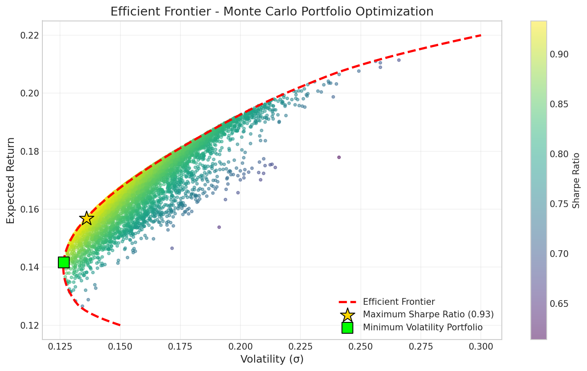
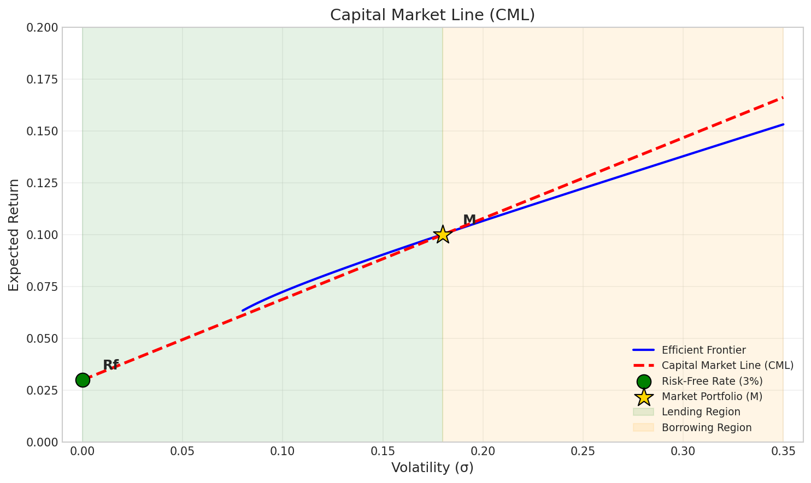
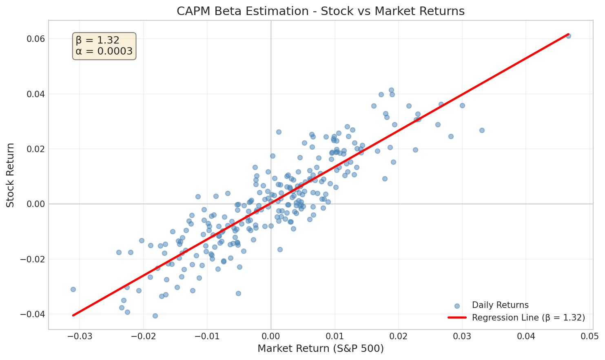
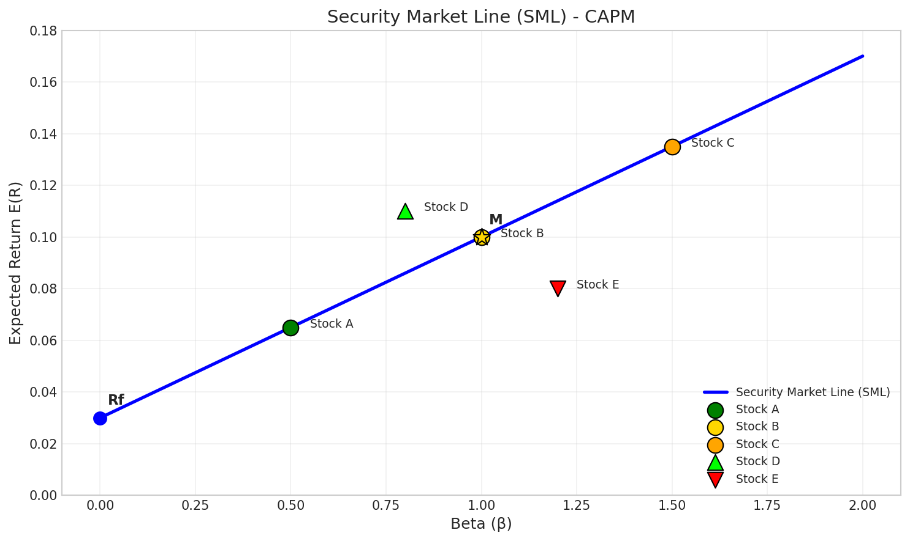

# Portfolio Theory and Risk Management

- [Portfolio Theory and Risk Management](#portfolio-theory-and-risk-management)
  - [Introduction](#introduction)
  - [Risk and Uncertainty](#risk-and-uncertainty)
    - [Risk Aversion](#risk-aversion)
  - [Measuring Returns](#measuring-returns)
    - [Historical Returns](#historical-returns)
    - [Expected Returns](#expected-returns)
  - [Measuring Risk](#measuring-risk)
    - [Volatility as a Risk Measure](#volatility-as-a-risk-measure)
    - [Tutorial Example: Calculating Volatility](#tutorial-example-calculating-volatility)
  - [Portfolio Returns and Risk](#portfolio-returns-and-risk)
    - [Portfolio Return](#portfolio-return)
    - [Portfolio Weights](#portfolio-weights)
    - [Expected Portfolio Return](#expected-portfolio-return)
    - [Portfolio Volatility](#portfolio-volatility)
    - [Portfolio Volatility: General Case](#portfolio-volatility-general-case)
  - [Correlation and Diversification](#correlation-and-diversification)
    - [Correlation Coefficient](#correlation-coefficient)
    - [Diversification Effects](#diversification-effects)
  - [Systematic and Unsystematic Risk](#systematic-and-unsystematic-risk)
  - [Modern Portfolio Theory (MPT)](#modern-portfolio-theory-mpt)
    - [Key Assumptions](#key-assumptions)
    - [Mean-Variance Analysis](#mean-variance-analysis)
    - [The Efficient Frontier](#the-efficient-frontier)
  - [Capital Market Theory](#capital-market-theory)
    - [The Risk-Free Asset](#the-risk-free-asset)
    - [Capital Market Line (CML)](#capital-market-line-cml)
    - [The Market Portfolio](#the-market-portfolio)
  - [Capital Asset Pricing Model (CAPM)](#capital-asset-pricing-model-capm)
    - [The CAPM Formula](#the-capm-formula)
    - [Beta (β)](#beta-β)
    - [Security Market Line (SML)](#security-market-line-sml)
    - [Tutorial Example: CAPM Calculation](#tutorial-example-capm-calculation)
    - [Portfolio Beta](#portfolio-beta)
    - [Practical Issues with CAPM](#practical-issues-with-capm)
  - [Multi-Factor Models](#multi-factor-models)
    - [Arbitrage Pricing Theory (APT)](#arbitrage-pricing-theory-apt)
    - [Fama-French Three-Factor Model](#fama-french-three-factor-model)
  - [Tutorial Discussion Questions](#tutorial-discussion-questions)
    - [Risk and Return Questions](#risk-and-return-questions)
    - [Portfolio Theory Questions](#portfolio-theory-questions)
    - [CAPM Questions](#capm-questions)

## Introduction

Portfolio theory provides a mathematical framework for constructing portfolios of assets that maximise expected return for a given level of risk, or minimise risk for a given level of expected return. This is fundamental to investment management and forms the basis for understanding how assets are priced in financial markets.

The theory addresses key questions for investors:

- How should returns and risk be measured?
- How does combining assets into a portfolio affect overall risk?
- What is the relationship between risk and expected return?
- How should individual assets be priced given their risk characteristics?

## Risk and Uncertainty

Before examining measures of risk and return, it is important to distinguish between **risk** and **uncertainty**:

| Concept         | Definition                                                 | Implications                                                |
| --------------- | ---------------------------------------------------------- | ----------------------------------------------------------- |
| **Risk**        | A set of unique consequences with assigned probabilities   | Can be measured and managed                                 |
| **Uncertainty** | Outcomes that cannot be identified when a decision is made | Cannot assign probabilities; difficult to measure or manage |

In finance, we typically focus on **risk** - situations where we can quantify the probability of different outcomes, allowing us to analyse and manage our exposure.

### Risk Aversion

Investors differ in their **risk appetite**, characterised by three attitudes:

| Attitude         | Description                                                                 | Compensation Required                                            |
| ---------------- | --------------------------------------------------------------------------- | ---------------------------------------------------------------- |
| **Risk Averse**  | Prefers certainty to uncertainty                                            | Requires a risk premium (compensation) for taking on risk        |
| **Risk Neutral** | Indifferent between certain and uncertain outcomes with same expected value | No compensation required                                         |
| **Risk Loving**  | Prefers uncertain outcomes                                                  | Accepts lower expected returns for the chance of higher outcomes |

**Rational investors are assumed to be risk averse.** This means:

- Given two assets with equivalent expected returns, risk-averse investors will choose the asset with lower risk.
- Investors prefer certainty to uncertainty - they will only accept additional risk if compensated with higher expected returns.

> **Example:** Yields on corporate bonds increase as credit ratings decrease from Aaa to Aa, reflecting the risk premium required by investors for bearing additional credit risk.

## Measuring Returns

### Historical Returns

**Historical returns** measure the realised return of an asset over a specific time period. They are expressed as relative values (percentages), enabling comparison across different assets, portfolios, and time periods.

$$\boxed{R_{t+1} = \frac{P_{t+1} - P_t}{P_t}}$$

where:

- $P_t$ = Value of investment at the beginning of the period
- $P_{t+1}$ = Value of investment at the end of the period
- $R_{t+1}$ = Return between time $t$ and $t+1$

**Example:** If you bought stock for £18.65 and sold it for £22.00:

$$R = \frac{£22.00 - £18.65}{£18.65} = \frac{£3.35}{£18.65} = 17.96\%$$

**Data sources for historical returns:**

- Bloomberg
- Refinitiv Datastream/Workspace
- Financial Times (markets.ft.com)
- Google Finance

Returns can be calculated at various frequencies: daily, weekly, monthly, quarterly, or annual.

### Expected Returns

Using historical data, investors can calculate the **expected future return** of an asset:

$$\boxed{\mathbb{E}[R_i] = \sum_{i=1}^{n} p_i R_i = p_1 R_1 + p_2 R_2 + \cdots + p_n R_n}$$

where:

- $\mathbb{E}[R_i]$ = Expected return of the asset
- $p_i$ = Probability of each return scenario
- $R_i$ = Possible return value in each scenario
- Probabilities must sum to 1: $\sum p_i = 1$

**Example:** An investor estimates future returns under different market conditions:

| Market Condition           | Possible Return | Probability |
| -------------------------- | --------------- | ----------- |
| Excellent (strong economy) | 15%             | 0.20        |
| No change                  | 10%             | 0.20        |
| Poor (recession)           | -25%            | 0.60        |

$$\mathbb{E}[R] = (0.20)(0.15) + (0.20)(0.10) + (0.60)(-0.25) = -0.10 = -10\%$$

The expected return is -10% (a loss), reflecting the high probability of recession.

## Measuring Risk

### Volatility as a Risk Measure

Risk is measured by the **standard deviation** ($\sigma$) or **variance** ($\sigma^2$) of returns:

$$\boxed{\sigma = \sqrt{\frac{\sum_{i=1}^{n}(R_i - \bar{R})^2}{n-1}}}$$

where:

- $R_i$ = Return observed in the dataset
- $\bar{R}$ = Arithmetic mean (average) of returns
- $n$ = Total number of observations

**Properties of volatility as a risk measure:**

- Measures the **dispersion** or variability of returns around the mean
- Captures both positive and negative deviations from expected returns
- Higher volatility indicates greater risk and uncertainty
- Widely recognised and used in fundamental asset pricing models
- Intuitive interpretation - represents the "typical" deviation from average returns

**Key insight:** Higher volatility implies a riskier asset, requiring a higher **risk premium** (compensation) from investors.

### Tutorial Example: Calculating Volatility

**Question:** Using the historical monthly returns below, calculate this asset's volatility.

| Date           | Monthly Return |
| -------------- | -------------- |
| June 2020      | -12%           |
| July 2020      | 3%             |
| August 2020    | 6%             |
| September 2020 | 8%             |

**Solution:**

**Step 1:** Calculate the arithmetic mean (average return):

$$\bar{R} = \frac{-0.12 + 0.03 + 0.06 + 0.08}{4} = \frac{0.05}{4} = 0.0125 = 1.25\%$$

**Step 2:** Calculate the standard deviation:

$$\sigma = \sqrt{\frac{(-0.12 - 0.0125)^2 + (0.03 - 0.0125)^2 + (0.06 - 0.0125)^2 + (0.08 - 0.0125)^2}{3}}$$

$$\sigma = \sqrt{\frac{0.0176 + 0.0003 + 0.0023 + 0.0046}{3}} = \sqrt{\frac{0.0248}{3}} = \sqrt{0.00827} = 0.0909 = 9.09\%$$

**Interpretation:** The monthly variability of returns for this asset is approximately 9%.

**Note:** To annualise monthly volatility: $\sigma_{annual} = \sigma_{monthly} \times \sqrt{12}$

## Portfolio Returns and Risk

### Portfolio Return

The return on a portfolio is the **weighted average** of the returns of individual assets:

$$\boxed{R_p = \sum_{i=1}^{n} w_i R_i = w_1 R_1 + w_2 R_2 + \cdots + w_n R_n}$$

where:

- $R_i$ = Return of each asset in the portfolio
- $w_i$ = Percentage weight of each asset
- $n$ = Total number of assets

### Portfolio Weights

Portfolio weights represent the proportion of each asset's value relative to total portfolio value:

$$w_i = \frac{\text{Value of asset } i}{\text{Total portfolio value}}$$

**Constraints:**

- Weights must sum to 1: $\sum_{i=1}^{n} w_i = 1$
- Values are typically based on market values

**Example:** A portfolio contains 100 shares of Company X at £200/share and 200 shares of Company Y at £50/share:

- Total value = $(100 \times £200) + (200 \times £50) = £20,000 + £10,000 = £30,000$
- $w_X = \frac{£20,000}{£30,000} = 66.67\%$
- $w_Y = \frac{£10,000}{£30,000} = 33.33\%$

### Expected Portfolio Return

The expected return of a portfolio is the weighted sum of expected returns:

$$\boxed{\mathbb{E}[R_p] = \sum_{i=1}^{n} w_i \mathbb{E}[R_i] = w_1 \mathbb{E}[R_1] + w_2 \mathbb{E}[R_2] + \cdots + w_n \mathbb{E}[R_n]}$$

### Portfolio Volatility

For a **two-asset portfolio**, the standard deviation is:

$$\boxed{\sigma_p = \sqrt{w_1^2 \sigma_1^2 + w_2^2 \sigma_2^2 + 2w_1 w_2 \rho_{1,2} \sigma_1 \sigma_2}}$$

where:

- $w_1, w_2$ = Portfolio weights of assets 1 and 2
- $\sigma_1, \sigma_2$ = Volatilities of assets 1 and 2
- $\rho_{1,2}$ = Correlation between assets 1 and 2

The formula has three components:

1. **Risk of asset 1:** $w_1^2 \sigma_1^2$
2. **Risk of asset 2:** $w_2^2 \sigma_2^2$
3. **Co-movement term:** $2w_1 w_2 \rho_{1,2} \sigma_1 \sigma_2$

### Portfolio Volatility: General Case

For a portfolio of $n$ assets:

$$\boxed{\sigma_p = \sqrt{\sum_{i=1}^{n} w_i^2 \sigma_i^2 + \sum_{i=1}^{n} \sum_{j \neq i} w_i w_j \rho_{ij} \sigma_i \sigma_j}}$$

**Key insight:** As more assets are added to a portfolio, the greater the potential risk reduction through diversification effects.

## Correlation and Diversification

### Correlation Coefficient

The **correlation coefficient** ($\rho$) measures the linear relationship between two variables:

$$\rho_{X,Y} = \frac{\text{Cov}(X,Y)}{\sigma_X \sigma_Y}$$

**Properties:**

- Range: $-1 \leq \rho \leq 1$
- $\rho = +1$: Perfect positive linear correlation (assets move together)
- $\rho = 0$: No linear correlation
- $\rho = -1$: Perfect negative linear correlation (assets move in opposite directions)

### Diversification Effects

| Correlation     | Diversification Benefit                                                             |
| --------------- | ----------------------------------------------------------------------------------- |
| $\rho = +1$     | **No diversification** - portfolio risk equals weighted average of individual risks |
| $0 < \rho < 1$  | **Partial diversification** - portfolio risk is reduced                             |
| $\rho = 0$      | **Good diversification** - significant risk reduction                               |
| $-1 < \rho < 0$ | **Better diversification** - substantial risk reduction                             |
| $\rho = -1$     | **Perfect diversification** - risk can be eliminated entirely                       |

> **Key Insight:** Assets with negative correlation provide the best diversification benefits, while perfectly correlated assets provide no diversification.

## Systematic and Unsystematic Risk

Total risk can be decomposed into two components:

| Risk Type             | Also Called                                           | Source                                                                                  | Diversifiable?                                      |
| --------------------- | ----------------------------------------------------- | --------------------------------------------------------------------------------------- | --------------------------------------------------- |
| **Systematic Risk**   | Market risk, Non-diversifiable risk                   | Common market conditions: economic cycles, inflation, interest rates, government policy | **No** - affects all risky assets                   |
| **Unsystematic Risk** | Idiosyncratic risk, Specific risk, Diversifiable risk | Firm-specific or industry-specific factors                                              | **Yes** - can be eliminated through diversification |

**Mathematical representation:**

$$\text{Total Risk} = \text{Systematic Risk} + \text{Unsystematic Risk}$$

As the number of uncorrelated securities in a portfolio increases, unsystematic risk decreases asymptotically towards zero, leaving only systematic risk.

## Modern Portfolio Theory (MPT)

Modern Portfolio Theory, developed by **Harry Markowitz (1952)**, provides a framework for constructing optimal portfolios.

### Key Assumptions

1. Investors are **rational** and seek to maximise expected utility
2. Investors are **risk-averse** - they prefer lower risk for a given return
3. Returns are **normally distributed**
4. Investors make decisions based solely on **mean** (expected return) and **variance** (risk)
5. Markets are **frictionless** - no taxes or transaction costs
6. All investors have the **same time horizon**
7. Information is freely available to all investors

### Mean-Variance Analysis

Given these assumptions, investors use **mean-variance rules** to compare portfolios:

- For portfolios with the **same variance**: prefer higher expected return
- For portfolios with the **same expected return**: prefer lower variance

**Dominance:** Portfolio A dominates Portfolio B if:

- $\mathbb{E}[R_A] \geq \mathbb{E}[R_B]$ AND $\sigma_A \leq \sigma_B$
- With at least one strict inequality

### The Efficient Frontier

The **efficient frontier** is the set of portfolios that offer:

- The highest expected return for each level of risk, OR
- The lowest risk for each level of expected return

**Properties:**

- All portfolios on the efficient frontier are **Pareto optimal**
- Rational investors will only hold portfolios on the efficient frontier
- The frontier is typically a hyperbola in mean-standard deviation space

## Capital Market Theory

Capital Market Theory extends MPT by introducing a **risk-free asset**.

### The Risk-Free Asset

A risk-free asset has the following characteristics:

- **Zero standard deviation:** $\sigma_{RF} = 0$
- **Zero correlation** with all risky assets: $\rho_{RF,i} = 0$ for all $i$
- Provides a certain return: $R_f$ (the risk-free rate)

**Examples:** U.S. Treasury bills, government bonds (short-term)

### Capital Market Line (CML)

The **Capital Market Line** represents the set of portfolios combining the risk-free asset with the optimal risky portfolio (market portfolio):

$$\boxed{\mathbb{E}[R_p] = R_f + \frac{\mathbb{E}[R_m] - R_f}{\sigma_m} \sigma_p}$$

where:

- $\mathbb{E}[R_p]$ = Expected return of the combined portfolio
- $R_f$ = Risk-free rate
- $\mathbb{E}[R_m]$ = Expected return of the market portfolio
- $\sigma_m$ = Volatility of the market portfolio
- $\sigma_p$ = Volatility of the combined portfolio

**Key term:** $\frac{\mathbb{E}[R_m] - R_f}{\sigma_m}$ is the **market price of risk** (risk premium per unit of risk)

**Properties of the CML:**

- The CML is tangent to the efficient frontier at the market portfolio
- All portfolios on the CML dominate portfolios on the efficient frontier (except at the tangent point)
- Below the market portfolio: lending (investing in the risk-free asset)
- Above the market portfolio: borrowing (leveraging by shorting the risk-free asset)

### The Market Portfolio

The **market portfolio** is the optimal risky portfolio that lies at the tangent point between the CML and the efficient frontier.

**Characteristics:**

- In theory, includes **all risky assets** weighted by market value
- All unsystematic risk is diversified away (only systematic risk remains)
- Provides the highest return per unit of risk
- All rational investors would choose to invest in it

**In practice:** The S&P 500 Index is commonly used as a proxy because:

- It represents a large proportion of total U.S. equity market value
- It is value-weighted
- It has extensive historical data

## Capital Asset Pricing Model (CAPM)

The **CAPM**, developed by Sharpe (1964), Lintner (1965), and Mossin (1966), provides a formula for pricing individual risky assets.

### The CAPM Formula

$$\boxed{\mathbb{E}[R_i] = R_f + \beta_i [\mathbb{E}[R_m] - R_f]}$$

where:

- $\mathbb{E}[R_i]$ = Expected return on asset $i$
- $R_f$ = Risk-free rate (baseline return compensating for time value of money)
- $\beta_i$ = Beta of asset $i$ (sensitivity to systematic risk)
- $\mathbb{E}[R_m] - R_f$ = Market risk premium

**Interpretation:** Expected return equals the risk-free rate plus a risk premium proportional to the asset's systematic risk (beta).

### Beta (β)

**Beta** measures the systematic risk of an asset relative to the market:

$$\boxed{\beta_i = \frac{\text{Cov}(R_i, R_m)}{\sigma_m^2} = \frac{\rho_{i,m} \sigma_i \sigma_m}{\sigma_m^2} = \frac{\rho_{i,m} \sigma_i}{\sigma_m}}$$

**Interpretation of beta values:**

| Beta            | Interpretation                             |
| --------------- | ------------------------------------------ |
| $\beta = 0$     | Risk-free asset (no systematic risk)       |
| $\beta = 1$     | Same systematic risk as the market         |
| $\beta > 1$     | More volatile than the market (aggressive) |
| $0 < \beta < 1$ | Less volatile than the market (defensive)  |
| $\beta < 0$     | Moves opposite to the market (rare)        |

**Example:** If $\beta_i = 1.5$, the asset's expected return changes by 1.5% for every 1% change in the market portfolio's expected return.

**Practical estimation:** Beta is typically estimated using the **market model** (OLS regression):

$$R_i = \alpha_i + \beta_i R_m + \epsilon_i$$

The slope coefficient gives the beta estimate.

### Security Market Line (SML)

The **Security Market Line** depicts the relationship between beta and expected return for individual assets:

$$\mathbb{E}[R_i] = R_f + \beta_i [\mathbb{E}[R_m] - R_f]$$

**Key properties:**

- All fairly priced assets should lie on the SML
- Assets **above** the SML are undervalued (higher return than required for their risk)
- Assets **below** the SML are overvalued (lower return than required for their risk)
- The market portfolio has $\beta = 1$ and lies on the SML
- The risk-free asset has $\beta = 0$ and lies on the SML

**Difference from CML:**

- CML applies to **efficient portfolios**
- SML applies to **all assets and portfolios**

### Tutorial Example: CAPM Calculation

**Question:** Shares of Turtle Inc. have a beta of 2.0. If the current risk-free return is 3% and the market risk premium is 5%, what is the expected return according to the CAPM?

**Solution:**

Using the CAPM equation:

$$\mathbb{E}[R_i] = R_f + \beta_i [\mathbb{E}[R_m] - R_f]$$

$$\mathbb{E}[R_i] = 0.03 + 2.0 \times 0.05 = 0.03 + 0.10 = 0.13 = 13\%$$

The expected return of Turtle Inc. shares is **13%** according to the CAPM.

### Portfolio Beta

The beta of a portfolio is the weighted average of the component asset betas:

$$\boxed{\beta_{portfolio} = \sum_{i=1}^{n} w_i \beta_i = w_1 \beta_1 + w_2 \beta_2 + \cdots + w_n \beta_n}$$

### Practical Issues with CAPM

When implementing the CAPM in practice, several challenges arise:

| Issue                        | Challenge                                                                     | Typical Approach                                                                    |
| ---------------------------- | ----------------------------------------------------------------------------- | ----------------------------------------------------------------------------------- |
| **Time interval**            | Different frequencies (daily, weekly, monthly) yield different beta estimates | Bloomberg uses weekly returns over 2 years; Reuters uses daily returns over 2 years |
| **Market portfolio proxy**   | Theory requires ALL risky assets globally                                     | S&P 500 commonly used (represents large portion of U.S. equity)                     |
| **Risk-free rate**           | Choice affects beta estimate                                                  | U.S. Treasury bills, LIBOR, or swap rates                                           |
| **Single factor limitation** | Market return may not capture all systematic risk                             | Use multi-factor models (APT, Fama-French)                                          |

## Multi-Factor Models

### Arbitrage Pricing Theory (APT)

**APT**, proposed by Stephen Ross (1976), provides an alternative to the CAPM with multiple sources of systematic risk:

$$\boxed{\mathbb{E}[R_i] = \alpha + \beta_{i1} F_1 + \beta_{i2} F_2 + \cdots + \beta_{in} F_n}$$

where:

- $\alpha$ = Expected return on an asset with zero systematic risk
- $F_j$ = Risk premium associated with factor $j$
- $\beta_{ij}$ = Factor loading (sensitivity of asset $i$ to factor $j$)

**Common factors in APT models:**

- Inflation
- GDP growth
- Oil prices
- Interest rates
- Sectoral indices

**Advantages over CAPM:**

- Accounts for multiple sources of systematic risk
- More flexible and empirically robust
- Does not require identification of the "true" market portfolio

### Fama-French Three-Factor Model

Fama and French (1993) developed a prominent multi-factor model:

$$R_{it} - R_{ft} = \alpha_i + b_{i1}(R_{mt} - R_{ft}) + b_{i2} \cdot SMB_t + b_{i3} \cdot HML_t + \epsilon_{it}$$

where:

- **SMB** (Small Minus Big): Return on small-cap stocks minus return on large-cap stocks (size factor)
- **HML** (High Minus Low): Return on high book-to-market stocks minus return on low book-to-market stocks (value factor)

This model captures:

1. Market risk (as in CAPM)
2. Size effect (small firms tend to outperform)
3. Value effect (high book-to-market firms tend to outperform)

## Tutorial Discussion Questions

### Risk and Return Questions

1. **Describe three attitudes to risk. What level of risk aversion are rational investors assumed to have and why?**

   *Answer:* Risk averse (require compensation), risk neutral (no compensation needed), and risk loving (accept discount). Rational investors are assumed to be risk averse because they prefer certainty to uncertainty - given equivalent returns, they choose lower risk.

2. **What are the benefits of using σ as a measure of risk?**

   *Answer:* It is intuitive, widely recognised in finance, and has been used in many fundamental theoretical asset pricing models (CAPM, MPT, Black-Scholes).

3. **What does correlation ρ = 1 between two assets indicate about diversification? What about ρ = -1?**

   *Answer:* Assets with ρ = +1 provide no diversification benefits. Assets with ρ = -1 provide the best diversification effects and can theoretically eliminate all portfolio risk.

### Portfolio Theory Questions

4. **Why can't systematic risk be diversified away?**

   *Answer:* Systematic risk is caused by common market conditions (economic cycles, inflation, interest rates, government policy) that affect ALL risky assets. Since it impacts every asset, it cannot be eliminated through diversification.

5. **What is unsystematic risk? How can it be reduced?**

   *Answer:* Unsystematic (idiosyncratic) risk is specific to a particular firm, industry, or security. It can be reduced or eliminated through portfolio diversification - as more uncorrelated securities are added, unsystematic risk decreases.

### CAPM Questions

6. **Explain the difference between Modern Portfolio Theory and Capital Market Theory.**

   *Answer:* Capital Market Theory extends MPT by introducing a risk-free asset. This allows investors to combine the risk-free asset with the optimal risky portfolio (market portfolio), creating the Capital Market Line.

7. **What are the characteristics of the market portfolio?**

   *Answer:* In theory, it includes ALL risky assets weighted by market value. All unsystematic risk is diversified away, leaving only systematic risk. It provides the highest return per unit of risk. In practice, the S&P 500 is commonly used as a proxy.

8. **In the CAPM, what does beta measure? How do you interpret β = 1.5?**

   *Answer:* Beta measures systematic risk - the sensitivity of an asset's return to market movements. β = 1.5 means the asset's expected return changes by 1.5% for every 1% change in the market's expected return, indicating 50% more systematic risk than the market.

9. **Discuss potential problems with using CAPM in practice.**

   *Answer:* (1) Choice of time interval affects beta estimates, (2) no true "market portfolio" exists - proxies like S&P 500 may be incomplete, (3) choice of risk-free rate varies, (4) CAPM is a single-factor model that may not capture all systematic risk sources. Multi-factor models (APT, Fama-French) address some of these limitations.
