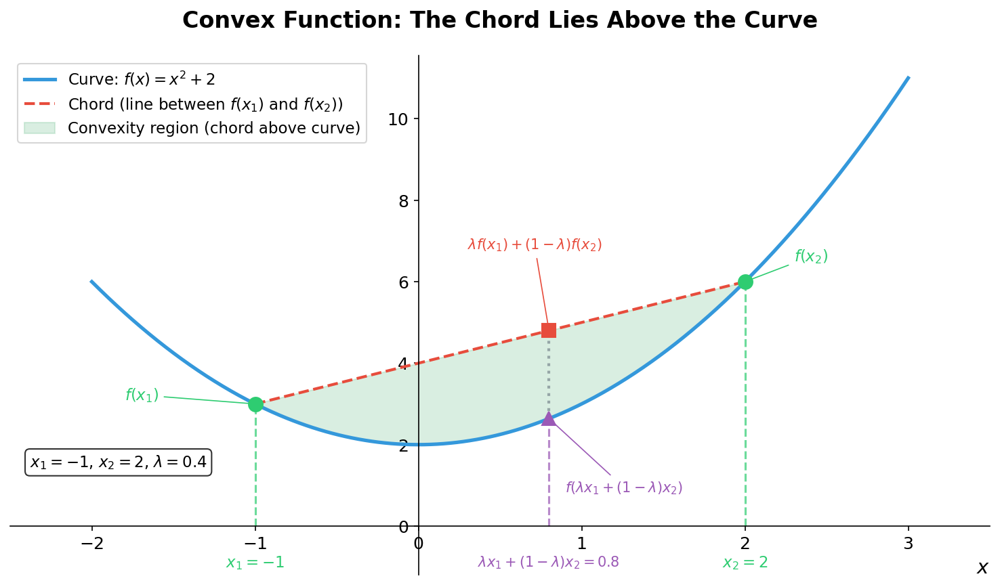

# Advanced Derivative Pricing and Risk Management

- [Advanced Derivative Pricing and Risk Management](#advanced-derivative-pricing-and-risk-management)
  - [1. Immunisation](#1-immunisation)
    - [Risk Management for Liabilities](#risk-management-for-liabilities)
    - [Hedging Scenarios](#hedging-scenarios)
    - [Immunisation of Cash Flows](#immunisation-of-cash-flows)
      - [Duration and Convexity](#duration-and-convexity)
      - [Surplus](#surplus)
      - [Redington's Immunisation Conditions](#redingtons-immunisation-conditions)
      - [The Convexity Inequality](#the-convexity-inequality)
  - [2. Quadratic Hedging](#2-quadratic-hedging)
    - [Introduction](#introduction)
    - [Portfolio Formulation](#portfolio-formulation)
    - [Single Financial Instrument (n = 1)](#single-financial-instrument-n--1)
    - [Delta Hedging](#delta-hedging)
      - [Delta Hedging Example with Geometric Brownian Motion](#delta-hedging-example-with-geometric-brownian-motion)
    - [General Solution (Any value of $n$)](#general-solution-any-value-of-n)
    - [General Case (Multiple Financial Instruments)](#general-case-multiple-financial-instruments)
      - [Convexity and Optimization](#convexity-and-optimization)
      - [Covariance Matrix and Vector](#covariance-matrix-and-vector)
      - [Properties of the Covariance Matrix](#properties-of-the-covariance-matrix)
      - [Optimal Solution for $n$ risky assets](#optimal-solution-for-n-risky-assets)
      - [Properties of the Optimal Hedging Error](#properties-of-the-optimal-hedging-error)
  - [3. Portfolio Diversification](#3-portfolio-diversification)
    - [Mean-Variance Portfolio Analysis](#mean-variance-portfolio-analysis)
      - [Portfolio Diagrams](#portfolio-diagrams)
    - [Portfolio Optimization Problem](#portfolio-optimization-problem)
      - [Lagrange Multipliers and Constraints](#lagrange-multipliers-and-constraints)
      - [Solution Without Risk-Free Asset](#solution-without-risk-free-asset)
      - [Inclusion of a Risk-Free Asset](#inclusion-of-a-risk-free-asset)
      - [Efficient Frontiers](#efficient-frontiers)
  - [4. Maximizing Expected Utility](#4-maximizing-expected-utility)
    - [Limitations of Mean-Variance Analysis](#limitations-of-mean-variance-analysis)
    - [Utility Functions](#utility-functions)
      - [Examples of Utility Functions](#examples-of-utility-functions)
      - [Certainty Equivalent](#certainty-equivalent)
    - [Optimal Investments via Expected Utility](#optimal-investments-via-expected-utility)
  - [5. Stochastic Calculus](#5-stochastic-calculus)
    - [Stochastic Integrals (Itô Integrals)](#stochastic-integrals-itô-integrals)
    - [Itô's Lemma](#itôs-lemma)
    - [Stochastic Differential Equations](#stochastic-differential-equations)
      - [Geometric Brownian Motion](#geometric-brownian-motion)
      - [Ornstein-Uhlenbeck Process](#ornstein-uhlenbeck-process)
  - [6. Stochastic Interest Rates](#6-stochastic-interest-rates)
    - [The Vasicek Model](#the-vasicek-model)
    - [The Cox-Ingersoll-Ross Model](#the-cox-ingersoll-ross-model)
    - [The Hull-White Model](#the-hull-white-model)
    - [Zero Coupon Bond Pricing](#zero-coupon-bond-pricing)
    - [Forward Rates](#forward-rates)
    - [Heath-Jarrow-Morton Framework](#heath-jarrow-morton-framework)
  - [7. Interest Rate Instruments and Derivatives](#7-interest-rate-instruments-and-derivatives)
    - [Black-Scholes Framework](#black-scholes-framework)
    - [Interest Rate Instruments](#interest-rate-instruments)
    - [Black's Model](#blacks-model)
  - [8. Credit Risk and Credit Derivatives](#8-credit-risk-and-credit-derivatives)
    - [Terminology: Credit Events and Recovery Rates](#terminology-credit-events-and-recovery-rates)
    - [The Merton Model](#the-merton-model)
    - [Credit Derivatives](#credit-derivatives)
    - [Two-State Intensity-Based Model](#two-state-intensity-based-model)
    - [Jarrow-Lando-Turnbull Model](#jarrow-lando-turnbull-model)
    - [Copula Models](#copula-models)
  - [9. Credit Risk Management and Valuation Adjustment](#9-credit-risk-management-and-valuation-adjustment)
    - [Credit Risk Concepts](#credit-risk-concepts)
    - [Credit Risk Mitigation](#credit-risk-mitigation)
    - [CVA and DVA](#cva-and-dva)
  - [10. Value at Risk](#10-value-at-risk)
    - [VaR Definition and Properties](#var-definition-and-properties)
    - [Expected Shortfall](#expected-shortfall)

## 1. Immunisation

### Risk Management for Liabilities

- The holder of some given liabilities does not want to speculate on a favourable or unfavourable market movement but wants to minimise risk.
- For liabilities $L$ at a future time $T$, regarded as random variables (e.g., derivative instruments, insurance claims), the goal is to purchase a portfolio $A$ at time $T$ that matches the value of the liabilities.
- In other words, this portfolio **hedges** the liabilities.

### Hedging Scenarios

1. **Immunisation**: Liabilities and assets are specified cash flows depending on variable interest rates. Uncertainty arises from fluctuating interest rates.
2. **Quadratic Hedging**: Liabilities and assets are random variables due to market fluctuations (stocks, futures, etc.). The goal is to set $\mathbb{E}[A - L] = 0$ and minimise $\text{Var}(A - L)$, thus minimising $\mathbb{E}[(A - L)^2]$. The quantity $A - L$ measures the risk of the hedging error.

### Immunisation of Cash Flows

An institution holds assets with present value $V_A$ to meet liabilities with present value $V_L$. Both are sensitive to interest rate $r$ (annualised) changes.
For a cash flow $\{C_1, \dots, C_n\}$ of payments made at the end of each year over $n%$ years, the present value is:
$$V(r) = \sum_{i=1}^n C_i \beta(r)^i, \quad \beta(r) = \frac{1}{1+r}$$
where $\beta(r)$ is the discounting factor.

The relative change in $V(r)$ following a small change $\epsilon$ in the interest rate $r$ is denoted as $\Delta V$:
$$\Delta V = \frac{V(r + \epsilon) - V(r)}{V(r)}$$

For a general function $f(x)$ with derivatives denoted as primes $f'(x)$ and $f''(x)$, the Taylor expansion around a point $x_0$ is:

$$f'(x) = \frac{df}{dx}, \quad f''(x) = \frac{d^2f}{dx^2}$$

$$f(x) = f(x_0) + f'(x_0)(x - x_0) + \frac{1}{2}f''(x_0)(x - x_0)^2 + \dots$$

for small deviations $x - x_0$. Setting $x = r + \epsilon$ and $x_0 = r$, and then using the Taylor expansion of $V(r + \epsilon)$, we have:

$$V(r + \epsilon) = V(r) + V'(r)\epsilon + \frac{1}{2}V''(r)\epsilon^2 + \dots$$

Ignoring higher-order terms, the (approximate) relative change in present value is:

$$ \Delta V = \frac{1}{V(r)} \left(V'(r)\epsilon + \frac{1}{2}V''(r)\epsilon^2 \right) =-\nu(r)\epsilon + \frac{1}{2}c(r)\epsilon^2$$

#### Duration and Convexity

- **Effective Duration** $\nu(r)$:

    ```math
    \begin{aligned}
    \nu(r) & = -\frac{1}{V(r)} V'(r) \\\\
    &= -\frac{1}{V(r)} \sum_{i=1}^n C_i i \beta(r)^{i-1} \beta'(r) \\\\
    &= \frac{1}{V(r)} \sum_{i=1}^n C_i i \beta(r)^{i+1}
    \end{aligned}
    ```

    since $\beta'(r) = -\beta(r)^2$
- **Convexity** $c(r)$:

    ```math
    \begin{aligned}
    c(r) & = \frac{1}{V(r)} V''(r) \\\\
    & = \frac{1}{V(r)} \frac{d}{dr} \left(-\sum_{i=1}^{n}{C_i i \beta (r)^{i+1}}\right) \\\\
    & = \frac{1}{V(r)} \sum_{i=1}^n C_i i (i+1) \beta(r)^{i+2}
    \end{aligned}
    ```

#### Surplus

The institution is immunised against small changes in the interest rate r if:

1. The present values of assets and liabilities are equal: $V_A(r) = V_L(r)$. The institution can ensure this from the onset since $r$ is known at time 0.
2. A small change in the interest rate by $\plusmn\epsilon$ will change the value of the assets to be greater or equal to that of the value of the liabilities, i.e. $V_A(r + \epsilon) - V_L(r + \epsilon) \geq 0$

The surplus is defined as:

$$S(r) = V_A(r) - V_L(r)$$

Taylor's theorem yields for small $\epsilon$ up to quadratic order:

$$S(r + \epsilon) \approx S(r) + S'(r)\epsilon + \frac{1}{2}S''(r)\epsilon^2 + \dots$$

For immunisation, we require $S(r + \epsilon) \geq 0$ for small $\epsilon$. This leads to the conditions on the derivatives of $S(r)$ at $r$.

- For the first term, we need $S(r) = 0$ or $V_A(r) = V_L(r)$.
- For the second term, we need $S'(r) = 0$ or $V_A'(r) = V_L'(r)$.
    $$V_A'(r) = V_l'(r) \iff - \frac{1}{V_A(r)} V_A'(r) = - \frac{1}{V_L(r)} V_L'(r) \iff \nu_A(r) = \nu_L(r)$$
  - **The durations of assets and liabilities must be equal.**
- For the third term, we need $S''(r) \geq 0$ or $V_A''(r) \geq V_L''(r)$.
    $$V_A''(r) \geq V_L''(r) \iff \frac{1}{V_A(r)} V_A''(r) \geq \frac{1}{V_L(r)} V_L''(r) \iff c_A(r) \geq c_L(r)$$
  - **The convexity of assets must be at least that of liabilities.**

#### Redington's Immunisation Conditions

Named after Frank M. Redington (1906-1984), an institution is immunised against small changes in interest rates if the surplus $S(r) = V_A(r) - V_L(r)$ satisfies $S(r+\epsilon) \geq 0$. This leads to three conditions:

1. **Present Value Equality**: $V_A(r) = V_L(r)$
2. **Duration Matching**: $\nu_A(r) = \nu_L(r)$ (Implies $S'(r) = 0$)
3. **Convexity Condition**: $c_A(r) \geq c_L(r)$ (Implies $S''(r) \geq 0$)

#### The Convexity Inequality

A function $f: K \to \mathbb{R}$ defined on a convex set $K$ is **convex** if for any $\lambda \in [0, 1]$ and $x_1, x_2 \in K$:

$$f(\lambda x_1 + (1 - \lambda) x_2) \leq \lambda f(x_1) + (1 - \lambda) f(x_2)$$

- The **left-hand side** represents a **point on the curve** at the weighted average of $x_1$ and $x_2$.
- The **right-hand side** represents a **point on the chord** (straight line) connecting $f(x_1)$ and $f(x_2)$.
- For a convex function, the chord always lies **above** the curve.

**Special Case ($\lambda = \frac{1}{2}$)**: When $\lambda = \frac{1}{2}$, the convex combination simplifies to the midpoint:

$$\frac{x_1}{2} + \frac{x_2}{2} = \frac{x_1 + x_2}{2}$$

$$f\left(\frac{x_1 + x_2}{2}\right) \leq \frac{f(x_1) + f(x_2)}{2}$$

This states that the function value at the midpoint $\frac{x_1 + x_2}{2}$ is less than or equal to the average of the function values at $x_1$ and $x_2$.



- The **blue curve** represents the convex function $f(x) = x^2 + 2$
- The **red dashed chord** connects the two points $(x_1, f(x_1))$ and $(x_2, f(x_2))$
- The **purple triangle** marks the point on the curve: $f(\lambda x_1 + (1-\lambda)x_2)$
- The **red square** marks the point on the chord: $\lambda f(x_1) + (1-\lambda)f(x_2)$
- The **green shaded region** shows where the chord lies above the curve (the convexity gap)
- The **dotted vertical line** illustrates the inequality: the point on the curve is always below the point on the chord

**Relevance to Immunisation**: The present value function $V(r)$ is convex in the interest rate $r$ (due to the positive convexity $c(r) > 0$). This convexity ensures that the surplus $S(r) = V_A(r) - V_L(r)$ has a local minimum that is also a global minimum when Redington's conditions are satisfied.

## 2. Quadratic Hedging

### Introduction

- Aim to choose a portfolio $A$ to hedge a liability $L$ at time $T$ such that $E[A - L] = 0$ and $\text{Var}(A - L)$ is minimised.
- If the variance is small, the spread around the expected value is small and thus the probability to be far away from the expected value is small.
- If the variance is large, the hedging error can deviate significantly from zero, potentially lead to catastrophic consequences.
- The key is determining the optimal portfolio $A$ to minimise the hedging error variance.

### Portfolio Formulation

Let $\mathbf{Z} = \begin{pmatrix} Z_1 \\ \vdots \\ Z_n \end{pmatrix}$ be the values of assets at time $T$.

Different combination of these assert (or derivative instruments based on these assets) can be purchased.

The portfolio value at time $T$ is denoted as $f(\mathbf{Z})$ with linear combinations of financial instruments $\mathbf{Z}$:

$$f(\mathbf{Z}) = h_0 + \sum_{i=1}^n h_i Z_i = h_0 + \mathbf{h}^T \mathbf{Z}$$

where the vector $\mathbf{h} = \begin{pmatrix} h_1 \\ \vdots \\ h_n \end{pmatrix}$ represent the number of units held in each asset.

The entries $h_i$ are in principle integers denoting the amount of units of the $i$th financial instrument in the portfolio; however, in order to simplify the mathematics, we allow $h_i$ to be real numbers.

Expressions of type $a_1 b_1 + a_2 b_2 + \dots + a_n b_n$ can be written as the dot product of two vectors $\mathbf{a}^T \mathbf{b}$.

$$\mathbf{a} = \begin{pmatrix} a_1 \\ a_2 \\ \vdots \\ a_n \end{pmatrix}, \quad \mathbf{b} = \begin{pmatrix} b_1 \\ b_2 \\ \vdots \\ b_n \end{pmatrix}$$

$$\mathbf{a}^T  = \begin{pmatrix} a_1 & a_2 & \dots & a_n \end{pmatrix}, \quad \mathbf{b}^T = \begin{pmatrix} b_1 & b_2 & \dots & b_n \end{pmatrix}$$

$$a_1 b_1 + a_2 b_2 + \dots + a_n b_n = \sum_{i=1}^{n}{a_ib_i} = \mathbf{a}^T \mathbf{b} = \begin{pmatrix} a_1 & a_2 & \dots & a_n \end{pmatrix} \begin{pmatrix} b_1 \\ b_2 \\ \vdots \\ b_n \end{pmatrix}$$

> Note that bold letters denote vectors in this documentation, other texts may use alternative notation such as an arrow above the letter (e.g., $\vec{a}$) or a tilde (e.g., $\tilde{a}$).

To satisfy the quadratic hedging objective, we need to choose $h_0$ and $\mathbf{h}$ such that the constants $h_0, h_1, \ldots, h_n$:

- Satisfy $\mathbb{E}[h_0 + \sum_{i=1}^n{h_i Z_i - L}] = 0$
- Minimise $\text{Var}(h_0 + \mathbf{h}^T\mathbf{Z} - L)$

The set $(h_0, \mathbf{h})$ specifies the portfolio of financial instruments to use for hedging and $h_0$ is the amount invested in a risk-free asset, e.g. a bank account or government bond.

The positions $h_1, h_2, \ldots, h_n$ are associated with the random variables $Z_1, Z_2, \ldots, Z_n$ representing the values of the risky assets/instruments.

Formally, the solution of minimising the variance $\text{Var}(h_0 + \mathbf{h}^T\mathbf{Z} - L)$ is a standard linear regression of $L$ onto the regressors $Z_1, Z_2, \ldots, Z_n$.

The solution is obtained by first considering the simpler case of $n=1$.

### Single Financial Instrument (n = 1)

For a single financial instrument $n=1$, $\mathbf{Z}=Z$ and the optimal hedging portfolio has the value $A = h_0 + hZ$:.

$(h_0, h)$ are chosen such that $\mathbb{E}[A - L] = 0$ and $\text{Var}(A - L)$ is minimised.

```math
\begin{aligned}
\text{Var}(A - L) = \text{Var}(h_0 + hZ - L) &= \text{Var}(h_0 + hZ) + Var(L) - 2\text{Cov}(hZ, L) \\
&= \text{Var}(hZ) + \text{Var}(L) - 2\text{Cov}(hZ, L) \\
&=h^2 \text{Var}(Z) + \text{Var}(L) - 2h\text{Cov}(Z, L)
\end{aligned}
```

Where the following properties are used:

- $\text{Var}(X - Y) = \text{Var}(X) + \text{Var}(Y) - 2\text{Cov}(X, Y)$
- $\text{Var}(X + c) = \text{Var}(X)$ for any constant $c$
- $\text{Var}(aX) = a^2 \text{Var}(X)$ for any constant $a$
- $\text{Cov}(aX, Y) = a \text{Cov}(X, Y)$ for any constant $a$

Since the variance $\text{Var}(A - L)$ is a quadratic function of $h$ and the factor $h^2$ is positive, the variance is a convex function of $h$ and has a unique minimum. This minimum is found by setting the derivative with respect to $h$ to zero:

$$\boxed{h^* = \frac{\text{Cov}(Z, L)}{\text{Var}(Z)}}$$

Using $E[A - L] = 0$ to determine $h_0$:

```math
E[A - L] = E[h_0 + hZ - L] = h_0 + hE[Z] - E[L] = 0
```

From the condition $\mathbb{E}[A^* - L]=0$, the optimal risk-free position is therefore:

$$\boxed{h_0^* = E[L] - h^* E[Z]}$$

Using quadratic hedging portfolio, given by $(h_0^*, h^*)$, to calculate the variance of the hedging error $A^* - L$ for the optimal portfolio value $A^* = h_0^* + h^* Z$:

```math
\begin{aligned}
\text{Var}(A^* - L) &= \text{Var}(A*) + \text{Var}(L) - 2\text{Cov}(A^*, L) \\\\
&= \text{Var} \left(\frac{\text{Cov}(L, Z)}{\text{Var}(Z)} Z \right) + \text{Var}(L) - 2 \text{Cov} \left( \frac{\text{Cov}(L,Z)}{\text{Var}(Z)}Z,L \right) \\\\
&= \frac{\text{Cov}(L,Z)^2}{\text{Var}(Z)^2} \text{Var}(Z) + \text{Var}(L) - 2 \frac{\text{Cov}(L,Z)}{\text{Var}(Z)} \text{Cov}(Z,L) \\\\
&= \text{Var}(L) - \frac{\text{Cov}(L,Z)^2}{\text{Var}(Z)}
\end{aligned}
```

Hence, the variance of the hedging error can be written in terms of the correlation coefficient $\text{Corr}(L, Z) = \frac{\text{Cov}(L, Z)}{\sqrt{\text{Var}(L)}\sqrt{\text{Var}(Z)}}$:

$$\boxed{\text{Var}(A^* - L) = \text{Var}(L) \left( 1 - \text{Corr}(L, Z)^2 \right)}$$

The hedging portfolio reduces the risk associated with the liability $L$, measured by its variance $\text{Var}(L)$, without hedging. The worst case scenario is when $\text{Cov}(L,Z) = 0$ when the hedging instrument $Z$ is uncorrelated with the liability $L$. In this case, quadratic hedging does not provide any improvement on the intrinsic risk of the liability since $h^*_0 = E[L]$ and $h^* = 0$ so the variance of the hedging error is $\text{Var}(A^* - L) = \text{Var}(L)$.

> Simply put, hedging exploits correlations to reduce risk. If $\text{Cov}(L, Z) = 0$, no risk reduction is achieved: $\text{Var}(A^* - L) = \text{Var}(L)$.

### Delta Hedging

Using  the following assumptions:

- That the price of a financial contract is given by a function $f$ of the price of an underlying asset $S_t$ at time $t$
- The function $f$ is assumed to be known at time $0$ and differentiable

The aim is to hedge the liability $L = f(S_t)$ by taking a position $h$ in the underlying asset and position $h_0$ in a risk-free investment, e.g. a unit zero-coupon bond maturing at time $t$.

Taking the optimal quadratic hedge for $n=1$:

$$h^* = \frac{\text{Cov}(S_t, f(S_t))}{\text{Var}(S_t)}, \quad h_0^* = E[f(S_t)] - h^* E[S_t]$$

The Taylor expansion of $f(S_t)$ around the expected value $\bar{S}_t = E[S_t]$ provides an approximation for the optimal hedge.

$$L = f(S_t) \approx f(\bar{S}_t) + f'(\bar{S}_t)(S_t - \bar{S}_t)$$

The optimal hedge is therefore:

```math
\begin{aligned}
h^* & = \frac{\text{Cov}(S_t, f(\bar{S}_t) + f'(\bar{S}_t)(S_t - \bar{S}_t))}{\text{Var}(S_t)} \\\\
& = \frac{f'(\bar{S}_t) \text{Cov}(S_t, S_t - \bar{S}_t)}{\text{Var}(S_t)} \\\\
& = \frac{f'(\bar{S}_t) \text{Var}(S_t)}{\text{Var}(S_t)} \\\\
& = f'(\bar{S_t})
\end{aligned}
```

and

```math
\begin{aligned}
h_0^* & = E[f(S_t) + f'(\bar{S}_t)(S_t - \bar{S}_t)] - f'(\bar{S}_t)S_t \\\\
& = f(\bar{S}_t) - f'(\bar{S}_t) \bar{S}_t
\end{aligned}
```

The hedging error is therefore:

```math
\begin{aligned}
h^*_0 + h^*St - f(S_t) &= f(\bar{S}_t) - f'(\bar{S}_t) \bar{S}_t + f'(\bar{S}_t) S_t - f(S_t) \\\\
&= f(\bar{S}_t) + f'(\bar{S}_t)(S_t - \bar{S}_t) - f(S_t)
\end{aligned}
```

This is just the error made by approximating $f(S_t)$ by its linear Taylor expansion around $\bar{S}_t$.

If $t$ is small, $\bar{S}_t \approx S_0$, and the delta hedge can be obtained:

$$h^* = f'(S_0), \quad h_0^* = f(S_0) - f'(S_0)S_0$$

The approximation of the optimal hedge does not need any knowledge of an underlying pdf of the asset price $S_t$. However, the approximation is only valid for small times $t$ so that is can only be used reasonably with frequent re-adjustments of the hedge (dynamic hedging). This usually leads to high transaction costs in practice.

#### Delta Hedging Example with Geometric Brownian Motion

Assume a contract with payoff $g(S_T)$ at time $T$ depending on the price of an underlying asset $S_T$. The price of the contract at time $0$ is given by the risk-neutral valuation formula:

$$\pi_0 = e^{-r_{0,T}T} \mathbb{E}^{\mathbb{Q}}[g(S_T)]$$

Assuming risk-neutral Geometric Brownian Motion (GBM) for $S_t$:

$$S_T = S_0 e^{\mu_0 T + \sigma_0 \sqrt{T} W}$$
$$W \sim N(0,1), \quad \mu = r_{0,T} - \frac{1}{2}\sigma_0^2$$

Therefore,

$$S_T = S_0 e^{(r_{0,T} - \frac{1}{2}\sigma_0^2)T + \sigma_0\sqrt{T}W}$$

The contract price at $t=0$ is:

$$\pi_0 = e^{-r_{0,T}T} \int_{-\infty}^{\infty} g\left(S_0 e^{(r_{0,T} - \frac{1}{2}\sigma_0^2)T + \sigma_0\sqrt{T}w}\right) \frac{1}{\sqrt{2\pi}} e^{-w^2/2} dw$$

At time $t$ the price of the contract is:

```math
\begin{aligned}
\pi_t & = e^{-r_{t,T}(T-t)} \mathbb{E}^{\mathbb{Q}}[g(S_T) | S_t] \\\\
& = e^{-r_{t,T}(T-t)} \int_{-\infty}^{\infty} g\left(S_t e^{(r_{t,T} - \frac{1}{2}\sigma_t^2)(T-t) + \sigma_t\sqrt{T-t}w}\right) \frac{1}{\sqrt{2\pi}} e^{-w^2/2} dw
\end{aligned}
```

Therefore, the assumption underlying the delta hedge is:

$$\pi_t \approx f(S_t)$$

where $f$ is a function known at time $0$ and holds oly apprximately if $t$ is close to $0$. Assuming, this the following approxmations hold:

$$r_{t,T} \approx r_{0,T}, \quad \sigma_t \approx \sigma_0$$

The underlying assumptions of the delta hedge are typically only valid for small times $t$ so that frequent re-adjustments of the hedge are required in practice.

If the payoff function $g(x)$ is given by $g(x) = \max(x - K, 0)$ for a European call option with strike $K$:

$$\pi_0 = C_{\text{BS}}(S_0, K, r_{0,T}, \sigma_0, T)$$

where $C_{\text{BS}}$ is the Black-Scholes formula for a European call option.

The Black-Scholes Greek (Delta) $\Delta = \frac{\partial C_{\text{BS}}}{\partial S_0} = h^*$ denotes the shares needed. The risk-free investment is $h_0^* = C_{\text{BS}} - \Delta S_0$.

### General Solution (Any value of $n$)

For the general case, assume that there is a large number $n$ of risk assets $\mathbf{Z} = (Z_1, Z_2, \ldots, Z_n)^T$ available for hedging the liability $L$.

In the single case $n=1$, the calculation for the minimum of $\text{Var}(A - L)$ was straightforward since it was a quadratic function of a single variable $h$ which had a unique minimum.

For higher dimensions, the convexity of the variance in $\mathbf{h}$ still holds, but the calculation of the minimum is more involved as follows.

- The set $\mathbb{C} \subset \mathbb{R}^n$ is called a convex set if for any $\lambda \in [0, 1]$ and any $\mathrm{x}, \mathrm{y} \in \mathbb{C}$, the convex combination $\lambda \mathrm{x} + (1 - \lambda)\mathrm{y} \in \mathbb{C}$ holds true.
- The function $f: \mathbb{C} \to \mathbb{R}$ is called convex if for any $\lambda \in [0, 1]$ and any $\mathrm{x}, \mathrm{y} \in \mathbb{C}$, the inequality $f(\lambda \mathrm{x} + (1 - \lambda)\mathrm{y}) \leq \lambda f(\mathrm{x}) + (1 - \lambda) f(\mathrm{y})$ holds true.
  - Both set and function are strictly convex if $<$ holds instead of $\leq$.
  
The optimal quadratic hedging portfolio is determined by the conditions when $\mathbb{E}[A - L] = 0$ and $\text{Var}(A - L)$ is minimised. Let $(h_0^*, \mathbf{h}^*)$ denote the optimal portfolio with value $A^* = h_0^* + \mathbf{h}^{*T} \mathbf{Z}$.

By first minimising $\text{Var}(\mathbf{h}^T \mathbf{Z} - L)$. Since $\text{Var}(h_0 + \mathbf{h}^T \mathbf{Z} - L) = \text{Var}(\mathbf{h}^T \mathbf{Z} - L)$, the variance of the hedging error is:

$$\text{Var}(A-L) = \text{Var}(\mathbf{h}^T \mathbf{Z} - L) = \text{Var}(\mathbf{h}^T \mathbf{Z}) + \text{Var}(L) - 2\text{Cov}(\mathbf{h}^T \mathbf{Z}, L)$$

The last term can be rewritten using $\mathbf{h}^T \mathbf{Z} = \sum_{i=1}^n h_i Z_i$ as:

```math
\begin{aligned}
\text{Cov}(\mathbf{h}^T \mathbf{Z}, L) & = \text{Cov}\left(\sum_{i=1}^n h_i Z_i, L\right) \\\\
& = \mathbb{E}\left[\sum_{i=1}^n h_i Z_i L \right] - \mathbb{E}\left[\sum_{i=1}^n h_i Z_i\right] \mathbb{E}[L] \\\\
& = \sum_{i=1}^n h_i \left( \mathbb{E}[Z_i L] - \mathbb{E}[Z_i] \mathbb{E}[L] \right) \\\\
& = \sum_{i=1}^n h_i \text{Cov}(Z_i, L) \\\\
& = \mathbf{h}^T \Sigma_{L, \mathbf{Z}}
\end{aligned}
```

Where the covariance vector $\Sigma_{L, \mathbf{Z}}$ contains the covariances of $L$ with $\mathbf{Z}$:

$$\Sigma_{L, \mathbf{Z}} = \begin{pmatrix} \text{Cov}(L, Z_1) \\ \text{Cov}(L, Z_2) \\ \vdots \\ \text{Cov}(L, Z_n) \end{pmatrix}$$

Using the result $\text{Var}(\mathbf{h}^T \mathbf{Z}) = \mathbf{h}^T \Sigma_{\mathbf{Z}} \mathbf{h}$ where $\Sigma_{\mathbf{Z}}$ is the covariance matrix of $\mathbf{Z}$ containing the convariances of the financial instruments:

$$\Sigma_{\mathbf{Z}} = \begin{pmatrix} \text{Cov}(Z_1, Z_1) & \text{Cov}(Z_1, Z_2) & \dots & \text{Cov}(Z_1, Z_n) \\ \text{Cov}(Z_2, Z_1) & \text{Cov}(Z_2, Z_2) & \dots & \text{Cov}(Z_2, Z_n) \\ \vdots & \vdots & \ddots & \vdots \\ \text{Cov}(Z_n, Z_1) & \text{Cov}(Z_n, Z_2) & \dots & \text{Cov}(Z_n, Z_n) \end{pmatrix}$$

Further, the variance of the hedging error can be written as:

$$\boxed{\text{Var}(\mathbf{h}^T \mathbf{Z} - L) = \mathbf{h}^T \Sigma_{\mathbf{Z}} \mathbf{h} + \text{Var}(L) - 2 \mathbf{h}^T \Sigma_{L, \mathbf{Z}}}$$

Writing out the indices explicitly:

$$\text{Var}(\mathbf{h}^T \mathbf{Z} - L) = \sum_{i=1}^n \sum_{j=1}^n h_i h_j \text{Cov}(Z_i, Z_j) + \text{Var}(L) - 2 \sum_{i=1}^n h_i \text{Cov}(L, Z_i)$$

The covariance matrix $\Sigma_{\mathbf{Z}}$ is an important quantity which quantifies the correlations among the financial instruments used for hedging. Any covariance matrix $\Sigma_{\mathbf{Z}}$ has the following properties:

1. **Symmetry**: $(\Sigma_{\mathbf{Z}})_{ij} = \text{Cov}(Z_i, Z_j) = \text{Cov}(Z_j, Z_i) = (\Sigma_{\mathbf{Z}})_{ji}$ for all $i, j$.
2. **Positive Semi-definite**: For any vector $\mathrm{x} \in \mathbb{R}^n$, $\mathrm{x}^T \Sigma_{\mathbf{Z}} \mathrm{x} \geq 0$.

*Proof*:

Define $\bar{Z}_i = E[Z_i]$ and $\bar{\mathbf{Z}}$ as the vector containing the elements $\bar{Z}_i$.
The covariance can be written as $\text{Cov}(Z_i, Z_j) = E[(Z_i - \bar{Z}_i)(Z_j - \bar{Z}_j)]$.

Thus,

```math
\begin{aligned}
\mathrm{x}^T \Sigma_{\mathbf{Z}} \mathrm{x} & = \sum_{i=1}^n \sum_{j=1}^n x_i x_j \text{Cov}(Z_i, Z_j) \\\\
& = \sum_{i=1}^n \sum_{j=1}^n x_i x_j E[(Z_i - \bar{Z}_i)(Z_j - \bar{Z}_j)] \\\\
& = E\left[ \sum_{i=1}^n \sum_{j=1}^n x_i x_j (Z_i - \bar{Z}_i)(Z_j - \bar{Z}_j) \right] \\\\
& = E\left[ \sum_{i=1}^n x_i (Z_i - \bar{Z}_i) \sum_{j=1}^n x_j (Z_j - \bar{Z}_j) \right] \\\\
& = E\left[ \left( \mathrm{x}^T (\mathbf{Z} - \bar{\mathbf{Z}}) \right) \left( \mathrm{x}^T (\mathbf{Z} - \bar{\mathbf{Z}}) \right) \right] \\\\
\end{aligned}
```

The scalar product $\mathrm{x}^T (\mathbf{Z} - \bar{\mathbf{Z}})$ is a particular random variable, so its square is non-negative. Similarly, defining $Y = \mathrm{x}^T (\mathbf{Z} - \bar{\mathbf{Z}})$, leads to $\mathrm{x}^T \Sigma_{\mathbf{Z}} \mathrm{x} = E[Y^2] \geq 0$.

### General Case (Multiple Financial Instruments)

In higher dimensions, $\text{Var}(\mathbf{h}^T \mathbf{Z} - L)$ is a convex function of $\mathbf{h}$.

#### Convexity and Optimization

A set $K$ is convex if $\lambda x + (1 - \lambda)y \in K$ for $\lambda \in [0, 1]$. A function $f$ is convex if $f(\lambda x + (1 - \lambda)y) \leq \lambda f(x) + (1 - \lambda) f(y)$. The unique extremum of the variance is its global minimum.

#### Covariance Matrix and Vector

- **Covariance Vector** $\Sigma_{L,\mathbf{Z}}$: Elements are $\text{Cov}(L, Z_i)$.
- **Covariance Matrix** $\Sigma_{\mathbf{Z}}$: Elements are $\text{Cov}(Z_i, Z_j)$.
$$\text{Var}(\mathbf{h}^T \mathbf{Z} - L) = \mathbf{h}^T \Sigma_{\mathbf{Z}} \mathbf{h} + \text{Var}(L) - 2 \mathbf{h}^T \Sigma_{L,\mathbf{Z}}$$

#### Properties of the Covariance Matrix

1. **Symmetry**: $(\Sigma_{\mathbf{Z}})_{ij} = (\Sigma_{\mathbf{Z}})_{ji}$.
2. **Positive Semi-definite**: $x^T \Sigma_{\mathbf{Z}} x \geq 0$.
   *Proof: Let $x^T \Sigma_{\mathbf{Z}} x = E[(x^T(\mathbf{Z} - \bar{\mathbf{Z}}))^2] \geq 0$.*

#### Optimal Solution for $n$ risky assets

Taking partial derivatives $\frac{\partial}{\partial h_m} \text{Var}(\mathbf{h}^T \mathbf{Z} - L) = 0$:
$$2 \sum_{j=1}^n h_j \text{Cov}(Z_m, Z_j) - 2 \text{Cov}(L, Z_m) = 0 \implies \Sigma_{\mathbf{Z}}\mathbf{h} - \Sigma_{L,\mathbf{Z}} = 0$$
The optimal vector $\mathbf{h}^*$:
$$\mathbf{h}^* = \Sigma_{\mathbf{Z}}^{-1} \Sigma_{L,\mathbf{Z}}$$
The risk-free position:
$$h_0^* = E[L] - \mathbf{h}^{*T} E[\mathbf{Z}]$$

#### Properties of the Optimal Hedging Error

For the optimal portfolio $A^* = h_0^* + \mathbf{h}^{*T} \mathbf{Z}$:

- $E[A^* - L] = 0$
- $\text{Var}(A^* - L) = \text{Var}(L) - \Sigma_{L,\mathbf{Z}}^T \Sigma_{\mathbf{Z}}^{-1} \Sigma_{L,\mathbf{Z}}$
- $\text{Cov}(A^* - L, Z_k) = 0$ for all $k$ (the error is uncorrelated with hedging instruments).

---

## 3. Portfolio Diversification

### Mean-Variance Portfolio Analysis

- Consider a portfolio of $n$ risky assets with random returns $R_1, R_2, \ldots, R_n$
- **Expected Return Vector**: $\boldsymbol{\mu} = E[\mathbf{R}] = (\mu_1, \ldots, \mu_n)^T$
- **Covariance Matrix**: $\boldsymbol{\Sigma}$ with elements $\Sigma_{ij} = \text{Cov}(R_i, R_j)$
- **Portfolio Weights**: $\mathbf{w} = (w_1, \ldots, w_n)^T$ where $\sum_{i=1}^n w_i = 1$

**Portfolio Return**:
$$R_p = \mathbf{w}^T \mathbf{R} = \sum_{i=1}^n w_i R_i$$

**Portfolio Statistics**:
$$E[R_p] = \mathbf{w}^T \boldsymbol{\mu}, \quad \text{Var}(R_p) = \mathbf{w}^T \boldsymbol{\Sigma} \mathbf{w}$$

#### Portfolio Diagrams

- The **feasible region** in $(\sigma, \mu)$-space contains all achievable portfolios
- The **efficient frontier** consists of portfolios with minimum variance for a given expected return
- Portfolios on the efficient frontier dominate all others (higher return for same risk, or lower risk for same return)

### Portfolio Optimization Problem

**Objective**: Minimize portfolio variance subject to constraints:

```math
\min_{\mathbf{w}} \quad \frac{1}{2} \mathbf{w}^T \boldsymbol{\Sigma} \mathbf{w}
```

Subject to:

- $\mathbf{w}^T \mathbf{1} = 1$ (weights sum to 1)
- $\mathbf{w}^T \boldsymbol{\mu} = \mu_p$ (target expected return)

#### Lagrange Multipliers and Constraints

The Lagrangian is:
$$\mathcal{L}(\mathbf{w}, \lambda, \gamma) = \frac{1}{2} \mathbf{w}^T \boldsymbol{\Sigma} \mathbf{w} - \lambda(\mathbf{w}^T \mathbf{1} - 1) - \gamma(\mathbf{w}^T \boldsymbol{\mu} - \mu_p)$$

First-order conditions:
$$\frac{\partial \mathcal{L}}{\partial \mathbf{w}} = \boldsymbol{\Sigma} \mathbf{w} - \lambda \mathbf{1} - \gamma \boldsymbol{\mu} = 0$$

This gives:
$$\mathbf{w}^* = \boldsymbol{\Sigma}^{-1}(\lambda \mathbf{1} + \gamma \boldsymbol{\mu})$$

#### Solution Without Risk-Free Asset

Define the constants:

```math
\begin{aligned}
A &= \mathbf{1}^T \boldsymbol{\Sigma}^{-1} \mathbf{1} \\
B &= \mathbf{1}^T \boldsymbol{\Sigma}^{-1} \boldsymbol{\mu} = \boldsymbol{\mu}^T \boldsymbol{\Sigma}^{-1} \mathbf{1} \\
C &= \boldsymbol{\mu}^T \boldsymbol{\Sigma}^{-1} \boldsymbol{\mu} \\
D &= AC - B^2
\end{aligned}
```

The Lagrange multipliers are:
$$\lambda = \frac{C - B\mu_p}{D}, \quad \gamma = \frac{A\mu_p - B}{D}$$

**Minimum Variance Portfolio** (global minimum):
$$\mathbf{w}_{\text{MVP}} = \frac{\boldsymbol{\Sigma}^{-1} \mathbf{1}}{A}, \quad \mu_{\text{MVP}} = \frac{B}{A}, \quad \sigma^2_{\text{MVP}} = \frac{1}{A}$$

**Efficient Frontier Equation** (hyperbola):
$$\sigma_p^2 = \frac{A\mu_p^2 - 2B\mu_p + C}{D} = \frac{1}{A} + \frac{A(\mu_p - B/A)^2}{D}$$

#### Inclusion of a Risk-Free Asset

With a risk-free asset yielding $r_f$:

- Total wealth: $w_0$ in risk-free + $\mathbf{w}^T \mathbf{1}$ in risky assets
- Constraint: $w_0 + \mathbf{w}^T \mathbf{1} = 1$

**Portfolio Return**:
$$R_p = r_f + \mathbf{w}^T (\boldsymbol{\mu} - r_f \mathbf{1})$$

**Optimal Risky Portfolio** (Tangency Portfolio):
$$\mathbf{w}_T = \frac{\boldsymbol{\Sigma}^{-1}(\boldsymbol{\mu} - r_f \mathbf{1})}{\mathbf{1}^T \boldsymbol{\Sigma}^{-1}(\boldsymbol{\mu} - r_f \mathbf{1})}$$

**Capital Market Line** (CML):
$$\mu_p = r_f + \frac{\mu_T - r_f}{\sigma_T} \sigma_p$$

The slope $\frac{\mu_T - r_f}{\sigma_T}$ is the **Sharpe Ratio** of the tangency portfolio.

#### Efficient Frontiers

| Without Risk-Free Asset              | With Risk-Free Asset                           |
| ------------------------------------ | ---------------------------------------------- |
| Hyperbola in $(\sigma, \mu)$-space   | Straight line (CML)                            |
| Upper branch is efficient            | Line from $(0, r_f)$ tangent to risky frontier |
| Minimum variance portfolio at vertex | Tangency portfolio is optimal risky portfolio  |

---

## 4. Maximizing Expected Utility

### Limitations of Mean-Variance Analysis

- Only considers first two moments (mean and variance)
- Implicitly assumes either:
  - Quadratic utility (unrealistic for large wealth changes), or
  - Normally distributed returns (may not hold)
- Does not account for investor preferences beyond risk aversion

### Utility Functions

A **utility function** $U(W)$ represents preferences over wealth levels:

- **Increasing**: $U'(W) > 0$ (more wealth is preferred)
- **Concave**: $U''(W) < 0$ (risk aversion)

**Risk Aversion Measures**:

- **Absolute Risk Aversion**: $A(W) = -\frac{U''(W)}{U'(W)}$
- **Relative Risk Aversion**: $R(W) = -\frac{W \cdot U''(W)}{U'(W)}$

#### Examples of Utility Functions

| Utility Function | Formula                                | ARA                       | RRA               |
| ---------------- | -------------------------------------- | ------------------------- | ----------------- |
| Quadratic        | $U(W) = W - \frac{b}{2}W^2$            | $\frac{b}{1-bW}$ (IARA)   | $\frac{bW}{1-bW}$ |
| Exponential      | $U(W) = -e^{-aW}$                      | $a$ (CARA)                | $aW$              |
| Power/CRRA       | $U(W) = \frac{W^{1-\gamma}}{1-\gamma}$ | $\frac{\gamma}{W}$ (DARA) | $\gamma$ (CRRA)   |
| Logarithmic      | $U(W) = \ln(W)$                        | $\frac{1}{W}$ (DARA)      | $1$ (CRRA)        |

- **CARA**: Constant Absolute Risk Aversion
- **CRRA**: Constant Relative Risk Aversion
- **DARA**: Decreasing Absolute Risk Aversion
- **IARA**: Increasing Absolute Risk Aversion

#### Certainty Equivalent

The **certainty equivalent** $W_{CE}$ is the guaranteed wealth that provides the same utility as the risky prospect:
$$U(W_{CE}) = E[U(W)]$$

**Risk Premium**:
$$\pi = E[W] - W_{CE}$$

For small risks with $W = \bar{W} + \epsilon$ where $E[\epsilon] = 0$:
$$\pi \approx \frac{1}{2} A(\bar{W}) \text{Var}(\epsilon)$$

### Optimal Investments via Expected Utility

**Problem**: Choose portfolio weights $\mathbf{w}$ to maximize expected utility:
$$\max_{\mathbf{w}} E[U(W_T)]$$

where $W_T = W_0(1 + R_p) = W_0(1 + \mathbf{w}^T \mathbf{R})$

**For CRRA Utility** with lognormal returns:

- Optimal allocation depends only on relative risk aversion $\gamma$
- Does not depend on initial wealth (myopic property)

**For Normal Returns and Exponential Utility**:
$$E[U(W)] = E[-e^{-aW}] = -e^{-a(E[W] - \frac{a}{2}\text{Var}(W))}$$
Maximizing expected utility is equivalent to:
$$\max_{\mathbf{w}} \left( E[W] - \frac{a}{2}\text{Var}(W) \right)$$
This is a **mean-variance** problem with risk aversion parameter $a$.

---

## 5. Stochastic Calculus

### Stochastic Integrals (Itô Integrals)

For a Wiener process $W_t$ and adapted process $f(t)$, the **Itô integral** is:
$$I_t = \int_0^t f(s) \, dW_s = \lim_{n \to \infty} \sum_{i=0}^{n-1} f(t_i)(W_{t_{i+1}} - W_{t_i})$$

**Key Properties**:

- $E[I_t] = 0$
- $E[I_t^2] = E\left[\int_0^t f(s)^2 \, ds\right]$ (Itô isometry)
- $I_t$ is a martingale

**Important Result**:
$$\int_0^t W_s \, dW_s = \frac{1}{2}W_t^2 - \frac{1}{2}t$$

This differs from ordinary calculus where $\int x \, dx = \frac{1}{2}x^2$.

### Itô's Lemma

For a process $X_t$ satisfying $dX_t = \mu_t \, dt + \sigma_t \, dW_t$ and a smooth function $f(t, x)$:

$$df(t, X_t) = \frac{\partial f}{\partial t} dt + \frac{\partial f}{\partial x} dX_t + \frac{1}{2} \frac{\partial^2 f}{\partial x^2} (dX_t)^2$$

Using the rules $(dt)^2 = 0$, $dt \cdot dW_t = 0$, $(dW_t)^2 = dt$:

$$\boxed{df = \left(\frac{\partial f}{\partial t} + \mu_t \frac{\partial f}{\partial x} + \frac{1}{2}\sigma_t^2 \frac{\partial^2 f}{\partial x^2}\right) dt + \sigma_t \frac{\partial f}{\partial x} dW_t}$$

**Multidimensional Itô's Lemma**:

For $\mathbf{X}_t = (X_1, \ldots, X_n)^T$ with $dX_i = \mu_i \, dt + \sum_j \sigma_{ij} \, dW_j$:
$$df = \frac{\partial f}{\partial t} dt + \sum_i \frac{\partial f}{\partial x_i} dX_i + \frac{1}{2} \sum_{i,j} \frac{\partial^2 f}{\partial x_i \partial x_j} dX_i \, dX_j$$

### Stochastic Differential Equations

#### Geometric Brownian Motion

$$dS_t = \mu S_t \, dt + \sigma S_t \, dW_t$$

**Solution**: Apply Itô's lemma to $f(S) = \ln S$:
$$d(\ln S_t) = \left(\mu - \frac{1}{2}\sigma^2\right) dt + \sigma \, dW_t$$

Integrating:
$$S_t = S_0 \exp\left[\left(\mu - \frac{1}{2}\sigma^2\right)t + \sigma W_t\right]$$

The log-return is normally distributed:
$$\ln\frac{S_t}{S_0} \sim N\left(\left(\mu - \frac{1}{2}\sigma^2\right)t, \sigma^2 t\right)$$

#### Ornstein-Uhlenbeck Process

$$dX_t = \kappa(\theta - X_t) \, dt + \sigma \, dW_t$$

- **Mean-reverting** to level $\theta$
- **Speed of reversion**: $\kappa$

**Solution**:
$$X_t = X_0 e^{-\kappa t} + \theta(1 - e^{-\kappa t}) + \sigma \int_0^t e^{-\kappa(t-s)} \, dW_s$$

**Stationary Distribution** (as $t \to \infty$):
$$X_\infty \sim N\left(\theta, \frac{\sigma^2}{2\kappa}\right)$$

---

## 6. Stochastic Interest Rates

### The Vasicek Model

The short rate $r_t$ follows:
$$dr_t = \kappa(\theta - r_t) \, dt + \sigma \, dW_t$$

**Properties**:

- Mean-reverting to $\theta$
- Gaussian (can become negative)
- Analytically tractable

**Distribution of $r_t$**:
$$r_t | r_0 \sim N\left(\theta + (r_0 - \theta)e^{-\kappa t}, \frac{\sigma^2}{2\kappa}(1 - e^{-2\kappa t})\right)$$

### The Cox-Ingersoll-Ross Model

$$dr_t = \kappa(\theta - r_t) \, dt + \sigma\sqrt{r_t} \, dW_t$$

**Properties**:

- Mean-reverting to $\theta$
- **Non-negative** if $2\kappa\theta \geq \sigma^2$ (Feller condition)
- Non-central chi-squared distribution

### The Hull-White Model

$$dr_t = (\theta(t) - \kappa r_t) \, dt + \sigma \, dW_t$$

**Properties**:

- Time-dependent drift $\theta(t)$
- Can be calibrated to initial term structure
- Extension of Vasicek

### Zero Coupon Bond Pricing

Under the risk-neutral measure, the price of a zero-coupon bond is:
$$P(t, T) = E^Q\left[\exp\left(-\int_t^T r_s \, ds\right) \bigg| \mathcal{F}_t\right]$$

**Affine Term Structure Models**: For Vasicek and CIR:
$$P(t, T) = A(t, T) e^{-B(t, T) r_t}$$

where $A(t, T)$ and $B(t, T)$ are deterministic functions of time.

**Vasicek Bond Price**:

```math
\begin{aligned}
B(t, T) &= \frac{1 - e^{-\kappa(T-t)}}{\kappa} \\
A(t, T) &= \exp\left[\left(\theta - \frac{\sigma^2}{2\kappa^2}\right)(B(t,T) - (T-t)) - \frac{\sigma^2}{4\kappa}B(t,T)^2\right]
\end{aligned}
```

### Forward Rates

The **instantaneous forward rate** at time $t$ for maturity $T$:
$$f(t, T) = -\frac{\partial \ln P(t, T)}{\partial T}$$

**Relationship to Short Rate**:
$$r_t = f(t, t) = \lim_{T \to t} f(t, T)$$

**Bond Price from Forward Rates**:
$$P(t, T) = \exp\left(-\int_t^T f(t, s) \, ds\right)$$

### Heath-Jarrow-Morton Framework

The HJM framework models the evolution of the entire forward rate curve:
$$df(t, T) = \alpha(t, T) \, dt + \sigma(t, T) \, dW_t$$

**No-Arbitrage Condition** (HJM drift restriction):
$$\alpha(t, T) = \sigma(t, T) \int_t^T \sigma(t, s) \, ds$$

The short rate models (Vasicek, CIR, Hull-White) are special cases of HJM.

---

## 7. Interest Rate Instruments and Derivatives

### Black-Scholes Framework

Under GBM $dS_t = \mu S_t \, dt + \sigma S_t \, dW_t$ and risk-free rate $r$:

**Black-Scholes PDE**:
$$\frac{\partial V}{\partial t} + rS\frac{\partial V}{\partial S} + \frac{1}{2}\sigma^2 S^2 \frac{\partial^2 V}{\partial S^2} = rV$$

**Risk-Neutral Valuation**:
$$V_t = e^{-r(T-t)} E^Q[V_T | \mathcal{F}_t]$$

**Black-Scholes Call Price**:
$$C = S_0 N(d_1) - Ke^{-rT} N(d_2)$$

where:
$$d_1 = \frac{\ln(S_0/K) + (r + \frac{1}{2}\sigma^2)T}{\sigma\sqrt{T}}, \quad d_2 = d_1 - \sigma\sqrt{T}$$

### Interest Rate Instruments

**Floating Rate Note (FRN)**:

- Pays coupons based on a floating reference rate (e.g., LIBOR, SOFR)
- At reset dates, the coupon is set to the prevailing short rate
- Trades at par immediately after each reset

**Interest Rate Swap**:

- Exchange fixed payments for floating payments
- **Fixed Leg**: $K \cdot \delta \cdot N$ per period
- **Floating Leg**: $L_i \cdot \delta \cdot N$ per period (where $L_i$ is the LIBOR rate)

**Swap Rate** (par swap rate making PV = 0):
$$K = \frac{P(0, T_0) - P(0, T_n)}{\delta \sum_{i=1}^n P(0, T_i)}$$

### Black's Model

**Black's Model** (1976) for pricing options on forwards/futures:

**Call on Forward**:
$$C = P(0, T)[F_0 N(d_1) - K N(d_2)]$$

where:
$$d_1 = \frac{\ln(F_0/K) + \frac{1}{2}\sigma^2 T}{\sigma\sqrt{T}}, \quad d_2 = d_1 - \sigma\sqrt{T}$$

**Caplet** (call on LIBOR rate):
$$\text{Caplet} = \delta P(0, T_{i+1})[(1+\delta L_i) N(d_1) - (1+\delta K) N(d_2)]$$

**Cap**: Sum of caplets over multiple periods

**Floorlet**: Put option on LIBOR rate

**Put-Call Parity for Caps/Floors**:
$$\text{Cap} - \text{Floor} = \text{Swap}$$

**Swaption**: Option to enter into a swap

- **Payer Swaption**: Right to pay fixed, receive floating
- **Receiver Swaption**: Right to receive fixed, pay floating

---

## 8. Credit Risk and Credit Derivatives

### Terminology: Credit Events and Recovery Rates

**Credit Events**:

- Default on payment
- Bankruptcy
- Restructuring
- Repudiation/Moratorium

**Recovery Rate** ($R$): Fraction of face value recovered upon default

- Typically 30-50% for senior unsecured bonds
- **Loss Given Default (LGD)**: $1 - R$

### The Merton Model

Treats equity as a **call option** on firm assets:

- Firm value $V_t$ follows GBM
- Debt has face value $D$ due at time $T$
- Default occurs if $V_T < D$

**Equity Value**:
$$E_0 = V_0 N(d_1) - De^{-rT} N(d_2)$$

**Debt Value**:
$$B_0 = V_0 - E_0 = De^{-rT} N(d_2) + V_0 N(-d_1)$$

**Probability of Default** (risk-neutral):
$$P^Q(\text{default}) = N(-d_2)$$

where:
$$d_1 = \frac{\ln(V_0/D) + (r + \frac{1}{2}\sigma_V^2)T}{\sigma_V\sqrt{T}}, \quad d_2 = d_1 - \sigma_V\sqrt{T}$$

**Distance to Default**:
$$DD = \frac{\ln(V_0/D) + (\mu - \frac{1}{2}\sigma_V^2)T}{\sigma_V\sqrt{T}}$$

### Credit Derivatives

**Credit Default Swap (CDS)**:

- Protection buyer pays periodic premium (CDS spread)
- Protection seller pays $(1-R) \times \text{Notional}$ upon default
- CDS spread reflects credit risk of reference entity

**CDS Pricing**:
$$\text{Premium Leg PV} = \text{Protection Leg PV}$$

$$s \sum_{i=1}^n \delta_i P(0, T_i) Q(T_i) = (1-R) \int_0^{T_n} P(0, t) \lambda(t) Q(t) \, dt$$

where $Q(t)$ is the survival probability and $\lambda(t)$ is the default intensity.

### Two-State Intensity-Based Model

The default time $\tau$ is modeled as the first jump of a Poisson process:

- **Default Intensity** (hazard rate): $\lambda(t)$
- **Survival Probability**: $Q(t) = P(\tau > t) = e^{-\int_0^t \lambda(s) \, ds}$

For constant intensity $\lambda$:
$$Q(t) = e^{-\lambda t}$$

**Credit Spread**:
$$\text{spread} \approx \lambda \cdot (1 - R)$$

### Jarrow-Lando-Turnbull Model

Extends intensity models to multiple credit ratings:

- Credit rating transitions follow a continuous-time Markov chain
- **Generator Matrix** $\Lambda$: $\lambda_{ij}$ is transition intensity from rating $i$ to $j$
- **Transition Probability Matrix**: $P(t) = e^{\Lambda t}$

**Risky Bond Pricing**:
$$P^{\text{risky}}(0, T) = P(0, T) \cdot E^Q[e^{-\int_0^T s(X_u) \, du}]$$

where $s(X_u)$ is the credit spread for rating $X_u$.

### Copula Models

**Copula**: A function that links marginal distributions to a joint distribution:
$$C(u_1, \ldots, u_n) = P(U_1 \leq u_1, \ldots, U_n \leq u_n)$$

where $U_i = F_i(X_i)$ are uniform marginals.

**Sklar's Theorem**: For any joint CDF $F$ with marginals $F_1, \ldots, F_n$:
$$F(x_1, \ldots, x_n) = C(F_1(x_1), \ldots, F_n(x_n))$$

**Gaussian Copula**:
$$C_\Sigma(u_1, \ldots, u_n) = \Phi_\Sigma(\Phi^{-1}(u_1), \ldots, \Phi^{-1}(u_n))$$

where $\Phi_\Sigma$ is the multivariate normal CDF with correlation matrix $\Sigma$.

**Application to CDOs**:

- Model correlated defaults using copulas
- Default correlation affects tranche pricing
- Higher correlation → higher risk for senior tranches, lower risk for equity tranche

---

## 9. Credit Risk Management and Valuation Adjustment

### Credit Risk Concepts

**Expected Loss**:
$$EL = PD \times LGD \times EAD$$

where:

- **PD**: Probability of Default
- **LGD**: Loss Given Default
- **EAD**: Exposure at Default

**Unexpected Loss**:
$$UL = \sqrt{\text{Var}(\text{Loss})}$$

### Credit Risk Mitigation

**Netting**: Offsetting positive and negative exposures with the same counterparty
$$\text{Net Exposure} = \max\left(\sum_i V_i, 0\right) \text{ vs. Gross: } \sum_i \max(V_i, 0)$$

**Collateralization**:

- Variation margin: daily exchange based on mark-to-market
- Initial margin: buffer against future changes

**Credit Support Annex (CSA)**: Legal agreement governing collateral posting

### CVA and DVA

**Credit Valuation Adjustment (CVA)**: The price of counterparty credit risk
$$CVA = (1-R) \int_0^T EE(t) \cdot \lambda_C(t) \cdot P(0,t) \cdot Q_C(t) \, dt$$

where:

- $EE(t)$: Expected Exposure at time $t$
- $\lambda_C(t)$: Counterparty default intensity
- $Q_C(t)$: Counterparty survival probability

**Debt Valuation Adjustment (DVA)**: Benefit from own default risk
$$DVA = (1-R_{\text{own}}) \int_0^T NEE(t) \cdot \lambda_{\text{own}}(t) \cdot P(0,t) \cdot Q_{\text{own}}(t) \, dt$$

where $NEE(t)$ is the negative expected exposure (what we owe).

**Bilateral CVA**:
$$\text{Price}_{\text{bilateral}} = \text{Price}_{\text{risk-free}} - CVA + DVA$$

**Simplified CVA** (for constant spread):
$$CVA \approx s_C \cdot EPE \cdot T$$

where $s_C$ is the CDS spread and $EPE$ is the expected positive exposure.

---

## 10. Value at Risk

### VaR Definition and Properties

**Value at Risk (VaR)**: The loss level that will not be exceeded with probability $(1-\alpha)$ over a given time horizon.

$$P(\text{Loss} > \text{VaR}_\alpha) = \alpha$$

Equivalently:
$$\text{VaR}_\alpha = -\inf\{x : P(L \leq x) \geq 1-\alpha\} = -F_L^{-1}(1-\alpha)$$

**For Normal Distribution**:
If portfolio return $R \sim N(\mu, \sigma^2)$:
$$\text{VaR}_\alpha = -(\mu + \sigma \Phi^{-1}(\alpha)) \approx -\mu + \sigma \Phi^{-1}(1-\alpha)$$

For $\alpha = 5\%$: $\text{VaR}_{5\%} \approx 1.645\sigma - \mu$

**Properties of VaR**:

- ✓ Translation invariant: $\text{VaR}(X + c) = \text{VaR}(X) - c$
- ✓ Positive homogeneity: $\text{VaR}(\lambda X) = \lambda \text{VaR}(X)$ for $\lambda > 0$
- ✗ **Not subadditive** in general: $\text{VaR}(X + Y) \not\leq \text{VaR}(X) + \text{VaR}(Y)$

VaR fails subadditivity, meaning diversification may appear to increase risk—a serious flaw.

### Expected Shortfall

**Expected Shortfall (ES)** / **Conditional VaR (CVaR)**: The expected loss given that losses exceed VaR.

$$ES_\alpha = E[L \,|\, L > \text{VaR}_\alpha] = \frac{1}{\alpha} \int_0^\alpha \text{VaR}_u \, du$$

**For Normal Distribution**:
$$ES_\alpha = -\mu + \sigma \frac{\phi(\Phi^{-1}(1-\alpha))}{\alpha}$$

where $\phi$ is the standard normal PDF.

**Properties of Expected Shortfall**:

- ✓ Translation invariant
- ✓ Positive homogeneity
- ✓ **Subadditive**: $ES(X + Y) \leq ES(X) + ES(Y)$
- ✓ **Coherent risk measure**

**Comparison**:

| Property       | VaR          | Expected Shortfall |
| -------------- | ------------ | ------------------ |
| Intuitive      | Yes          | Less so            |
| Subadditive    | No           | Yes                |
| Tail risk      | Ignores      | Captures           |
| Coherent       | No           | Yes                |
| Regulatory use | Basel II/III | Basel III (FRTB)   |

**Fundamental Review of the Trading Book (FRTB)**:

- Basel III moved from VaR to Expected Shortfall
- Confidence level: 97.5% for ES (vs. 99% for VaR)
- Better captures tail risk and extreme losses
