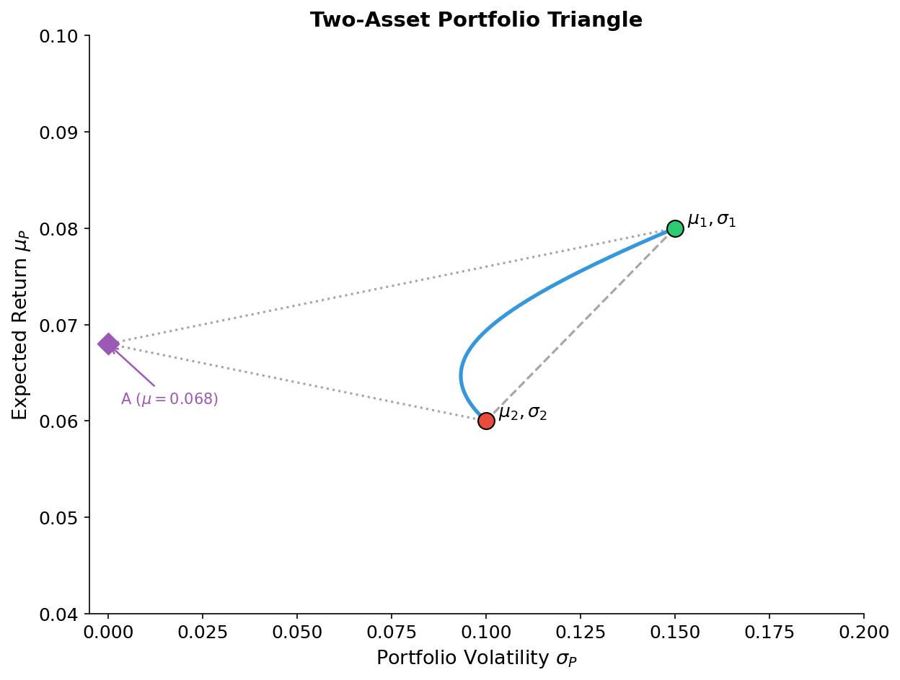
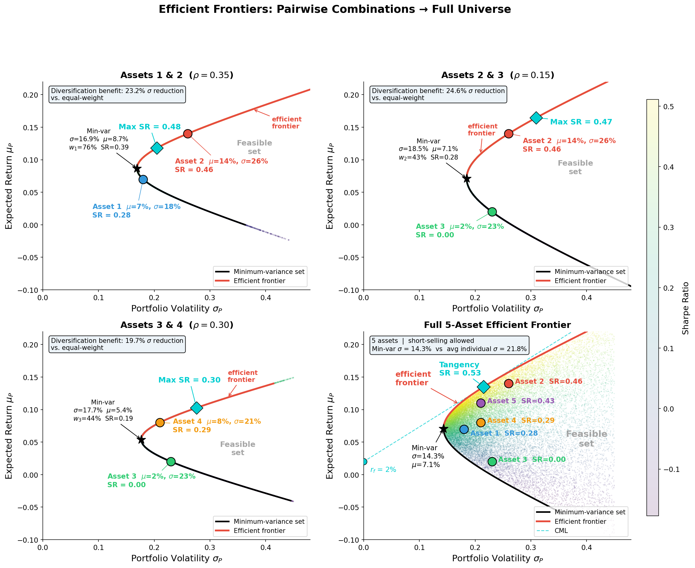
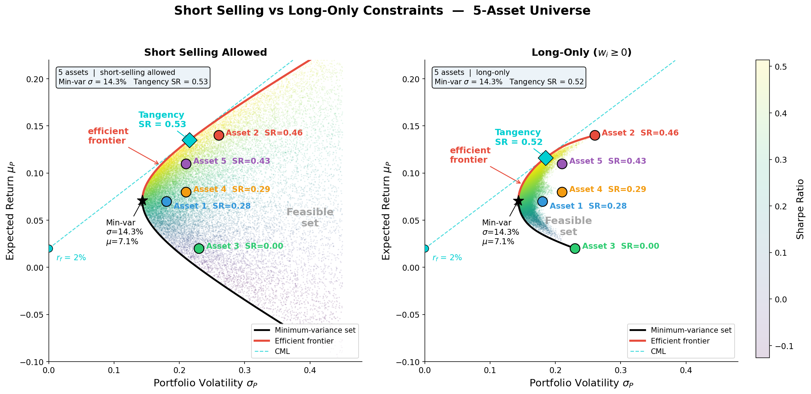
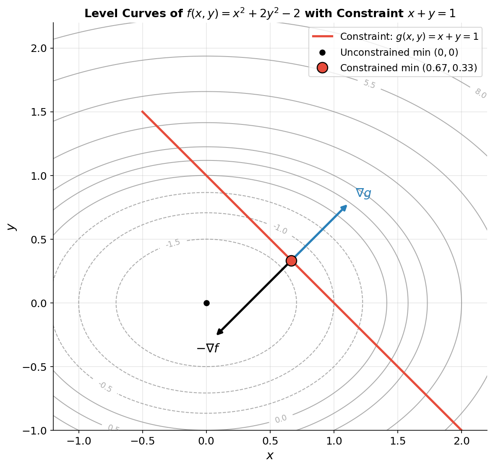
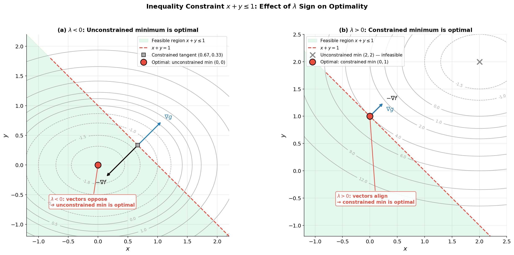

# Diversification

- [Diversification](#diversification)
  - [Mean-Variance Portfolio Analysis](#mean-variance-portfolio-analysis)
  - [Portfolio Diagrams](#portfolio-diagrams)
  - [The portfolio optimization problem: Expected gain versus risk](#the-portfolio-optimization-problem-expected-gain-versus-risk)
  - [Excursion: Finding extrema subject to constraints](#excursion-finding-extrema-subject-to-constraints)
  - [Solution without a risk-free asset](#solution-without-a-risk-free-asset)
    - [Strict Budget Constraint without Risk-Free Asset](#strict-budget-constraint-without-risk-free-asset)
    - [Soft budget constraint without Risk-Free Asset](#soft-budget-constraint-without-risk-free-asset)
  - [Inclusion of a risk-free asset](#inclusion-of-a-risk-free-asset)
    - [Strict Budget Constraint with Risk-Free Asset](#strict-budget-constraint-with-risk-free-asset)
    - [Soft budget constraint with Risk-Free Asset](#soft-budget-constraint-with-risk-free-asset)
  - [Efficient frontiers](#efficient-frontiers)
  - [Other optimization problems](#other-optimization-problems)
  - [Convex optimization with multiple constraints](#convex-optimization-with-multiple-constraints)
  - [A simple example](#a-simple-example)
  - [Maximization of expectation problem](#maximization-of-expectation-problem)
  - [Minimization of variance problem](#minimization-of-variance-problem)

> **Chapter Overview**: While the previous chapter asked _"How do I protect against specific liabilities?"_, this chapter asks the complementary question: _"How do I build the best possible portfolio?"_. The shift is from defensive risk management to **optimal allocation**. The key insight, formalised by Harry Markowitz in 1952, is that diversification is not merely a matter of holding many assets but of holding assets whose returns are imperfectly correlated. This chapter develops the full mean-variance optimisation framework, introduces the role of Lagrange multipliers in constrained optimisation, and culminates in the **One Fund Theorem**: every rational investor should hold the same portfolio of risky assets, differing only in how much they allocate to the risk-free asset.

Portfolio diversification is a fundamental principle of risk management that involves spreading investments across a variety of assets to reduce the overall risk of the portfolio. The key idea is that by holding a mix of assets that are not perfectly correlated, the portfolio can achieve a lower variance (risk) than any individual asset.

The mathematical modelling discussed in the following sections will balance the trade-off between risk and reward (returns), where the financial instruments in the portfolio can be stocks, options, advanced derivatives, or any other assets with quantifiable returns and risks. The mathematical framework for modelling is the same, regardless of the instrument type, and only depends on the expected returns and variance of the financial instruments.

## Mean-Variance Portfolio Analysis

Consider a portfolio of $n$ risky assets with random returns $R_1, R_2, \ldots, R_n$ and a risk-free asset with return $R_0$. Denote the initial capital as $V_0$ and the spot prices for the assets at time $t$ as $S_t^k$ for $k = 0, 1, \ldots, n$ where $S_0^k$ is a known quantity (the current price) and $S_1^k$ is a random variable (the future price).

A position in the risky assets is represented by $h_k \in \mathbb{R}$, which can be positive (long) or negative (short). The position $h_0$ in a risk-free zero-coupon bond that costs $B_0$ at time 0 and pays one unit of currency at time $1$.

If not risk-free bond is available, then $h_0=0$.

The value of the portfolio at time 0 is:

```math
V_0 \geq h_0 B_0 + \sum_{k=1}^n h_k S_0^k
```

The random variable $V_1$ denotes the portfolio value at time 1, which is given by:

```math
V_1 = h_0+ \sum_{k=1}^n h_k S_1^k
```

The aim is to maximise the expected value $\mathbb{E}[V_1]$ while minimising the variance $\text{Var}(V_1)$, which is the essence of mean-variance portfolio optimisation.

Taking the monetary value $w_k = h_k S_0^k$ as the $k$th portfolio weight instead of $h_k$ and denoting $w_0 = h_0 B_0$, the returns of the assets for $k = 1, 2, \ldots, n$ is defined as:

```math
R_k = \frac{S_1^k}{S_0^k}  \quad R_0 = \frac{1}{B_0}
```

Then the portfolio value at time 0 and time 1 can be rewritten as:

```math
V_0 \geq w_0 + \sum_{k=1}^n w_k
```

```math
V_1 = w_0 R_0 + \sum_{k=1}^n w_k R_k = w_0 R_0 + \mathbf{w}^{\intercal} \mathbf{R}
```

where $w_0$ is the amount invested in the risk-free asset, $\mathbf{w} = (w_1, \ldots, w_n)^{\intercal}$ is the vector of amounts invested in each risky asset, and $\mathbf{R} = (R_1, \ldots, R_n)^{\intercal}$ is the vector of returns of the risky assets.

The variance of the portfolio return can then be written as

```math
\begin{aligned}
\text{Var}(V_1) &= \text{Var}(w_0 R_0 + \mathbf{w}^{\intercal} \mathbf{R}) \\
&= \text{Var}(\mathbf{w}^{\intercal} \mathbf{R}) \\
&= \mathbf{w}^{\intercal} \Sigma \mathbf{w}
\end{aligned}
```

where the covariance matrix of the asset returns is defined as follows:

```math
\Sigma = \begin{pmatrix} \text{Cov}(R_1, R_1) & \dots & \text{Cov}(R_1, R_n) \\ \vdots & \ddots & \vdots \\ \text{Cov}(R_n, R_1) & \dots & \text{Cov}(R_n, R_n) \end{pmatrix}
```

Now considering the case without a risk-free asset ($w_0 = 0$) and two simple scenarios: _with uncorrelated assets_ and _with correlated assets_.

Assume that the **risky assets are uncorrelated**, that is, $\text{Cov}(R_i, R_j) = 0$ for $i \neq j$, and that the rates of return all have the same expected value, $\mathbb{E}[R_i] = \mu$ for all $i$, and the same variance, $\text{Var}(R_i) = \sigma^2$ for all $i$. If the weights $w_i = 1/n$ are all equal, leads to the following expected value and variance of the portfolio return:

```math
\mathbb{E}[\mathbf{w}^{\intercal} \mathbf{R}] = \sum_{k=1}^{n} w_k \mathbb{E}[R_k] = \sum_{k=1}^{n} \frac{1}{n} \mu = \mu
```

and

```math
\begin{aligned}
\text{Var}(\mathbf{w}^{\intercal} \mathbf{R}) &= \sum_{i=1}^{n} \sum_{j=1}^{n} w_i w_j \text{Cov}(R_i, R_j) = \sum_{i=1}^{n} \frac{1}{n} \cdot \frac{1}{n} \text{Var}(R_i) \\\\
&= \frac{\sigma^2}{n}
\end{aligned}
```

Therefore, the variance of the portfolio (the spread around the expected value) can be reduced to zero for large $n$. This therefore means that diversification of investments can reduce the risk.

Assume again equal expected returns and variances of the returns, but now **each pair of assets has the covariance**.

```math
\text{Cov}(R_i, R_j) = \alpha \sigma^2
```

that is, the pair covariance ($i \neq j$) is proportional to $\sigma^2$ with $\alpha \in [0, 1]$. Then $\mathbb{E}[\mathbf{w}^{\intercal} \mathbf{R}] = \mu$, but

```math
\begin{aligned}
\text{Var}(\mathbf{w}^{\intercal} \mathbf{R}) &= \sum_{i=1}^{n} \sum_{j=1}^{n} w_i w_j \text{Cov}(R_i, R_j) \\\\
&= \frac{1}{n^2}\sum_{i=1}^{n} \left(\text{Var}(R_i) + \sum_{j=1 \, j \neq i}^{n} \text{Cov}(R_i, R_j)\right) \\\\
&= \frac{1}{n^2} \sum_{i=1}^{n} \left(\sigma^2 + \sum_{j=1 \, j \neq i}^{n} \alpha \sigma^2\right) \\\\
&= \frac{1}{n^2} \sum_{i=1}^{n} \left(\sigma^2 + (n-1)\alpha \sigma^2\right) \\\\
&= \frac{\sigma^2}{n^2} (n + n(n-1)\alpha) \\\\
&= \sigma^2\left(\frac{1 - \alpha}{n} + \alpha\right)
\end{aligned}
```

Here, the variance can be maximally reduced to $\alpha\sigma^2$. The conclusion is that correlations in assets make it more difficult to reduce the portfolio variance through diversification.

In general, diversification leads to a trade-off between lower expected rate of return and lower variance.

## Portfolio Diagrams

In the following section, the notation $\mu_i = \mathbb{E}[R_i]$ and $\sigma_{ij}^2 = \text{Cov}(R_i, R_j)$ is used, where the mean and variance of the portfolio is denoted by

```math
\mu_p = \mathbb{E}[\mathbf{w}^{\intercal} \mathbf{R}], \quad \sigma_p^2 = \text{Var}(\mathbf{w}^{\intercal} \mathbf{R})
```

Consider a portfolio of two assets.

```math
\mu_p = \mathbb{E}[w_1 R_1 + w_2 R_2] = w_1 \mu_1 + w_2 \mu_2
```

```math
\sigma_p^2 = \text{Var}(w_1 R_1 + w_2 R_2) = w_1^2 \sigma_{11}^2 + 2 w_1 w_2 \sigma_{12}^2 + w_2^2 \sigma_{22}^2
```

Without loss of generality, $V_0$ can always be set to $1$, since all other values are simply multiples.

> _Without loss of generality_ means that the assumption simplifies the problem but doesn't exclude any cases; any result proven under it holds in full generality because the excluded cases are trivially equivalent by rescaling.

For a strict budget constraint, $V_0 = w_1 + w_2$, the portfolio weights can be expressed in the form $w_1 = 1 - \alpha$ and $w_2 = \alpha$, with $\alpha \in [0, 1]$ if shortselling is prohibited, i.e., $w_{1,2} \geq 0$.

> The _strict budget constraint_ requires that the weights sum exactly to the total initial wealth $V_0$ - every pound is invested and nothing is held in cash. Setting $V_0 = 1$, this becomes $w_1 + w_2 = 1$, so the two weights are not independent: once you choose $w_2 = \alpha$, the other is forced to be $w_1 = 1 - \alpha$. The word "strict" distinguishes this from a *relaxed* constraint that would allow holding cash or borrowing (i.e. $\sum w_i \leq V_0$).

This means that all possible portfolios given by different weights of $w_1$ and $w_2$ under the strict budget constraint are simply described by choosing a value of $\alpha$.

For $\alpha = 0$ everything is invested into asset 1, while for $\alpha = 1$ everything is invested into asset 2. For intermediate $\alpha$ there is a composition of investments into 1 and 2.

Plotting now $\mu_p$ against $\sigma_p$ as a function of $\alpha$ a curve of all possible portfolios in the $\mu_p$-$\sigma_p$ plane.



The curve in a $\mu$-$\sigma$ diagram defined by non-negative mixtures of two assets 1 and 2 lies within the triangular region defined by the two original assets and the point on the $\mu$ axis of height

```math
A = \frac{\mu_1 \sigma_{22} + \mu_2 \sigma_{11}}{\sigma_{11} + \sigma_{22}}
```

Assets 1 and 2 are prescribed in the diagram by their mean values $\mu_{1,2}$ and standard deviations $\sigma_1 = \sqrt{\sigma_{11}^2}$ and  $\sigma_2 = \sqrt{\sigma_{22}^2}$.

Depending on the covariance $\sigma_{12}^2$ different (left convex) curves (parametrized by $\alpha$) are obtained that describe all possible portfolios consisting of the two assets. All possible curves for different covariances lie inside the triangle spanned by asset 1, 2 and the point $A$.

In general, consider $n$ risky assets and assume that portfolios are constructed using any possible weighting for the $w_i$, under the strict budget constraint that $\sum w_i = V_0$.



The set of points in the $\mu$-$\sigma$ diagram that correspond to these portfolios is called the feasible region. The feasible region has the following properties:

1. If there are at least 3 assets, not perfectly correlated and with different means, then the feasible region will be a two dimensional surface.
2. The feasible region is convex to the left, that is, the straight line connecting any two points inside the feasible region does not cross the left boundary.

The left boundary of the feasible region is called the minimum variance set, which includes the minimum variance point (the left-most point of the feasible region). The upper part of the minimum variance set is the efficient frontier. These are the portfolios that provide the best mean-variance combinations for most investors. The points on the efficient frontier can be calculated using the so-called Markowitz model, which is described in the following section.



See [Modern Portfolio Theory](../10_portfolio_theory.md#modern-portfolio-theory-mpt) for further details on the efficient frontier and the Markowitz model.

## The portfolio optimization problem: Expected gain versus risk

An investor would ideally like to choose a portfolio that attains a high expected value, while keeping the variance small in order to reduce the risk. The portfolio value at time 1 is

```math
V_1 = w_0 R_0 + \mathbf{w}^{\intercal} \mathbf{R}
```

with expected value

```math
\mathbb{E}[V_1] = \mathbb{E}[w_0 R_0 + \mathbf{w}^{\intercal} \mathbf{R}] = w_0 R_0 + \mathbf{w}^{\intercal} \boldsymbol{\mu}
```

where $\boldsymbol{\mu} = (\mu_1, \ldots, \mu_n)^{\intercal}$ is the vector of expected returns $\mu_i = \mathbb{E}[R_i]$ of the individual risky investments. The variance is

```math
\text{Var}(V_1) = \text{Var}(w_0 R_0 + \mathbf{w}^{\intercal} \mathbf{R}) = \text{Var}(\mathbf{w}^{\intercal} \mathbf{R}) = \mathbf{w}^{\intercal} \Sigma \mathbf{w}
```

with the covariance matrix

```math
\Sigma = \begin{pmatrix} \sigma_{11}^2 & \cdots & \sigma_{1n}^2 \\ \vdots & \ddots & \vdots \\ \sigma_{n1}^2 & \cdots & \sigma_{nn}^2 \end{pmatrix}
```

where $\sigma_{ij}^2 = \text{Cov}(R_i, R_j)$. In order to maximize the expected value of $V_1$ and minimize its variance, an investor has to solve the constrained optimization problem (portfolio optimization problem)

```math
\text{maximize} \left\{w_0 R_0 + \mathbf{w}^{\intercal} \boldsymbol{\mu} - \frac{c}{2V_0} \mathbf{w}^{\intercal} \Sigma \mathbf{w}\right\}
```

subject to the budget constraint

```math
w_0 R_0 + \mathbf{w}^{\intercal} \mathbf{1} \leq V_0
```

Here, the dimensionless constant $c > 0$ is called the trade-off parameter, which quantifies the investor's choice of trade-off between maximizing $\mathbf{w}^{\intercal} \boldsymbol{\mu}$ and minimizing $\mathbf{w}^{\intercal} \Sigma \mathbf{w}$. For example, an investor who does not care about risks would choose $c = 0$, while a risk-averse investor would choose a large value of $c$. Note that the factor $\frac{1}{2V_0}$ appears for convenience. The maximization yields the optimal portfolio weights $w_0^*$, $\mathbf{w}^*$, which tell the investor how much to invest in each of the assets given an initial budget $V_0$.

Instead of maximizing, the following function can be minimized

```math
f(w_0, \mathbf{w}) = -w_0 R_0 - \mathbf{w}^{\intercal} \boldsymbol{\mu} + \frac{c}{2V_0} \mathbf{w}^{\intercal} \Sigma \mathbf{w}
```

since $f$ is just the negative. The solution $\mathbf{w}$ is thus identical for both. The minimization is more convenient, because $f$ is a convex function and results from general convex optimization theory can be applied (see below). Before calculating the solution $\mathbf{w}$ of the portfolio optimization problem, how to calculate extrema subject to constraints first needs to be understood.

## Excursion: Finding extrema subject to constraints

> Considering a strict equality constraint

For finding the extremum of a function $f(\mathbf{x})$, where $\mathbf{x} = (x_1, x_2, \ldots, x_n)^{\intercal}$, subject to a constraint on $\mathbf{x}$. The constraint can in general be expressed in the form $g(\mathbf{x}) = g_0$. Here, both $f$ and $g$ are functions $\mathbb{R}^n \to \mathbb{R}$. For concreteness, consider a simple example with the following two dimensional problem:

```math
\text{minimize} \quad f(x, y) = x^2 + 2y^2 - 2 \quad \text{subject to} \quad g(x, y) = x + y = 1
```

It is clear that the function $f$ is convex and has a unique minimum at $x = y = 0$. You can show this simply by calculating the partial derivatives with respect to $x$ and $y$ and setting them to zero. However, this minimum does not satisfy $x + y = 1$ and is thus not the solution under the constraint. How do we find the constrained minimum?

**(a) Substitution method:** Here, solve the constraint for either $x$ or $y$ and substitute this result into the function $f$. This means you obtain a new function $\tilde{f}$ which only depends on one variable and the minimum of this function is the constrained minimum of $f$. In the example, you need to substitute either $y = 1 - x$ or $x = 1 - y$. Using the former find the minimum of

```math
\tilde{f}(x) = x^2 + 2(1 - x)^2 - 2 = 3x^2 - 4x
```

at $x = 2/3$. Substituting this value into the constraint $x + y = 1$ yields $y = 1/3$. The values of $x$ and $y$ give the location of the constrained minimum of $f$. Note that this method in general requires that you can solve the constraint equation for one of the variables.

**(b) Graphical solution:** A convenient way to visualize the constrained extremum is to plot level curves (contours) of $f$ in the $x$-$y$ plane. In the example, these are ellipses centred at $(0, 0)$. In the same plot we include the constraint $g(x, y) = x + y = 1$, e.g., by plotting $y = 1 - x$, which describes a straight line. For more general constraints you will obtain a curved line. The important observation is that the constrained minimum is the point where the constraint curve is tangent to a level curve. The reason is that only at the tangent point the function $f$ is neither decreased nor increased when moving along the constraint curve, so this point is locally an extremum. Since our $f$ is convex, the local minimum will also be the global one.



The figure above shows the level curves of $f(x, y) = x^2 + 2y^2 - 2$ with the constraint $y = 1 - x$ (straight line). The constrained minimum is the point where the constraint curve is tangent to a level curve (red point). At this tangent point, the vectors $-\nabla f$ (black) and $\nabla g$ (blue) are parallel, which is the geometric interpretation of the Lagrange gradient condition.

**(c) Method of Lagrange multipliers:** Translate this graphical observation into mathematical equations as follows. The condition of a tangent point is equivalent to requiring that the gradient of $f$ and the normal vector on $g$ are parallel. This means that

```math
\nabla_{x,y} f(x, y) = -\lambda \nabla_{x,y} g(x, y)
```

for some value $\lambda$ that can be positive or negative. The negative sign is irrelevant here, but becomes meaningful later on when we discuss inequality constraints. In addition, the tangent point needs to satisfy the constraint

```math
g(x, y) = g_0
```

Note that the gradient condition is equivalent to the set of equations

```math
\frac{\partial f}{\partial x} = -\lambda \frac{\partial g}{\partial x}, \quad \frac{\partial f}{\partial y} = -\lambda \frac{\partial g}{\partial y}
```

These can be implemented in compact form by introducing the following function (called Lagrangian)

```math
\mathcal{L}(x, y, \lambda) = f(x, y) + \lambda(g(x, y) - g_0)
```

The constrained extremum then follows by solving the equations

```math
\nabla_{x,y,\lambda} \mathcal{L}(x, y, \lambda) = \mathbf{0}
```

The parameter $\lambda$ is called Lagrange multiplier and the approach is called method of Lagrange multipliers. It is easily seen that this gives the correct constrained extremum, since the first two of these equations correspond just to the gradient condition. The remaining equation is

```math
\frac{\partial \mathcal{L}}{\partial \lambda} = g(x, y) - g_0 = 0
```

which is just the constraint.

In the example, the Lagrangian is $\mathcal{L}(x, y, \lambda) = x^2 + 2y^2 - 2 + \lambda(x + y - 1)$ and the set of equations $\nabla_{x,y,\lambda} \mathcal{L} = \mathbf{0}$ is

```math
\begin{aligned}
\frac{\partial \mathcal{L}}{\partial x} &= 2x + \lambda = 0 \\
\frac{\partial \mathcal{L}}{\partial y} &= 4y + \lambda = 0 \\
\frac{\partial \mathcal{L}}{\partial \lambda} &= x + y - 1 = 0
\end{aligned}
```

Solving for $x$, $y$ you obtain the same solution as with the substitution method. Although the Lagrange multiplier method requires more effort in the example, it is generally the more powerful approach and can in particular be extended to inequality constraints.

> **Inequality constraint**
>
> The important question is now, what happens when the constraint becomes an inequality constraint?
>
> - If the equality constraint is relaxed to an inequality constraint $x + y \leq 1$, the minimization is over all values in the feasible area.
> - If the vectors $-\nabla f$ and $\nabla g$ at the tangent point show in opposite directions, i.e., $\lambda < 0$, we see that the unconstrained global minimum becomes optimal, since it is the global minimum of $f$ and thus always lower than the constrained one.
>
> However, depending on $f$ there is also a second possible scenario. If the function $f$ is such that both vectors point into the same direction at the constrained minimum, i.e., $\lambda > 0$, the constrained minimum remains optimal due to the convexity of $f$.



**(a)** If the equality constraint is relaxed to an inequality constraint $x + y \leq 1$, the minimisation is over all values in the shaded feasible area. If the vectors $-\nabla f$ (black) and $\nabla g$ (blue) at the tangent point show in opposite directions, i.e., $\lambda < 0$, the unconstrained global minimum becomes optimal (red point), since it is always lower than the constrained one. **(b)** However, if the function $f$ is such that both vectors point into the same direction, i.e., $\lambda > 0$, the constrained minimum remains optimal. The optimal solution in (a) and (b) is indicated by a red point.

The situation is clarified mathematically by the following proposition. It is important to note that this result only applies when both $f$ and $g$ are convex functions.

**Proposition (KKT Conditions for Convex Optimization).** Consider the constrained optimization problem

```math
\text{minimize} \quad f(\mathbf{x}) \quad \text{subject to} \quad g(\mathbf{x}) \leq g_0
```

where $f$ and $g$ are differentiable and convex functions $C \to \mathbb{R}$. Suppose that there exist $\mathbf{x} \in C$ and $\lambda \in \mathbb{R}$ satisfying

```math
\begin{aligned}
&\text{(1)} \quad \frac{\partial}{\partial x_i} \left\{ f(\mathbf{x}) + \lambda(g(\mathbf{x}) - g_0) \right\} = 0 \quad \text{for } i = 1, \ldots, n \\
&\text{(2)} \quad g(\mathbf{x}) \leq g_0 \\
&\text{(3)} \quad \lambda \geq 0 \\
&\text{(4)} \quad \lambda(g(\mathbf{x}) - g_0) = 0
\end{aligned}
```

Then $\mathbf{x}$ is the optimal solution.

_Proof._ Define the function

```math
\mathcal{L}(\mathbf{x}) = f(\mathbf{x}) + \lambda(g(\mathbf{x}) - g_0)
```

If conditions (1,3) hold, then $\mathbf{x}$ is a global minimum of $\mathcal{L}$. This follows because $\mathcal{L}$ is a convex function defined on a convex set. We know the convexity because:

- $g$ is convex and thus also $\lambda(g(\mathbf{x}) - g_0)$ is convex for $\lambda \geq 0$. The sum of two convex functions $f(\mathbf{x}) + \lambda(g(\mathbf{x}) - g_0)$ is again a convex function.
- The set $\{\mathbf{x} : g(\mathbf{x}) \leq V_0\}$ is a convex set, if $g$ is a convex function (see definitions introduced earlier).

If condition (2) holds, then $\mathbf{x}$ is feasible, that is, it satisfies the constraint. We need to show that $f(\mathbf{x}) \leq f(\mathbf{y})$ for all feasible $\mathbf{y}$. We have

```math
f(\mathbf{x}) = \mathcal{L}(\mathbf{x}) \leq \mathcal{L}(\mathbf{y}) = f(\mathbf{y}) + \lambda(g(\mathbf{y}) - g_0) \leq f(\mathbf{y})
```

Here, the first equality holds due to condition (4). The inequality holds due to condition (1) and the convexity of $\mathcal{L}$. The last inequality holds due to the fact that $\mathbf{y}$ is feasible, which implies that $g(\mathbf{y}) - g_0 \leq 0$ and thus $\lambda(g(\mathbf{y}) - g_0) \leq 0$ because of condition (3).

Considering the conditions (2)-(4), we see that they can only be satisfied in two cases, namely either (a) $\lambda > 0$ and $g(\mathbf{x}) = g_0$ or (b) $\lambda = 0$ and $g(\mathbf{x}) \leq g_0$. The statement of the proposition is thus that by looking at $\lambda$ we can distinguish the two cases:

(a) If $\lambda > 0$, the solution of the problem with a strict equality constraint is optimal.

(b) If $\lambda \leq 0$, the unconstrained solution is optimal, if it is a feasible solution (it satisfies the inequality constraint). The unconstrained solution is obtained from the solution of the strict equality constraint by setting $\lambda = 0$.

## Solution without a risk-free asset

### Strict Budget Constraint without Risk-Free Asset

Returning to the portfolio optimization problem and considering the strict budget constraint without a risk-free asset ($w_0 = 0$)

```math
g(\mathbf{w}) = \mathbf{w}^{\intercal} \mathbf{1} = V_0
```

Since $f(\mathbf{w})$ is a convex function the global minimum is found by setting the derivatives of $f$ with respect to the $w_k$ to zero. However, we also have the equality constraint. In the presence of such a constraint, the solution is found using the method of Lagrange multipliers. For this we introduce the function

```math
\mathcal{L}(\mathbf{w}) = f(\mathbf{w}) + \lambda(g(\mathbf{w}) - V_0) = -\mathbf{w}^{\intercal} \boldsymbol{\mu} + \frac{c}{2V_0} \mathbf{w}^{\intercal} \Sigma \mathbf{w} + \lambda(\mathbf{w}^{\intercal} \mathbf{1} - V_0)
```

and then need to solve the set of equations $\nabla_{\mathbf{w}} \mathcal{L}(\mathbf{w}) = \mathbf{0}$. Calculating the derivatives of $\mathcal{L}(\mathbf{w})$ with respect to the $w_1, \ldots, w_n$ yields the set of equations

```math
\begin{aligned}
\frac{\partial}{\partial w_1} \mathcal{L}(\mathbf{w}) &= -\mu_1 + \frac{c}{V_0} \sum_j w_j \sigma_{j1}^2 + \lambda = 0 \\
&\vdots \\
\frac{\partial}{\partial w_n} \mathcal{L}(\mathbf{w}) &= -\mu_n + \frac{c}{V_0} \sum_j w_j \sigma_{jn}^2 + \lambda = 0
\end{aligned}
```

This set of equations can also be expressed in vector-matrix notation as

```math
-\boldsymbol{\mu} + \frac{c}{V_0} \Sigma \mathbf{w} + \lambda \mathbf{1} = \mathbf{0}
```

where we introduce the vectors $\mathbf{1} = (1, \ldots, 1)^{\intercal}$ and $\mathbf{0} = (0, \ldots, 0)^{\intercal}$. This together with the strict budget constraint provide $n+1$ equations for the $n+1$ unknowns: $w_1, w_2, \ldots, w_n, \lambda$. We can first solve by matrix inversion to obtain

```math
\mathbf{w} = \frac{V_0}{c} \Sigma^{-1}(\boldsymbol{\mu} - \lambda \mathbf{1})
```

and substitute this equation into the budget constraint to solve for $\lambda$. This yields

```math
V_0 = \frac{V_0}{c} \left( \mathbf{1}^{\intercal} \Sigma^{-1} \boldsymbol{\mu} - \lambda \mathbf{1}^{\intercal} \Sigma^{-1} \mathbf{1} \right)
```

and thus

```math
\lambda = \frac{\mathbf{1}^{\intercal} \Sigma^{-1} \boldsymbol{\mu} - c}{\mathbf{1}^{\intercal} \Sigma^{-1} \mathbf{1}}
```

The solution for $\mathbf{w}$ is thus

```math
\mathbf{w} = \frac{V_0}{c} \Sigma^{-1} \left( \boldsymbol{\mu} - \frac{\mathbf{1}^{\intercal} \Sigma^{-1} \boldsymbol{\mu} - c}{\mathbf{1}^{\intercal} \Sigma^{-1} \mathbf{1}} \mathbf{1} \right)
```

### Soft budget constraint without Risk-Free Asset

If we allow for a soft budget constraint, this solution is not necessarily optimal. The inequality constraint is

```math
g(\mathbf{w}) = \mathbf{w}^{\intercal} \mathbf{1} \leq V_0
```

Since $g$ is a convex function, we can apply the KKT Proposition. The proposition tells us that the solution obtained for an equality constraint is optimal as long as $\lambda > 0$. However, we observe that $\lambda \leq 0$ when

```math
\mathbf{1}^{\intercal} \Sigma^{-1} \boldsymbol{\mu} \leq c
```

In this case, we need to solve the unconstrained problem, which is just the solution with $\lambda = 0$. Therefore, the unconstrained solution is

```math
\mathbf{w} = \frac{V_0}{c} \Sigma^{-1} \boldsymbol{\mu}
```

We need to check whether this solution is feasible, by substituting it into the soft budget constraint. This yields

```math
\mathbf{1}^{\intercal} \mathbf{w} = \frac{V_0}{c} \mathbf{1}^{\intercal} \Sigma^{-1} \boldsymbol{\mu} \leq V_0
```

because of the condition above. According to the KKT Proposition, the unconstrained solution is thus indeed an optimal solution for the regime $c \geq \mathbf{1}^{\intercal} \Sigma^{-1} \boldsymbol{\mu}$. Overall, we obtain two different solutions depending on the trade-off parameter $c$. It can be summarized as follows:

**The optimal solution** to the portfolio optimization problem without a risk-free asset ($w_0 = 0$) is given by

```math
\mathbf{w} = \frac{V_0}{c} \Sigma^{-1} \left( \boldsymbol{\mu} - \left( \frac{\mathbf{1}^{\intercal} \Sigma^{-1} \boldsymbol{\mu} - c}{\mathbf{1}^{\intercal} \Sigma^{-1} \mathbf{1}} \right)^{+} \mathbf{1} \right)
```

where $(x)^{+} = \max(x, 0)$.

**Remarks**

(a) Consider the special case of uncorrelated assets and a strict budget constraint. In this case $\sigma_{ij}^2 = 0$ for $i \neq j$ and the inverse covariance matrix has the simple diagonal form

```math
\Sigma^{-1} = \begin{pmatrix} \sigma_{11}^{-2} & \cdots & 0 \\ \vdots & \ddots & \vdots \\ 0 & \cdots & \sigma_{nn}^{-2} \end{pmatrix}
```

If the mean values are all constant, $\mu_i = \mu_0$ for all $i = 1, \ldots, n$, we obtain the portfolio weights (see exercises):

```math
w_i = \frac{V_0}{\sigma_{ii}^2 \sum_j \sigma_{jj}^{-2}}
```

This means that the initial capital is distributed proportional to the inverse variance of the return of each investment.

(b) If we have uncorrelated assets, but unequal mean values of returns with equal variances $\sigma_{ii}^2 = \sigma_0^2$ for all $i = 1, \ldots, n$ we obtain (see exercises):

```math
w_i = \frac{V_0}{c \sigma_0^2} \left( \mu_i - \frac{1}{n} \sum_j \mu_j \right) + \frac{V_0}{n}
```

This means that more capital is invested in the assets with above average expected returns. We also see that when all investments have the same mean value, the capital is just evenly distributed among the $n$ assets.

(c) For particular combinations of $\boldsymbol{\mu}$ and $\Sigma$ it is possible to have an optimal solution $\mathbf{w}$, for which

```math
\mathbf{w}^{\intercal} \mathbf{1} \leq 0
```

for any value of $c$. This means that nothing of the initial capital is used. In a more realistic scenario, we usually have the possibility to invest the initial capital in a risk-free asset to increase the expected return.

## Inclusion of a risk-free asset

Suppose we are able to invest a fraction $w_0$ of the initial capital $V_0$ into a risk-free asset with return $R_0$. The portfolio optimization problem is minimizing $f(w_0, \mathbf{w})$, subject to the budget constraint. This is a convex optimization problem, so that we can use the KKT Proposition. This means that we should first calculate the solution for an equality constraint and check if the Lagrange multiplier $\lambda$ can become negative. If it can, the unconstrained solution is optimal in this parameter regime.

### Strict Budget Constraint with Risk-Free Asset

We need to consider the strict budget constraint first, i.e., the constraint

```math
g(w_0, \mathbf{w}) = w_0 + \mathbf{w}^{\intercal} \mathbf{1} = V_0
```

In order to solve the optimization problem, we use the method of Lagrange multipliers. For this we introduce the function

```math
\mathcal{L}(w_0, \mathbf{w}) = f(w_0, \mathbf{w}) + \lambda(g(w_0, \mathbf{w}) - V_0) = -w_0 R_0 - \mathbf{w}^{\intercal} \boldsymbol{\mu} + \frac{c}{2V_0} \mathbf{w}^{\intercal} \Sigma \mathbf{w} + \lambda(w_0 + \mathbf{w}^{\intercal} \mathbf{1} - V_0)
```

and first set the derivatives of $\mathcal{L}(w_0, \mathbf{w})$ with respect to $w_1, \ldots, w_n$, to zero. This leads to the set of equations in vector-matrix notation as

```math
-\boldsymbol{\mu} + \frac{c}{V_0} \Sigma \mathbf{w} + \lambda \mathbf{1} = \mathbf{0}
```

Together with the strict budget constraint this provides $n+1$ equations for the $n+2$ unknowns: $w_0, w_1, w_2, \ldots, w_n, \lambda$. The additional equation is provided by

```math
\frac{\partial}{\partial w_0} \mathcal{L}(w_0, \mathbf{w}) = -R_0 + \lambda = 0
```

which leads immediately to

```math
\lambda = R_0
```

Solving by matrix inversion and substituting this $\lambda$ thus yields

```math
\mathbf{w} = \frac{V_0}{c} \Sigma^{-1} (\boldsymbol{\mu} - R_0 \mathbf{1})
```

With $\mathbf{w}$, we obtain the amount invested in the risk-free asset by substituting in the strict budget constraint:

```math
w_0 = V_0 - \mathbf{w}^{\intercal} \mathbf{1}
```

### Soft budget constraint with Risk-Free Asset

The question is whether this solution for an equality constraint is still optimal when we allow for a soft budget constraint

```math
g(w_0, \mathbf{w}) = w_0 + \mathbf{w}^{\intercal} \mathbf{1} \leq V_0
```

The KKT Proposition guarantees that the solution is still optimal in this case, because $\lambda = R_0 > 0$ always and therefore the KKT conditions are always satisfied for the exact constraint. Overall, we obtain the solution:

**The optimal solution** to the portfolio optimization problem including a risk-free asset is given by

```math
\begin{aligned}
\mathbf{w} &= \frac{V_0}{c} \Sigma^{-1} (\boldsymbol{\mu} - R_0 \mathbf{1}) \\
w_0 &= V_0 - \mathbf{w}^{\intercal} \mathbf{1}
\end{aligned}
```

**Remarks**

(a) The optimal solution will always invest all the capital due to the presence of a risk-free investment. Assume that there is a solution for which $w_0 + \mathbf{w}^{\intercal} \mathbf{1} < V_0$, then you could always make this solution "more optimal" by investing more in the risk-free asset, because this would increase the expected return, while leaving the variance unchanged.

(b) In the case of uncorrelated risky assets, where we have the inverse covariance matrix given above, we obtain

```math
w_i = \frac{V_0}{c} \frac{\mu_i - R_0}{\sigma_{ii}^2}, \quad i = 1, \ldots, n
```

This means investments are chosen independently from the other $n-1$ assets, with a large portfolio weight if $\mu_i$ is large and $\sigma_{ii}^2$ is small. This implies that, if necessary, money is borrowed from the risk-free asset to afford these positions, since

```math
w_0 = V_0 - \mathbf{w}^{\intercal} \mathbf{1}
```

can be negative. Note that also each position $w_i$ can be negative when $\mu_i < R_0$. This means in economic terms that this particular asset is sold short and the proceeds are invested in the remaining assets.

(c) There is a unique value of the trade-off parameter, such that the optimal portfolio is fully invested in the risky assets only. Denote this value by $c^*$. We can determine $c^*$ by solving the equation $\mathbf{w}^{\intercal} \mathbf{1} = V_0$, because then the amount invested in the risk-free asset is $w_0 = V_0 - \mathbf{w}^{\intercal} \mathbf{1} = 0$. This yields

```math
c^* = \mathbf{1}^{\intercal} \Sigma^{-1} (\boldsymbol{\mu} - R_0 \mathbf{1})
```

The optimal portfolio associated with $c^*$ is called the **tangent portfolio** $\mathbf{w}_t$:

```math
\mathbf{w}_t = \frac{V_0}{c^*} \Sigma^{-1} (\boldsymbol{\mu} - R_0 \mathbf{1})
```

## Efficient frontiers

(a) Consider first the portfolio diagram in the case without a risk-free asset. The solution is given by

```math
\mathbf{w} = \frac{V_0}{c} \Sigma^{-1} \left( \boldsymbol{\mu} - \left( \frac{\mathbf{1}^{\intercal} \Sigma^{-1} \boldsymbol{\mu} - c}{\mathbf{1}^{\intercal} \Sigma^{-1} \mathbf{1}} \right)^{+} \mathbf{1} \right)
```

and using this solution, the portfolio line (efficient frontier) in the $\mu$-$\sigma$ plane is given by $(\mu_p(c),\; \sigma_p(c))$ with

```math
\begin{aligned}
\mu_p(c) &= \mathbb{E}[V_1] = \mathbf{w}^{\intercal} \boldsymbol{\mu} \\
\sigma_p(c) &= \sqrt{\text{Var}(V_1)} = \sqrt{\mathbf{w}^{\intercal} \Sigma \mathbf{w}}
\end{aligned}
```

In order to plot the portfolio line, you need to know the properties of the assets given by the vector $\boldsymbol{\mu}$ and covariance matrix $\Sigma$. You can then plot $(\mu_p(c),\; \sigma_p(c))$ as a function of the trade-off parameter $c$, which selects different optimal portfolios depending on your risk preference. This portfolio line is the efficient frontier for portfolios consisting of risky assets only, because they appear as the solution of our optimization problem without a risk-free asset.

The plot of the resulting portfolio line shows that it curves down for $c < \mathbf{1}^{\intercal} \Sigma^{-1} \boldsymbol{\mu}$ (black line), while for $c > \mathbf{1}^{\intercal} \Sigma^{-1} \boldsymbol{\mu}$ it is a straight line (blue line). From the solution we see that for $c \to \infty$, $\mathbf{w} \to \mathbf{0}$. The interpretation is that for larger risk averseness (larger $c$), the optimal solution is to invest less and less at all.

(b) If we include a risk-free asset, we have the solution

```math
\mathbf{w} = \frac{V_0}{c} \Sigma^{-1} (\boldsymbol{\mu} - R_0 \mathbf{1}), \quad w_0 = V_0 - \mathbf{w}^{\intercal} \mathbf{1}
```

and the portfolio line in the $\mu$-$\sigma$ plane is given by $(\mu_p(c),\; \sigma_p(c))$, with

```math
\begin{aligned}
\mu_p(c) &= \mathbb{E}[V_1] = w_0 R_0 + \mathbf{w}^{\intercal} \boldsymbol{\mu} \\
\sigma_p(c) &= \sqrt{\text{Var}(V_1)} = \sqrt{\mathbf{w}^{\intercal} \Sigma \mathbf{w}}
\end{aligned}
```

In this case, the portfolio line is a straight line. There are two particular points that define this straight line: (a) The line intersects the $\sigma = 0$ axis at $V_0 R_0$. This is the portfolio where all capital is invested into the risk-free asset only and thus the associated risk is zero. Our optimal solution reaches this portfolio for $c \to \infty$ corresponding to $\mathbf{w} \to \mathbf{0}$ and thus $w_0 \to V_0$. (b) The line touches the efficient frontier of risky portfolios at a single point. This tangent point corresponds to the tangent portfolio $\mathbf{w}_t$, where all capital is invested in risky assets only, since this particular portfolio is contained in the solutions of both with and without a risk-free asset. The tangent portfolio is thus either determined by the condition $w_0 = 0$ or by the condition that the solutions with and without a risk-free asset coincide.

Overall, we find that any optimal solution is a linear combination of a position in the risk-free asset and in the tangent portfolio. This can be seen easily if we parametrize $c$ by $c^*/\alpha$ ($c^*$ is the $c$ value characterizing the tangent portfolio), we have then

```math
\mathbf{w} = \alpha \mathbf{w}_t, \quad w_0 = V_0 - \alpha \mathbf{w}_t^{\intercal} \mathbf{1}
```

and so by changing $\alpha \geq 0$ (i.e., moving along the portfolio line) we simply change the amounts invested in the tangent portfolio and the risk-free asset, respectively. Note that such a combination of investing into a single fund plus a risk-free asset is always a more optimal investment than investing into risky assets alone. This implies that a portfolio of risky assets with the same expected return always has a higher risk, or, for the same risk, always has a lower return.

In economical terms, we can conclude that in the quadratic (mean-variance) approach to investments it is optimal to invest into a selected fund (the tangent portfolio) plus keeping money in a risk-free bond. This is known as the **one fund theorem**.

(c) A portfolio with $\mathbf{w} = \alpha \mathbf{w}_t$ in risky assets and $w_0 = V_0 - \alpha \mathbf{w}_t^{\intercal} \mathbf{1}$ in the risk-free asset has expected return

```math
\mu_p = (V_0 - \alpha \mathbf{w}_t^{\intercal} \mathbf{1}) R_0 + \alpha \mathbf{w}_t^{\intercal} \boldsymbol{\mu}
```

and risk

```math
\sigma_p = \sqrt{\alpha \mathbf{w}_t^{\intercal} \Sigma \alpha \mathbf{w}_t} = \alpha \sqrt{\mathbf{w}_t^{\intercal} \Sigma \mathbf{w}_t}
```

Therefore,

```math
\begin{aligned}
\mu_p &= V_0 R_0 + \alpha \mathbf{w}_t^{\intercal} (\boldsymbol{\mu} - R_0 \mathbf{1}) \\
&= V_0 R_0 + \sigma_p \frac{\mathbf{w}_t^{\intercal} (\boldsymbol{\mu} - R_0 \mathbf{1})}{\sqrt{\mathbf{w}_t^{\intercal} \Sigma \mathbf{w}_t}} \\
&= V_0 R_0 + \frac{\mathbf{w}_t^{\intercal} \boldsymbol{\mu} - R_0 V_0}{\sqrt{\mathbf{w}_t^{\intercal} \Sigma \mathbf{w}_t}} \sigma_p
\end{aligned}
```

We have shown that the efficient frontier in the $\mu$-$\sigma$ diagram is a straight line.

It is important to note that the mathematical solutions of the portfolio optimization problem always assume $w_i \in \mathbb{R}$, which means in economic terms that shortselling is allowed. On the other hand, the portfolio diagrams discussed qualitatively earlier assume that shortselling is prohibited. How are the diagrams related? With the help of a computer, we can clarify the situation. We use the four risky assets specified by $\boldsymbol{\mu}, \Sigma$ and now simulate all possible portfolios by generating random numbers for the portfolio weights $w_i$. Each set of random numbers $w_1, w_2, w_3, w_4$ can be used as $\mathbf{w}$ in $\mu_p = \mathbf{w}^{\intercal} \boldsymbol{\mu}$, $\sigma_p = \sqrt{\mathbf{w}^{\intercal} \Sigma \mathbf{w}}$ and corresponds to a single point in the portfolio diagram. Sampling a large number of such $\mathbf{w}$ values for a given constraint yields the simulated feasible regions. We observe the following:

1. Sampling positive real numbers $w_i$ and enforcing $\sum w_i = V_0$ corresponds to the case without shortselling and a strict budget constraint. The feasible region has a left convex boundary as discussed earlier.

2. If we compare this feasible region with the theoretical solutions of the portfolio optimization problems, which include shortselling, we see that the solutions do not describe the boundary of the simulated feasible region. The discrepancy is due to the allowed shortselling in the theory.

3. However, we can now include the shortselling in the simulation by generating also negative $w_i$ values. The number of possible portfolios is then greatly larger. If we still enforce the constraint $\sum w_i = V_0$ (strict budget constraint) we obtain a much larger feasible region. The feasible region without shortselling is a tiny subset of this greater region. We now observe that the theoretical solution that corresponds to risky assets only and a strict budget constraint, i.e., with $c < \mathbf{1}^{\intercal} \Sigma^{-1} \boldsymbol{\mu}$ (black curve), indeed captures the upper part of the boundary of the simulated feasible region. The solution correctly describes the optimal portfolios.

4. If we do not enforce the constraint $\sum w_i = V_0$ in the simulation, but generate random $w_i \in \mathbb{R}$ and select only those sets of $w_i$ that satisfy $\sum w_i \leq V_0$, we implement the soft budget constraint with shortselling allowed. Adding these portfolios completes the picture and we see that the solution with $c \geq \mathbf{1}^{\intercal} \Sigma^{-1} \boldsymbol{\mu}$ describes the left boundary of these portfolios as expected.

## Other optimization problems

## Convex optimization with multiple constraints

In order to discuss more general portfolio optimization problems with multiple constraints, we first have to extend the single-constraint KKT Proposition.

**Proposition (KKT Conditions for Multiple Constraints).** Consider the constrained optimization problem

```math
\text{minimize} \quad f(\mathbf{x}) \quad \text{subject to} \quad g_j(\mathbf{x}) \leq g_{j,0}, \quad j = 1, \ldots, m
```

where $f$ and $g_j$ are differentiable and convex functions $C \to \mathbb{R}$ and $g_{j,0}$ are constants with $j = 1, \ldots, m$. Suppose that there exist $\mathbf{x} \in C$ and $\lambda_1, \ldots, \lambda_m \in \mathbb{R}$ satisfying

```math
\begin{aligned}
&\text{(1)} \quad \frac{\partial}{\partial x_i} \left\{ f(\mathbf{x}) + \sum_j \lambda_j (g_j(\mathbf{x}) - g_{j,0}) \right\} = 0 \quad \text{for } i = 1, \ldots, n \\
&\text{(2)} \quad g_j(\mathbf{x}) \leq g_{j,0}, \quad j = 1, \ldots, m \\
&\text{(3)} \quad \lambda_j \geq 0, \quad j = 1, \ldots, m \\
&\text{(4)} \quad \lambda_j (g_j(\mathbf{x}) - g_{j,0}) = 0, \quad j = 1, \ldots, m
\end{aligned}
```

Then $\mathbf{x}$ is an optimal solution to the constrained optimization problem.

_Proof._ Similar to the $m = 1$ case, not given here.

The statement of the proposition is similar to that of the single-constraint KKT Proposition. There are two possible optimal solutions:

(a) If $\lambda_j > 0$ for all $j = 1, \ldots, m$, the solution of the problem with strict equality constraints is optimal.

(b) If $\lambda_j \leq 0$ for one of the $j$, the corresponding unconstrained solution ($\lambda_j = 0$) is optimal, if it is a feasible solution (it satisfies the inequality constraint).

## A simple example

Consider the convex function

```math
f(x, y) = x^2 - xy + y^2
```

and the conditions $x \geq 1$ and $y \geq 1$. We define $g_1(x, y) = 1 - x$, $g_{1,0} = 0$, $g_2(x, y) = 1 - y$, $g_{2,0} = 0$. We set

```math
\frac{\partial}{\partial x} \left\{ f(x, y) + \lambda_1(1 - x) + \lambda_2(1 - y) \right\} = 0
```

and

```math
\frac{\partial}{\partial y} \left\{ f(x, y) + \lambda_1(1 - x) + \lambda_2(1 - y) \right\} = 0
```

resulting in

```math
2x - y - \lambda_1 = 0
```

and

```math
-x + 2y - \lambda_2 = 0
```

Suppose we take the hard constraint, so that $x = y = 1$. Then $\lambda_1 = \lambda_2 = 1$ and this choice of $x, y, \lambda_1, \lambda_2$ satisfies the theorem. The constrained minimum occurs at $x = y = 1$.

Suppose we change the constraints to $x \leq 1$ and $y \leq 1$. Then, we set

```math
\frac{\partial}{\partial x} \left\{ f(x, y) + \lambda_1(x - 1) + \lambda_2(y - 1) \right\} = 0
```

and

```math
\frac{\partial}{\partial y} \left\{ f(x, y) + \lambda_1(x - 1) + \lambda_2(y - 1) \right\} = 0
```

resulting in

```math
2x - y + \lambda_1 = 0
```

and

```math
-x + 2y + \lambda_2 = 0
```

If we take the hard constraint, so that $x = y = 1$. Then $\lambda_1 = \lambda_2 = -1$ which is not allowed by the theorem. Let's take $\lambda_1 = \lambda_2 = 0$. Our solution becomes $x = y = 0$. Clearly, $x$ and $y$ satisfy the constraints, so this choice of $x, y, \lambda_1, \lambda_2$ satisfies the theorem. The constrained minimum occurs at $x = y = 0$.

## Maximization of expectation problem

Consider the following portfolio optimization problem including a risk-free asset: $V_1 = w_0 R_0 + \mathbf{w}^{\intercal} \mathbf{R}$

```math
\begin{aligned}
\text{maximize} \quad & \mathbb{E}[V_1] = w_0 R_0 + \mathbf{w}^{\intercal} \boldsymbol{\mu} \\
\text{subject to} \quad & \text{Var}(V_1) = \mathbf{w}^{\intercal} \Sigma \mathbf{w} \leq \sigma_0^2 V_0^2, \quad w_0 + \mathbf{w}^{\intercal} \mathbf{1} \leq V_0
\end{aligned}
```

Here, $\sigma_0$ is a given parameter. This means we seek a maximal expected value of $V_1$ but provide an upper boundary for the variance (risk). The solution is given by

```math
\mathbf{w} = \frac{\sigma_0 V_0 \, \Sigma^{-1} (\boldsymbol{\mu} - R_0 \cdot \mathbf{1})}{\sqrt{(\boldsymbol{\mu} - R_0 \cdot \mathbf{1})^{\intercal} \Sigma^{-1} (\boldsymbol{\mu} - R_0 \cdot \mathbf{1})}}
```

```math
w_0 = V_0 - \mathbf{w}^{\intercal} \mathbf{1}
```

_Proof._ Apply Proposition 2.3.1 (see exercises).

## Minimization of variance problem

Consider the following portfolio optimization problem including a risk-free asset: $V_1 = w_0 R_0 + \mathbf{w}^{\intercal} \mathbf{R}$

```math
\begin{aligned}
\text{minimize} \quad & \tfrac{1}{2} \text{Var}(V_1) = \tfrac{1}{2} \mathbf{w}^{\intercal} \Sigma \mathbf{w} \\
\text{subject to} \quad & \mathbb{E}[V_1] = w_0 R_0 + \mathbf{w}^{\intercal} \boldsymbol{\mu} \geq \mu_0 V_0, \quad w_0 + \mathbf{w}^{\intercal} \mathbf{1} \leq V_0
\end{aligned}
```

Here, $\mu_0$ is a given parameter. This means we seek a minimal variance of the portfolio (the factor $\tfrac{1}{2}$ only appears for convenience), but provide a lower bound for the expected value. The solution is given by

```math
\mathbf{w} = \frac{V_0 (\mu_0 - R_0) \, \Sigma^{-1} (\boldsymbol{\mu} - R_0 \cdot \mathbf{1})}{(\boldsymbol{\mu} - R_0 \cdot \mathbf{1})^{\intercal} \Sigma^{-1} (\boldsymbol{\mu} - R_0 \cdot \mathbf{1})}
```

```math
w_0 = V_0 - \mathbf{w}^{\intercal} \mathbf{1}
```

if $\mu_0 > R_0$ and $\mathbf{w} = \mathbf{0}$ otherwise.

_Proof._ We solve this problem as the previous portfolio optimization problems by first considering the strict constraints and then evaluating the optimality of the solution by looking at the Lagrange multipliers $\lambda_1, \lambda_2$. Condition (1) of Proposition 2.3.1 requires us to calculate the derivatives:

```math
\frac{\partial}{\partial w_l} \left\{ \tfrac{1}{2} \mathbf{w}^{\intercal} \Sigma \mathbf{w} + \lambda_1 (\mu_0 V_0 - w_0 R_0 - \mathbf{w}^{\intercal} \boldsymbol{\mu}) + \lambda_2 (w_0 + \mathbf{w}^{\intercal} \mathbf{1} - V_0) \right\}
```

for $l = 1, \ldots, n$. Note that all constraints have to be included in the form $g_j(x) - g_{j,0} \leq 0$ leading to the term $+\lambda_1 (\mu_0 V_0 - w_0 R_0 - \mathbf{w}^{\intercal} \boldsymbol{\mu})$. We also need to calculate the derivative with respect to $w_0$. Setting the derivatives to zero leads to the system of equations in vector notation

```math
\begin{aligned}
\Sigma \mathbf{w} - \lambda_1 \boldsymbol{\mu} + \lambda_2 \mathbf{1} &= \mathbf{0} \\
-\lambda_1 R_0 + \lambda_2 &= 0
\end{aligned}
```

This yields

```math
\begin{aligned}
\mathbf{w} &= \lambda_1 \Sigma^{-1} (\boldsymbol{\mu} - R_0 \cdot \mathbf{1}) \\
\lambda_2 &= \lambda_1 R_0
\end{aligned}
```

In addition we have the exact constraints

```math
\begin{aligned}
w_0 R_0 + \mathbf{w}^{\intercal} \boldsymbol{\mu} &= \mu_0 V_0 \\
w_0 + \mathbf{w}^{\intercal} \mathbf{1} &= V_0
\end{aligned}
```

In order to determine $\lambda_1$ we first eliminate $w_0$ from the two constraint equations, which leads to: $\mathbf{w}^{\intercal} \boldsymbol{\mu} - \mathbf{w}^{\intercal} \mathbf{1} R_0 = \mathbf{w}^{\intercal} (\boldsymbol{\mu} - \mathbf{1} R_0) = V_0 (\mu_0 - R_0)$. Substituting the solution $\mathbf{w}$ into this equation leads to

```math
\lambda_1 = \frac{V_0 (\mu_0 - R_0)}{(\boldsymbol{\mu} - R_0 \cdot \mathbf{1})^{\intercal} \Sigma^{-1} (\boldsymbol{\mu} - R_0 \cdot \mathbf{1})}
```

Condition (3) of Proposition 2.3.1 ensures that this solution is optimal as long as $\lambda_1 > 0$. Therefore, if $\mu_0 \leq R_0$ we need to consider the solution of the unconstrained problem, which is just $\lambda_1 = \lambda_2 = 0$. For this we obtain $\mathbf{w} = \mathbf{0}$, which satisfies the budget constraint and is thus the correct solution for $\mu_0 \leq R_0$. The interpretation is clear: If the risk-free asset provides a larger expected return than the risky assets, no capital will be invested in the risky ones.
