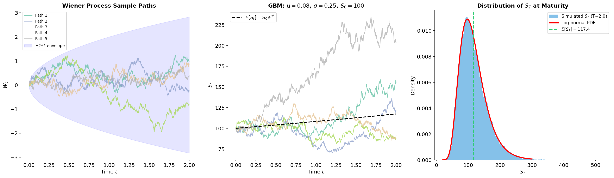

# Calculus

- [Calculus](#calculus)
  - [Differentiation](#differentiation)
    - [Constant Rule](#constant-rule)
    - [Power Rule](#power-rule)
    - [Product Rule](#product-rule)
    - [Quotient Rule](#quotient-rule)
    - [Chain Rule](#chain-rule)
    - [Exponential Differentiation](#exponential-differentiation)
    - [Natural Logarithm Differentiation](#natural-logarithm-differentiation)
  - [Integration](#integration)
    - [Integration by Parts](#integration-by-parts)
    - [Integration by Substitution](#integration-by-substitution)
  - [Stochastic Calculus](#stochastic-calculus)
    - [The Standard Definition of an Integral](#the-standard-definition-of-an-integral)
    - [Stochastic Integrals (The Itô Integrals)](#stochastic-integrals-the-itô-integrals)
      - [Stochastic Integral $\\int\_0^t f(s) , dW\_s$](#stochastic-integral-int_0t-fs--dw_s)
      - [The Distribution of the Random Variable $\\int\_0^t f(s) , dW\_s$](#the-distribution-of-the-random-variable-int_0t-fs--dw_s)
      - [Stochastic Integrals $\\int\_0^t f(W\_s) , dW\_s$ and $\\int\_0^t f(s, W\_s) , dW\_s$](#stochastic-integrals-int_0t-fw_s--dw_s-and-int_0t-fs-w_s--dw_s)
    - [The 'Usual' Differential of a Function](#the-usual-differential-of-a-function)
    - [The Stochastic Case](#the-stochastic-case)
      - [Itô's Formula for $F(W\_t)$](#itôs-formula-for-fw_t)
      - [One Useful Corollary of the Itô Formula](#one-useful-corollary-of-the-itô-formula)
      - [One More Explanation of Itô's Formula](#one-more-explanation-of-itôs-formula)
      - [Itô's Formula for $F(t, W\_t)$](#itôs-formula-for-ft-w_t)
      - [The Chain Rule](#the-chain-rule)
      - [How to Remember the Chain Rule](#how-to-remember-the-chain-rule)
    - [Stochastic Differential Equations](#stochastic-differential-equations)
      - [Simple Examples of SDEs](#simple-examples-of-sdes)
    - [Important Examples of SDEs](#important-examples-of-sdes)
      - [The SDE for the Price of a Share](#the-sde-for-the-price-of-a-share)
        - [The First Solution](#the-first-solution)
        - [The Second Solution](#the-second-solution)
      - [The Ornstein-Uhlenbeck Process (OUP)](#the-ornstein-uhlenbeck-process-oup)

## Differentiation

### Constant Rule

The constant rule states that the derivative of a constant function is zero. Mathematically, this is expressed as:
$$\frac{d}{dx} (c) = 0$$

where \( c \) is a constant.

### Power Rule

The power rule is a fundamental rule for differentiating functions of the form \( f(x) = x^n \), where \( n \) is any real number. The rule states that:
$$\frac{d}{dx} (x^n) = n x^{n-1}$$

### Product Rule

The product rule is used to differentiate functions that are the product of two or more functions. If you have two functions \( u(x) \) and \( v(x) \), the product rule states that:

$$\frac{d}{dx} (u(x) \cdot v(x)) = u'(x) \cdot v(x) + u(x) \cdot v'(x)$$

This is often remembered by the mnemonic "*first times the derivative of the second plus the second times the derivative of the first.*"

### Quotient Rule

The quotient rule is used to differentiate functions that are the quotient of two functions. If you have two functions \( u(x) \) and \( v(x) \), the quotient rule states that:

$$\frac{d}{dx} \left( \frac{u(x)}{v(x)} \right) = \frac{u'(x) \cdot v(x) - u(x) \cdot v'(x)}{(v(x))^2}$$

### Chain Rule

The chain rule is a formula for computing the derivative of the composition of two or more functions. If you have a function \( y = f(g(x)) \), the chain rule states that:

$$\frac{dy}{dx} = \frac{dy}{dg} \cdot \frac{dg}{dx}$$

### Exponential Differentiation

The rule for differentiating exponential functions is as follows:

$$\frac{d}{dx} ( e^{x} ) = e^{x}$$

For a more general exponential function $e^{u(x)}$, where $u(x)$ is a differentiable function of $x$, the differentiation is given by:

$$\frac{d}{dx} \left( e^{u(x)} \right) = e^{u(x)} \cdot \frac{du}{dx}$$

So, if we have a function like $e^{3x^2}$, we first find $\frac{du}{dx}$ where $u = 3x^2$:

$$\frac{du}{dx} = 6x$$

Then, applying the exponential differentiation rule, we get:

$$\frac{d}{dx} \left( e^{3x^2} \right) = e^{3x^2} \cdot 6x = 6x e^{3x^2}$$

### Natural Logarithm Differentiation

The simple rule for differentiating the natural logarithm function is as follows:

$$\frac{d}{dx} ( \ln(x) ) = \frac{1}{x}$$

Using this rule, we can derive the differentiation of more complex logarithmic functions. For example:

$$\frac{d}{dx} ( \ln(x^2) ) = \frac{d}{dx} (2 \ln(x)) =  2 \cdot \frac{d}{dx} (\ln(x)) = \frac{2}{x}$$

For a more complex function such as $\ln(x^3 + 2x^2 -4)$, we apply the chain rule which states that:

$$\frac{dy}{dx} = \frac{dy}{du} \cdot \frac{du}{dx}$$

where $u = x^3 + 2x^2 -4$. First, we find $\frac{du}{dx}$:

$$\frac{du}{dx} = 3x^2 + 4x$$

Now, applying the chain rule where $y = \ln(u)$, we have:

$$\frac{dy}{du} = \frac{1}{u} = \frac{1}{x^3 + 2x^2 -4}$$

Combining these results using the chain rule gives us:

$$\frac{d}{dx} \left( \ln(x^3 + 2x^2 -4) \right) = \frac{3x^2 + 4x}{x^3 + 2x^2 -4}$$

Thus, the derivative of the function $f(x) = \ln(x^3 + 2x^2 -4)$ is:

$$f'(x) = \frac{3x^2 + 4x}{x^3 + 2x^2 -4}$$

## Integration

Integration is the reverse process of differentiation. It involves finding the integral of a function, which can be thought of as the area under the curve of that function. The most common types of integrals are indefinite and definite integrals.

### Integration by Parts

Integration by parts is a technique used to integrate the product of two functions. It is based on the product rule for differentiation and is expressed by the formula:
$$\int u \, dv = uv - \int v \, du$$

The choice of $u$ and $dv$ is crucial for simplifying the integral. Generally, $u$ is chosen to be a function that becomes simpler when differentiated, and $dv$ is chosen to be a function that can be easily integrated.

For example, to integrate $\int_0^\infty{(1+x)e^{-2x} \, dx}$, we can set:

```math
\begin{aligned}
u &= 1 + x \quad & dv &= e^{-2x} \, dx \\\\
\frac{du}{dx} &= 1 \quad & v &= -\frac{1}{2} e^{-2x} \\\\
\end{aligned}
```

Then, applying the integration by parts formula:

```math
\begin{aligned}
\int_0^\infty{(1+x)e^{-2x} \, dx} &= \left[ (1+x) \cdot \left(-\frac{1}{2} e^{-2x}\right) \right]_0^\infty - \int_0^\infty \left(-\frac{1}{2} e^{-2x}\right) \, dx \\\\
&= \left[ -\frac{1+x}{2} e^{-2x} \right]_0^\infty + \frac{1}{2} \int_0^\infty e^{-2x} \, dx \\\\
&= [0] + \frac{1}{2} \left[ \left(-\frac{1}{2} e^{-2x}\right) \right]_0^\infty \\\\
&= \frac{1}{2} \left(0 - \left(-\frac{1}{2}\right)\right) \\\\
&= \frac{1}{4}
\end{aligned}
```

### Integration by Substitution

Integration by substitution is a technique used to simplify integrals by making a substitution that transforms the integral into a more manageable form. If $u = g(x)$, then $du = g'(x) \, dx$ and:

$$\int f(g(x)) g'(x) \, dx = \int f(u) \, du$$

This is based on the chain rule for differentiation where:

$$\frac{d}{dx} f(g(x)) = f'(g(x)) \cdot g'(x) \Leftrightarrow \int f(g(x)) \cdot g'(x) \, dx = f(g(x)) + C$$

For example, to integrate $\int{2x e^{x^2} \, dx}$, we can set:

```math
\begin{aligned}
u &= x^2 \quad & du &= 2x \, dx \\\\
\end{aligned}
```

Then, rewriting the integral in terms of $u$:

```math
\begin{aligned}
\int{2x e^{x^2} \, dx} &= \int{e^{u} \, du} \\\\
&= e^{u} + C \\\\
&= e^{x^2} + C
\end{aligned}
```


## Stochastic Calculus

### The Standard Definition of an Integral

Let us recall the standard definition of the integral $\int_a^b f(x) \, dx$, where $f : [a, b] \to \mathbb{R}$ is a real-valued function on $[a, b]$. To define the integral we need the following construction.

1. Choose any $n - 1$ (interior) points from $[a, b]$ such that $a = x_0 < x_1 < \ldots < x_{n-1} < x_n = b$.

2. Consider the integral sum $\sum_{i=0}^{n-1} f(\xi_i) \Delta x_i$, where $\Delta x_i = x_{i+1} - x_i$ and $\xi_i \in [x_i, x_{i+1}]$ (and is arbitrary otherwise).

3. Set $\delta = \max_{0 \le i \le n-1} \Delta x_i$.

4. Finally, the integral of the function $f(x)$ over $[a, b]$ is, by definition, the limit of the integral sum (if this limit exists):

$$\int_a^b f(x) \, dx \overset{\text{def}}{=} \lim_{\delta \to 0} \sum_{i=0}^{n-1} f(\xi_i) \Delta x_i$$

**Theorem.** If $f(x)$ is a continuous function on $[a, b]$, then the limit $\lim_{\delta \to 0} \sum_{i=0}^{n-1} f(\xi_i) \Delta x_i$ exists (and does not depend on the choice of $x_i$, $\xi_i$, $0 \le i \le n$).

### Stochastic Integrals (The Itô Integrals)

Before we define the stochastic integral (also called the Itô integral) we have to recall several properties of normal random variables and of the Wiener process which play a very important role in the study of these integrals.

1. If $Z_1, Z_2, \ldots, Z_n$ are independent normal random variables, $Z_i \sim N(\mu_i, \sigma_i^2)$, then:

$$\sum_{i=1}^{n} Z_i \sim N\left(\sum_{i=1}^{n} \mu_i, \sum_{i=1}^{n} \sigma_i^2\right)$$

2. As usual, we denote by $W(t) \equiv W_t$ the standard Wiener process. By the definition of the Wiener process the following properties hold:
   1. $W(0) = 0$
   2. $W(t + s) - W(t) \sim N(0, s)$ if $s > 0$.
   3. Let $t_0 = 0 < t_1 < t_2 < \cdots < t_{n-1} < t_n = t$ be any points from the interval $[0, t]$. Set $\Delta W_i = W(t_{i+1}) - W(t_i)$, $i = 0, 1, \ldots, n - 1$ and $\Delta t_i = t_{i+1} - t_i$. Then $\Delta W_i$, $i = 0, 1, \ldots, n - 1$ are independent normal random variables, $\Delta W_i \sim N(0, \Delta t_i)$.

Our goal is to define:

1. $\int_0^t f(s) \, dW_s$, where $f(s)$ is a "usual" function (not random). This is a relatively simple case of a stochastic integral.
2. $\int_0^t f(W_s) \, dW_s$ — the stochastic integral of a function of a Wiener process which is a somewhat more complicated case.

#### Stochastic Integral $\int_0^t f(s) \, dW_s$

**Definition.** Let $t_0 = 0 < t_1 < t_2 < \cdots < t_n = t$ be a sequence of points in $[0, t]$ and define $\delta = \max_i \Delta t_i$. Then:

$$\int_0^t f(s) \, dW_s = \lim_{\delta \to 0} \sum_{i=0}^{n-1} f(t_i) \Delta W_i$$

if this limit exists.

**Theorem.** If $f(x)$ is differentiable and $f'(x)$ is a continuous function then the limit above exists.

Let us consider several simple examples.

**Example.** $f(x) = c$ (constant), then:

$$\int_0^t c \, dW_s = \lim_{\max_i \Delta t_i \to 0} \sum_{i=0}^{n-1} c \Delta W_i = c \lim_{\max_i \Delta t_i \to 0} \sum_{i=0}^{n-1} \Delta W_i$$

where as above $\Delta W_i = W(t_{i+1}) - W(t_i)$. Since:

```math
\begin{aligned}
\sum_{i=0}^{n-1} \Delta W_i &= (W(t_1) - W(t_0)) + (W(t_2) - W(t_1)) + \cdots + (W(t_n) - W(t_{n-1})) \\\\
&= W(t_n) - W(t_0) = W(t)
\end{aligned}
```

we see that $\lim_{\max_i \Delta t_i \to 0} \sum_{i=0}^{n-1} \Delta W_i = W(t)$ and therefore:

$$\int_0^t c \, dW_s = cW(t)$$

**Remark.** Always remember the telescoping identity:

$$\sum_{i=0}^{n-1} (b_{i+1} - b_i) = (b_1 - b_0) + (b_2 - b_1) + \cdots + (b_n - b_{n-1}) = b_n - b_0$$

We use it in the above example with $b_i = W(t_i)$.

**Example.** Consider the piecewise function:

$$f(x) = \begin{cases} 1, & 0 \le x < 1.5 \\\\ -1, & 1.5 \le x \le 2 \end{cases}$$

Then:

```math
\begin{aligned}
\int_0^2 f(s) \, dW_s &= \int_0^{1.5} f(s) \, dW_s + \int_{1.5}^2 f(s) \, dW_s \\\\
&= \int_0^{1.5} dW_s - \int_{1.5}^2 dW_s \\\\
&= W(1.5) - (W(2) - W(1.5)) \\\\
&= 2W(1.5) - W(2)
\end{aligned}
```

We use $\int_a^b dW_s = W(b) - W(a)$.

*Question:* What is the distribution of this integral? Denote $Y \equiv W(1.5) - (W(2) - W(1.5))$.

*Answer:* Since $W(1.5) \sim N(0, 1.5)$, $W(2) - W(1.5) \sim N(0, 0.5)$ and these random variables are independent, their difference $Y \sim N(0, 2)$.

**Exercise.** Given:

$$f(x) = \begin{cases} 1, & 0 \le x < 1 \\\\ 2, & 1 \le x < 1.5 \\\\ -1.5, & 1.5 \le x \le 3 \end{cases}$$

What is the distribution of $\int_0^3 f(s) \, dW_s$?

#### The Distribution of the Random Variable $\int_0^t f(s) \, dW_s$

The integral $\int_0^t f(s) \, dW_s$ is a random variable because it is defined as a limit of a sum of random variables.

*Question:* What is the distribution of this random variable?

It is remarkable that this question has a simple answer. Namely, our next theorem states that this random variable has a normal distribution and, moreover, it is relatively easy to compute the parameters of this distribution. We shall see later that this fact plays a very important role in constructing solutions to questions arising in financial mathematics.

**Theorem.** $\int_0^t f(s) \, dW_s \sim N\left(0, \int_0^t (f(s))^2 \, ds\right)$

*Proof.* By the definition of a limit:

$$\int_0^t f(s) \, dW_s \approx \sum_{i=0}^{n-1} f(t_i) \Delta W_i$$

Since $\Delta W_i$ are independent random variables and $\Delta W_i = W(t_{i+1}) - W(t_i) \sim N(0, \Delta t_i)$, the random variables $f(t_i) \Delta W_i$ are also independent and $f(t_i) \Delta W_i \sim N(0, f(t_i)^2 \Delta t_i)$.

(Note that the last statement makes use of the fact that $f(t_i)$ are not random variables!)

Next, due to the property of sums of independent normals we conclude that:

$$\sum_{i=0}^{n-1} f(t_i) \Delta W_i \sim N\left(0, \sum_{i=0}^{n-1} f(t_i)^2 \Delta t_i\right)$$

But, by the standard definition of the integral:

$$\lim_{\max_i \Delta t_i \to 0} \sum_{i=0}^{n-1} f(t_i)^2 \Delta t_i = \int_0^t f(s)^2 \, ds$$

which finishes the proof. $\square$

**Exercise.** Find the distributions of the random variables defined in the examples of the previous section.

#### Stochastic Integrals $\int_0^t f(W_s) \, dW_s$ and $\int_0^t f(s, W_s) \, dW_s$

As before, let $0 = t_0 < t_1 < \cdots < t_{n-1} < t_n = t$ and $\delta = \max_{0 \le i \le n-1}(t_{i+1} - t_i)$.

**Definition.** Let $f : \mathbb{R} \to \mathbb{R}$ be a function. If the limit $\lim_{\delta \to 0} \sum_{i=0}^{n-1} f(W(t_i)) \Delta W_i$ exists, then we say that:

$$\int_a^b f(W_t) \, dW_t = \lim_{\delta \to 0} \sum_{i=0}^{n-1} f(W(t_i)) \Delta W_i$$

Similarly, we define $\int_a^b f(t, W_t) \, dW_t$ by:

$$\int_a^b f(t, W_t) \, dW_t = \lim_{\delta \to 0} \sum_{i=0}^{n-1} f(t_i, W(t_i)) \Delta W_i$$

if this limit exists.

**Theorem.** Suppose that the function $f : \mathbb{R} \to \mathbb{R}$ is bounded and continuous. Then the limit above exists.

**Remark.** The existence of these integrals can be proved under much milder conditions. However, we don't discuss them here.

The just defined integral is of course again a random variable. But unlike for $\int_0^t f(s) \, dW_s$, it may be very difficult to find the distribution of this random variable. We finish this section by stating two properties of these stochastic integrals.

**Theorem (Expectation and Variance).**

$$E\left[\int_a^b f(W_t) \, dW_t\right] = 0 \quad \text{and} \quad E\left[\int_a^b f(t, W_t) \, dW_t\right] = 0$$

$$\text{Var}\left(\int_a^b f(W_t) \, dW_t\right) = \int_a^b E[f(W_t)^2] \, dt \quad \text{and} \quad \text{Var}\left(\int_a^b f(t, W_t) \, dW_t\right) = \int_a^b E[f(t, W_t)^2] \, dt$$

*Explanation:* First, let us introduce notations which will make our calculation less cumbersome. We set $W_i \equiv W(t_i)$, $f_i \equiv f(W_i)$, $\Delta W_i \equiv W(t_{i+1}) - W(t_i)$.

Since $W_i$ and $\Delta W_i$ are independent, also the random variables $f_i = f(W(t_i))$ and $\Delta W_i$ are independent. Hence:

$$E(f_i \Delta W_i) = E(f_i) \times E(\Delta W_i) = 0 \quad \text{because } E(\Delta W_i) = 0$$

It is now obvious that:

$$E\left(\sum_{i=0}^{n-1} f_i \Delta W_i\right) = \sum_{i=0}^{n-1} E(f_i \Delta W_i) = 0$$

and the expectation result follows because $E\left[\int_a^b f(W_t) \, dW_t\right] = \lim_{\delta \to 0} E\left[\sum_{i=0}^{n-1} f(W(t_i)) \Delta W_i\right]$.

To explain the variance result, note that if $i < j$ then:

$$\text{Cov}(f_i \Delta W_i, f_j \Delta W_j) = E[f_i \Delta W_i \times f_j \Delta W_j] = E[f_i \Delta W_i f_j] \times E(\Delta W_j) = 0$$

where the expectation factorises because $\Delta W_j$ is independent of the other three random variables. We thus have that:

```math
\begin{aligned}
\text{Var}\left(\sum_{i=0}^{n-1} f(W_i) \Delta W_i\right) &= \sum_{i=0}^{n-1} \text{Var}(f_i \Delta W_i) \\\\
&= \sum_{i=0}^{n-1} E(f_i^2 \Delta W_i^2) = \sum_{i=0}^{n-1} E(f_i^2) \times E(\Delta W_i^2) \\\\
&= \sum_{i=0}^{n-1} E(f_i^2) \times \Delta t_i
\end{aligned}
```

The last sum converges, as $\delta \to 0$, to $\int_a^b E[f(W_t)^2] \, dt$ and this implies the variance result because $\text{Var}\left(\int_a^b f(W_t) \, dW_t\right) = \lim_{\delta \to 0} \text{Var}\left(\sum_{i=0}^{n-1} f(W(t_i)) \Delta W_i\right)$.

**Remarks.**

1. In the above computation, we use $E[\Delta W_i^2] = t_{i+1} - t_i = \Delta t_i$.
2. We use the following fact: if $X_1, \ldots, X_n$ are such that $\text{Cov}(X_i, X_j) = 0$ when $i \ne j$ then:

$$\text{Var}\left(\sum_{i=1}^{n} X_i\right) = \sum_{i=1}^{n} \text{Var}(X_i)$$

### The 'Usual' Differential of a Function

Suppose $F(x)$ is a function $F : \mathbb{R} \to \mathbb{R}$ and $F'(x)$ is continuous.

**Definition.** $dF(x) = F'(x) \, dx$ (here $dx$ is "small").

*Explanation:* $dF(x)$ is the linear part of the increment $\Delta F(x) = F(x + \Delta x) - F(x)$. By the Taylor formula:

$$F(x + dx) = F(x) + F'(x) \, dx + \frac{1}{2} F''(\theta) \, dx^2$$

where $\theta$ is an (unknown) point in $(x, x + dx)$ if $dx > 0$ and $\theta \in (x + dx, x)$ if $dx < 0$.

The important fact is that the difference between $\Delta F(x) = F(x + dx) - F(x)$ and $dF(x) = F'(x) \, dx$ is much smaller than $dx$ (when $dx$ is a small number). More precisely:

$$\frac{\Delta F(x) - dF(x)}{dx} \to 0 \quad \text{as } dx \to 0$$

Indeed, it follows from the Taylor formula that $\Delta F(x) - dF(x) = F(x + dx) - F(x) - F'(x) \, dx = \frac{1}{2} F''(\theta) \, dx^2$ and hence:

$$\frac{\Delta F(x) - dF(x)}{dx} = \frac{1}{2} F''(\theta) \, dx \to 0 \quad \text{as } dx \to 0$$

**Example.** $F(x) = \sqrt{x}$. Then $F(1) = 1$, $F'(x) = \frac{1}{2} x^{-1/2}$, $F'(1) = \frac{1}{2}$.

$$\Delta F(1) = F(1 + dx) - F(1) \approx F'(1) \, dx$$

Since $F(x + dx) - F(x) \approx dF(x)$, we have $F(1 + 0.05) = F(1) + dF(1)$ (with $dx = 0.05$). That is:

$$\sqrt{1.05} \approx 1 + dF(1) = 1 + \frac{0.05}{2} = 1.025$$

*Remark:* $\Delta x = dx$. Indeed, in this case $F(x) = x$, $F'(x) = 1$ and $\Delta F(x) = \Delta x = x + dx - x = dx$.

### The Stochastic Case

*Question:* What is $dF(W_t)$? Here $F : \mathbb{R} \to \mathbb{R}$ and $W_t$ is the standard Wiener process.

#### Itô's Formula for $F(W_t)$

Note that if $g(x)$ is a differentiable function, then:

$$dF(g(x)) = F'(g(x)) g'(x) \, dx$$

However:

$$dF(W(t)) \ne F'(W(t)) \frac{dW(t)}{dt} \, dt$$

since the derivative $\frac{dW(t)}{dt}$ does not exist.

The equation above can be rewritten as $dF(g(x)) = F'(g(x)) \, dg(x)$, since $dg(x) = g'(x) \, dx$.

Can we state that $dF(W(t)) = F'(W(t)) \, dW(t)$?

The answer is **NO!** The correct answer is given by Itô's lemma.

**Lemma (Itô's Lemma).** Let $F(x)$ be a function $F : \mathbb{R} \to \mathbb{R}$ which has two derivatives $F'(x)$, $F''(x)$ and $F''(x)$ is continuous. Then:

$$dF(W_t) = F'(W_t) \, dW_t + \frac{1}{2} F''(W_t) \, dt$$

**Remark.** By definition, $dW_t \equiv \Delta W_t \equiv W(t + dt) - W(t)$.

*Explanation:* The main explanation of the Itô formula is due to the following theorem.

**Theorem.** Suppose that $F(x)$ has two continuous and bounded derivatives: $F'(x)$, $F''(x)$. Then:

$$F(W(b)) - F(W(a)) = \int_a^b F'(W_s) \, dW_s + \frac{1}{2} \int_a^b F''(W_s) \, ds$$

(Note: we shall not prove this theorem but you are supposed to know this statement.)

Let us now compare this with the following relation from standard calculus. Namely:

$$F(b) - F(a) = \int_a^b F'(x) \, dx$$

Moreover, if a function $g(x)$, $g : \mathbb{R} \to \mathbb{R}$, has a continuous derivative $g'(x)$ then:

$$F(g(b)) - F(g(a)) = \int_a^b F'(g(x)) g'(x) \, dx = \int_a^b F'(g(x)) \, dg(x)$$

However, the Itô formula tells us that:

$$F(W(b)) - F(W(a)) \ne \int_a^b F'(W_t) \, dW_t$$

(And this happens because $W'(t)$ does not exist!)

#### One Useful Corollary of the Itô Formula

**Corollary.** The Itô formula can be rearranged as follows:

$$\int_a^b F'(W_s) \, dW_s = F(W(b)) - F(W(a)) - \frac{1}{2} \int_a^b F''(W_s) \, ds$$

**Example.** $\int_a^b dW_s = W_b - W_a$. Here $F(x) = x$, $F(W_t) = W_t$, $F'(W_t) = 1$. So:

$$\int_a^b F'(W_s) \, dW_s = \int_a^b dW_s = W_b - W_a$$

This is a particular case of the corollary.

**Example.** $F(x) = x^2$. We have $F'(x) = 2x$, $F''(x) = 2$ and so the corollary now reads:

$$\int_a^b 2W_s \, dW_s = W_b^2 - W_a^2 - \frac{1}{2} \int_a^b 2 \, ds = W_b^2 - W_a^2 - (b - a)$$

In particular:

$$\int_0^t W_s \, dW_s = \frac{1}{2} W_t^2 - \frac{1}{2} t$$

> **Important Conclusion**
>
> We know that, by definition:
>
> $$\int_0^t f(W_s) \, dW_s = \lim_{\max_i \Delta t_i \to 0} \sum_{i=0}^{n-1} f(W_i) \Delta W_i$$
>
> To compute this stochastic integral in terms of the ordinary integral one can do the following:
>
> 1. Find $F(x)$ such that $F'(x) = f(x)$.
> 2. Then $\int_0^t f(W_s) \, dW_s = F(W_t) - F(0) - \frac{1}{2} \int_0^t f'(W_s) \, ds$.
>
> This is what we did in the examples considered above.

**Exercise.** Compute the following stochastic integrals:

(a) $\int_0^t W_s^3 \, dW_s$

(b) $\int_0^t e^{W_s} \, dW_s$

#### One More Explanation of Itô's Formula

By Taylor's formula:

$$F(x + dx) - F(x) = F'(x) \, dx + \frac{1}{2} F''(x) \, dx^2 + \frac{1}{3!} F^{(3)}(\theta) \, dx^3$$

As usual, $\theta$ is not known but this does not matter since we suppose that $F^{(3)}(x) = F'''(x)$ is bounded: $|F^{(3)}(x)| < \text{Constant}$. We can use this (taking into account that $W(t + dt) = W(t) + dW(t)$) to obtain:

$$F(W_t + dW_t) - F(W_t) = F'(W_t) \, dW_t + \frac{1}{2} F''(W_t) \, dW_t^2 + \frac{1}{3!} F^{(3)}(\theta)(dW_t)^3$$

Note that $E(dW_t^2) = E((W_{t+dt} - W_t)^2) = dt$ (by the definition of the Wiener process). Note also that $E(|dW_t|^3) = c(dt)^{3/2}$, where $c$ is a constant.

So Itô's lemma does the following: it tells us that we can replace $dW_t^2$ by $dt$ and we can drop $(dW_t)^3$ since the expectation of $|dW_t|^3$ is much smaller than $dt$.

**Exercise.** Compute $E(|dW_t|^3)$. Thus show that $c = 2\sqrt{\frac{2}{\pi}}$.

*Hint:* $E(|dW_t|^3) = \int_{-\infty}^{\infty} |x|^3 f_{dW_t}(x) \, dx$. It is convenient to write $h$ for $dt$ (that is $h = dt$) and $W(t + h) - W(t)$ for $dW_t$. So:

$$f_{W(t+h)-W(t)}(x) = \frac{1}{\sqrt{2\pi h}} e^{-\frac{x^2}{2h}}$$

Setting $y = \frac{x}{\sqrt{h}}$ (change of variable), we obtain:

```math
\begin{aligned}
\int_0^{\infty} x^3 \frac{1}{\sqrt{2\pi h}} e^{-\frac{x^2}{2h}} \, dx &= \frac{1}{\sqrt{2\pi}} h^{3/2} \int_0^{\infty} y^3 e^{-y^2/2} \, dy \\\\
&= h^{3/2} \frac{1}{\sqrt{2\pi}} \int_0^{\infty} y^3 e^{-y^2/2} \, dy = \sqrt{\frac{2}{\pi}} h^{3/2}
\end{aligned}
```

Thus $E(|dW_t|^3) = 2 \int_0^{\infty} x^3 f_{dW_t}(x) \, dx = 2\sqrt{\frac{2}{\pi}} (dt)^{3/2}$. So $c = 2\sqrt{\frac{2}{\pi}}$.

#### Itô's Formula for $F(t, W_t)$

Let $F(t, x)$ be a function of $t$ and $x$, $F : \mathbb{R}^2 \to \mathbb{R}$.

**Lemma (Itô's Formula for $F(t, W_t)$).**

$$dF(t, W_t) = \left(\frac{\partial F(t, W_t)}{\partial t} + \frac{1}{2} \frac{\partial^2 F(t, W_t)}{\partial W_t^2}\right) dt + \frac{\partial F(t, W_t)}{\partial W_t} \, dW_t$$

**Remarks.**

1. Here and throughout, we assume that all the derivatives we need exist, are continuous functions, and have all the properties we may want them to have.
2. Even though the notations should be easy to understand, here is an additional explanation of their meaning:

$$\frac{\partial F(t, W_t)}{\partial W_t} = \frac{\partial F(t, x)}{\partial x}\bigg|_{x=W_t}, \qquad \frac{\partial^2 F(t, W_t)}{\partial W_t^2} = \frac{\partial^2 F(t, x)}{\partial x^2}\bigg|_{x=W_t}$$

**Example.** $F(t, x) = t^2 + x^2$. We have $\frac{\partial F}{\partial t} = 2t$, $\frac{\partial F}{\partial x} = 2x$, $\frac{\partial^2 F}{\partial x^2} = 2$. So:

$$dF(t, W_t) = (2t + 1) \, dt + 2W_t \, dW_t$$

#### The Chain Rule

Suppose that $Y_t$ is a stochastic process and that:

$$dY_t = a(t, Y_t) \, dt + \sigma(t, Y_t) \, dW_t$$

where $a$ and $\sigma$ are "good" functions. Then:

$$dF(t, Y_t) = \left(\frac{\partial F}{\partial t} + \frac{1}{2} \sigma^2 \frac{\partial^2 F}{\partial Y_t^2} + a \frac{\partial F}{\partial Y_t}\right) dt + \sigma \frac{\partial F}{\partial Y_t} \, dW_t$$

where $\frac{\partial F}{\partial t} \equiv \frac{\partial F(t, Y_t)}{\partial t}$, $\frac{\partial F}{\partial Y_t} \equiv \frac{\partial F(t, Y_t)}{\partial Y_t}$, $\frac{\partial^2 F}{\partial Y_t^2} \equiv \frac{\partial^2 F(t, Y_t)}{\partial Y_t^2}$.

Note that Itô's formula for $F(t, W_t)$ is a particular case of the chain rule:

$$dF(t, W_t) = \left(\frac{\partial F}{\partial t} + \frac{1}{2} \frac{\partial^2 F}{\partial W_t^2}\right) dt + \frac{\partial F}{\partial W_t} \, dW_t$$

#### How to Remember the Chain Rule

1. Know Taylor's formula up to order 2:

$$dF(t, x) = \frac{\partial F}{\partial t} \, dt + \frac{\partial F}{\partial x} \, dx + \frac{1}{2} \frac{\partial^2 F}{\partial x^2} \, dx^2 + \frac{\partial^2 F}{\partial x \partial t} \, dx \, dt + \frac{1}{2} \frac{\partial^2 F}{\partial t^2} \, dt^2$$

2. Use the following formal rules when you replace $x$ by $W_t$ or $Y_t$:
   - $dW_t^2 = dt$
   - $dt \, dW_t = 0$, $dt^2 = 0$

**Example.** Replace $x$ by $W_t$. Then:

```math
\begin{aligned}
dF(t, W_t) &= \frac{\partial F}{\partial t} \, dt + \frac{\partial F}{\partial W_t} \, dW_t + \frac{1}{2} \frac{\partial^2 F}{\partial W_t^2} \, dt + 0 + 0 \\\\
&= \left(\frac{\partial F(t, W_t)}{\partial t} + \frac{1}{2} \frac{\partial^2 F(t, W_t)}{\partial W_t^2}\right) dt + \frac{\partial F(t, W_t)}{\partial W_t} \, dW_t
\end{aligned}
```

which is Itô's lemma for $F(t, W_t)$.

**Example.** Replace $x$ by $Y_t$. Note that, according to the second rule:

$$(dY_t)^2 = a^2 \, dt^2 + 2a\sigma \, dt \, dW_t + \sigma^2 \, dW_t^2 = \sigma^2 \, dt$$

Here we use the SDE for $Y_t$. So:

```math
\begin{aligned}
dF(t, Y_t) &= \frac{\partial F}{\partial t} \, dt + \frac{\partial F}{\partial Y_t} \, dY_t + \frac{1}{2} \frac{\partial^2 F}{\partial Y_t^2} \, dY_t^2 + 0 + 0 \\\\
&= \frac{\partial F}{\partial t} \, dt + \frac{\partial F}{\partial Y_t}(a \, dt + \sigma \, dW_t) + \frac{1}{2} \frac{\partial^2 F}{\partial Y_t^2} \sigma^2 \, dt
\end{aligned}
```

Hence the chain rule:

$$dF(t, Y_t) = \left(\frac{\partial F}{\partial t} + \frac{\partial F}{\partial Y_t} a + \frac{1}{2} \frac{\partial^2 F}{\partial Y_t^2} \sigma^2\right) dt + \sigma \frac{\partial F}{\partial Y_t} \, dW_t$$

**Exercise.** Compute $dF(t, g(W_t))$.

*Remark:* The two zeros above are because $dt \, dY_t = dt \cdot (a \, dt + \sigma \, dW_t) = 0$ and $dt^2 = 0$, so:

$$\frac{\partial^2 F(t, Y_t)}{\partial t \partial Y_t} \, dt \, dY_t = 0 \quad \text{and} \quad \frac{\partial^2 F(t, Y_t)}{\partial t^2} \, dt^2 = 0$$

### Stochastic Differential Equations

**Definition.** A stochastic differential equation (SDE) is the equation of the form:

$$dY_t = a(t, Y_t) \, dt + \sigma(t, Y_t) \, dW_t$$

where $a(t, Y_t)$, $\sigma(t, Y_t)$ are given (random) functions and $Y_t = Y(t)$ is an unknown random process.

**Definition.** We say that $Y(t)$ is a solution to the SDE with initial value $Y(0)$, if for $t \ge 0$:

$$Y(t) = Y(0) + \int_0^t a(s, Y_s) \, ds + \int_0^t \sigma(s, Y_s) \, dW_s$$

**Terminological remarks:**

- $Y(t)$ solving the SDE is said to be a **diffusion process**.
- $a(t, Y_t)$ is called the **drift** and $\sigma(t, Y_t)$ is the **volatility** of the diffusion process.
- The solution is obtained from the SDE by integrating both parts. If $\sigma \equiv 0$, then the SDE becomes $dY_t = a(t, Y_t) \, dt$ and is equivalent to $Y_t' = a(t, Y_t)$ — the ordinary differential equation (but still, $Y(t)$ is a random process if $a$ is a random process).

#### Simple Examples of SDEs

**Example.** The following relation is the simplest example of a SDE:

$$dY_t = dW_t, \quad Y(0) = 0$$

Then $Y_t = Y(0) + \int_0^t dW_s = W_t - W_0 = W_t$. Thus $Y_t$ in this case is the Wiener process.

**Example.** Consider:

$$dY_t = \mu \, dt + \sigma \, dW_t, \quad Y(0) = 1$$

where $\mu$ and $\sigma$ are constants. Then:

$$Y(t) = Y(0) + \int_0^t \mu \, ds + \int_0^t \sigma \, dW_s$$

and we obtain:

$$Y(t) = 1 + \mu t + \sigma W_t$$

which is the Brownian motion starting from 1.

**Exercise.** $dY_t = e^{-t} \, dt + 2t \, dW_t$. State the distribution of $Y_t$ if $Y(0) = -1$.

**Exercise.** $dY_t = e^{-t} \, dt + 2t \, dW_t$. Find $d(Y_t^2)$.

### Important Examples of SDEs

#### The SDE for the Price of a Share

Let $S(t)$ be a random process describing the price of a share. How does the difference between $S(t)$ and $S(t + dt)$ behave?

A simple model for $dS(t) = S(t + dt) - S(t)$ is:

$$dS(t) = S(t) \cdot a \, dt + S(t) \cdot \xi(dt)$$

where $a$ is a parameter (usually $a > 0$) and $\xi(dt)$ is a random "noise". The term $S(t) \cdot a \, dt$ pushes the price up, while $\xi(dt)$ may be $\ge 0$ or $< 0$. We choose $\xi(dt) = \sigma \, dW_t$, where $W_t$ is the standard Wiener process and $\sigma$ is a constant (which may be negative). Then we obtain the following stochastic differential equation (SDE):

$$dS(t) = aS(t) \, dt + \sigma S(t) \, dW_t$$

Assuming that $S(0) = S_0$ is given, how do we solve this SDE?

##### The First Solution

**Theorem.** The solution is given by:

$$S_t = S_0 \, e^{(a - \frac{\sigma^2}{2})t + \sigma W_t}$$

*Proof.* Rewrite the SDE as follows:

$$\frac{dS_t}{S_t} = a \, dt + \sigma \, dW_t \quad \text{with } S(0) = S_0$$

Note that the left hand side resembles the differential $d \ln S(t)$ (but in fact it is not equal to this differential as will be seen below). So, let us compute $d \ln S(t)$ using the chain rule version of Itô's lemma.

Recall that the differential of a function $F(S_t)$ (which has two continuous derivatives) can be computed as follows:

$$dF(S_t) = F'(S_t) \, dS_t + \frac{1}{2} F''(S_t)(dS_t)^2$$

In our case $F(x) = \ln x$ and so $F'(x) = \frac{1}{x}$, $F''(x) = -\frac{1}{x^2}$ and $(dS_t)^2 = \sigma^2 S_t^2 \, dt$. Hence:

```math
\begin{aligned}
d \ln(S_t) &= \frac{1}{S_t}(aS_t \, dt + \sigma S_t \, dW_t) - \frac{1}{2} \frac{1}{S_t^2} \times \sigma^2 S_t^2 \, dt \\\\
&= \left(a - \frac{\sigma^2}{2}\right) dt + \sigma \, dW_t
\end{aligned}
```

*Remark.* We now see that indeed $d \ln(S_t) \ne a \, dt + \sigma \, dW_t$.

Integrating both parts of the last formula, we obtain:

```math
\begin{aligned}
\int_0^t d\ln(S_u) &= \int_0^t \left(a - \frac{\sigma^2}{2}\right) du + \int_0^t \sigma \, dW_u
\end{aligned}
```

and hence:

$$\ln(S_t) - \ln(S_0) = \left(a - \frac{\sigma^2}{2}\right)t + \sigma W_t$$

or, equivalently:

$$\frac{S_t}{S_0} = e^{(a - \frac{\sigma^2}{2})t + \sigma W_t} \quad \text{and} \quad S_t = S_0 \, e^{(a - \frac{\sigma^2}{2})t + \sigma W_t}$$

A random variable distributed as $e^X$, where $X \sim N(\mu, \sigma^2)$ is said to have $\text{LogNormal}(\mu, \sigma^2)$ distribution. Thus, $S_t \sim \text{LogNormal}((a - \sigma^2/2)t, \sigma^2 t)$. The process $S_t$ is said to be **Geometric Brownian Motion** with drift parameter $a$ and volatility parameter $\sigma$. We often denote the drift parameter by $\mu$ instead of $a$.



##### The Second Solution

This approach to solving the SDE is slightly more difficult than the first one. It can be viewed as a useful exercise illustrating one more way in which the Itô formula can be used.

*Plan: the main steps of the second solution.*

1. Suppose that $S(t)$ can be found in the form $S(t) = f(t, W_t)$, where $f(t, x)$ is a function of two variables, $t$ and $x$.
2. Use Itô's lemma and substitute $S(t)$ by $f(t, W_t)$ and $dS(t)$ by $df(t, W_t)$.
3. Then see whether you can find $f(t, x)$.

**Theorem.** $f(t, x) = S_0 \, e^{\mu t + \sigma x}$, where $\mu = a - \frac{\sigma^2}{2}$ and $S_0 = S(0)$.

*Proof.* **Step 1.** By Itô's lemma:

$$df(t, W_t) = \left(\frac{\partial f(t, W_t)}{\partial t} + \frac{1}{2} \frac{\partial^2 f(t, W_t)}{\partial W_t^2}\right) dt + \frac{\partial f(t, W_t)}{\partial W_t} \, dW_t$$

Substituting the left side of the SDE we get:

$$\left(\frac{\partial f}{\partial t} + \frac{1}{2} \frac{\partial^2 f}{\partial W_t^2}\right) dt + \frac{\partial f}{\partial W_t} \, dW_t = af \, dt + \sigma f \, dW_t$$

where we write $f$ for $f(t, W_t)$. Equating the coefficients in front of $dW_t$ on both sides, we get:

$$\frac{\partial f(t, W_t)}{\partial W_t} = \sigma f(t, W_t)$$

Rewrite this as $f_x'(t, x) = \sigma f(t, x)$. Fix $t$, then this is the simplest linear equation. It has the general solution of the form:

$$f(t, x) = c(t) e^{\sigma x}$$

Note that $c(t)$ is an unknown function of $t$. It remains to find it.

**Step 2.** To find $c(t)$, we equate the coefficients in front of $dt$ on both sides and get:

$$f_t'(t, x) + \frac{1}{2} f_{xx}''(t, x) = af(t, x)$$

Next, it follows from the general solution that $f_t'(t, x) = c'(t) e^{\sigma x}$ and $f_{xx}''(t, x) = \sigma^2 c(t) e^{\sigma x}$. Substituting these we get:

$$c'(t) e^{\sigma x} + \frac{1}{2} \sigma^2 c(t) e^{\sigma x} = a \, c(t) e^{\sigma x}$$

and so:

$$c'(t) = \left(a - \frac{\sigma^2}{2}\right) c(t)$$

which is the same type of equation as before. Hence $c(t) = c_0 \, e^{(a - \frac{\sigma^2}{2})t}$, where $c_0 = c(0)$. Finally:

$$f(t, x) = c_0 \, e^{\mu t + \sigma x}, \quad \text{where } \mu = a - \frac{\sigma^2}{2}$$

We have thus proved that $S(t)$ can be found in the form $S(t) = f(t, W_t)$, namely:

$$S(t) = f(t, W_t) = c_0 \, e^{\mu t + \sigma W_t}$$

Since $S(0) = c_0$, we get $c_0 = S_0$ and finally:

$$S(t) = S_0 \, e^{\mu t + \sigma W_t}$$

**Remarks.**

1. We use the following fact: if $y'(x) = \alpha y(x)$ then $y(x) = c \, e^{\alpha x}$, where $c$ is a constant.
2. If $c$ depends on $t$ then this means that we are considering a "family of solutions" with $t$ being the parameter of the family.

#### The Ornstein-Uhlenbeck Process (OUP)

**Definition.** We say that $r(t)$ is the OUP if:

$$dr = -a(r - \mu) \, dt + \sigma \, dW_t$$

where $a$, $\mu$, $\sigma$ are the parameters of the model.

In our applications, the parameters $a$, $\mu$, and $\sigma$ will be positive: $a > 0$, $\mu > 0$, $\sigma > 0$. However, the solution that we discuss below is valid for arbitrary values of these parameters.

Before solving the OUP, let us consider the case when $\sigma = 0$. We then have $dr = -a(r - \mu) \, dt$, and since $dr = r' \, dt$ we obtain the following ordinary differential equation:

$$r' = -a(r - \mu)$$

Then $(r - \mu)' = -a(r - \mu)$, (as $(r - \mu)' = r' - \mu' = r'$) and hence:

$$r - \mu = c \, e^{-at}, \quad \text{or} \quad r(t) = \mu + c \, e^{-at}$$

It is useful to note that if $a > 0$ then $e^{-at} \to 0$ as $t \to \infty$ and hence $r(t) \to \mu$. Note also that $r(t) = \mu$ is a solution. If $a > 0$ then the solution $r(t) = \mu$ is the so called **stable solution**.

**Theorem.** Suppose that $r(t)$ is a random process which satisfies the equation $dr = -a(r - \mu) \, dt + \sigma \, dW_t$. Then:

$$r(t) = \mu + (r(0) - \mu) e^{-at} + \sigma e^{-at} \int_0^t e^{as} \, dW_s$$

*Proof.* We shall be looking for a function $u(t)$ such that:

$$r(t) - \mu = u(t) e^{-at}$$

Then $u(t) = e^{at}(r(t) - \mu)$. By Itô's lemma, we compute:

```math
\begin{aligned}
du(t) &= a e^{at}(r - \mu) \, dt + e^{at} \, dr \\\\
&= a e^{at}(r - \mu) \, dt + e^{at}(-a(r - \mu) \, dt + \sigma \, dW_t) \\\\
&= \sigma e^{at} \, dW_t
\end{aligned}
```

Hence $\int_0^t du(s) = \sigma \int_0^t e^{as} \, dW_s$, or equivalently:

$$u(t) - u(0) = \sigma \int_0^t e^{as} \, dW_s$$

It follows that $r(0) - \mu = u(0)$. So this can be rewritten as:

$$u(t) = u(0) + \sigma \int_0^t e^{as} \, dW_s = r(0) - \mu + \sigma \int_0^t e^{as} \, dW_s$$

and we obtain:

```math
\begin{aligned}
r(t) &= \mu + e^{-at}\left(r(0) - \mu + \sigma \int_0^t e^{as} \, dW_s\right) \\\\
&= r(0) e^{-at} + \mu(1 - e^{-at}) + \sigma e^{-at} \int_0^t e^{as} \, dW_s \\\\
&= (r(0) - \mu) e^{-at} + \mu + \sigma e^{-at} \int_0^t e^{as} \, dW_s
\end{aligned}
```

$\square$

**Some comments:**

1. The most important step in the proof is the "guess" $r(t) - \mu = u(t) e^{-at}$. There is a good reason for this guess but we shall not discuss it here. However, you are required to know and be able to reproduce the above proof.

2. To compute $du(t)$, we use the chain rule. Namely, if $dr = -a(r - \mu) \, dt + \sigma \, dW_t$ and $u = f(t, r)$, then:

$$du = f_t' \, dt + f_r' \, dr + \frac{1}{2} f_{rr}''(dr)^2$$

In our case $u(t) = f(t, r) = e^{at}(r - \mu)$ and therefore:

```math
\begin{aligned}
f_t' &= \frac{\partial}{\partial t}(e^{at}(r - \mu)) = a e^{at}(r - \mu) \\\\
f_r' &= \frac{\partial}{\partial r}(e^{at}(r - \mu)) = e^{at} \\\\
f_{rr}'' &= 0
\end{aligned}
```

*Remark.* We use the notation $f_t' = \frac{\partial f}{\partial t}$, $f_r' = \frac{\partial f}{\partial r}$, and $f_{rr}'' = \frac{\partial^2 f}{\partial r^2}$.
