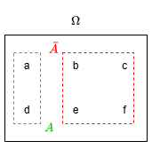
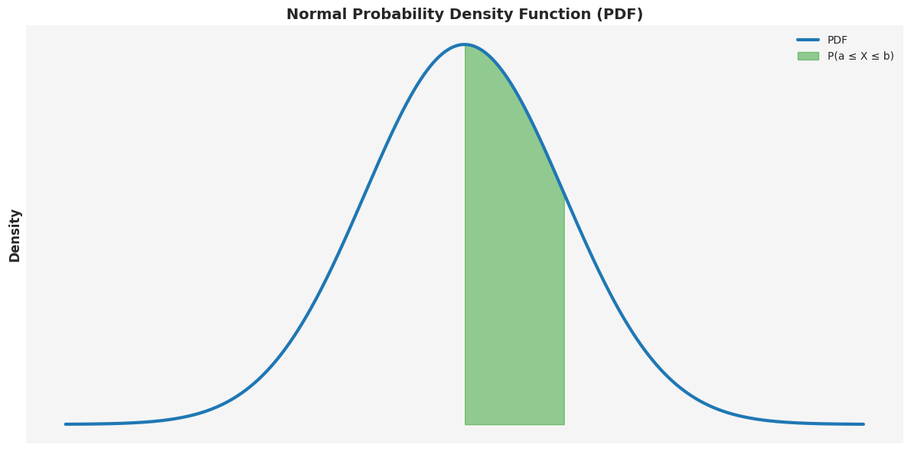
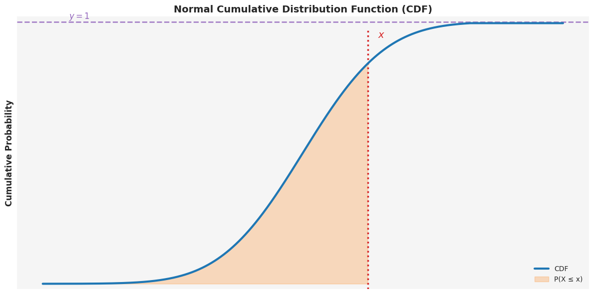

# Probability Theory

- [Probability Theory](#probability-theory)
  - [Probability Concepts](#probability-concepts)
  - [Set Theory in Probability](#set-theory-in-probability)
    - [Set Theory Definitions Summary](#set-theory-definitions-summary)
      - [Set Notation](#set-notation)
  - [Finite Probability Spaces](#finite-probability-spaces)
    - [Inclusion-Exclusion Formula](#inclusion-exclusion-formula)
    - [Addition Rule of Probabilities](#addition-rule-of-probabilities)
    - [Independent Events](#independent-events)
    - [Conditional Probability](#conditional-probability)
    - [Law of Total Probability](#law-of-total-probability)
    - [Example: Tossing a Coin](#example-tossing-a-coin)
    - [Axioms of Probability](#axioms-of-probability)
    - [Properties of Probability](#properties-of-probability)
    - [Further Finite Probability Examples](#further-finite-probability-examples)
      - [Single Die Roll](#single-die-roll)
      - [Hiring Example](#hiring-example)
  - [General Probability Spaces](#general-probability-spaces)
  - [Discrete Random Variables](#discrete-random-variables)
    - [Probability Distribution](#probability-distribution)
      - [Probability Distribution of a Coin Toss](#probability-distribution-of-a-coin-toss)
    - [Binomial Distribution](#binomial-distribution)
    - [Bernoulli Distribution](#bernoulli-distribution)
    - [Equality of Random Variables](#equality-of-random-variables)
    - [Random Variables Defining Events](#random-variables-defining-events)
    - [Random Variables Defining Partitions](#random-variables-defining-partitions)
    - [Expectation](#expectation)
      - [Expectation of a Coin Toss](#expectation-of-a-coin-toss)
    - [Functions of Random Variables](#functions-of-random-variables)
      - [Function of a Coin Toss Random Variable](#function-of-a-coin-toss-random-variable)
      - [Linearity Property of Expectations](#linearity-property-of-expectations)
    - [Variance](#variance)
      - [Property of Variance](#property-of-variance)
    - [Standard Deviation](#standard-deviation)
    - [Radon-Nikodym Derivative](#radon-nikodym-derivative)
      - [Properties of the Radon-Nikodym Derivative](#properties-of-the-radon-nikodym-derivative)
    - [Conditional Expectations](#conditional-expectations)
      - [Conditioning on an Event](#conditioning-on-an-event)
        - [Conditional Expectation Given an Event Example 1](#conditional-expectation-given-an-event-example-1)
        - [Conditional Expectation Given an Event Example 2](#conditional-expectation-given-an-event-example-2)
    - [Conditioning on a Partition](#conditioning-on-a-partition)
        - [Conditional Expectation Given a Partition Example](#conditional-expectation-given-a-partition-example)
      - [Linearity of Conditional Expectation](#linearity-of-conditional-expectation)
      - [Expectation of Conditional Expectation](#expectation-of-conditional-expectation)
        - [Example of Expectation of Conditional Expectation](#example-of-expectation-of-conditional-expectation)
      - [Law of Iterated Conditional Expectations (Tower Property)](#law-of-iterated-conditional-expectations-tower-property)
    - [Conditioning on a Discrete Random Variable](#conditioning-on-a-discrete-random-variable)
  - [Continuous Random Variables](#continuous-random-variables)
    - [Probability Density Function (PDF)](#probability-density-function-pdf)
    - [Cumulative Distribution Function (CDF)](#cumulative-distribution-function-cdf)
    - [Expectation (Continuous Case)](#expectation-continuous-case)
    - [Variance and Moments](#variance-and-moments)
    - [Normal Distribution](#normal-distribution)
    - [Transformation of Random Variables](#transformation-of-random-variables)
    - [Log-Normal Distribution](#log-normal-distribution)
  - [Multivariate Distributions](#multivariate-distributions)
    - [Independence](#independence)
    - [Covariance and Correlation](#covariance-and-correlation)
  - [Limit Theorems](#limit-theorems)
    - [Law of Large Numbers](#law-of-large-numbers)
    - [Central Limit Theorem](#central-limit-theorem)

Probability theory has evolved to model uncertainty, providing both an abstract system of thought and practical tools for quantifying likelihoods. While it can be studied as a purely theoretical branch of mathematics, its significance is closely tied to real-world applications.

## Probability Concepts

1. **Random Experiments**:
   - A random experiment is any process with an uncertain outcome but well-defined possible results. Examples include:
     - Tossing a coin: outcomes are heads or tails.
     - Rolling a die: outcomes range from 1 to 6.
     - Dealing a poker hand: possible hands from a standard deck.
     - Measuring daily temperatures: results in a sequence of real numbers.

2. **Probability Numbers**:
   - Probability assigns a value between 0 and 1 to outcomes or sets of outcomes (events):
     - **0**: Certainty that the outcome will not occur.
     - **1**: Certainty that the outcome will occur.
   - These numbers formalize intuitions about uncertainty and likelihood.

3. **Interpretations of Probability**:
   - **Frequentist View**:
     - Probability represents the long-run frequency of an outcome in repeated experiments.
     - Example: A coin with a probability of 0.7 for heads means that in many tosses, about 70% will show heads.
   - **Challenges**:
     - Not all scenarios, such as estimating the likelihood of a rare event (e.g., nuclear war), lend themselves to repeatable experiments.
   - **Subjective Bayesian View**:
     - Probability is seen as a degree of belief, often used in Bayesian statistics.
     - This approach accommodates single-event probabilities but requires further study for in-depth understanding.

## Set Theory in Probability

In probability, outcomes of a random experiment are modelled as sets, which are collections of elements. These sets help formalize and analyze the behaviour of random experiments and their possible outcomes.

- An empty set is a set that contains no elements, denoted as $\emptyset$ and defined as $\emptyset = \{\}$.
- The **set complement** is for outcomes that are not an element of $A$ and is given by $\bar{A}$ which is defined as $\bar{A}=\Omega \setminus A = \omega \in \Omega : \omega \notin A$.
  - The $:$ can be read as *such that*, the $\setminus$ as *minus*, the $\in$ as *is an element of*, and the $\notin$ as *is not an element of*.

    

- Two sets are considered *equal* $A = B$ if they contain exactly the same elements. This can be expressed as:
  - $\omega \in A \Longleftrightarrow  \omega \in B$
  - If $\omega$ in $A$ then $\omega$ is in $B$ and vice versa.
- If every element of set $A$ is also an element of set B, then $A$ is a **subset** of B, denoted as $A \subset B$
  - Usually this includes the case where $A$ and $B$ are equal $A = B$.
  - However, to emphasize that $A$ is a subset of $B$ but not equal to B, we can use the notation $A \subsetneq B$.
  - Similarly, if $A=B$, the notation $A \subseteq B$ can be used to indicate that $A$ is a subset of B, and possibly equal to $B$.
- The **union** of two sets $A$ and $B$ represents everything in $A$ and everything in $B$ and is given by $A \cup B$ which is defined as:
  - $A \cup B = \{ \omega \in \Omega: \omega \in A \text{ or } \omega \in B  \text{ or both}\}$
  - For $n$ sets $\bigcup_{i=1}^{n} A_i = A_1 \cup A_2 \cup \dots \cup A_n$

    

- The **intersection** of two sets $A$ and $B$ is the set of all elements common to both $A$ and B$ and is given by $A \cap B$ which is defined as:
  - $A \cap B = \{ \omega \in \Omega: \omega \in A \text{ and } \omega \in B\}$
  - For $n$ sets $\bigcap_{i=1}^{n} A_i = A_1 \cap A_2 \cap \dots \cap A_n$

    

- Two sets $A$ and $B$ are **disjoint** if they have no elements in common, which means their intersection is the empty set: $A \cap B = \emptyset$.

    

- A **partition** is a way of describing what is ***knowable*** at a particular time about the actual outcome of an experiment.
  - A partition $\mathcal{U}$ of $\Omega$ is a set of non-empty events $A_{1}, A_{2}, \dots, A_{n}$ such that each outcome $\omega$ appears in exactly one event.
    - $A_{i} \neq \emptyset$ for all $A_{i} \in \mathcal{U}$
    - $A_i \cap A_j = \emptyset$ for all $i \neq j$
    - $\bigcup_{i=1}^{n} A_i = \Omega$
  - This means that the events are disjoint (or the events are incompatible).
  - A partition $\mathcal{U}$ is described as *finer* than another partition $\mathcal{V}$ if for all $A \in \mathcal{U}$, there exists some event $B \in \mathcal{V}$ such that $A \subset B$.
    - Equivalently, every event in $\mathcal{V}$ can be expressed as a union of events in $\mathcal{U}$.
  - Similarly, a partition $\mathcal{U}$ is described as *coarser* than another partition $\mathcal{V}$ if for all $B \in \mathcal{V}$, there exists some event $A \in \mathcal{U}$ such that $B \subset A$.

    

    $$\Omega = \{a,b,c,d,e,f\} = A_1 \cup A_2 \cup A_3 = \{a,b\} \cup \{c,d\} \cup \{e,f\}$$
    where $\mathcal{U} = \{A_1, A_2, A_3\} = \{\{a,d\},\{b,c,e\},\{f\}\}$ is a partition of $\Omega$.

### Set Theory Definitions Summary

1. **Set**:
   - A collection of elements, which could be anything from numbers to abstract objects.
   - Example: The set of positive integers less than 10 is $S = \{1, 2, 3, 4, 5, 6, 7, 8, 9\}$.

2. **Set Operations**:
   - **Union $(A \cup B)$**: All elements in either $(A)$ or $(B)$.
     - Example: $A = \{2, 5, 8\}, B = \{4, 5, 9\}, A \cup B = \{2, 4, 5, 8, 9\}$.
   - **Intersection $(A \cap B)$**: Elements common to $(A)$ and $(B)$.
     - Example: $A = \{2, 4, 6\}, B = \{6, 9\}, A \cap B = \{6\}$.
   - **Complement $(A^C)$**: All elements not in $A$, relative to a universal set $\Omega$.
     - $A^C = \{x \in \Omega : x \notin A\}$.
   - **Relative Complement $(A / B)$**: Elements in $A$ but not in $B$.
     - $A / B = A \cap B^C$.
   - **De Morgan’s Laws**:
     - $(A \cup B)^C = A^C \cap B^C$
     - $(A \cap B)^C = A^C \cup B^C$

3. **Sample Space** $(S)$:
   - The set of all possible outcomes of a random experiment.
   - Example: For rolling a six-sided die once, $S = \{1, 2, 3, 4, 5, 6\}$.
   - For rolling the die twice, $S = \{(i, j) : i, j \in \{1, 2, 3, 4, 5, 6\}\}$.

4. **Event**:
   - A subset of the sample space.
   - Example: In a single die roll, the event $A$ of rolling an even number is $A = \{2, 4, 6\}$.

#### Set Notation

The common practice is to denote intersections in probabilities using commas. For example:
> Probability of $S_1$ *and* $S_2$ occurring.

$$P(S_1 \cap S_2) = P(S_1, S_2)$$

Both notations are context-dependent, and familiarity with both is important.

## Finite Probability Spaces

- A **sample space** is the set of all outcomes within a random system where there are a finite set of outcomes. The sample space is denoted as $\Omega$.
- A typical outcome is denoted as $\omega$ and $\omega \in \Omega$ is used to indicate that $\omega$ is an **element** of the sample space $\Omega$.
- An **event** is a set of possible outcomes and (equivalently) an event of the sample space $\Omega$.
  - An event $A$, has occurred if the actual outcome $\omega$ is an element of the event $A$, i.e. $\omega \in A$.

| Probability Theory | Set Theory |
|:------------------:|:----------:|
| Sample Space $\Omega$ | Universal Set $U$ |
| Outcome $\omega$ | Element $x$ |
| Event $A$ | Subset $A$ |

- A *probability measure* assigns to each outcome $\omega \in \Omega$ a number $P(\omega) \in [0,1]$ such that:
  $$\boxed{\sum_{\omega \in \Omega} P(\omega) = 1}$$
  where $0 \leq P(\omega) \leq 1$ for all $\omega \in \Omega$.
- The probability of an event $A$ is defined as:
  $$\boxed{P(A) = \sum_{\omega \in A} P(\omega)}$$
  - In particular:
    - $P(\emptyset) = 0$ (the empty event cannot occur).  
    - $P(\Omega) = 1$ (the whole sample space occurs with certainty).  
- The pair $(\Omega, P)$ is called a **finite probability space**.
  - For finite probability spaces, any outcome $\omega$ with $P(\omega) = 0$ is called an **impossible outcome** and can never occur.
  - Typically, assume that $P(\omega) > 0$ for all outcomes, $\omega \in \Omega$.

### Inclusion-Exclusion Formula

- For two events $A$ and $B$, the inclusion-exclusion formula is given by:

$$\boxed{P(A \cup B) = P(A) + P(B) - P(A \cap B)}$$

- This formula accounts for the overlap between events $A$ and $B$ to avoid double counting the outcomes in the intersection $A \cap B$.


### Addition Rule of Probabilities

- If two event $A$ and $B$ are disjoint (i.e. if $A \cap B = \emptyset$), then the addition rule of probabilities states that:

$$\boxed{P(A \cup B) = P(A) + P(B)}$$


- The probability of not $A$ is given by: $P(\bar{A}) = 1 - P(A)$

- Let $\Omega$ be a finite sample space with probability measure $P$ and suppose $\{A_1, A_2, \dots, A_n\}$ is a **partition** of $\Omega$, i.e.
  - $A_i \cap A_j = \emptyset$ for all $i \neq j$ (pairwise disjointness),  
  - $\bigcup_{i=1}^n A_i = \Omega$ (covering the whole space).

$$P(\Omega) = P\left(\bigcup_{i=1}^{n} A_i\right) = \sum_{i=1}^{n} P(A_i) = \sum_{i=1}^{n} \sum_{\omega=A_i}P(\omega) = \sum_{\omega \in \Omega}P(\omega) = 1$$

- The partition breaks the sample space into disjoint events.
- Because of disjointness, probabilities add without double-counting.
- Since each event probability is itself the sum of probabilities of its outcomes, the result collapses back to the normalisation condition: the total probability of the sample space equals $1$.

### Independent Events

- Two events $A$ and $B$ are **statistically independent** by definition if:

$$\boxed{P(A \cap B) = P(A)P(B)}$$

### Conditional Probability

- For two events $A$ and $B$ with $P(B) > 0$, the **conditional probability** of $A$ given $B$ is defined as:

$$\boxed{P(A \mid B) = \frac{P(A \cap B)}{P(B)}}$$

- In other words, $P(A \mid B)$ represents the probability of event $A$ occurring given that event $B$ has already occurred.

$$\boxed{P(A)= P(A \mid B) \Longleftrightarrow  A \text{ and } B \text{ are independent}}$$

- The set $B$ becomes the new universe and therefore dividing by $P(B)$ rescales the conditional probabilities such that $P(B \mid B) = 1$.

### Law of Total Probability

- Let $\mathcal{U}$ be a partition of $\Omega$ with events $B_1, B_2, \dots, B_m$ and $P(B_i) > 0$ for all $i$.
- Then for any event $A$, the law of total probability states that:

$$\boxed{P(A) = P(\bigcup_{i=1}^{m} (A \cap B_i)) = \sum_{i=1}^{m} (A \cap B_i)=\sum_{i=1}^{m} P(A \mid B_i)P(B_i)}$$


### Example: Tossing a Coin

- Tossing a coin three times can be modelled as a finite probability space.
- The sample space is given by:
  $$\Omega = \{ \omega_{hhh}, \omega_{hht}, \omega_{hth}, \omega_{htt}, \omega_{thh}, \omega_{tht}, \omega_{tth}, \omega_{ttt} \}$$
  where $h$ represents heads and $t$ represents tails.
- An example event $A$ is the set of outcomes where the first toss is heads:
  $$A = \{ \omega_{hhh}, \omega_{hht}, \omega_{hth}, \omega_{htt} \}$$
- For a coin that is tossed three times, and only the result of the first toss is known, the partition for what is *knowable* after the first toss is given by:
    $$\mathcal{U_1} = \{ A_h, A_t \}$$

    where
    $$A_h = \{\omega_{hhh}, \omega_{hht}, \omega_{hth}, \omega_{htt}\}$$
    $$A_t = \{\omega_{thh}, \omega_{tht}, \omega_{tth}, \omega_{ttt}\}$$
  - Similarly, if the result of the first two tosses is known, the partition for what is *knowable* after the second toss is given by:
    $$\mathcal{U_2} = \{ A_{hh}, A_{ht}, A_{th}, A_{tt} \}$$
    where
    $$A_{hh} = \{\omega_{hhh}, \omega_{hht}\}$$
    $$A_{ht} = \{\omega_{hth}, \omega_{htt}\}$$
    $$A_{th} = \{\omega_{thh}, \omega_{tht}\}$$
    $$A_{tt} = \{\omega_{tth}, \omega_{ttt}\}$$

- If the coin is biased where $p_{h}$ is the probability of headers and $p_{t} = 1 - p_{h}$ is the probability of tails, then the probability measure $P$ is given by:
  $$P(\omega_{hhh}) = p_{h}^3$$
  $$P(\omega_{hht}) = p_{h}^2 p_{t}$$
  $$P(\omega_{hth}) = p_{h}^2 p_{t}$$
  $$P(\omega_{htt}) = p_{h} p_{t}^2$$
  $$P(\omega_{thh}) = p_{h}^2 p_{t}$$
  $$P(\omega_{tht}) = p_{h} p_{t}^2$$
  $$P(\omega_{tth}) = p_{h} p_{t}^2$$
  $$P(\omega_{ttt}) = p_{t}^3$$

- Let $A_{h}$ be the event that the first toss is heads, then:

```math
\begin{aligned}
P(A_{h}) &= \sum_{\omega \in A_{h}} P(\omega) \\\\
&= P(\omega_{hhh}) + P(\omega_{hht}) + P(\omega_{hth}) + P(\omega_{htt}) \\\\
&= p_{h}^3 + p_{h}^2 p_{t} + p_{h}^2 p_{t} + p_{h} p_{t} \\\\
&= p^2h(p_{h} + p_{t}) + p_{h}p_{t}(p_h+p_t) \\\\
&= p_{h}^2 + p_{h}p_{t} \\\\
&= p_{h}(p_{h} + p_{t}) \\\\
&= p_{h}(1) \\\\
&= p_{h}
\end{aligned}
```

- Similarly, let $B$ be the event that the second toss is heads, and $C$ be the event that the third toss is heads, then:
  $$P(B) = P(\omega_{hhh}) + P(\omega_{hht}) + P(\omega_{thh}) + P(\omega_{tht}) = p_{h}^3 + p_{h}^2 p_{t} + p_{h}^2 p_{t} + p_{h} p_{t}^2 = p_{h}$$
  $$P(C) = P(\omega_{hhh}) + P(\omega_{hth}) + P(\omega_{thh}) + P(\omega_{tth}) = p_{h}^2 p_{t} + p_{h} p_{t}^2 + p_{h} p_{t}^2 + p_{t}^3 = p_{t}$$
  $$P(B \cap C) = P(\omega_{hht}) + P(\omega_{tht}) = p_{h}^2 p_{t} + p_{h} p_{t}^2 = p_{h}p_{t}$$
  $$\therefore P(B \cap C) = P(B)P(C)$$
  - Hence, the events $B$ and $C$ are independent.
- The probability of getting precisely one tail (event $D_t$), given that the first toss is heads (event $A_h$), is given by:

```math
\begin{aligned}
P(D_t\mid A_h) &= \frac{P(D_t \cap A_h)}{P(A_h)} \\
&= \frac{P(\omega_{hht})+P(\omega_{hth})}{P(A_h)} \\\\
&= \frac{p_{h}^2 p_{t} + p_{h}^2 p_{t}}{p_{h}} \\\\
&= 2 p_{h} p_{t}
\end{aligned}
```

- The probability of getting precisely one tail ($3p_h^2p_t$) is different from the conditional probability of getting precisely one tail given that the first toss is heads ($2p_hp_t$).
  - Hence, the events $D_t$ and $A_h$ are not independent.
- The probability of getting precisely one tail (event $D_t$), given that the first toss is tails (event $A_t$), is given by:

```math
\begin{aligned}
P(D_t) &= \frac{P(\omega_{thh})}{P(A_t)} \\\\
&= \frac{ p_{t}p_{h}^2}{p_{t}} \\\\
&= p_{h}^2
\end{aligned}
```

- By the law of total probability, the probability of getting precisely one tail is given by:

$$P(D_t\mid A_h)P(A_h) + P(D_t\mid A_t)P(A_t) = 2p_hp_t \cdot p_h + p_h^2 \cdot p_t = 3p_h^2p_t$$

- Which is the same as getting precisely one tail without any conditions.

### Axioms of Probability

In the finite case, **probability** is modelled as a function $P(A)$ that assigns real numbers between $0$ and $1$ to subsets of a **sample space** $S$. The function $P$ is defined using the following axioms:

1. **Non-negativity**: For any event $A \subseteq S$, $P(A) \geq 0$.
2. **Total Probability**: $P(S) = 1$.
3. **Additivity**: For disjoint events $A$ and $B$, $P(A \cup B) = P(A) + P(B)$.

### Properties of Probability

These axioms lead to several useful properties:

1. **Finite Additivity**: For disjoint events $A_1, A_2, \dots, A_n$:
   $$P\left ( \bigcup_{i=1}^{n}A_{i} \right ) = \sum_{i=1}^{n}P(A_{i})$$

2. **Complement Rule**: For any event $A$:
   $$P(\bar{A}) = P(A^C) = 1 - P(A)$$

3. **Subset Property**: If $B \subseteq A$, then $P(B) \leq P(A)$.

4. **Range of Probability**: $0 \leq P(A) \leq 1$ for any $A$.

5. **Inclusion-Exclusion Law**:
   $$P(A \cup B) = P(A) + P(B) - P(A \cap B)$$

### Further Finite Probability Examples

#### Single Die Roll

- **Sample space**: $S = \{1, 2, 3, 4, 5, 6\}$.
- For a balanced die, each outcome has $P(i) = \frac{1}{6}$.
- **Event**: $A = \{2, 4, 6\}$ (rolling an even number).

Using finite additivity:
$$P(A) = P(2) + P(4) + P(6) = \frac{1}{6} + \frac{1}{6} + \frac{1}{6} = \frac{1}{2}$$

#### Hiring Example

- **Events**: $A$: You are hired, $B$: Your cousin is hired.
- **Given**: $P(A) = 0.4$, $P(B) = 0.3$, $P((A \cup B)^C) = 0.5$.

1. Using the complement rule:
   $$P(A \cup B) = 1 - P((A \cup B)^C) = 1 - 0.5 = 0.5$$

2. From the inclusion-exclusion law:
   $$P(A \cap B) = P(A) + P(B) - P(A \cup B) = 0.4 + 0.3 - 0.5 = 0.2$$

3. To calculate $P(A \cap B^C)$:
   - The union $A = (A \cap B) \cup (A \cap B^C)$ is disjoint, so:
    $$P(A) = P(A \cap B) + P(A \cap B^C)$$
   - Solving for $P(A \cap B^C)$:
     $$P(A \cap B^C) = P(A) - P(A \cap B) = 0.4 - 0.2 = 0.2$$

## General Probability Spaces

- Financial modelling and stochastic calculus often requires **continuous outcomes** (e.g. stock prices taking real values, Brownian motion paths).  
- To handle this rigorously, probability theory is built on **measure theory**, where probabilities are defined on collections of sets called **sigma-algebras**.  
- This measure-theoretic framework underpins everything from Brownian motion to martingales and stochastic integration.

A **general probability space** is a triple $(\Omega, \mathcal{F}, P)$ where:

1. $\Omega$ is the **sample space** of outcomes.  
2. $\mathcal{F}$ is a **sigma-algebra** (also called a sigma-field) of subsets of $\Omega$, i.e. a collection of events on which probability is defined.  
   - $\Omega \in \mathcal{F}$.  
   - If $A \in \mathcal{F}$ then $A^c \in \mathcal{F}$.  
   - If $A_1, A_2, \dots \in \mathcal{F}$ then $\bigcup_{i=1}^\infty A_i \in \mathcal{F}$.  
3. $P$ is a **probability measure** on $\mathcal{F}$ satisfying the Kolmogorov axioms:  
   - *Non-negativity*: $P(A) \geq 0$ for all $A \in \mathcal{F}$.  
   - *Normalization*: $P(\Omega) = 1$.  
   - *Countable additivity*: For any countable collection of pairwise disjoint sets $A_1, A_2, \dots \in \mathcal{F}$,  
     $$
     P\!\left(\bigcup_{i=1}^{\infty} A_i\right) = \sum_{i=1}^{\infty} P(A_i).
     $$

## Discrete Random Variables

- A **random variable** is a numerical quantity that is determined by the outcome of a random experiment.
- Formally, a random variable $X$ is a real-valued function defined on the sample space $\Omega$:
  $$X: \Omega \rightarrow \mathbb{R}$$
- By convention, random variables are denoted by **uppercase** letters (e.g., $X$, $Y$), while the specific values they can take are denoted by **lowercase** letters (e.g., $x$, $y$).
- A random variable is called **discrete** if it takes values in a finite or countable set, e.g. $\{x_i\}$ and $\{x_1, x_2, \dots\, x_i, \dots, x_k\}$.  
  - In a finite probability space, every random variable must be discrete, since $\Omega$ itself is finite.  
  - However, not all discrete random variables come from finite sample spaces: for example, a Poisson random variable takes values in $\{0,1,2,3,\dots\}$, which is countably infinite.

### Probability Distribution

- A random variable can be characterised by its **probability distribution**, given a particular probability measure $P$ on the sample space $\Omega$.
- The probability distribution of a discrete random variable $X$ is defined by the set of probabilities of individual values:

$$\boxed{p_i = P(X = x_i) = P(\{\omega \in \Omega : X(\omega) = x_i\})}$$
where $X=x_i$ is the event that the random variable $X$ takes the value $x_i$.

- The underlying space $\Omega$ can have many random variables defined on it, each with its own probability distribution.
- A random variable is a function $\Omega \to \mathbb{R}$, so technically speaking it does *not* include any information about the probabilities.
- A random variable can take the same value for different outcomes $\omega$ and the probability distribution by itself does not tell us which outcomes correspond to which values.
- Changing the probability measure $P$ on $\Omega$ will change the probability distribution of the random variable $X$.

- The probability space and random variable $X$ can be represented as a table:

| Outcome $\omega$ | $P(\omega)$ | $X(\omega)$ |
|:----------------:|:-----------:|:----------:|
| $\omega_1$       | $p_1$       | $x_1$      |
| $\omega_2$       | $p_2$       | $x_2$      |
| $\vdots$         | $\vdots$    | $\vdots$   |
| $\omega_n$       | $p_n$       | $x_n$      |

#### Probability Distribution of a Coin Toss

- For a biased coin, the probability space and random variable $X$ (number of heads in three tosses) is given by:

| Outcome $\omega$ | $P(\omega)$  | $X(\omega)$ (Number of Heads) |
|:----------------:|:------------:|:-----------------------------:|
| $\omega_{hhh}$   | $p_h^3$      | 3                             |
| $\omega_{hht}$   | $p_h^2 p_t$  | 2                             |
| $\omega_{hth}$   | $p_h^2 p_t$  | 2                             |
| $\omega_{thh}$   | $p_h^2 p_t$  | 1                             |
| $\omega_{htt}$   | $p_h p_t^2$  | 2                             |
| $\omega_{tht}$   | $p_h p_t^2$  | 1                             |
| $\omega_{tth}$   | $p_h p_t^2$  | 1                             |
| $\omega_{ttt}$   | $p_t^3$      | 0                             |

- The *outcome* column is referred to as the **sample space**.
- The *outcome* column and the *probability* column together are referred to as a **finite probability space**.
- The *outcome* column and the *number of headers* column together are referred to as a **random variable**

- The resulting **probability distribution** of $X$ is calculated by summing the probabilities of outcomes that yield the same value of $X$:

| $X=x_i$ (Number of Heads) | $P(X=x_i)$                                                                   |
|:-------------------------:|:----------------------------------------------------------------------------:|
| 0                         | $P(X=0) = P(\omega_{ttt}) = p_t^3$                                           |
| 1                         | $P(X=1) = P(\omega_{tht}) + P(\omega_{tth}) + P(\omega_{htt}) = 3 p_h p_t^2$ |
| 2                         | $P(X=2) = P(\omega_{hht}) + P(\omega_{hth}) + P(\omega_{thh}) = 3 p_h^2 p_t$ |
| 3                         | $P(X=3) = P(\omega_{hhh}) = p_h^3$                                           |

### Binomial Distribution

- In general, for $N$ independet tosses of a unbiased coin, the probability of getting exactly $i$ heads is given by:

$$\boxed{p_i = P(X=i) = \binom{N}{i} p_h^i p_t^{N-i} \text{ for } i=0, 1, 2, \dots, N}$$
where $\binom{N}{i} = \frac{N!}{i!(N-i)!}$ is the binomial coefficient, representing the number of ways to choose $i$ heads from $N$ tosses.

- The binomial distribution is denoted as $\mathcal{B}(N, p_h)$, and the random variable $X$ can be written as $X \sim \mathcal{B}(N, p_h)$ to mean that $X$ follows a binomial distribution with parameters $N$ and $p_h$.

### Bernoulli Distribution

- A special case of the binomial distribution is when $N=1$, which is known as the **Bernoulli distribution**.
- $P(X=0) = 1 - p$ and $P(X=1) = p$.

### Equality of Random Variables

- Two random variables, $X$ and $Y$ are equal if $X(\omega) = Y(\omega)$ for all $\omega \in \Omega$.
  - Random variables that are not equal can still have the same probability distribution.
    - E.g. suppose that $p_h = p_t = 0.5$, then the random variable number of heads $X \sim \mathcal{B}(N,\frac{1}{2})$ and the random variable for the number of tails $Y \sim \mathcal{B}(N,\frac{1}{2})$ are the same but the two random variables are not equal.

### Random Variables Defining Events

- A random variable can be used to define (or determine) an event.
- The notation ${X = x_i}$ is used to denote the event $\{\omega \in \Omega: X(\omega) = x_i\}$ where the random variable $X$ takes the value $x_i$.
- In the coin toss example where $X$ is the number of heads, the event ${X = 2}$ is given by:
  $$\{X = 2\} = \{\omega_{hht}, \omega_{hth}, \omega_{thh}\}$$

### Random Variables Defining Partitions

- A random variable $X$ can take the values $x_1, x_2, \dots, x_k$.
- $\mathcal{U}$ is the partition defined (or determined, or generated) by the random variable $X$.
- $\mathcal{U} = \{\{X=x_i\}\}$ is a partitiion of $\Omega$, or in other words $\mathcal{U} = \{B_1, B_2, \dots, B_k\}$ where $B_i = \{\omega \in \Omega: X(\omega) = x_i\}$ is the set of all outcomes where $X=x_i$..
- For the random variable $X$ (number of heads), the following paritition is defined:

$$\{\{\omega_{ttt}\}, \{\omega_{tht}, \omega_{tth}, \omega_{htt}\}, \{\omega_{hht}, \omega_{hth}, \omega_{thh}\}, \{\omega_{hhh}\}\}$$

```math
\begin{aligned}
X=0 &\Longrightarrow \{\omega_{ttt}\} \\\\
X=1 &\Longrightarrow \{\omega_{tht}, \omega_{tth}, \omega_{htt}\} \\\\
X=2 &\Longrightarrow \{\omega_{hht}, \omega_{hth}, \omega_{thh}\} \\\\
X=3 &\Longrightarrow \{\omega_{hhh}\}
\end{aligned}
```

### Expectation

The expectation (expected value) of a discrete random variable $X$, with respect to probability measure $P$, is defined as follows:

$$\boxed{\mathbb{E}[X] = \sum_{i=1}^{k}{x_i P(X = x_i)} = \sum_{\omega \in \Omega}{X(\omega) P(\omega)}}$$
where the first sum is over all possible values $x_i$ that $X$ can take, and the second sum is over all outcomes $\omega$ in the sample space $\Omega$.

- For a constant $k$, $\mathbb{E}[k] = \sum_{\omega \in \Omega}{k(\omega)P(\omega)}=k\sum_{\omega \in \Omega}{P(\omega)}=k$.
- Also, for any random variable $X$, $\mathbb{E}[\mathbb{E}[X]] = \mathbb{E}[X]$. since $\mathbb{E}[X]$ is a number.

#### Expectation of a Coin Toss

The expectation for the value of $X$, where $X$ is the number of heads in three tosses of a coin, is given by:

```math
\begin{aligned}
\mathbb{E}[X] &= 0 \cdot P(X=0) + 1 \cdot P(X=1) + 2 \cdot P(X=2) + 3 \cdot P(X=3) \\\\
&= 0 \cdot p_t^3 + 1 \cdot 3 p_h p_t^2 + 2 \cdot 3 p_h^2 p_t + 3 \cdot p_h^3 \\\\
&= 3 p_h p_t^2 + 6 p_h^2 p_t + 3 p_h^3 \\\\
&= 3 p_h (p_t^2 + 2 p_h p_t + p_h^2) \\\\
&= 3 p_h (p_t + p_h)^2 \\\\
&= 3 p_h (1)^2 \\\\
&= 3 p_h
\end{aligned}
```

As a sense check, $X$ can take values from $0$ to $3$, so the expectation $\mathbb{E}[X]$ lies between $0$ and $3$, given that $0 \leq p_h \leq 1$.

More generally, for $N$ tosses of a biased coin where $X \sim \mathcal{B}(N, p_h)$, the expectation is given by:
$$\boxed{\mathbb{E}[X] = N p_h}$$

### Functions of Random Variables

- For a function $f: \mathbb{R} \to \mathbb{R}$ and a random variable $X$, the composition $f(X)$ is also a random variable defined by:
$$\boxed{f(X)(\omega) = f(X(\omega)) \text{ for all } \omega \in \Omega}$$

|$\Omega$     | $X$        | $f(X)$   |
|:-----------:|:----------:|:--------:|
| $\omega_1$  |  $x_1$     | $f(x_1)$ |
| $\omega_2$  |  $x_2$     | $f(x_2)$ |
| $\vdots$    |  $\vdots$  | $\vdots$ |
| $\omega_n$  |  $x_n$     | $f(x_n)$ |

Therefore, it follows that the expectation of $f(X)$ is given by:
$$\boxed{\mathbb{E}[f(X)] = \sum_{i=1}^{k}{f(x_i) P(X = x_i)} = \sum_{\omega \in \Omega}{f(X(\omega)) P(\omega)}}$$
where $X$ can take the values $x_1, x_2, \dots, x_k$ with probabilities $p_1, p_2, \dots, p_k$ respectively.

#### Function of a Coin Toss Random Variable

- Continuing with the coin toss example where $X$ is the number of heads in three tosses, consider the function $f(x) = x^2$.
- The random variable $f(X)$ is given by:

| $X$ (Number of Heads) | $f(X) = X^2$ |
|:---------------------:|:------------:|
| 0                     | 0            |
| 1                     | 1            |
| 2                     | 4            |
| 3                     | 9            |

- The expectation of $f(X)$ is calculated as follows:

```math
\begin{aligned}
\mathbb{E}[f(X)] &= 0^2 \cdot P(X=0) + 1^2 \cdot P(X=1) + 2^2 \cdot P(X=2) + 3^2 \cdot P(X=3) \\\\
&= 0 \cdot p_t^3 + 1 \cdot 3 p_h p_t^2 + 4 \cdot 3 p_h ^2 p_t + 9 \cdot p_h^3 \\\\
&= 3 p_h p_t^2 + 12 p_h^2 p_t + 9 p_h^3 \\\\
&= 3 p_h (p_t^2 + 4 p_h p_t + 3 p_h^2) \\\\
&= 3 p_h (p_t + p_h)(p_t + 3 p_h) \\\\
&= 3 p_h (1)(1 + 2 p_h) \\\\
&= 3 p_h (1 + 2 p_h) \\\\
&= 3 p_h + 6 p_h^2 \\\\
&= 3 p_h (1 + 2 p_h)
\end{aligned}
```

#### Linearity Property of Expectations

- For $n$ random rvariables $X_1, X_2, \dots, X_n$ and constants $a_1, a_2, \dots, a_n$, the expectation operator is linear:
$$\boxed{\mathbb{E}\left[\sum_{i=1}^{n} a_i X_i\right] = \sum_{i=1}^{n} a_i \mathbb{E}[X_i]}$$

Which can be proven as follows:

```math
\begin{aligned}
\mathbb{E}\left[\sum_{i=1}^{n} a_i X_i\right] &= \sum_{\omega \in \Omega} \left(\sum_{i=1}^{n} a_i X_i(\omega)\right) P(\omega) \\\\
&= \sum_{i=1}^{n} a_i \left(\sum_{\omega \in \Omega} X_i(\omega) P(\omega)\right) \\\\
&= \sum_{i=1}^{n} a_i \mathbb{E}[X_i]
\end{aligned}
```

- A special case of the linearity property is when $n=2$:
$$\boxed{\mathbb{E}[aX + bY] = a\mathbb{E}[X] + b\mathbb{E}[Y]}$$
where $X$ and $Y$ are random variables and $a$ and $b$ are constants.

- Similarly, for a single random variable $X$ and constants $a$ and $b$:
$$\boxed{\mathbb{E}[aX + b] = a\mathbb{E}[X] + b}$$

### Variance

- The **variance** of a discrete random variable $X$ is a measure of how much the values of $X$ deviate from its expectation $\mathbb{E}[X]$.

$$\boxed{\text{Var}(X) = \mathbb{E}[(X - \mathbb{E}[X])^2] = \mathbb{E}[X^2] - (\mathbb{E}[X])^2}$$

- This formula can be derived as follows:

```math
\begin{aligned}
\text{Var}(X) &= \mathbb{E}[(X - \mathbb{E}[X])^2] \\\\
&= \mathbb{E}[X^2 - 2X\mathbb{E}[X] + (\mathbb{E}[X])^2] \\\\
&= \mathbb{E}[X^2] - 2\mathbb{E}[X]\mathbb{E}[X]  + (\mathbb{E}[X])^2 \\\\
&= \mathbb{E}[X^2] - (\mathbb{E}[X])^2
\end{aligned}
```

#### Property of Variance
- For a random variable $X$ and constants $a$ and $b$, the variance satisfies the following property:
$$\boxed{\text{Var}(aX + b) = a^2 \text{Var}(X)}$$
- This property can be proven as follows:

```math
\begin{aligned}
\text{Var}(aX + b) &= \mathbb{E}[(aX + b - \mathbb{E}[aX + b])^2] \\\\
&= \mathbb{E}[(aX + b - (a\mathbb{E}[X] + b))^2] \\\\
&= \mathbb{E}[(aX - a\mathbb{E}[X])^2] \\\\
&= \mathbb{E}[a^2(X - \mathbb{E}[X])^2] \\\\
&= a^2 \mathbb{E}[(X - \mathbb{E}[X])^2] \\\\
&= a^2 \text{Var}(X)
\end{aligned}
```

- **N.B. Variance is not linear, unlike expectation.**

### Standard Deviation

- The **standard deviation** of a discrete random variable $X$ is defined as the square root of its variance:
$$\boxed{\sigma_X = \sigma(X) = \sqrt{\text{Var}(X)}}$$

### Radon-Nikodym Derivative

- The expectation and variance of a random variable $X$ depend on the probability measure $P$ assigned to the underlying space $\Omega$.
- When defining the expectation and variance of a random variable $X$, it is important to specify the probability measure $P$ being used by including it as a superscript:
  - $\mathbb{E}^P[X]$ denotes the expectation of $X$ with respect to the probability measure $P$.
  - $\text{Var}^P(X)$ denotes the variance of $X$ with respect to the probability measure $P$.
- In certain applications, multiple probability measures may be considered on the same sample space $\Omega$, and the expectation and variance of a random variable $X$ may differ depending on the chosen measure (e.g. $P$ or $Q$).
  - $\mathbb{E}^P[X]$ or $\mathbb{E}^Q[X]$ may yield different results.

|$\Omega$     | $P(\omega)$  | $Q(\omega)$  | $X(\omega)$ |
|:-----------:|:------------:|:------------:|:-----------:|
| $\omega_1$  |  $p_1$       |  $q_1$       | $x_1$       |
| $\omega_2$  |  $p_2$       |  $q_2$       | $x_2$       |
| $\vdots$    |  $\vdots$    |  $\vdots$    | $\vdots$    |
| $\omega_n$  |  $p_n$       |  $q_n$       | $x_n$       |

The **Radon-Nikodym derivative** allows us to relate two probability measures defined on the same measurable space, by defining the Radon-Nikodym derivates to be the random variable:
$$\boxed{Z(\omega) = \frac{Q(\omega)}{P(\omega)} \text{ for all } \omega \in \Omega \text{ where } P(\omega) > 0}$$

#### Properties of the Radon-Nikodym Derivative

**1. Positivity: $Z(\omega) > 0$ for all $\omega \in \Omega$, and so $P(Z > 0) = 1$.**

- Since $Q$ is a probability measure on $\Omega$, we have $Q(\omega) \geq 0$ for all $\omega \in \Omega$. Additionally, since $P$ is a probability measure, $P(\omega) > 0$ for all $\omega \in \Omega$ (by assumption). Therefore:
$$Z(\omega) = \frac{Q(\omega)}{P(\omega)} \geq 0 \text{ for all } \omega \in \Omega$$

- For strict positivity, note that if $Q(\omega) = 0$, then $Z(\omega) = 0$, and if $Q(\omega) > 0$, then $Z(\omega) > 0$ since $P(\omega) > 0$. Thus:
$$P(Z > 0) = P\left(\left\{\omega \in \Omega : Z(\omega) > 0\right\}\right) = \sum_{\omega: Q(\omega) > 0} P(\omega)$$

- The key property is that if $Q$ is absolutely continuous with respect to $P$ (written $Q \ll P$), then $\{Q(\omega) = 0\} \subseteq \{P(\omega) = 0\}$. Since $P(\omega) > 0$ for all $\omega$, any outcome where $Q(\omega) = 0$ would contradict the assumption. Therefore, in applications where $Q \ll P$, we have $P(Z > 0) = 1$.

**2. Expectation: $\mathbb{E}^P[Z] = 1$.**

- By definition of the Radon-Nikodym derivative, the expectation of $Z$ can be computed under the measure $P$:

```math
\begin{aligned}
\mathbb{E}^P[Z] &= \sum_{\omega \in \Omega} Z(\omega) P(\omega) \\\\
&= \sum_{\omega \in \Omega} \frac{Q(\omega)}{P(\omega)} P(\omega) \\\\
&= \sum_{\omega \in \Omega} Q(\omega) \\\\
&= 1
\end{aligned}
```

- The last equality follows from the fact that $Q$ is a probability measure, so its probabilities sum to 1 over $\Omega$.

**3. Change of Measure: $\mathbb{E}^Q[Y] = \mathbb{E}^P[ZY]$ for any random variable $Y$.**

- The Radon-Nikodym derivative provides a formula to compute expectations under the measure $Q$ using the measure $P$. For any random variable $Y$ defined on $\Omega$:

```math
\begin{aligned}
\mathbb{E}^Q[Y] &= \sum_{\omega \in \Omega} Y(\omega) Q(\omega) \\\\
&= \sum_{\omega \in \Omega} Y(\omega) \cdot Z(\omega) P(\omega) \\\\
&= \sum_{\omega \in \Omega} [Y(\omega) Z(\omega)] P(\omega) \\\\
&= \mathbb{E}^P[ZY]
\end{aligned}
```

- This result is fundamental in probability theory and quantitative finance, as it allows probability measures to be changed. The random variable $Z$ acts as a "weight" that transforms expectations from one measure to another. This is particularly useful when comparing probabilities and expectations under different market measures (e.g., the real-world measure and the risk-neutral measure in derivatives pricing).

### Conditional Expectations

This section focusses on the conditional expectation of a random variables, following on from the concept of conditional probability of events.

#### Conditioning on an Event

Let $A$ be some event (with non-zero probability) such that $A \subset \Omega$ with $P(A) > 0$ and let $X$ be a (discrete) random variable defined on $(\Omega, P)$.

- The **conditional expectation of random variable $X$ given the event $A$** has occurred is defined as:

$$\boxed{\mathbb{E}[X \mid A] = \frac{\sum_{\omega \in A}{X(\omega)P(\omega)}}{\sum_{\omega \in A}{P(\omega)}} =  \frac{\sum_{\omega \in A}{X(\omega)P(\omega)}}{{P(A)}}}$$

- If $X \in \{x_1,\dots,x_k\}$ is discrete with finitely many values, the same quantity can be written as:

$$\mathbb{E}[X \mid A] = \sum_{i=1}^{k} x_i \frac{P(\{X=x_i\} \cap A)}{P(A)} = \sum_{i=1}^{k} x_i P(X=x_i \mid A)$$

- $\mathbb{E}[X \mid A]$ is a **number** (not a random variable).

##### Conditional Expectation Given an Event Example 1

- For three tosses of a coin, let $X$ be the number of heads and let $A_h$ be the event that the first toss is a head.
- The conditional expectation of $X$ given $A_h$ is calculated as follows:

```math
\begin{aligned}
\mathbb{E}[X \mid A_h] &= \frac{\sum_{\omega \in A_h}{X(\omega) P(\omega)}}{P(A_h)} \\\\
&= \sum_{x=0}^{3}x\frac{{P(X=x, A_h)}}{P(A_h)} \\\\
&= \frac{3 \cdot P(\omega_{hhh}) + 2 \cdot P(\omega_{hht}) + 2 \cdot P(\omega_{hth}) + 1 \cdot P(\omega_{htt})}{P(A_h)} \\\\
&= \frac{3 \cdot p_h^3 + 2 \cdot p_h^2 p_t + 2 \cdot p_h^2 p_t + 1 \cdot p_h p_t^2}{P(A_h)} \\\\
&= \frac{3 p_h^3 + 4 p_h^2 p_t + p_h p_t^2}{P(A_h)} \\\\
&= \frac{p_h(3 p_h^2 + 4 p_h p_t + p_t^2)}{P(A_h)} \\\\
&= \frac{p_h(3 p_h^2 + 4 p_h p_t + p_t^2)}{p_h} \\\\
&= 3 p_h^2 + 4 p_h p_t + p_t^2 \\\\
&= (3 p_h + p_t)(p_h+p_t) \text{ where } p_h + p_t = 1 \\\\
&= (3p_h + (1 - p_h)) \\\\
&= 1 + 2 p_h
\end{aligned}
```

##### Conditional Expectation Given an Event Example 2

- It has been shown that random variables can [define events](#random-variables-defining-events).
- Let $Y$ be another discrete random variable defined on the same probability space as $X$ where $Y$ can take values $y_1, y_2, \dots, y_k$.
- Event $A_j$ is defined for $j=1, \dots, k$ as $A_j = \{Y = y_j\} = \{\omega \in \Omega : Y(\omega) = y_j\}$, assuming $P(A_j) > 0$ (non-zero probability).
- Let $X$ be some other discrete random variable defined on the same probability space which can take values $x_i \dots, x_n$. Then the conditional expectation of $X$ given that $Y = y_j$ is:

```math
\begin{aligned}
\mathbb{E}[X \mid Y=y_j] &= \sum_{i=1}^{n}{x_i\,\frac{P(X=x_i,\,Y=y_j)}{P(Y=y_j)}} \\\\
&= \sum_{i=1}^{n}{x_i\,P(X=x_i \mid Y=y_j)}
\end{aligned}
```

- Here, the expectation of $X$ has been found by summing over only those outcomes $\omega$ where $Y(\omega) = y_j$.

### Conditioning on a Partition

Following on from conditioning on an event, now consider conditioning on a partition of the sample space.

- Let $\mathcal{U} = \{B_1,B_2,\dots,B_m\}$ be a **partition** of $\Omega$ and let $A$ be some event.
- The conditional probability of $A$ with respect to the partition $\mathcal{U}$ is defined as the random variable:

$$\boxed{P(A \mid \mathcal{U})(\omega) = P(A \mid B(\omega))}$$

where $B(\omega)$ denotes the unique event in $\mathcal{U}$ that contains $\omega$.

Now let $X$ be some random variable.

- The conditional expectation of $X$ with respect to the partition $\mathcal{U}$ is also a **random variable**:

$$\boxed{\mathbb{E}[X\mid \mathcal{U}](\omega) = \mathbb{E}[X \mid B(\omega)]}$$

where $B(\omega)$ denotes the unique partition element in $\mathcal{U}$ that contains $\omega$.

- So $\mathbb{E}[X \mid \mathcal{U}]$ takes the value $\mathbb{E}[X \mid B_i]$ when $\omega \in B_i$ with probability $P(B_i)$.
- It is necessary to assume that $P(B_j) > 0$ for all $j=1, \dots, m$ in order for the conditional expectation to be well-defined.

##### Conditional Expectation Given a Partition Example

Continuing with the coin toss example where $X$ is the number of heads in three tosses and $p_h$ is the probability of  head and $p_t$ the probability o a tail, consider the partition $\mathcal{U_1} = \{B_h, B_t\}$ where:

- $B_h$ is the event that the first toss is a head: $B_h = \{\omega_{hhh}, \omega_{hht}, \omega_{hth}, \omega_{htt}\}$
- $B_t$ is the event that the first toss is a tail: $B_t = \{\omega_{thh}, \omega_{tht}, \omega_{tth}, \omega_{ttt}\}$

Let $X$ be the number of heads in three tosses. The conditional expectation of $X$ given the partition $\mathcal{U}_1$ is the random variable:

```math
\begin{aligned}
\mathbb{E}[X \mid \mathcal{U}_1](\omega) &=
\begin{cases}
\mathbb{E}[X \mid B_h] & \text{if } \omega \in B_h \\\\
\mathbb{E}[X \mid B_t] & \text{if } \omega \in B_t
\end{cases}
\\\\
&=
\begin{cases}
3p_h^2 +2p_hp_t + 2p_tp_h +p_t^2 & \text{if } \omega \in B_h \\\\
2p_h^2 + 1p_hp_t + 1p_tp_h + 0p_t^2 & \text{if } \omega \in B_t
\end{cases}
\\\\
&=
\begin{cases}
1 + 2 p_h & \text{if } \omega \in B_h \\\\
2 p_h & \text{if } \omega \in B_t
\end{cases}
\end{aligned}
```

#### Linearity of Conditional Expectation

For random variables $X_1,\dots,X_n$ and constants $a_1,\dots,a_n$:

$$\boxed{\mathbb{E}\!\left[\sum_{j=1}^{n} a_j X_j\,\middle|\,\mathcal{U}\right] = \sum_{j=1}^{n} a_j\,\mathbb{E}[X_j\mid \mathcal{U}]}$$

#### Expectation of Conditional Expectation

Suppose $X$ is a random variable and $\mathcal{U}=\{B_1, \dots, B_m\}$ is a partition of $\Omega$. Then:

$$\boxed{\mathbb{E}[\,\mathbb{E}[X\mid \mathcal{U}]\,] = \mathbb{E}[X]}$$

This can be proven as follows:

```math
\begin{aligned}
\mathbb{E}[\,\mathbb{E}[X\mid \mathcal{U}]\,]
&= \sum_{j=1}^{m} \mathbb{E}[X \mid B_j] P(B_j) \\\\
&= \sum_{j=1}^{m} \left(\sum_{\omega \in B_j} X(\omega) \frac{P(\omega)}{P(B_j)}\right) P(B_j) \\\\
&= \sum_{j=1}^{m} \sum_{\omega \in B_j} X(\omega) P(\omega) \\\\
&= \sum_{\omega \in \Omega} X(\omega) P(\omega) \\\\
&= \mathbb{E}[X]
\end{aligned}
```

##### Example of Expectation of Conditional Expectation

Continuing with the coin toss example where $X$ is the number of heads in three tosses and $p_h$ is the probability of head and $p_t$ the probability of a tail, consider the partition $\mathcal{U_1} = \{B_h, B_t\}$ where:- $B_h$ is the event that the first toss is a head: $B_h = \{\omega_{hhh}, \omega_{hht}, \omega_{hth}, \omega_{htt}\}$
- $B_t$ is the event that the first toss is a tail: $B_t = \{\omega_{thh}, \omega_{tht}, \omega_{tth}, \omega_{ttt}\}$
- Let $X$ be the number of heads in three tosses. The expectation of the conditional expectation of $X$ given the partition $\mathcal{U}_1$ is calculated as follows:

```math
\begin{aligned}
\mathbb{E}[\,\mathbb{E}[X \mid \mathcal{U}_1]\,]
&= \mathbb{E}[X \mid B_h] P(B_h) + \mathbb{E}[X \mid B_t] P(B_t) \\\\
&= (1 + 2 p_h) \cdot P(B_h) + (2 p_h) \cdot P(B_t) \\\\
&= (1 + 2 p_h) \cdot p_h + (2 p_h) \cdot p_t \\\\
&= p_h + 2 p_h^2 + 2 p_h p_t \\\\
&= 3 p_h (p_h + p_t) \\\\
&= 3 p_h (1) \\\\
&= 3 p_h \\\\
&= \mathbb{E}[X]
\end{aligned}
```

#### Law of Iterated Conditional Expectations (Tower Property)

Let $X$ be a random variable and let $\mathcal{U}$ and $\mathcal{V}$ be two partitions of $\Omega$ where $\mathcal{U}$ is **finer** than partition $\mathcal{V}$. Then:

$$\boxed{\mathbb{E}[\,\mathbb{E}[X\mid \mathcal{U}]\,\mid \mathcal{V}] = \mathbb{E}[X\mid \mathcal{V}]}$$

### Conditioning on a Discrete Random Variable

Let $X$ and $Y$ be discrete random variables and then define the random variable $\mathbb{E}[X\mid Y]$ by conditioning on the partition induced by $Y$:

$$\boxed{\mathbb{E}[X \mid Y] = \mathbb{E}[X \mid \mathcal{U}_Y]}$$

where the partition $\mathcal{U}_Y$ is the partition of $\Omega$ defined by $Y$.

Using the expression for the conditional expectation given a partition, it follows that:

$$\mathbb{E}[\,\mathbb{E}[X\mid Y]] = \mathbb{E}[X]$$

## Continuous Random Variables

- A continuous random variable has an **uncountable** number of possible values, taking all the values in one (or more intervals) of the real number $\mathbb{R}$.
- In typical continuous models, the probability of taking any individual is zero:

$$P(X=x)=0\quad \text{for all } x.$$

Continuous random variables can therefore only be defined on a [general probability space](#general-probability-spaces) $(\Omega, \Sigma, P)$ where $\Sigma$ (sometimes defined as $\mathcal{F}$) is a sigma-algebra on $\Omega$.

### Probability Density Function (PDF)

If $X$ has a probability density function $f_X(x)$, which is a positive function $fX(x) \geq 0$, then for $a \le b$:

$$\boxed{P(a \le X \le b) = \int_a^b f_X(x) dx}$$

Informally, $f_X(x)dx = P(x \le X \le x + dx)$, or in other words $f_X(x)\,dx$ represents the probability that $X$ takes a value in the infinitesimal interval $[x, x+dx]$.

The density also normalises to 1 since the total probability is 1:

$$\int_{-\infty}^{\infty} f_X(x) dx = 1$$



### Cumulative Distribution Function (CDF)

The cumulative distribution function is defined as (noting the upper case $F$):

$$\boxed{F_X(x) = P(X \le x) = \int_{-\infty}^{x} f_X(x')dx'}$$

and (where differentiable)

$$f_X(x) = \frac{dF_X}{dx}(x)$$

$$\int_a^b f_X(x) dx = F_X(b) - F_X(a) = P(a \le X \le b)$$

$$F_X(x) \rightarrow 0 \text{ as } x \rightarrow-\infty$$
$$F_X(x) \rightarrow 1 \text{ as } x \rightarrow\infty$$



### Expectation (Continuous Case)

If $X$ has density $f_X$ and $\mathbb{E}[\lvert X\rvert] < \infty$, then

$$\boxed{\mathbb{E}[X] = \int_{-\infty}^{\infty} x\, f_X(x)\,dx}$$

### Variance and Moments

$$\boxed{\mathrm{Var}(X) = \mathbb{E}\!\left[(X-\mathbb{E}[X])^2\right] = \mathbb{E}[X^2] - (\mathbb{E}[X])^2}$$

The $m$-th moment (when finite) is

$$\boxed{\mathbb{E}[X^m] = \int_{-\infty}^{\infty} x^m\, f_X(x)\,dx}$$

### Normal Distribution

A normal random variable $X \sim \mathcal{N}(\mu,\sigma^2)$ has density

$$\boxed{f_X(x) = \frac{1}{\sqrt{2\pi}\,\sigma}\,\exp\!\left(-\frac{(x-\mu)^2}{2\sigma^2}\right)}$$

The **standard normal** is $Z \sim \mathcal{N}(0,1)$ with

$$\boxed{\varphi(x) = \frac{1}{\sqrt{2\pi}}e^{-x^2/2}},\qquad \boxed{\Phi(x) = \int_{-\infty}^{x} \varphi(t)\,dt}.$$

### Transformation of Random Variables

Let $Y=g(X)$ where $g$ is monotone and differentiable, and $X$ has density $f_X$. Then $Y$ has density

$$\boxed{f_Y(y) = f_X(g^{-1}(y))\,\left|\frac{d}{dy}g^{-1}(y)\right|}$$

### Log-Normal Distribution

If $\log Y \sim \mathcal{N}(\mu,\sigma^2)$, then $Y$ is **log-normal**.

$$\boxed{\mathbb{E}[Y] = e^{\mu + \sigma^2/2}}$$

$$\boxed{\mathrm{Var}(Y) = (e^{\sigma^2}-1)\,e^{2\mu+\sigma^2}}$$

## Multivariate Distributions

Let $(X,Y)$ have joint density $f_{X,Y}(x,y)$. Then

$$\boxed{P(a \le X \le b,\; c \le Y \le d) = \int_a^b\!\int_c^d f_{X,Y}(x,y)\,dy\,dx}$$

### Independence

If $X$ and $Y$ are independent and admit densities, then

$$\boxed{f_{X,Y}(x,y) = f_X(x)\,f_Y(y)}$$

### Covariance and Correlation

$$\boxed{\mathrm{Cov}(X,Y) = \mathbb{E}[XY] - \mathbb{E}[X]\,\mathbb{E}[Y]}$$

The correlation coefficient is

$$\boxed{\rho_{X,Y} = \frac{\mathrm{Cov}(X,Y)}{\sigma_X\,\sigma_Y}}$$

- Independence $\Rightarrow$ zero correlation (when second moments exist).
- The converse is false in general.

## Limit Theorems

### Law of Large Numbers

For i.i.d. random variables $X_1, X_2, \dots$ with $\mathbb{E}[X_i]=\mu$ (and suitable integrability conditions),

$$\boxed{\frac{1}{N}\sum_{i=1}^{N} X_i \xrightarrow[]{\text{a.s.}} \mu}$$

### Central Limit Theorem

For i.i.d. random variables with mean $\mu$ and variance $\sigma^2 \in (0,\infty)$, letting $S_N = \sum_{i=1}^{N} X_i$,

$$\boxed{\frac{S_N - N\mu}{\sigma\sqrt{N}} \xrightarrow[]{d} \mathcal{N}(0,1)}$$
