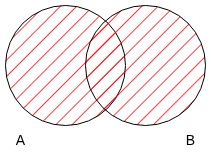
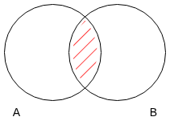
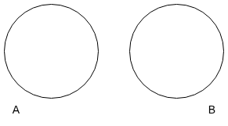
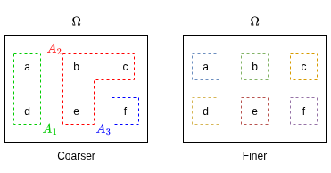
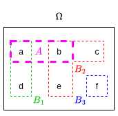

# Probability Theory

- [Probability Theory](#probability-theory)
  - [Probability Concepts](#probability-concepts)
  - [Set Theory in Probability](#set-theory-in-probability)
    - [Set Theory Definitions Summary](#set-theory-definitions-summary)
      - [Set Notation](#set-notation)
    - [Set Theory Examples](#set-theory-examples)
  - [Finite Probability Spaces](#finite-probability-spaces)
    - [Inclusion-Exclusion Formula](#inclusion-exclusion-formula)
    - [Addition Rule of Probabilities](#addition-rule-of-probabilities)
    - [Independent Events](#independent-events)
    - [Conditional Probability](#conditional-probability)
    - [Law of Total Probability](#law-of-total-probability)
    - [Example: Tossing a Coin](#example-tossing-a-coin)
    - [Axioms of Probability](#axioms-of-probability)
    - [Properties of Probability](#properties-of-probability)
    - [Further Finite Probability Examples](#further-finite-probability-examples)
      - [Single Die Roll](#single-die-roll)
      - [Hiring Example](#hiring-example)
  - [General Probability Spaces](#general-probability-spaces)
  - [Discrete Random Variables](#discrete-random-variables)
    - [Probability Distribution](#probability-distribution)
      - [Probability Distribution of a Coin Toss](#probability-distribution-of-a-coin-toss)
    - [Binomial Distribution](#binomial-distribution)
    - [Bernoulli Distribution](#bernoulli-distribution)
    - [Equality of Random Variables](#equality-of-random-variables)
    - [Random Variables Defining Events](#random-variables-defining-events)
    - [Random Variables Defining Partitions](#random-variables-defining-partitions)

Probability theory has evolved to model uncertainty, providing both an abstract system of thought and practical tools for quantifying likelihoods. While it can be studied as a purely theoretical branch of mathematics, its significance is closely tied to real-world applications.

## Probability Concepts

1. **Random Experiments**:
   - A random experiment is any process with an uncertain outcome but well-defined possible results. Examples include:
     - Tossing a coin: outcomes are heads or tails.
     - Rolling a die: outcomes range from 1 to 6.
     - Dealing a poker hand: possible hands from a standard deck.
     - Measuring daily temperatures: results in a sequence of real numbers.

2. **Probability Numbers**:
   - Probability assigns a value between 0 and 1 to outcomes or sets of outcomes (events):
     - **0**: Certainty that the outcome will not occur.
     - **1**: Certainty that the outcome will occur.
   - These numbers formalize intuitions about uncertainty and likelihood.

3. **Interpretations of Probability**:
   - **Frequentist View**:
     - Probability represents the long-run frequency of an outcome in repeated experiments.
     - Example: A coin with a probability of 0.7 for heads means that in many tosses, about 70% will show heads.
   - **Challenges**:
     - Not all scenarios, such as estimating the likelihood of a rare event (e.g., nuclear war), lend themselves to repeatable experiments.
   - **Subjective Bayesian View**:
     - Probability is seen as a degree of belief, often used in Bayesian statistics.
     - This approach accommodates single-event probabilities but requires further study for in-depth understanding.

## Set Theory in Probability

In probability, outcomes of a random experiment are modelled as sets, which are collections of elements. These sets help formalize and analyze the behaviour of random experiments and their possible outcomes.

- An empty set is a set that contains no elements, denoted as $\emptyset$ and defined as $\emptyset = \{\}$.
- The **set complement** is for outcomes that are not an element of $A$ and is given by $\bar{A}$ which is defined as $\bar{A}=\Omega \setminus A = \omega \in \Omega : \omega \notin A$.
  - The $:$ can be read as "such that".
- Two sets are considered *equal* $A = B$ if they contain exactly the same elements. This can be expressed as:
  - $\omega \in A \Longleftrightarrow  \omega \in B$
  - If $\omega$ in $A$ then $\omega$ is in $B$ and vice versa.
- If every element of set $A$ is also an element of set B, then $A$ is a **subset** of B, denoted as $A \subset B$
  - Usually this includes the case where $A$ and $B$ are equal $A = B$.
  - However, to emphasize that $A$ is a subset of $B$ but not equal to B, we can use the notation $A \subsetneq B$.
  - Similarly, if $A=B$, the notation $A \subseteq B$ can be used to indicate that $A$ is a subset of B, and possibly equal to $B$.
- The **union** of two sets $A$ and $B$ represents everything in $A$ and everything in $B$ and is given by $A \cup B$ which is defined as:
  - $A \cup B = \{ \omega \in \Omega: \omega \in A \text{ or } \omega \in B  \text{ or both}\}$
  - For $n$ sets $\bigcup_{i=1}^{n} A_i = A_1 \cup A_2 \cup \dots \cup A_n$

    

- The **intersection** of two sets $A$ and $B$ is the set of all elements common to both $A$ and B$ and is given by $A \cap B$ which is defined as:
  - $A \cap B = \{ \omega \in \Omega: \omega \in A \text{ and } \omega \in B\}$
  - For $n$ sets $\bigcap_{i=1}^{n} A_i = A_1 \cap A_2 \cap \dots \cap A_n$

    

- Two sets $A$ and $B$ are **disjoint** if they have no elements in common, which means their intersection is the empty set: $A \cap B = \emptyset$.

    

- A **partition** is a way of describing what is ***knowable*** at a particular time about the actual outcome of an experiment.
  - A partition $\mathcal{U}$ of $\Omega$ is a set of non-empty events $A_{1}, A_{2}, \dots, A_{n}$ such that each outcome $\omega$ appears in exactly one event.
    - $A_{i} \neq \emptyset$ for all $A_{i} \in \mathcal{U}$
    - $A_i \cap A_j = \emptyset$ for all $i \neq j$
    - $\bigcup_{i=1}^{n} A_i = \Omega$
  - This means that the events are disjoint (or the events are incompatible).
  - A partition $\mathcal{U}$ is described as *finer* than another partition $\mathcal{V}$ if for all $A \in \mathcal{U}$, there exists some event $B \in \mathcal{V}$ such that $A \subset B$.
    - Equivalently, every event in $\mathcal{V}$ can be expressed as a union of events in $\mathcal{U}$.
  - Similarly, a partition $\mathcal{U}$ is described as *coarser* than another partition $\mathcal{V}$ if for all $B \in \mathcal{V}$, there exists some event $A \in \mathcal{U}$ such that $B \subset A$.

    

    $$\Omega = \{a,b,c,d,e,f\} = A_1 \cup A_2 \cup A_3 = \{a,b\} \cup \{c,d\} \cup \{e,f\}$$
    where $\mathcal{U} = \{A_1, A_2, A_3\} = \{\{a,d\},\{b,c,e\},\{f\}\}$ is a partition of $\Omega$.
  - For a coin that is tossed three times, and only the result of the first toss is known, the partition for what is *knowable* after the first toss is given by:
    $$\mathcal{U_1} = \{ A_h, A_t \}$$
    where
    $$A_h = \{\omega_{hhh}, \omega_{hht}, \omega_{hth}, \omega_{htt}\}$$
    $$A_t = \{\omega_{thh}, \omega_{tht}, \omega_{tth}, \omega_{ttt}\}$$
  - Similarly, if the result of the first two tosses is known, the partition for what is *knowable* after the second toss is given by:
    $$\mathcal{U_2} = \{ A_{hh}, A_{ht}, A_{th}, A_{tt} \}$$
    where
    $$A_{hh} = \{\omega_{hhh}, \omega_{hht}\}$$
    $$A_{ht} = \{\omega_{hth}, \omega_{htt}\}$$
    $$A_{th} = \{\omega_{thh}, \omega_{tht}\}$$
    $$A_{tt} = \{\omega_{tth}, \omega_{ttt}\}$$

### Set Theory Definitions Summary

1. **Set**:
   - A collection of elements, which could be anything from numbers to abstract objects.
   - Example: The set of positive integers less than 10 is $S = \{1, 2, 3, 4, 5, 6, 7, 8, 9\}$.

2. **Set Operations**:
   - **Union $(A \cup B)$**: All elements in either $(A)$ or $(B)$.
     - Example: $A = \{2, 5, 8\}, B = \{4, 5, 9\}, A \cup B = \{2, 4, 5, 8, 9\}$.
   - **Intersection $(A \cap B)$**: Elements common to $(A)$ and $(B)$.
     - Example: $A = \{2, 4, 6\}, B = \{6, 9\}, A \cap B = \{6\}$.
   - **Complement $(A^C)$**: All elements not in $A$, relative to a universal set $\Omega$.
     - $A^C = \{x \in \Omega : x \notin A\}$.
   - **Relative Complement $(A / B)$**: Elements in $A$ but not in $B$.
     - $A / B = A \cap B^C$.
   - **De Morgan’s Laws**:
     - $(A \cup B)^C = A^C \cap B^C$
     - $(A \cap B)^C = A^C \cup B^C$

3. **Sample Space** $(S)$:
   - The set of all possible outcomes of a random experiment.
   - Example: For rolling a six-sided die once, $S = \{1, 2, 3, 4, 5, 6\}$.
   - For rolling the die twice, $S = \{(i, j) : i, j \in \{1, 2, 3, 4, 5, 6\}\}$.

4. **Event**:
   - A subset of the sample space.
   - Example: In a single die roll, the event $A$ of rolling an even number is $A = \{2, 4, 6\}$.

#### Set Notation

The common practice is to denote intersections in probabilities using commas. For example:
$$P(S_1 \cap S_2) = P(S_1, S_2)$$
Both notations are context-dependent, and familiarity with both is important.

### Set Theory Examples

1. **Coin Toss**:
   - Sample space for a single toss: $S = \{H, T\}$.
   - For three tosses: $S = \{(H, H, H), (H, H, T), (H, T, H), \dots, (T, T, T)\}$.
   - Event $B$: At least two heads in three tosses.
     - $B = \{(H, H, T), (H, T, H), (T, H, H), (H, H, H)\}$.

2. **Die Roll**:
   - Sample space: $S = \{1, 2, 3, 4, 5, 6\}$.
   - Event $A$: Rolling an even number.
     - $A = \{2, 4, 6\}$.

## Finite Probability Spaces

- A **sample space** is the of all outcomes within a random system where there are a finite set of outcomes. The sample space is denoted as $\Omega$.
- A typical outcome is denoted as $\omega$ and $\omega \in \Omega$ is used to indicate that $\omega$ is an **element** of the sample space $\Omega$.
- An **event** is a set of possible outcomes and (equivalently) an event of the sample space $\Omega$.

| Probability Theory | Set Theory |
|:------------------:|:----------:|
| Sample Space $\Omega$ | Universal Set $U$ |
| Outcome $\omega$ | Element $x$ |
| Event $A$ | Subset $A$ |

- A *probability measure* assigns to each outcome $\omega \in \Omega$ a number $P(\omega) \in [0,1]$ such that:
  $$\boxed{\sum_{\omega \in \Omega} P(\omega) = 1}$$
  where $0 \leq P(\omega) \leq 1$ for all $\omega \in \Omega$.
- The probability of an event $A$ is defined as:
  $$\boxed{P(A) = \sum_{\omega \in A} P(\omega)}$$
  - In particular:
    - $P(\emptyset) = 0$ (the empty event cannot occur).  
    - $P(\Omega) = 1$ (the whole sample space occurs with certainty).  
- The pair $(\Omega, P)$ is called a **finite probability space**.
  - For finite probability spaces, any outcome $\omega$ with $P(\omega) = 0$ is called an **impossible outcome** and can never occur.
  - Typically, assume that $P(\omega) > 0$ for all outcomes, $\omega \in \Omega$.

### Inclusion-Exclusion Formula

- For two events $A$ and $B$, the inclusion-exclusion formula is given by:

$$\boxed{P(A \cup B) = P(A) + P(B) - P(A \cap B)}$$

- This formula accounts for the overlap between events $A$ and $B$ to avoid double counting the outcomes in the intersection $A \cap B$.


### Addition Rule of Probabilities

- If two event $A$ and $B$ are disjoint (i.e. if $A \cap B = \emptyset$), then the addition rule of probabilities states that:

$$\boxed{P(A \cup B) = P(A) + P(B)}$$


- The probability of not $A$ is given by: $P(\bar{A}) = 1 - P(A)$

- Let $\Omega$ be a finite sample space with probability measure $P$ and suppose $\{A_1, A_2, \dots, A_n\}$ is a **partition** of $\Omega$, i.e.
  - $A_i \cap A_j = \emptyset$ for all $i \neq j$ (pairwise disjointness),  
  - $\bigcup_{i=1}^n A_i = \Omega$ (covering the whole space).

$$P(\Omega) = P\left(\bigcup_{i=1}^{n} A_i\right) = \sum_{i=1}^{n} P(A_i) = \sum_{i=1}^{n} \sum_{\omega=A_i}P(\omega) = \sum_{\omega \in \Omega}P(\omega) = 1$$

- The partition breaks the sample space into disjoint events.
- Because of disjointness, probabilities add without double-counting.
- Since each event probability is itself the sum of probabilities of its outcomes, the result collapses back to the normalisation condition: the total probability of the sample space equals $1$.

### Independent Events

- Two events $A$ and $B$ are **statistically independent** by definition if:

$$\boxed{P(A \cap B) = P(A)P(B)}$$

### Conditional Probability

For two events $A$ and $B$ with $P(B) > 0$, the **conditional probability** of $A$ given $B$ is defined as:

$$\boxed{P(A|B) = \frac{P(A \cap B)}{P(B)}}$$

In other words, $P(A|B)$ represents the probability of event $A$ occurring given that event $B$ has already occurred.

$$\boxed{P(A)= P(A|B) \Longleftrightarrow  A \text{ and } B \text{ are independent}}$$

### Law of Total Probability

- Let $\mathcal{U}$ be a partition of $\Omega$ with events $B_1, B_2, \dots, B_m$ and $P(B_i) > 0$ for all $i$.
- Then for any event $A$, the law of total probability states that:

$$\boxed{P(A) = P(\bigcup_{i=1}^{m} (A \cap B_i)) = \sum_{i=1}^{m} (A \cap B_i)=\sum_{i=1}^{m} P(A|B_i)P(B_i)}$$



### Example: Tossing a Coin

- Tossing a coin three times can be modelled as a finite probability space.
- The sample space is given by:
  $$\Omega = \{ \omega_{hhh}, \omega_{hht}, \omega_{hth}, \omega_{htt}, \omega_{thh}, \omega_{tht}, \omega_{tth}, \omega_{ttt} \}$$
  where $h$ represents heads and $t$ represents tails.
- An example event $A$ is the set of outcomes where the first toss is heads:
  $$A = \{ \omega_{hhh}, \omega_{hht}, \omega_{hth}, \omega_{htt} \}$$
- If the coin is biased where $p_{h}$ is the probability of headers and $p_{t} = 1 - p_{h}$ is the probability of tails, then the probability measure $P$ is given by:
  $$P(\omega_{hhh}) = p_{h}^3$$
  $$P(\omega_{hht}) = p_{h}^2 p_{t}$$
  $$P(\omega_{hth}) = p_{h}^2 p_{t}$$
  $$P(\omega_{htt}) = p_{h} p_{t}^2$$
  $$P(\omega_{thh}) = p_{h}^2 p_{t}$$
  $$P(\omega_{tht}) = p_{h} p_{t}^2$$
  $$P(\omega_{tth}) = p_{h} p_{t}^2$$
  $$P(\omega_{ttt}) = p_{t}^3$$

- Let $A_{h}$ be the event that the first toss is heads, then:

```math
\begin{aligned}
P(A_{h}) &= \sum_{\omega \in A_{h}} P(\omega) \\\\
&= P(\omega_{hhh}) + P(\omega_{hht}) + P(\omega_{hth}) + P(\omega_{htt}) \\\\
&= p_{h}^3 + p_{h}^2 p_{t} + p_{h}^2 p_{t} + p_{h} p_{t} \\\\
&= p^2h(p_{h} + p_{t}) + p_{h}p_{t}(p_h+p_t) \\\\
&= p_{h}^2 + p_{h}p_{t} \\\\
&= p_{h}(p_{h} + p_{t}) \\\\
&= p_{h}(1) \\\\
&= p_{h}
\end{aligned}
```

- Similarly, let $B$ be the event that the second toss is heads, and $C$ be the event that the third toss is heads, then:
  $$P(B) = P(\omega_{hhh}) + P(\omega_{hht}) + P(\omega_{thh}) + P(\omega_{tht}) = p_{h}^3 + p_{h}^2 p_{t} + p_{h}^2 p_{t} + p_{h} p_{t}^2 = p_{h}$$
  $$P(C) = P(\omega_{hhh}) + P(\omega_{hth}) + P(\omega_{thh}) + P(\omega_{tth}) = p_{h}^2 p_{t} + p_{h} p_{t}^2 + p_{h} p_{t}^2 + p_{t}^3 = p_{t}$$
  $$P(B \cap C) = P(\omega_{hht}) + P(\omega_{tht}) = p_{h}^2 p_{t} + p_{h} p_{t}^2 = p_{h}p_{t}$$
  $$\therefore P(B \cap C) = P(B)P(C)$$

- The probability of getting precisely one tail (event $E_t$), given that the first toss is heads (event $A_h$), is given by:

```math
\begin{aligned}
P(E_t|A_h) &= \frac{P(\omega_{hht})+P(\omega_{hth})}{P(A_h)} \\\\
&= \frac{p_{h}^2 p_{t} + p_{h}^2 p_{t}}{p_{h}} \\\\
&= 2 p_{h} p_{t}
\end{aligned}
```

- The probability of getting precisely one tail ($3p_h^2p_t$) is different from the conditional probability of getting precisely one tail given that the first toss is heads ($2p_hp_t$).
  - Hence, the events $E_t$ and $A_h$ are not independent.
- The probability of getting precisely one tail (event $E_t$), given that the first toss is tails (event $A_t$), is given by:

```math
\begin{aligned}
P(E_t) &= \frac{P(\omega_{thh})}{P(A_t)} \\\\
&= \frac{ p_{t}p_{h}^2}{p_{t}} \\\\
&= p_{h}^2
\end{aligned}
```

- By the law of total probability, the probability of getting precisely one tail is given by:

$$P(E_t|A_h)P(A_h) + P(E_t|A_t)P(A_t) = 2p_hp_t \cdot p_h + p_h^2 \cdot p_t = 3p_h^2p_t$$

- Which is the same as getting precisely one tail without any conditions.

### Axioms of Probability

In the finite case, **probability** is modelled as a function $P(A)$ that assigns real numbers between $0$ and $1$ to subsets of a **sample space** $S$. The function $P$ is defined using the following axioms:

1. **Non-negativity**: For any event $A \subseteq S$, $P(A) \geq 0$.
2. **Total Probability**: $P(S) = 1$.
3. **Additivity**: For disjoint events $A$ and $B$, $P(A \cup B) = P(A) + P(B)$.

### Properties of Probability

These axioms lead to several useful properties:

1. **Finite Additivity**: For disjoint events $A_1, A_2, \dots, A_n$:
   $$P\left ( \bigcup_{i=1}^{n}A_{i} \right ) = \sum_{i=1}^{n}P(A_{i})$$

2. **Complement Rule**: For any event $A$:
   $$P(\bar{A}) = P(A^C) = 1 - P(A)$$

3. **Subset Property**: If $B \subseteq A$, then $P(B) \leq P(A)$.

4. **Range of Probability**: $0 \leq P(A) \leq 1$ for any $A$.

5. **Inclusion-Exclusion Law**:
   $$P(A \cup B) = P(A) + P(B) - P(A \cap B)$$

### Further Finite Probability Examples

#### Single Die Roll

- **Sample space**: $S = \{1, 2, 3, 4, 5, 6\}$.
- For a balanced die, each outcome has $P(i) = \frac{1}{6}$.
- **Event**: $A = \{2, 4, 6\}$ (rolling an even number).

Using finite additivity:
$$P(A) = P(2) + P(4) + P(6) = \frac{1}{6} + \frac{1}{6} + \frac{1}{6} = \frac{1}{2}$$

#### Hiring Example

- **Events**: $A$: You are hired, $B$: Your cousin is hired.
- **Given**: $P(A) = 0.4$, $P(B) = 0.3$, $P((A \cup B)^C) = 0.5$.

1. Using the complement rule:
   $$P(A \cup B) = 1 - P((A \cup B)^C) = 1 - 0.5 = 0.5$$

2. From the inclusion-exclusion law:
   $$P(A \cap B) = P(A) + P(B) - P(A \cup B) = 0.4 + 0.3 - 0.5 = 0.2$$

3. To calculate $P(A \cap B^C)$:
   - The union $A = (A \cap B) \cup (A \cap B^C)$ is disjoint, so:
    $$P(A) = P(A \cap B) + P(A \cap B^C)$$
   - Solving for $P(A \cap B^C)$:
     $$P(A \cap B^C) = P(A) - P(A \cap B) = 0.4 - 0.2 = 0.2$$

## General Probability Spaces

- Financial modelling and stochastic calculus often requires **continuous outcomes** (e.g. stock prices taking real values, Brownian motion paths).  
- To handle this rigorously, probability theory is built on **measure theory**, where probabilities are defined on collections of sets called **sigma-algebras**.  
- This measure-theoretic framework underpins everything from Brownian motion to martingales and stochastic integration.

A **general probability space** is a triple $(\Omega, \mathcal{F}, P)$ where:

1. $\Omega$ is the **sample space** of outcomes.  
2. $\mathcal{F}$ is a **sigma-algebra** (also called a sigma-field) of subsets of $\Omega$, i.e. a collection of events on which probability is defined.  
   - $\Omega \in \mathcal{F}$.  
   - If $A \in \mathcal{F}$ then $A^c \in \mathcal{F}$.  
   - If $A_1, A_2, \dots \in \mathcal{F}$ then $\bigcup_{i=1}^\infty A_i \in \mathcal{F}$.  
3. $P$ is a **probability measure** on $\mathcal{F}$ satisfying the Kolmogorov axioms:  
   - *Non-negativity*: $P(A) \geq 0$ for all $A \in \mathcal{F}$.  
   - *Normalization*: $P(\Omega) = 1$.  
   - *Countable additivity*: For any countable collection of pairwise disjoint sets $A_1, A_2, \dots \in \mathcal{F}$,  
     $$
     P\!\left(\bigcup_{i=1}^{\infty} A_i\right) = \sum_{i=1}^{\infty} P(A_i).
     $$

## Discrete Random Variables

- A **random variable** is a numerical quantity that is determined by the outcome of a random experiment.
- Formally, a random variable $X$ is a real-valued function defined on the sample space $\Omega$:
  $$X: \Omega \rightarrow \mathbb{R}$$
- By convention, random variables are denoted by **uppercase** letters (e.g., $X$, $Y$), while the specific values they can take are denoted by **lowercase** letters (e.g., $x$, $y$).
- A random variable is called **discrete** if it takes values in a finite or countable set, e.g. $\{x_i\}$ and $\{x_1, x_2, \dots\, x_i, \dots, x_k\}$.  
  - In a finite probability space, every random variable must be discrete, since $\Omega$ itself is finite.  
  - However, not all discrete random variables come from finite sample spaces: for example, a Poisson random variable takes values in $\{0,1,2,3,\dots\}$, which is countably infinite.

### Probability Distribution

- A random variable can be characterised by its **probability distribution**, given a particular probability measure $P$ on the sample space $\Omega$.
- The probability distribution of a discrete random variable $X$ is defined by the set of probabilities of individual values:

$$\boxed{p_i = P(X = x_i) = P(\{\omega \in \Omega : X(\omega) = x_i\})}$$
where $X=x_i$ is the event that the random variable $X$ takes the value $x_i$.

- The underlying space $\Omega$ can have many random variables defined on it, each with its own probability distribution.
- A random variable is a function $\Omega \to \mathbb{R}$, so technically speaking it does *not* include any information about the probabilities.
- A random variable can take the same value for different outcomes $\omega$ and the probability distribution by itself does not tell us which outcomes correspond to which values.
- Changing the probability measure $P$ on $\Omega$ will change the probability distribution of the random variable $X$.

- The probability space and random variable $X$ can be represented as a table:

| Outcome $\omega$ | $P(\omega)$ | $X(\omega)$ |
|:----------------:|:-----------:|:----------:|
| $\omega_1$       | $p_1$       | $x_1$      |
| $\omega_2$       | $p_2$       | $x_2$      |
| $\vdots$         | $\vdots$    | $\vdots$   |
| $\omega_n$       | $p_n$       | $x_n$      |

#### Probability Distribution of a Coin Toss

- For a biased coin, the probability space and random variable $X$ (number of heads in three tosses) is given by:

| Outcome $\omega$ | $P(\omega)$  | $X(\omega)$ (Number of Heads) |
|:----------------:|:------------:|:-----------------------------:|
| $\omega_{hhh}$   | $p_h^3$      | 3                             |
| $\omega_{hht}$   | $p_h^2 p_t$  | 2                             |
| $\omega_{hth}$   | $p_h^2 p_t$  | 2                             |
| $\omega_{thh}$   | $p_h^2 p_t$  | 1                             |
| $\omega_{htt}$   | $p_h p_t^2$  | 2                             |
| $\omega_{tht}$   | $p_h p_t^2$  | 1                             |
| $\omega_{tth}$   | $p_h p_t^2$  | 1                             |
| $\omega_{ttt}$   | $p_t^3$      | 0                             |

- The outcome column is referred to as the **sample space**.
- The outcome column and the probability column together are referred to as a **finite probability space**.
- The outcome column and the number of headers column together are referred to as a **random variable**

- The resulting **probability distribution** of $X$ is calculating by summing the probabilities of outcomes that yield the same value of $X$:

| $X=x_i$ (Number of Heads) | $P(X=x_i)$                     |
|:-------------------------:|:------------------------------:|
| 0                         | $P(X=0) = P(\omega_{ttt}) = p_t^3$ |
| 1                         | $P(X=1) = P(\omega_{tht}) + P(\omega_{tth}) + P(\omega_{htt}) = 3 p_h p_t^2$ |
| 2                         | $P(X=2) = P(\omega_{hht}) + P(\omega_{hth}) + P(\omega_{thh}) = 3 p_h^2 p_t$ |
| 3                         | $P(X=3) = P(\omega_{hhh}) = p_h^3$ |

### Binomial Distribution

- In general, for $N$ independet tosses of a unbiased coin, the probability of getting exactly $i$ heads is given by:

$$\boxed{p_i = P(X=i) = \binom{N}{i} p_h^i p_t^{N-i} \text{ for } i=0, 1, 2, \dots, N}$$
where $\binom{N}{i} = \frac{N!}{i!(N-i)!}$ is the binomial coefficient, representing the number of ways to choose $i$ heads from $N$ tosses.

- The binomial distribution is denoted as $\mathcal{B}(N, p_h)$, and the random variable $X$ can be written as $X \sim \mathcal{B}(N, p_h)$ to mean that $X$ follows a binomial distribution with parameters $N$ and $p_h$.

### Bernoulli Distribution

- A special case of the binomial distribution is when $N=1$, which is known as the **Bernoulli distribution**.
- $P(X=0) = 1 - p$ and $P(X=1) = p$.

### Equality of Random Variables

- Two random variables, $X$ and $Y$ are equal if $X(\omega) = Y(\omega)$ for all $\omega \in \Omega$.
  - Random variables that are not equal can still have the same probability distribution.

### Random Variables Defining Events

- A random variable can be used to define (or determine) an event.
- The notation ${X = x_i}$ is used to denote the event $\{\omega \in \Omega: X(\omega) = x_i\}$ where the random variable $X$ takes the value $x_i$.
- In the coin toss example where $X$ is the number of heads, the event ${X = 2}$ is given by:
  $$\{X = 2\} = \{\omega_{hht}, \omega_{hth}, \omega_{thh}\}$$

### Random Variables Defining Partitions

- A random variable $X$ can take the values $x_1, x_2, \dots, x_k$.
- $\mathcal{U}$ is the partition defined (or determined, or generated) by the random variable $X$.
- $\mathcal{U} = \{\{X=x_i\}\}$ is a partitiion of $\Omega$, or in other words $\mathcal{U} = \{B_1, B_2, \dots, B_k\}$ where $B_i = \{\omega \in \Omega: X(\omega) = x_i\}$.