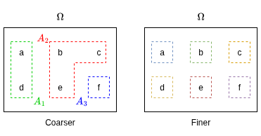

# Statistics

- [Statistics](#statistics)
  - [Financial Data](#financial-data)
    - [Financial Statistics Concepts](#financial-statistics-concepts)
      - [Stationary](#stationary)
      - [Marginal Distribution](#marginal-distribution)
      - [Ergodic Theorem](#ergodic-theorem)
    - [Returns](#returns)
      - [Gross Rate of Return](#gross-rate-of-return)
      - [Example 1: Calculating Returns from Values](#example-1-calculating-returns-from-values)
      - [Example 1: Calculating Weekly Returns from Daily Returns](#example-1-calculating-weekly-returns-from-daily-returns)
      - [Continuously Compounded Returns](#continuously-compounded-returns)
  - [Probability Theory](#probability-theory)
    - [Probability Concepts](#probability-concepts)
    - [Set Theory in Probability](#set-theory-in-probability)
      - [Set Theory Definitions Summary](#set-theory-definitions-summary)
        - [Set Notation](#set-notation)
      - [Set Theory Examples](#set-theory-examples)
    - [Finite Probability Spaces](#finite-probability-spaces)
    - [Inclusion-Exclusion Forumula](#inclusion-exclusion-forumula)
    - [Addition Rule of Probabilities](#addition-rule-of-probabilities)
    - [Independent Events](#independent-events)
    - [Example: Tossing a Coin](#example-tossing-a-coin)
    - [Axioms of Probability](#axioms-of-probability)
    - [Properties of Probability](#properties-of-probability)
      - [Finite Probability Examples](#finite-probability-examples)
        - [Single Die Roll](#single-die-roll)
        - [Hiring Example](#hiring-example)

## Financial Data

- The main use case for statistics in finance concern how assets will change in value over time, and more specifically what the future value of an asset is likely to be.
  - Given future asset values are unknown, probability and statistics are used to create reasonable models and forecasts.
- Fundamentally, financial entities are looking to profit from changes in asset values whilst minimising the risk of loss.
- **Time series** is the main form of financial data, with a time-dependent variable $V$ representing an asset's value at a time $t$.
$$V(t_{1}), V(t_{2}), ...,V(t_{n-1}), V(t_{n})$$
- The unit of time can vary from milliseconds to years, but should be consistent when working with a time series dataset.
- For the purpose of financial analysis, **asset returns** are more useful than outright asset values/prices.
- **Gross rate of return** $r(t)$ represents the *percentage change* between two prices at times $t$ and $t-1$, and is calculated by $r(t) = \frac{P(t) - P(t-1)}{P(t-1)}$.
  - In other words, the gross rate of return is a measure of the *relative return* as a fraction of the value at $t-1$ realized on the asset from $t-1$ to $t$.
- Many financial time series, in particular returns, can be assumed to be stationary.

### Financial Statistics Concepts

#### Stationary

- A stationary process has constant statistical properties, such as mean, variance, and autocorrelation, over time.
  - The value for $V(T)$ does not depend on $T$.
- For instance, if returns $r(t)$ are stationary, it implies that the average return and the variability of returns do not change over different periods.
- Stationarity is crucial for making reliable forecasts and in applying many statistical models that assume constant underlying distributions.
- A common technique to achieve stationarity is to transform the raw price series into a series of returns.

#### Marginal Distribution

- The marginal distribution of a subset of a collection of random variables is the probability distribution of that subset, ignoring the influence of the other variables.
  - In finance, this often refers to the distribution of returns for a single asset over time.
- Mathematically, for a joint probability distribution $P(X, Y)$ of two random variables $X$ and $Y$ representing the returns of two assets, the marginal distribution of $X$ is obtained by summing (or integrating, if dealing with continuous variables) the joint distribution over all possible values of $Y$:
  - Discrete variables: $P_{X}(x) = \sum_{y}P(X=x,Y=y)$
  - Discrete variables: $P_{X}(x) = \int_{-\infty}^{\infty}P(X=x,Y=y)dy$

- When handling the returns of multiple assets, the marginal distribution of a single asset's returns gives the probability of different return levels for that asset, without considering the returns of the other assets.
- Understanding the marginal distribution helps in assessing the risk and expected performance of individual assets.
  -For example, knowing the marginal distribution of returns $r(t)$ for a particular stock allows an investor to evaluate the likelihood of various return outcomes based on historical data.

#### Ergodic Theorem

- In a financial context, the ergodic theorem asserts that, over a long period, the time averages of a stochastic process (like asset returns) will converge to the ensemble averages (expected values).
  - This means that the long-term average return of an asset can be considered representative of its expected return.
- The ergodic property is essential for justifying the use of historical data to make inferences about future returns.
  - Financial analysts use past performance to estimate long-term trends and make probabilistic forecasts, assuming that the future will resemble the past over a sufficiently long horizon.

### Returns

- A return is a measure of an investor's profit/loss from an investment in a particular asset, given as a fraction (or percentage) of the initial investment.
  - Returns are independent of currency and price level, so are a useful measure when comparing the performance of multiple assets.
  - Prices are dependent on a wide variety of factors that are irrelevant when evaluating the profitability of an asset.
    - For example, a stock split wil affect the share price of an asset but have no impact on the returns.
- Let $P(t)$ represent a price time series for an asset at a time $t$.
  - Assume that the unit of time for $t$ is days.
- To define the return on an asset, the *return horizon* must be specified - this is the time period over which the return will be realized.
- For sake of ease, an investment horizon of 1 period, i.e. 1 day, will be used to initially define return measures.

#### Gross Rate of Return

- As mentioned previously, the gross rate of return on an asset is defined by:
$$\text{Net Return} = \frac{P(t)-P(t-1)}{P(t-1)}$$
- This is the ratio of the change in price of an asset over the return horizon to the price at the start.
  - The profit or loss (PnL) is represented by $P(t)-P(t-1)$ so the gross rate of return is therefore the PnL represented as a fraction/percentage of the value of the investment at the previous time period, $t-1$.

#### Example 1: Calculating Returns from Values

- A price time series is given in the table below.

|   Time    | Value, P(t) |   Daily Gross Rate of Return    |
| ----------|:-----------:|:------------------------------: |
| **t = 1** |     124     |                 -               |
| **t = 2** |     131     | $\frac{131-124}{124} = 5.65\%$  |
| **t = 3** |     128     | $\frac{128-131}{131} = -2.29\%$ |
| **t = 4** |     134     | $\frac{134-128}{128} = 4.69\%$  |
| **t = 5** |     132     | $\frac{132-134}{134} = -1.49\%$ |
| **t = 6** |     135     | $\frac{135-132}{132} = 2.27\%$  |

- The weekly gross rate of return can be calculated as follows:

$$
\begin{aligned}
\text{Gross rate of return} &= \frac{P(t=6)-P(t=1)}{P(t=1)} \\\\
&= \frac{135-124}{124} \\\\
&= 8.87\%
\end{aligned}
$$

#### Example 1: Calculating Weekly Returns from Daily Returns

- The daily gross rates of return are given in the table below for a one week period.

|    Day  | Return |
| --------|:------:|
| **Mon** |  0.7%  |
| **Tue** |  -0.2% |
| **Wed** |  1.2%  |
| **Thu** |  0.8%  |
| **Fri** |  -0.7% |

- The weekly gross rate of return can be calculated by tracking the value of 1 USD

|    Day  | Multiplier |                   Value                 |
| --------|:----------:|:---------------------------------------:|
| **Mon** |   1.007    |                $1(1.007)$               |
| **Tue** |   0.998    |            $1(1.007)(0.998)$            |
| **Wed** |   1.012    |        $1(1.007)(0.998)(1.012)$         |
| **Thu** |   1.008    |     $1(1.007)(0.998)(1.012)(1.008)$     |
| **Fri** |   0.993    |  $1(1.007)(0.998)(1.012)(1.008)(0.993)$ |

- The gross rate of return for week can be calculated by $\frac{1(1.007)(0.998)(1.012)(1.008)(0.993) - 1}{1} = (1.007)(0.998)(1.012)(1.008)(0.993) - 1 = 0.0180 = 1.80\%$
- The sum of the daily rates of return is therefore equal to the weekly rate of return:
$$r_{k}(t) = r(t-k+1) + r(t-k+2) +...+ r(t)$$

#### Continuously Compounded Returns

- A one-period continuously compounded return, $r(t)$, is calculated as follows:
$$P(t) = e^{r(t)}P(t-1)$$
$$r(t) = \log \left(\frac{P(t)}{P(t-1)} \right)$$
- Continuously compounded returns are also referred to as *logarithmic returns*.

## Probability Theory

Probability theory has evolved to model uncertainty, providing both an abstract system of thought and practical tools for quantifying likelihoods. While it can be studied as a purely theoretical branch of mathematics, its significance is closely tied to real-world applications.

### Probability Concepts

1. **Random Experiments**:
   - A random experiment is any process with an uncertain outcome but well-defined possible results. Examples include:
     - Tossing a coin: outcomes are heads or tails.
     - Rolling a die: outcomes range from 1 to 6.
     - Dealing a poker hand: possible hands from a standard deck.
     - Measuring daily temperatures: results in a sequence of real numbers.

2. **Probability Numbers**:
   - Probability assigns a value between 0 and 1 to outcomes or sets of outcomes (events):
     - **0**: Certainty that the outcome will not occur.
     - **1**: Certainty that the outcome will occur.
   - These numbers formalize intuitions about uncertainty and likelihood.

3. **Interpretations of Probability**:
   - **Frequentist View**:
     - Probability represents the long-run frequency of an outcome in repeated experiments.
     - Example: A coin with a probability of 0.7 for heads means that in many tosses, about 70% will show heads.
   - **Challenges**:
     - Not all scenarios, such as estimating the likelihood of a rare event (e.g., nuclear war), lend themselves to repeatable experiments.
   - **Subjective Bayesian View**:
     - Probability is seen as a degree of belief, often used in Bayesian statistics.
     - This approach accommodates single-event probabilities but requires further study for in-depth understanding.

### Set Theory in Probability

In probability, outcomes of a random experiment are modelled as sets, which are collections of elements. These sets help formalize and analyze the behaviour of random experiments and their possible outcomes.

- An empty set is a set that contains no elements, denoted as $\emptyset$ and defined as $\emptyset = \{\}$.
- The **set complement** is for outcomes that are not an element of $A$ and is given by $\bar{A}$ which is defined as $\bar{A}=\Omega \setminus A = \omega \in \Omega : \omega \notin A$.
  - The $:$ can be read as "such that".
- Two sets are considered *equal* $A = B$ if they contain exactly the same elements. This can be expressed as:
  - $\omega \in A \Longleftrightarrow  \omega \in B$
  - If $\omega$ in $A$ then $\omega$ is in $B$ and vice versa.
- If every element of set $A$ is also an element of set B, then $A$ is a **subset** of B, denoted as $A \subset B$
  - Usually this includes the case where $A$ and $B$ are equal $A = B$.
  - However, to emphasize that $A$ is a subset of $B$ but not equal to B, we can use the notation $A \subsetneq B$.
  - Similarly, if $A=B$, the notation $A \subseteq B$ can be used to indicate that $A$ is a subset of B, and possibly equal to $B$.
- The **union** of two sets $A$ and $B$ represents everything in $A$ and everything in $B$ and is given by $A \cup B$ which is defined as:
  - $A \cup B = \{ \omega \in \Omega: \omega \in A \text{ or } \omega \in B  \text{ or both}\}$
  - For $n$ sets $\bigcup_{i=1}^{n} A_i = A_1 \cup A_2 \cup ... \cup A_n$

    

- The **intersection** of two sets $A$ and $B$ is the set of all elements common to both $A$ and B$ and is given by $A \cap B$ which is defined as:
  - $A \cap B = \{ \omega \in \Omega: \omega \in A \text{ and } \omega \in B\}$
  - For $n$ sets $\bigcap_{i=1}^{n} A_i = A_1 \cap A_2 \cap ... \cap A_n$

    

- Two sets $A$ and $B$ are **disjoint** if they have no elements in common, which means their intersection is the empty set: $A \cap B = \emptyset$.

    

- A **partition** is a way of describing what is ***knowable*** at a particular time about the actual outcome of an experiment.
  - A partition $\mathcal{U}$ of $\Omega$ is a set of non-empty events $A_{1}, A_{2}, ..., A_{n}$ such that each outcome $\omega$ appears in exactly one event.
    - $A_{i} \neq \emptyset$ for all $A_{i} \in \mathcal{U}$
    - $A_i \cap A_j = \emptyset$ for all $i \neq j$
    - $\bigcup_{i=1}^{n} A_i = \Omega$
  - This means that the events are disjoint (or the events are incompatible).
  - A partition $\mathcal{U}$ is described as *finer* than another partition $\mathcal{V}$ if for all $A \in \mathcal{U}$, there exists some event $B \in \mathcal{V}$ such that $A \subset B$.
    - Equivalently, every event in $\mathcal{V}$ can be expressed as a union of events in $\mathcal{U}$.
  - Similarly, a partition $\mathcal{U}$ is described as *coarser* than another partition $\mathcal{V}$ if for all $B \in \mathcal{V}$, there exists some event $A \in \mathcal{U}$ such that $B \subset A$.

    

    $$\Omega = \{a,b,c,d,e,f\} = A_1 \cup A_2 \cup A_3 = \{a,b\} \cup \{c,d\} \cup \{e,f\}$$
    where $\mathcal{U} = \{A_1, A_2, A_3\} = \{\{a,d\},\{b,c,e\},\{f\}\}$ is a partition of $\Omega$.
  - For a coin that is tossed three times, and only the result of the first toss is known, the partition for what is *knowable* after the first toss is given by:
    $$\mathcal{U_1} = \{ A_h, A_t \}$$
    where
    $$A_h = \{\omega_{hhh}, \omega_{hht}, \omega_{hth}, \omega_{htt}\}$$
    $$A_t = \{\omega_{thh}, \omega_{tht}, \omega_{tth}, \omega_{ttt}\}$$
  - Similarly, if the result of the first two tosses is known, the partition for what is *knowable* after the second toss is given by:
    $$\mathcal{U_2} = \{ A_{hh}, A_{ht}, A_{th}, A_{tt} \}$$
    where
    $$A_{hh} = \{\omega_{hhh}, \omega_{hht}\}$$
    $$A_{ht} = \{\omega_{hth}, \omega_{htt}\}$$
    $$A_{th} = \{\omega_{thh}, \omega_{tht}\}$$
    $$A_{tt} = \{\omega_{tth}, \omega_{ttt}\}$$

#### Set Theory Definitions Summary

1. **Set**:
   - A collection of elements, which could be anything from numbers to abstract objects.
   - Example: The set of positive integers less than 10 is $S = \{1, 2, 3, 4, 5, 6, 7, 8, 9\}$.

2. **Set Operations**:
   - **Union $(A \cup B)$**: All elements in either $(A)$ or $(B)$.
     - Example: $A = \{2, 5, 8\}, B = \{4, 5, 9\}, A \cup B = \{2, 4, 5, 8, 9\}$.
   - **Intersection $(A \cap B)$**: Elements common to $(A)$ and $(B)$.
     - Example: $A = \{2, 4, 6\}, B = \{6, 9\}, A \cap B = \{6\}$.
   - **Complement $(A^C)$**: All elements not in $A$, relative to a universal set $\Omega$.
     - $A^C = \{x \in \Omega : x \notin A\}$.
   - **Relative Complement $(A / B)$**: Elements in $A$ but not in $B$.
     - $A / B = A \cap B^C$.
   - **De Morgan’s Laws**:
     - $(A \cup B)^C = A^C \cap B^C$
     - $(A \cap B)^C = A^C \cup B^C$

3. **Sample Space** $(S)$:
   - The set of all possible outcomes of a random experiment.
   - Example: For rolling a six-sided die once, $S = \{1, 2, 3, 4, 5, 6\}$.
   - For rolling the die twice, $S = \{(i, j) : i, j \in \{1, 2, 3, 4, 5, 6\}\}$.

4. **Event**:
   - A subset of the sample space.
   - Example: In a single die roll, the event $A$ of rolling an even number is $A = \{2, 4, 6\}$.

##### Set Notation

The common practice is to denote intersections in probabilities using commas. For example:
$$P(S_1 \cap S_2) = P(S_1, S_2)$$
Both notations are context-dependent, and familiarity with both is important.

#### Set Theory Examples

1. **Coin Toss**:
   - Sample space for a single toss: $S = \{H, T\}$.
   - For three tosses: $S = \{(H, H, H), (H, H, T), (H, T, H), \dots, (T, T, T)\}$.
   - Event $B$: At least two heads in three tosses.
     - $B = \{(H, H, T), (H, T, H), (T, H, H), (H, H, H)\}$.

2. **Die Roll**:
   - Sample space: $S = \{1, 2, 3, 4, 5, 6\}$.
   - Event $A$: Rolling an even number.
     - $A = \{2, 4, 6\}$.

### Finite Probability Spaces

- A **sample space** is the of all outcomes within a random system where there are a finite set of outcomes. The sample space is denoted as $\Omega$.
- A typical outcome is denoted as $\omega$ and $\omega \in \Omega$ is used to indicate that $\omega$ is an **element** of the sample space $\Omega$.
- An **event** is a set of possible outcomes and (equivalently) an event of the sample space $\Omega$.

| Probability Theory | Set Theory |
|:------------------:|:----------:|
| Sample Space $\Omega$ | Universal Set $U$ |
| Outcome $\omega$ | Element $x$ |
| Event $A$ | Subset $A$ |

- A *probability measure* assigns to each outcome $\omega \in \Omega$ a number $P(\omega) \in [0,1]$ such that:
  $$\boxed{\sum_{\omega \in \Omega} P(\omega) = 1}$$
  where $0 \leq P(\omega) \leq 1$ for all $\omega \in \Omega$.
- The probability of an event $A$ is defined as:
  $$\boxed{P(A) = \sum_{\omega \in A} P(\omega)}$$
  - In particular:
    - $P(\emptyset) = 0$ (the empty event cannot occur).  
    - $P(\Omega) = 1$ (the whole sample space occurs with certainty).  
- The pair $(\Omega, P)$ is called a **finite probability space**.
  - For finite probability spaces, any outcome $\omega$ with $P(\omega) = 0$ is called an **impossible outcome** and can never occur.
  - Typically, assume that $P(\omega) > 0$ for all outcomes, $\omega \in \Omega$.

### Inclusion-Exclusion Forumula

- For two events $A$ and $B$, the inclusion-exclusion formula is given by:

$$\boxed{P(A \cup B) = P(A) + P(B) - P(A \cap B)}$$

- This formula accounts for the overlap between events $A$ and $B$ to avoid double counting the outcomes in the intersection $A \cap B$.


### Addition Rule of Probabilities

- If two event $A$ and $B$ are disjoint (i.e. if $A \cap B = \emptyset$), then the addition rule of probabilities states that:

$$\boxed{P(A \cup B) = P(A) + P(B)}$$


- The probability of not $A$ is given by: $P(\bar{A}) = 1 - P(A)$

- Let $\Omega$ be a finite sample space with probability measure $P$ and suppose $\{A_1, A_2, \dots, A_n\}$ is a **partition** of $\Omega$, i.e.
  - $A_i \cap A_j = \emptyset$ for all $i \neq j$ (pairwise disjointness),  
  - $\bigcup_{i=1}^n A_i = \Omega$ (covering the whole space).

$$P(\Omega) = P\left(\bigcup_{i=1}^{n} A_i\right) = \sum_{i=1}^{n} P(A_i) = \sum_{i=1}^{n} \sum_{\omega=A_i}P(\omega) = \sum_{\omega \in \Omega}P(\omega) = 1$$

- The partition breaks the sample space into disjoint events.
- Because of disjointness, probabilities add without double-counting.
- Since each event probability is itself the sum of probabilities of its outcomes, the result collapses back to the normalisation condition: the total probability of the sample space equals $1$.

### Independent Events

- Two events $A$ and $B$ are **statistically independent** by definition if:

$$\boxed{P(A \cap B) = P(A)P(B)}$$

### Example: Tossing a Coin

- Tossing a coin three times can be modelled as a finite probability space.
- The sample space is given by:
  $$\Omega = \{ \omega_{hhh}, \omega_{hht}, \omega_{hth}, \omega_{htt}, \omega_{thh}, \omega_{tht}, \omega_{tth}, \omega_{ttt} \}$$
  where $h$ represents heads and $t$ represents tails.
- An example event $A$ is the set of outcomes where the first toss is heads:
  $$A = \{ \omega_{hhh}, \omega_{hht}, \omega_{hth}, \omega_{htt} \}$$
- If the coin is biased where $p_{h}$ is the probability of headers and $p_{t} = 1 - p_{h}$ is the probability of tails, then the probability measure $P$ is given by:
  $$P(\omega_{hhh}) = p_{h}^3$$
  $$P(\omega_{hht}) = p_{h}^2 p_{t}$$
  $$P(\omega_{hth}) = p_{h}^2 p_{t}$$
  $$P(\omega_{htt}) = p_{h} p_{t}^2$$
  $$P(\omega_{thh}) = p_{h}^2 p_{t}$$
  $$P(\omega_{tht}) = p_{h} p_{t}^2$$
  $$P(\omega_{tth}) = p_{h} p_{t}^2$$
  $$P(\omega_{ttt}) = p_{t}^3$$

- Let $A_{h}$ be the event that the first toss is heads, then:

```math
\begin{aligned}
P(A_{h}) &= \sum_{\omega \in A_{h}} P(\omega) \\\\
&= P(\omega_{hhh}) + P(\omega_{hht}) + P(\omega_{hth}) + P(\omega_{htt}) \\\\
&= p_{h}^3 + p_{h}^2 p_{t} + p_{h}^2 p_{t} + p_{h} p_{t} \\\\
&= p^2h(p_{h} + p_{t}) + p_{h}p_{t}(p_h+p_t) \\\\
&= p_{h}^2 + p_{h}p_{t} \\\\
&= p_{h}(p_{h} + p_{t}) \\\\
&= p_{h}(1) \\\\
&= p_{h}
\end{aligned}
```

- Similarly, let $B$ be the event that the second toss is heads, and $C$ be the event that the third toss is heads, then:
  $$P(B) = P(\omega_{hhh}) + P(\omega_{hht}) + P(\omega_{thh}) + P(\omega_{tht}) = p_{h}^3 + p_{h}^2 p_{t} + p_{h}^2 p_{t} + p_{h} p_{t}^2 = p_{h}$$
  $$P(C) = P(\omega_{hhh}) + P(\omega_{hth}) + P(\omega_{thh}) + P(\omega_{tth}) = p_{h}^2 p_{t} + p_{h} p_{t}^2 + p_{h} p_{t}^2 + p_{t}^3 = p_{t}$$
  $$P(B \cap C) = P(\omega_{hht}) + P(\omega_{tht}) = p_{h}^2 p_{t} + p_{h} p_{t}^2 = p_{h}p_{t}$$
  $$\therefore P(B \cap C) = P(B)P(C)$$

### Axioms of Probability

In the finite case, **probability** is modelled as a function $P(A)$ that assigns real numbers between $0$ and $1$ to subsets of a **sample space** $S$. The function $P$ is defined using the following axioms:

1. **Non-negativity**: For any event $A \subseteq S$, $P(A) \geq 0$.
2. **Total Probability**: $P(S) = 1$.
3. **Additivity**: For disjoint events $A$ and $B$, $P(A \cup B) = P(A) + P(B)$.

### Properties of Probability

These axioms lead to several useful properties:

1. **Finite Additivity**: For disjoint events $A_1, A_2, \dots, A_n$:
   $$P\left ( \bigcup_{i=1}^{n}A_{i} \right ) = \sum_{i=1}^{n}P(A_{i})$$

2. **Complement Rule**: For any event $A$:
   $$P(A^C) = 1 - P(A)$$

3. **Subset Property**: If $B \subseteq A$, then $P(B) \leq P(A)$.

4. **Range of Probability**: $0 \leq P(A) \leq 1$ for any $A$.

5. **Inclusion-Exclusion Law**:
   $$P(A \cup B) = P(A) + P(B) - P(A \cap B)$$

#### Finite Probability Examples

##### Single Die Roll

- **Sample space**: $S = \{1, 2, 3, 4, 5, 6\}$.
- For a balanced die, each outcome has $P(i) = \frac{1}{6}$.
- **Event**: $A = \{2, 4, 6\}$ (rolling an even number).

Using finite additivity:
$$P(A) = P(2) + P(4) + P(6) = \frac{1}{6} + \frac{1}{6} + \frac{1}{6} = \frac{1}{2}$$

##### Hiring Example

- **Events**: $A$: You are hired, $B$: Your cousin is hired.
- **Given**: $P(A) = 0.4$, $P(B) = 0.3$, $P((A \cup B)^C) = 0.5$.

1. Using the complement rule:
   $$P(A \cup B) = 1 - P((A \cup B)^C) = 1 - 0.5 = 0.5$$

2. From the inclusion-exclusion law:
   $$P(A \cap B) = P(A) + P(B) - P(A \cup B) = 0.4 + 0.3 - 0.5 = 0.2$$

3. To calculate $P(A \cap B^C)$:
   - The union $A = (A \cap B) \cup (A \cap B^C)$ is disjoint, so:
    $$P(A) = P(A \cap B) + P(A \cap B^C)$$
   - Solving for $P(A \cap B^C)$:
     $$P(A \cap B^C) = P(A) - P(A \cap B) = 0.4 - 0.2 = 0.2$$
