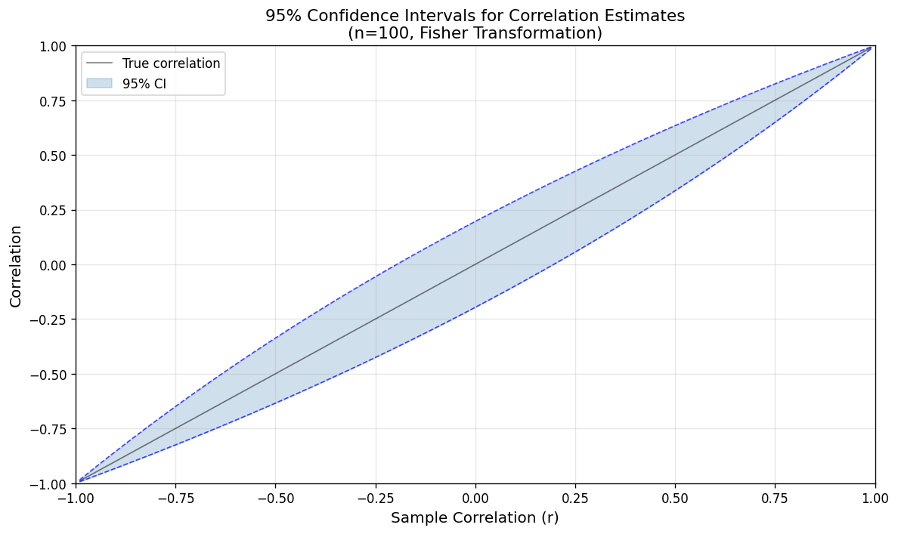
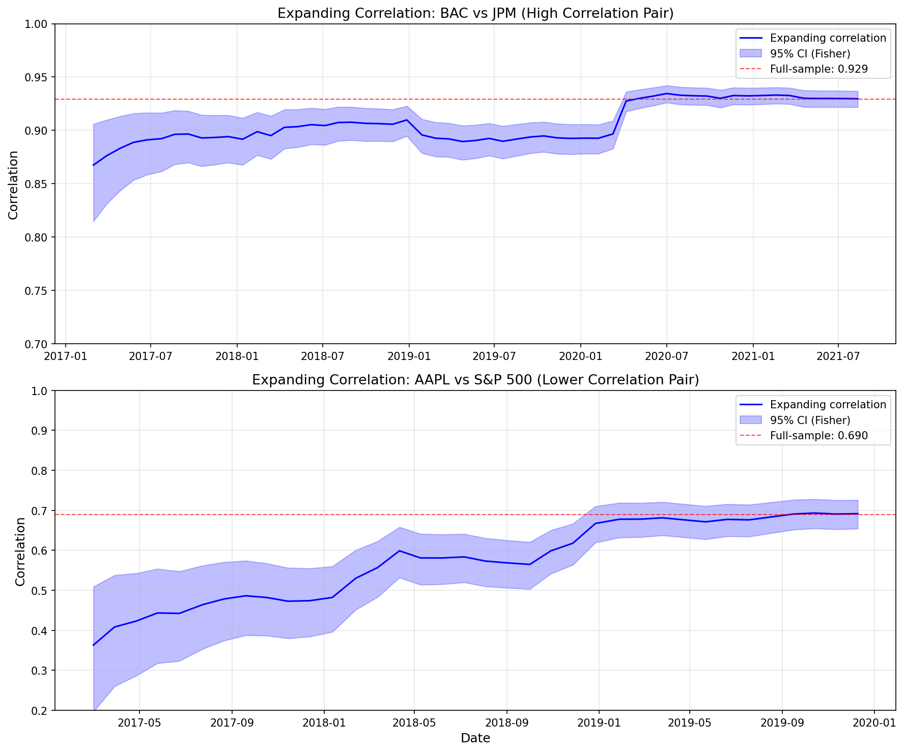
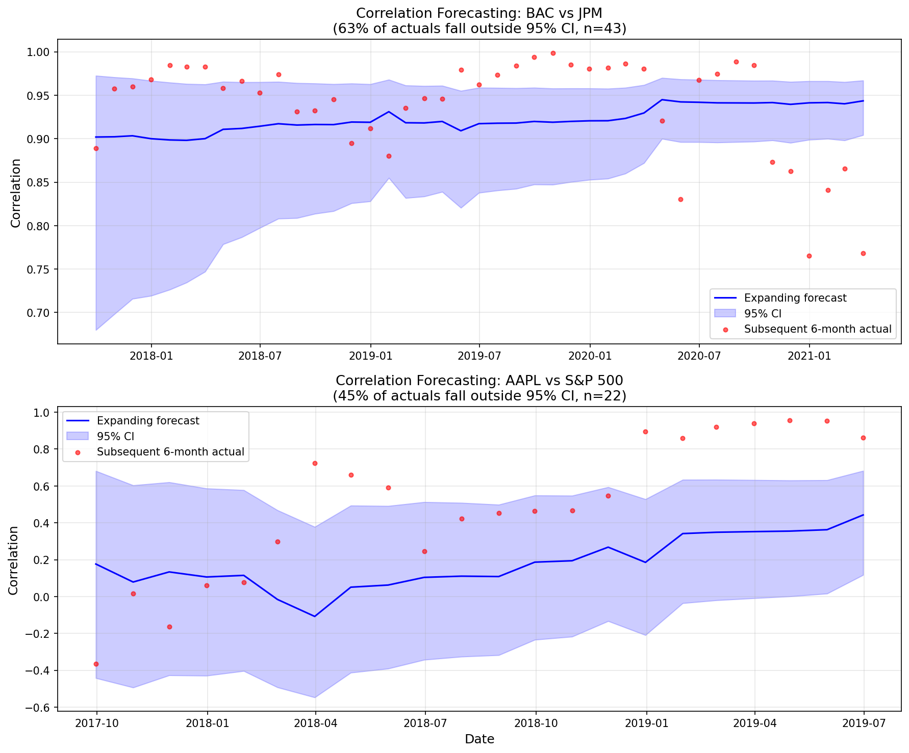

# Predicting Risk & Returns

- [Predicting Risk \& Returns](#predicting-risk--returns)
  - [Predicting Risk: Volatility and Standard Deviation](#predicting-risk-volatility-and-standard-deviation)
    - [Parameter Uncertainty of Standard Deviation Estimates](#parameter-uncertainty-of-standard-deviation-estimates)
    - [Time Scaling and Volatility Estimates](#time-scaling-and-volatility-estimates)
    - [Empirical Estimates of Volatility](#empirical-estimates-of-volatility)
    - [How Well Do Volatility Estimates Predict the Future?](#how-well-do-volatility-estimates-predict-the-future)
    - [Exponential Weighting](#exponential-weighting)
    - [More Complex Volatility Estimation](#more-complex-volatility-estimation)
  - [Predicting Risk Adjusted Returns (Sharpe Ratios)](#predicting-risk-adjusted-returns-sharpe-ratios)
    - [Parameter Uncertainty of Sharpe Ratio Estimates](#parameter-uncertainty-of-sharpe-ratio-estimates)
    - [Empirical Evidence of Sharpe Ratio Estimation](#empirical-evidence-of-sharpe-ratio-estimation)
    - [How Well Do Sharpe Ratio Estimates Predict the Future?](#how-well-do-sharpe-ratio-estimates-predict-the-future)
  - [Predicting the Entire Distribution of Returns](#predicting-the-entire-distribution-of-returns)
  - [Prediction and Uncertainty for Multiple Assets](#prediction-and-uncertainty-for-multiple-assets)
    - [Prediction of Correlations](#prediction-of-correlations)
    - [Parameter Uncertainty of Correlation Estimates](#parameter-uncertainty-of-correlation-estimates)
    - [Parameter Uncertainty of Correlation Estimates: For Different Correlation Levels](#parameter-uncertainty-of-correlation-estimates-for-different-correlation-levels)
    - [Empirical Evidence of Correlation Estimates](#empirical-evidence-of-correlation-estimates)
    - [How Well Do Correlation Estimates Predict the Future?](#how-well-do-correlation-estimates-predict-the-future)

## Predicting Risk: Volatility and Standard Deviation

It's worth asking why predicting volatility would be desired. Predicting the mean return seems much more useful when building a trading strategy, as it will determine whether to buy or sell a particular asset. But volatility is also useful, because:

- As will be seen in later lectures volatility is a key input in deciding the size of positions, which in turn will determine the risk properties of a strategy
- Predicting volatility is necessary when trading certain financial instruments whose price is determined by the level of volatility such as options, and various derivatives based on volatility indices like the VIX.

### Parameter Uncertainty of Standard Deviation Estimates

The formula for determining the parameter uncertainty of a standard deviation estimate is much more complex than for the mean.

The two sided confidence interval given a confidence of $\alpha$ is:

$$\left[\sigma\sqrt{\frac{n-1}{\chi^2(1-0.5\alpha, n-1)}}, \sigma\sqrt{\frac{n-1}{\chi^2(0.5\alpha, n-1)}}\right]$$

Where $n$ is the sample size, $\sigma$ is the standard deviation estimate and $\chi^2$ is the chi-squared distribution. You can also use a spreadsheet to calculate these figures:

- **Lower limit:** `=SD*SQRT((n-1)/CHIINV((alpha/2), n-1))`
- **Upper limit:** `=SD*SQRT((n-1)/CHIINV(1-(alpha/2), n-1))`

Where SD is the cell containing the standard deviation, n is the sample size and alpha is the confidence interval.

To get some intuition about these distributions assume a range with 95% confidence is desired (so $\alpha = 0.025$), and that $n$ is a reasonable size (say 50). If the terms to the right of the standard deviation are calculated then figures of 0.84 and 1.25 are obtained. For larger $n$ a slightly narrower range is obtained. As they are easy to remember an excellent rule of thumb approximation is to use figures of **0.85 and 1.25** for the range.

If these values are applied to the standard deviation of 5% that was used in the original motivating example for the mean parameter, then a range of $0.85 \times 5\%$ to $1.25 \times 5\% = 4.25\%$ to $6.25\%$ is obtained. Remember these will only be exactly right if there are exactly 50 observations. More than that and the confidence interval will be narrower; less and it will be wider.

### Time Scaling and Volatility Estimates

Remember the original motivating example of a trading strategy with a standard deviation of 5% a week. If there were 1040 observations (20 years of 52 weeks) a 95% confidence interval of (4.79%, 5.22%) would be obtained. As ratios to the central estimate of 5% these are (0.959, 1.045).

Assuming time scaling could be used the standard deviation would be $5\% \times \sqrt{16} = 36.06\%$ a year. But in the calculation of the confidence interval what should be used for $n$ (and so for the degrees of freedom)? $n=20$ shouldn't be used, as that would produce a confidence interval of (27.42%, 52.66%) which is far too wide. The correct approach is to use $n=1040$ which will produce estimates around the central estimate of 35.06% but in the same ratios as for the weekly estimate (0.959, 1.045): (34.57%, 37.68%).

**So having more frequent data is always better for standard deviation estimates.** If time scaling isn't advisable then more frequent data means you won't get a biased estimate. If time scaling is possible you won't have a biased central estimate with less frequent data, but you will have a wider confidence interval.

### Empirical Estimates of Volatility

Consider again the daily returns of the US 10 year bond. The standard deviation was 0.42% per day (if time scaling can be used this works out to 6.78% a year). Using the rule of thumb a range is obtained, expressed in annualised volatility, of $0.85 \times 6.78\%$ to $1.25 \times 6.78\% = 5.7\%$ to $8.5\%$

**How do these confidence intervals vary over time?**

Clearly this was a period when volatility in this contract was falling, however it can be seen that relatively little data is required to get very narrow confidence intervals. The intervals are much narrower than the rule of thumb as there is considerably more data.

### How Well Do Volatility Estimates Predict the Future?

The earlier exercise done for mean estimates can be repeated, to see how well realised values of standard deviation fit into the expected distribution.

Disappointingly, the forecasting performance here is very poor. However, this is mainly driven by the effect of falling volatility in this period. The higher volatility early on biases the standard deviation estimate, and the confidence intervals are not wide enough to account for this bias. These confidence intervals are constructed assuming that the volatility is a stationary process, and it clearly is not in this case.

> **Is It Worth Updating Forecasts More Frequently?**
>
> In the short term the volatility of real financial assets shows clustering behaviour – **periods of low volatility tend to persist, and vice versa**. This suggests much better forecasting of volatility can be done if a shorter lookback is used. This would hopefully help with price series that show secular trends like the US 10 year bond future.
>
> **Note:** Incidentally in the long run volatility shows mean reverting behaviour (eventually very low volatility regimes will revert to normal, and the same for high volatility regimes) – this pattern is clear in the figure if you ignore the underlying secular trend. More complex models for modelling volatility such as the GARCH model include this kind of behaviour.

The following experiment can be tried: the last N days of returns are used, the standard deviation is measured, and it is seen how closely that matches the next N days of returns.

**Beginning with annual blocks of returns:**

Contrast this with the previous plot for annual returns. The slope is positive (0.62) and the p-value is just 0.00054; the $R^2$ is 0.31. This is a highly significant result – it's rare to get such high $R^2$ when working with financial data and trying to forecast on an out of sample basis.

**What if monthly blocks of returns are used?**

Again the slope is around 0.62, the p-value is tiny, and the $R^2$ is a highly respectable 0.38. The standard error of the estimation is around 0.027. **It turns out that the forecasts of volatility can be improved by using a shorter period of data to estimate the value of standard deviations.**

However there is a **'sweet spot'** for this. A month is about right; if less data is used the estimate becomes a little less accurate, but using more data also reduces forecasting ability.

### Exponential Weighting

An excellent way to improve volatility forecasting when using a fast updating forecast is by changing the averaging process used.

Assuming the last L observations are being used to calculate the standard deviation $\sigma$, then the estimate for the formula will be (where $r_t$ are returns, and $r^*$ is the average return):

$$\sigma = \sqrt{\frac{1}{L-1}\sum_{t=T-L+1}^{T}(r_t - r^*)^2}$$

The averaging here is a simple average, where all observations have equal weights. This can be rewritten as a more general form:

$$\sigma = \sqrt{\frac{1}{L-1}\sum_{t=T-L+1}^{T}w_t(r_t - r^*)^2}$$

Now instead of giving each value an equal weight different weights are applied, $w_t$ (which add up to 1) to each value. A logical approach is to weight more recent returns more highly than those in the past, for example using exponential weighting. An exponential weighting requires setting a parameter $\lambda$ which determines what fraction of the current estimate is determined by the most recent return.

A nice property of exponential weighting is that estimates can be calculated recursively. If the previous period's variance estimate is $\sigma_{t-1}^2$ then the new estimate will be:

$$\sigma_t^2 = (1-\lambda)\sigma_{t-1}^2 + \lambda(r_t - r_t^*)^2$$

Where $r_t^*$ is the average up to time t, and the initial value can be set as $\sigma_2^2 = (r_2 - r_2^*)^2$, $r_2^* = 0.5(r_1 + r_2)$

If the earlier experiment of trying to forecast the next month's volatility is repeated, but instead an exponential weighting of standard deviation is used to do the prediction (with $\lambda = 0.0555$, a value set to ensure that the 'half-life' of the standard deviation estimator is around half a month, the same as if just one month's data was used) then the $R^2$ of the regression improves from 0.38 (using the last month's return in the usual standard deviation calculation) to 0.44 (using exponential weighting of all history).

### More Complex Volatility Estimation

As has been seen using unconditional volatility with relatively fast forecast updating is an excellent predictor of future volatility. However it is possible to improve this by using a more complex model of time varying volatility, or by using additional information.

More complex models explicitly model the time varying nature of volatility. Broadly these fall into two categories: **models in the GARCH family, and stochastic volatility**.

These models might be worth using if you are trying to predict the price of an instrument whose value is based on volatility, for example a futures contract on the VIX volatility index. However for those developing trading strategies which use volatility purely for position sizing they probably aren't necessary; as they don't seem to add much value over and above using a fast updating unconditional historical estimate.

Much of the value of these more complex models comes from acknowledging that volatility clusters in the near term (hence the success of a simple one month estimate to predict next month), but mean reverts in the long run. **A simple model that averages a long run and short run estimate of standard deviation can thus perform very well.**

The main source of **additional information** is to use the price of derivatives whose price depends on expected future volatility. These include call and put options, variance swaps, and derivatives based on volatility indices like the VIX (which is based on the price of options on the US S&P 500 equity index). Volatility derived from market forecasts like these is called **implied volatility**.

Care needs to be taken as implied volatility is a biased forecast of future volatility. Usually implied volatility will be higher than expected future volatility, reflecting the biased preference of option traders towards hedging their exposure by buying options, pushing up the price of implied volatility.

Using implied volatility significantly improves the forecasting of future volatility, but it involves considerable additional work, and may not be possible in assets where options are unavailable or illiquid.

> **Reference:** Poon, S. and Granger, C. "Forecasting volatility in financial markets: A review" Journal of Economic Literature, 2003
>
> **Is It Worth Pooling Data When Making Forecasts?**
>
> Pooling data makes less sense for volatility than it does for means (or Sharpe Ratios). Normally very good estimates of individual asset volatility are available, and there are often good reasons why different assets have different volatility.

## Predicting Risk Adjusted Returns (Sharpe Ratios)

### Parameter Uncertainty of Sharpe Ratio Estimates

Under certain assumptions (independent Gaussian returns) the variance of the Sharpe Ratio estimate is:

$$\omega_{SR} = \frac{1 + 0.5 \cdot SR^2}{N}$$

Where SR is the Sharpe Ratio $\frac{\mu - r_f}{\sigma}$, and $N$ is the number of samples.

> **Reference:** Lo, A. "The Statistics of Sharpe Ratios" 2002, Financial Analysts Journal

Returning to the earlier example: Over 100 weeks a trading strategy has an average return of 1% a week with a standard deviation of 5% a week. Assuming a risk free rate of zero this is a Sharpe Ratio of $1\% / 5\% = 0.20$. The variance of the estimator $\omega_{SR}$ is $(1 + 0.5 \times 0.2^2) / 100 = 0.0102$, and the standard deviation is $\sqrt{\omega_{SR}}$ which is 0.10.

Hence there is a 95% chance that the Sharpe Ratio estimate lies within the range $0.20 \pm (0.10 \times 1.96)$, i.e. between 0 and 0.40 (with the usual assumption that the normal distribution can be used to determine confidence intervals). This is a very wide confidence interval, similar in magnitude to the interval for the mean. **Most of the uncertainty in Sharpe Ratios comes from the uncertainty of the mean.**

The t-statistic is the Sharpe Ratio divided by the standard deviation of the estimate:

$$\frac{SR}{\sqrt{\omega_{SR}}} = \frac{SR \cdot \sqrt{N}}{\sqrt{1 + 0.5 \cdot SR^2}}$$

For the simple example the t-statistic is $0.20 / 0.10 = 2.00$. Again this is almost identical to, but slightly lower than, the result obtained with the mean estimate.

As was done with means the **'breakeven' horizon** can be calculated: the number of time periods to reach a t-stat of 2 for Sharpe Ratios, where there can be roughly 97% confidence that the Sharpe Ratio was positive:

$$2 = \frac{SR \cdot \sqrt{N}}{\sqrt{1 + 0.5 \cdot SR^2}}$$

$$\sqrt{N} = \frac{2 \cdot \sqrt{1 + 0.5 \cdot SR^2}}{SR}$$

$$N = \frac{4 \cdot (1 + 0.5 \cdot SR^2)}{SR^2}$$

In the simple example for SR of 0.2 this gives a breakeven of 102 weeks. Again this is slightly higher than the breakeven for mean estimates.

### Empirical Evidence of Sharpe Ratio Estimation

Using the US 10 year bond future an annual Sharpe Ratio of 0.706 is obtained (assuming time scaling can be used)

$$\omega_{SR} = (1 + 0.706^2)/35.2 = 0.0423$$

and $\sqrt{\omega_{SR}} = 0.206$

The two sided confidence interval is $(0.706 - 1.96 \times 0.206, 0.706 + 1.96 \times 0.206) = (0.302, 1.109)$

The t-statistic is $0.706 / 0.206 = 3.42$. Notice this is slightly lower than the t statistic for the mean – due to the extra source of uncertainty coming from the standard deviation.

**How do these confidence intervals vary over time?**

(See SR distribution of estimates over time)

### How Well Do Sharpe Ratio Estimates Predict the Future?

Most of the uncertainty in Sharpe Ratios is driven by the mean rather than the standard deviation, especially for the more realistic Sharpe Ratios below 1.0 seen for real financial assets. So it isn't a surprise that predicting Sharpe Ratios based on historic estimates is very difficult. The exercise from earlier can be repeated: measuring the Sharpe Ratio every year and seeing how it fits within the confidence intervals calculated at the beginning of the year.

As with the mean, this is a clear failure.

> **Is It Worth Updating Forecasts More Frequently?**
>
> As with the mean, it is not worth trying to use more recent data to improve forecasts, as it doesn't improve things. A scatter plot of the Sharpe Ratio for each year against the Sharpe Ratio for the previous year is shown.
>
> The regression statistics are unsurprisingly poor: there is a slight negative slope but the $R^2$ is a mere 0.05. The results for monthly Sharpe Ratios are equally depressing.
>
> **Is It Worth Pooling Data When Making Forecasts?**
>
> Pooling makes sense when assets would be expected to have the same Sharpe Ratio, such as with trading strategies run on different instruments. For example the performance of a carry strategy might be pooled across different futures contracts. Trading strategies can be constructed so that they have the same expected volatility (as will be seen in later lectures), so pooling data is relatively straightforward.

## Predicting the Entire Distribution of Returns

Arguably the tests done earlier to see if mean returns fell within a given confidence interval were unfair. Instead the distribution of returns over a given period should be compared with the distribution given by the statistical model based on past data.

**Using a fixed volatility estimate:**

It can be seen that the statistical model does okay – around 5% of the observations would be expected to be outside the red and blue lines, and that is indeed approximately what is seen. The model could also be improved further by using a faster updating estimate of volatility (it is already known that updating the mean estimate wouldn't help with forecasting).

**Using a varying volatility estimate:**

This is doing a very good job of predicting the entire distribution. This means for example that if the returns are normalised by dividing by the recent forecast of standard deviations, returns that are much better behaved will be obtained; essentially closer to the ideal of Gaussian returns with stable parameters. However they still won't be precisely Gaussian, and the vol estimate will generally lag behind when shocks occur.

## Prediction and Uncertainty for Multiple Assets

Previous sections examined statistical models for a single asset. However, few trading strategies involve only one financial instrument — there will normally be multiple assets. In addition, when developing trading strategies it is often necessary to compare multiple possible strategies, or to combine portfolios of different strategies.

### Prediction of Correlations

With multiple underlying assets, or more than one trading strategy, a measure of similarity must be included in the statistical model — the **correlation of returns**. Returns are still modelled using a relatively simple joint Gaussian model that requires only three types of parameters: the mean $\mu$, standard deviation $\sigma$, and correlation $\rho$.

### Parameter Uncertainty of Correlation Estimates

The formula for the confidence interval of a correlation estimate is relatively complex. Given a correlation $r$ and a sample size $n$, for some confidence level $\alpha$, the **Fisher transformation** is first calculated:

$$z_r = \frac{1}{2} \ln\left(\frac{1+r}{1-r}\right)$$

$z$ then has upper and lower confidence intervals:

$$z_L = z_r - z_{1-\alpha/2}\sqrt{\frac{1}{n-3}}, \quad z_U = z_r + z_{1-\alpha/2}\sqrt{\frac{1}{n-3}}$$

Where $z_k$ is the $k$-th percentage point of the standard normal distribution. These are then transformed back into the correlation space:

$$r_L = \frac{e^{2z_L} - 1}{e^{2z_L} + 1}, \quad r_U = \frac{e^{2z_U} - 1}{e^{2z_U} + 1}$$

**Example:** Suppose a correlation of 0.5, a sample size of 100, and the 95% confidence range ($\alpha = 0.05$):

- $z_r = 0.5493$
- $\sqrt{1/(n-3)} = 0.1015$
- $z_{1-\alpha/2} = 2.2414$
- $z_L = 0.3503, \quad z_U = 0.7483$
- $r_L = 0.334, \quad r_U = 0.634$

### Parameter Uncertainty of Correlation Estimates: For Different Correlation Levels

Although the formulas above would not be expected in an exam, it is worth understanding the intuition about how accurate different correlation parameter estimates are. The table below shows the 95% confidence interval assuming a sample of 100 values:

|  $r$  | $r_L$  | $r_U$  |
| :---: | :----: | :----: |
| -0.95 | -0.966 | -0.926 |
| -0.50 | -0.634 | -0.337 |
| 0.00  | -0.196 | 0.196  |
| 0.25  | 0.056  | 0.426  |
| 0.50  | 0.337  | 0.634  |
| 0.75  | 0.649  | 0.825  |
| 0.80  | 0.716  | 0.861  |
| 0.90  | 0.855  | 0.932  |
| 0.95  | 0.926  | 0.966  |
| 0.99  | 0.985  | 0.993  |

**Key observations:**

- The ranges are symmetric for positive and negative values of correlation (which is why not every negative value is included).
- Small absolute correlations have a wider estimation range than large absolute correlations (a range of approximately 0.39 for zero correlation compared to 0.008 for a correlation of 0.99).
- Large absolute correlations have a skewed range; this is because there is an absolute limit on correlations, so the parameter distribution "piles up" against this limit at extreme values.

### Empirical Evidence of Correlation Estimates

To examine correlation estimation empirically, two asset pairs with contrasting correlation profiles are used: Bank of America (BAC) and JPMorgan (JPM) as a high-correlation pair (both large US banks), and Apple (AAPL) against the S&P 500 as a lower-correlation pair. The two banks should exhibit very high correlation, whereas AAPL and the broad market index should have a moderate correlation. Given the results above, much tighter confidence intervals for BAC/JPM than for AAPL/S&P 500 should be expected.

The full-sample correlation between BAC and JPM is 0.929, with a 95% confidence interval of (0.921, 0.937). As the figure shows, relatively little data is needed to obtain fairly accurate estimates for highly correlated assets. There is also clearly some variation in correlation over the period shown, as was observed for volatility estimation previously.

The correlation between AAPL and the S&P 500 is lower at 0.690, with a 95% confidence interval of (0.653, 0.724). The wider confidence band and slower convergence are consistent with the theoretical expectation that moderate correlations are harder to estimate precisely.

### How Well Do Correlation Estimates Predict the Future?

The exercise from previous sections can be repeated: measuring the correlation of past data, calculating a 95% confidence interval, and then adding the subsequent 6-month realised correlation.

For BAC vs JPM, 63% of the subsequent 6-month actual correlations fall outside the 95% confidence interval — far more than the expected 5%. The expanding estimate consistently underestimates the true correlation, suggesting non-stationarity in the relationship.

For AAPL vs S&P 500, 45% of actuals fall outside the 95% confidence interval. While less extreme than the BAC/JPM case, this still far exceeds the theoretical 5% rate, confirming that the expanding estimate based on all previous data is a poor predictor of near-term correlation.

> **Is It Worth Updating Forecasts More Frequently?**
>
> From the graphs above, correlations do seem to vary over time, which is part of the reason for the poor forecasting performance of an estimate based on all past data.

**US 5 year and US 10 year bonds — Annual forecasting:**

Instead of using all past data, the correlation based on the previous year can be used and compared to the correlation in the subsequent year. There is a positive slope, but the $R^2$ is just 0.03 — a very weak relationship.

**US 5 year and US 10 year bonds — Monthly forecasting:**

Reducing the forecasting period to one month improves performance, with an $R^2$ of 0.16. This is not as good as the figures observed for forecasting volatility, but is still much better than for predicting means or Sharpe Ratios. It is also worth bearing in mind that the size of the forecasting error is relatively small: the standard error of the estimation is around 0.06.

**S&P 500 and US 10 year bonds — Monthly forecasting:**

The $R^2$ here is 0.25 — better than for the very high correlation example. However the standard deviation is similar at around 0.06.

> **Is It Worth Pooling Data When Making Forecasts?**
>
> Pooling data can sometimes make sense for correlations. For example, if calculating the correlation between a carry strategy and a momentum strategy for different futures contracts, there is probably no reason why the correlation between these two strategies should vary for different futures contracts, so pooling would be appropriate. This could be done by calculating the correlation between carry and momentum for the Eurodollar future, and for other futures like the S&P 500, and then pooling the estimates.
