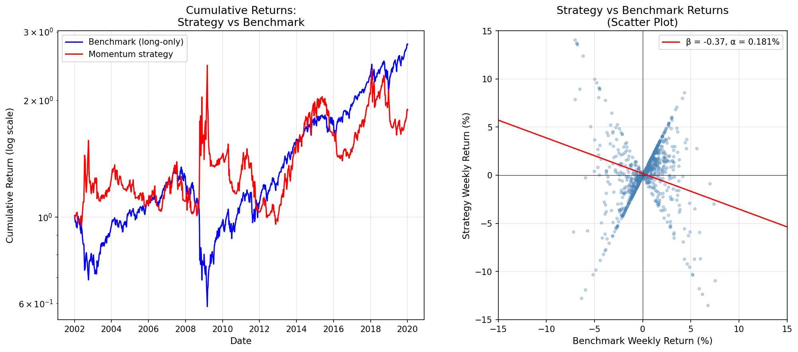

# The Statistics of Relative Performance

- [The Statistics of Relative Performance](#the-statistics-of-relative-performance)
  - [Comparing Paired Returns](#comparing-paired-returns)
  - [Variance of the Difference in Means](#variance-of-the-difference-in-means)
  - [Empirical Example: Comparing Trading Strategies](#empirical-example-comparing-trading-strategies)
  - [Assets with Different Volatility](#assets-with-different-volatility)
  - [Benchmarking and Regression](#benchmarking-and-regression)
    - [Empirical Example: S\&P 500 Momentum Strategy](#empirical-example-sp-500-momentum-strategy)
  - [Backtesting, Paper Trading, and Live Trading](#backtesting-paper-trading-and-live-trading)

How significant is the difference in past performance between two assets? This is an important question for several reasons:

1. A simple strategy might use past performance to decide how to build a portfolio of different assets. Without knowing whether past performance data is meaningful, allocation decisions are unreliable.
2. There is usually a choice between different trading strategies, either in the development phase when fitting strategies to data, or when allocating capital to different strategies.

It is possible to determine whether the mean, or risk-adjusted mean, of a particular strategy or asset is positive. But how can it be determined whether the mean is _significantly higher_ for one asset than for another?

## Comparing Paired Returns

First, it must be considered whether data points from two assets can be directly compared. Data points can only be compared if the returns occurred in the same time period.

**If the data points cannot be compared** (independent samples), then two independently generated sample mean distributions are being compared. For example, suppose two assets both have 20 years of annual returns and volatility of 20%. The first has an annualised mean return of 10%, the other 20%. The standard deviation of the mean estimator is the same for both: 4.47%. The 95% confidence ranges are (1.1%, 18.9%) and (11.1%, 28.9%) respectively. This is a substantial overlap, and no certainty about which asset is truly better can be established.

**If the data points can be compared** (paired returns over the same period), a distribution of the _difference_ in returns can be constructed. If the two assets are independent (zero correlation), then the variance of the sample mean of the difference equals the sum of the variance of each individual asset. For the two assets mentioned above, the mean of the difference is trivially 10% (20% − 10%), whilst the standard deviation of the estimator will be $\sqrt{2}$ larger than for each individual asset, i.e. 6.3%. The two-standard-deviation range for the difference is then (−2.7%, 22.7%).

This is a massive range, but things improve considerably if the assets have some positive correlation, since the variance of the estimator for the difference in means will be lower.

## Variance of the Difference in Means

$$\omega_{\Delta} = \omega_x + \omega_y - 2\rho\sqrt{\omega_x}\sqrt{\omega_y}$$

Where $\omega_x, \omega_y$ are the variances of the individual mean parameter estimates, and $\rho$ is the correlation between the two return series.

**Key properties:**

- For $\rho = 0$: this collapses to the sum of the variances
- For $\rho = 1$: the variance is trivially zero
- For $\rho = -1$: the standard deviation is exactly twice that of an individual mean estimator

| Correlation | Standard Deviation of Mean Difference |
| :---------: | :-----------------------------------: |
|     1.0     |                 0.0%                  |
|     0.9     |                 2.0%                  |
|     0.7     |                 3.5%                  |
|     0.5     |                 4.5%                  |
|     0.0     |                 6.4%                  |
|    −0.5     |                 7.7%                  |
|    −1.0     |                 8.9%                  |

The confidence interval for the difference can be constructed as:

$$(\mu_x - \mu_y) \pm 1.96\sqrt{\omega_x + \omega_y - 2\rho\sqrt{\omega_x}\sqrt{\omega_y}}$$

The t-statistic for the difference is:

$$T = \frac{\mu_x - \mu_y}{\sqrt{\omega_x + \omega_y - 2\rho\sqrt{\omega_x}\sqrt{\omega_y}}}$$

## Empirical Example: Comparing Trading Strategies

Consider three trading strategies generated on the US 10 year bond future: a carry strategy, a relatively fast momentum strategy, and a relatively slow momentum strategy.

> _The fast strategy is an exponentially weighted moving average crossover with lookbacks of 8 and 32 days. The slow strategy has lookbacks of 16 and 64 days. Further explanation can be found in Chapter 7 of "Systematic Trading"._

**Correlations between strategies:**

|                   | Carry | Fast Mom. | Slow Mom. |
| :---------------- | :---: | :-------: | :-------: |
| **Carry**         | 1.00  |   0.23    |   0.34    |
| **Fast Momentum** | 0.23  |   1.00    |   0.88    |
| **Slow Momentum** | 0.34  |   0.88    |   1.00    |

Carry is relatively uncorrelated with the other two strategies, but the two momentum strategies are highly correlated.

By design these strategies have the same expected standard deviation of returns. In reality, the actual annualised standard deviations differ slightly: 22.3% for carry, 18.0% for fast momentum, and 18.4% for slow momentum.

The performance is quite different: 13.9% for carry, 5.74% for fast momentum, and 5.32% for slow momentum. With 8,995 daily returns (~35.1 years), the standard deviations of the mean estimates $\sqrt{\omega} = \sigma / \sqrt{N}$ are 3.77%, 3.04%, and 3.10% respectively.

**Comparing carry and fast momentum** (low correlation, $\rho = 0.23$):

$$\omega_{\Delta} = 3.77^2 + 3.04^2 - 2 \times 0.23 \times 3.77 \times 3.04 = 18.18\%$$

$$\sqrt{\omega_{\Delta}} = 4.26\%$$

The difference in returns is 4.3%. The 95% confidence interval is $4.3\% \pm 1.96 \times 4.26\% = (-4.1\%, 12.7\%)$.

The t-statistic is $4.3\% / 4.26\% = 1.01$, giving a p-value of around 16% — clearly not significant. A difference in returns of nearly 9% ($2 \times 4.26\% = 8.52\%$) would be needed to achieve a t-statistic of 2 and confirm carry's superiority with confidence.

**Comparing fast and slow momentum** (high correlation, $\rho = 0.88$):

$$\omega_{\Delta} = 3.04^2 + 3.10^2 - 2 \times 0.88 \times 3.04 \times 3.10 = 2.27\%$$

$$\sqrt{\omega_{\Delta}} = 1.51\%$$

The difference in returns is 0.4%. The 95% confidence interval is $0.4\% \pm 1.96 \times 1.51\% = (-2.6\%, 3.4\%)$.

The t-statistic is $0.4\% / 1.51\% = 0.27$, for a p-value of 40% — far from significant. In this context, a performance difference of just 3.02% would have sufficed for a t-statistic of 2. However, it is extremely rare to find trading strategies with return differences of this magnitude that are also similar enough to have a correlation of nearly 0.9.

In both cases, the strategies cannot be statistically distinguished.

## Assets with Different Volatility

If the assets have different volatility, a correction must be applied. An asset with higher volatility would be expected to return more than a less risky asset, so risk differences should be corrected for before making comparisons.

A reasonable approximation (when volatilities are not too different) is to scale returns so that they have the same standard deviation. All returns for the second asset $r_{y,t}$ are replaced with $\lambda r_{y,t}$ where:

$$\lambda = \frac{\sigma_x}{\sigma_y}$$

The formula for the difference in means becomes:

$$\mu_x - \lambda\mu_y$$

The formula for the variance of the difference in means changes to:

$$\omega_x + \omega_x - 2\rho\sqrt{\omega_x}\sqrt{\omega_x} = 2\omega_x(1-\rho)$$

The t-test for the difference becomes:

$$T = \frac{\mu_x - \lambda\mu_y}{\sqrt{2\omega_x(1-\rho)}}$$

This approach is equivalent to assuming that the returns of the less risky strategy can be leveraged without paying any interest. In reality this is not possible, which is why the **Sharpe Ratio** is used to compare strategies with different levels of risk.

If the difference in volatility is large, Sharpe Ratios should be compared rather than means. This is complex and is not covered in this course.

> **Reference:** Opdyke, J.D. "Comparing Sharpe Ratios: So Where are the p-values?" _Journal of Asset Management_, 2007

## Benchmarking and Regression

Another method for comparing returns is regression. An appropriate benchmark is needed, against which the returns of the strategy are regressed. Examples of benchmarks include:

- The market (in which case the regression is equivalent to the CAPM)
- An existing trading strategy being considered for replacement
- The returns of a competing trader or fund
- An industry average performance for funds running similar strategies

Given strategy returns $y$ and benchmark returns $x$, the following regression is performed:

$$y_t = \alpha + \beta x_t + \epsilon_t$$

The focus is on the intercept $\alpha$, since a significant and positive $\alpha$ indicates outperformance. The covariance term $\beta$ deals with the correlation and any differences in variance between the two assets. Thus the benchmarking method is suitable for assets with different risk levels.

**Considerations:**

- A benchmark with a positive $\beta$ should be chosen. A market-neutral strategy should have a zero $\beta$ with a long-only benchmark — an industry benchmark would be more informative.
- The usual assumptions of linear regression should be satisfied. The scatter plot of $y$ against $x$ should show the characteristic elliptical shape. Unusual strategies will have non-linear relationships to long-only benchmarks; for example, a long-short strategy will resemble a "scissors" pattern with two overlapping ellipses.

### Empirical Example: S&P 500 Momentum Strategy

Consider the returns from an EWMAC momentum strategy on the S&P 500 (using fast and slow exponentially weighted moving averages) against a benchmark long-only "buy and hold" strategy. The momentum strategy allows risk to vary with forecast strength and can go both long and short, with signals clipped to $(-2, 2)$.

Key observations:

- The cumulative return chart (left) shows divergent performance: the benchmark accumulates steadily over the long run, while the momentum strategy's performance depends heavily on the market regime
- The risk of the trading strategy varies; there are periods of flat performance with very low risk (when forecasts are weak)
- The scatter plot (right) shows the relationship between weekly strategy and benchmark returns, with a negative $\beta$ indicating the strategy tends to be short the market on average over this period

The characteristic wide scatter of a long/short strategy against a long-only benchmark is visible. The spread of points reflects the variable position sizing inherent in the signal-driven approach.

**Regression output:**

| Statistic             | Value   |
| :-------------------- | :------ |
| $R^2$                 | 0.746   |
| Intercept ($\alpha$)  | 0.0175  |
| Intercept t-statistic | 1.438   |
| Intercept p-value     | 0.150   |
| $\beta$ (Long only)   | 1.4661  |
| $\beta$ t-statistic   | 128.405 |

The high $R^2$ indicates that a reasonable benchmark was chosen. The positive and highly significant $\beta$ coefficient confirms this. The $\alpha$ intercept is positive, indicating outperformance, but with a relatively low t-statistic there is a 15% chance the outperformance is merely luck.

## Backtesting, Paper Trading, and Live Trading

Information about trading strategy performance comes from different sources:

**Backtesting:**

- Hypothetical performance based on historical data
- Backtested performance should reasonably be assumed to be **overstated**, as it is extremely difficult to backtest without using information that would not have been available in real time

**Paper Trading:**

- Positions and trades are calculated normally, but no actual trades are executed — no money is at risk
- The simulation environment determines what prices orders would have been executed at
- Returns from paper trading should be more trustworthy than those from backtesting
- Paper trading is also an excellent way to test software and infrastructure for automated trading

**Live Trading:**

- The only accurate way to determine actual cost levels
- It is impossible to know exactly what execution prices would have been achieved in paper trading, nor the precise market impact of trades
- The distribution of costs is discussed in the section on trading costs
