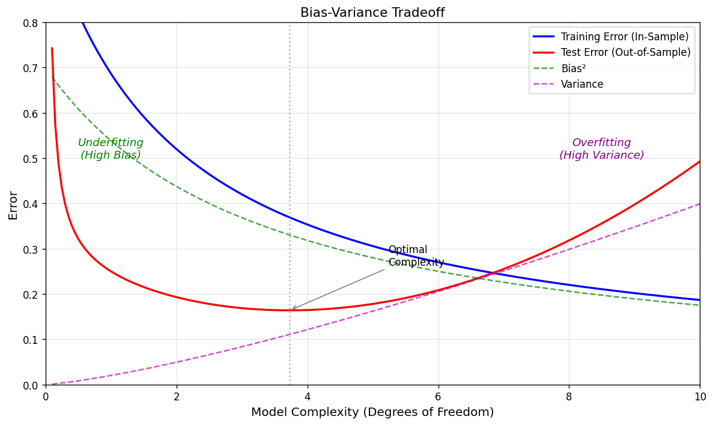
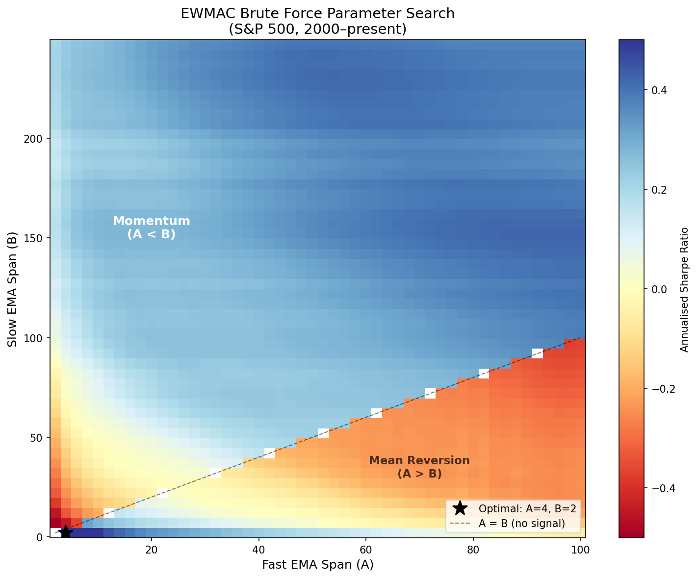
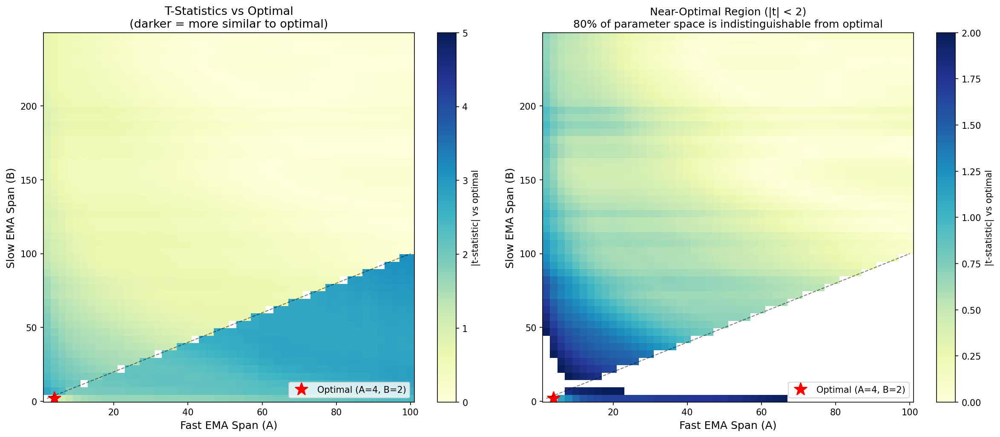

# Fitting & Optimisation

- [Fitting \& Optimisation](#fitting--optimisation)
  - [How Are Trading Strategies Created?](#how-are-trading-strategies-created)
  - [Where Do Algorithms Come From?](#where-do-algorithms-come-from)
  - [A Real Example: EWMAC Momentum Rule](#a-real-example-ewmac-momentum-rule)
  - [How Many Degrees of Freedom?](#how-many-degrees-of-freedom)
  - [In-Sample and Out-of-Sample Methods](#in-sample-and-out-of-sample-methods)
  - [Optimisation Techniques](#optimisation-techniques)
    - [Brute Force / Grid Search](#brute-force--grid-search)
    - [Speeding Up Brute Force](#speeding-up-brute-force)
    - [Regression](#regression)
    - [Portfolio Optimisation Approach](#portfolio-optimisation-approach)
  - [Fitting and Uncertainty](#fitting-and-uncertainty)
  - [Should More Than One Parameter Set Be Chosen?](#should-more-than-one-parameter-set-be-chosen)
  - [Is It Worth Pooling?](#is-it-worth-pooling)

## How Are Trading Strategies Created?

In abstract terms, a trading strategy consists of:

- An **algorithm**
- A set of **parameters**

**Simple example:** Suppose a strategy buys assets which have recently fallen in price, and sells those which have risen. To decide whether to buy or sell, the return over the last $N$ business days is examined. The strategy therefore consists of:

- **Algorithm:** Buy if return over last $N$ days is negative; sell if it is positive
- **Single parameter:** $N$

(The question of _how much_ to buy or sell is addressed in the position sizing section.)

The process of **fitting** is discovering what those parameters should be. Fitting is done within a given **parameter space** (a range of possible values; e.g. $N \in \{1, 2, \ldots, 256\}$). The combination of the number of parameters and the parameter space defines the **degrees of freedom** of the fitting process.

Fitting is normally done using historic data to determine optimal values. This is performed on **in-sample** (training) data, and the performance of the rule is then evaluated on **out-of-sample** (test/evaluation) data.

## Where Do Algorithms Come From?

It is difficult to envisage a situation in which an algorithm comes entirely from data, since any specific algorithm is technically an instance of a more general class. For example, if it is not known whether one should buy or sell after a price fall, the algorithm can be generalised by adding a parameter:

- **Algorithm:** Trade $X$ units if return over last $N$ days is negative; trade $-X$ units if positive
- **Parameters:** $N$ and $X$, where $X \in (-1, +1)$

In practice, systems tend to fall on a continuum:

| Approach        | Characteristics                                                                                                    |
| :-------------- | :----------------------------------------------------------------------------------------------------------------- |
| **Data First**  | Very generic algorithms with many possible parameters and large parameter spaces                                   |
| **Ideas First** | Very specific algorithms with few parameters (or none at all); requires more a priori thought about the model form |

The "Ideas First" approach restricts the search to algorithms and parameter ranges that are already believed to work, based on tacit knowledge (e.g. from academic research). This is called **tacit fitting**.

Other forms of fitting:

- **Explicit fitting:** A specific algorithm is used to find the best set of parameters
- **Implicit fitting:** A manual process of repeatedly changing and refining the model after examining performance. This is more dangerous as it occurs in an uncontrolled way. Many strategy developers practise implicit fitting without acknowledging it

## A Real Example: EWMAC Momentum Rule

The momentum rule consists of the following algorithm:

1. Calculate an exponentially weighted moving average (EWMA) of the price using a lookback parameter $A$
2. Calculate another EWMA of the price using a lookback parameter $B$
3. If $\text{EWMA}_A > \text{EWMA}_B$, then buy; otherwise sell

This rule has two parameters, $A$ and $B$. For it to be a momentum rule, $A < B$ (but not imposing this restriction is arguably a form of tacit fitting). It is more convenient to refer to $A$ as the **fast** parameter and $B$ as the **slow** parameter.

## How Many Degrees of Freedom?

Naïvely, it makes sense to have more degrees of freedom, since there is a higher chance of finding the most profitable rule. In practice, however, too many degrees of freedom lead to rules that perform badly out of sample.

> **Source:** Hastie, T. et al. (2009) _The Elements of Statistical Learning_, Springer, Figure 2.11

**Key observations from the bias-variance tradeoff:**

- **Training sample performance** (in-sample) always improves with model complexity. Eventually, with as many degrees of freedom as data points, prediction error reaches zero — an impossibly perfect fit.
- **Test sample performance** (out-of-sample) is always worse than training performance. The gap widens as the model becomes more complex and finely tuned to the training data.
- At some point, test performance begins to **degrade** as complexity increases. This is **overfitting** (or curve fitting).

Determining the exact point of overfitting is difficult. With more data, a more complex model can be fitted, but in practice most practitioners overestimate the appropriate number of degrees of freedom.

**Methods to reduce effective degrees of freedom** (beyond reducing parameters or their ranges):

- Introduce **structure** into the model: linear or non-linear restrictions on parameter values
- For the EWMAC model: impose $A < B$ (only momentum allowed)
- Use **economic theory** to impose structure. For example, a carry rule based on nominal interest rates $i$ and inflation $p$ could have unrestricted form $ai + bp$, but imposing the structure that only real interest rates matter gives $a(i - p)$

## In-Sample and Out-of-Sample Methods

It is critical to separate the in-sample fitting period from the out-of-sample evaluation period. Failing to do so produces unrealistic performance expectations and risks overfitting.

**Methods for separating in-sample and out-of-sample:**

| Method                            | Description                                                                                 | Advantages                                    | Disadvantages                                                                  |
| :-------------------------------- | :------------------------------------------------------------------------------------------ | :-------------------------------------------- | :----------------------------------------------------------------------------- |
| **Half and Half**                 | Fit on first half of data, evaluate on second half (e.g. fit 1978–1997, evaluate 1998–2017) | Simple and clean separation                   | Wastes data; model may not suit changed conditions                             |
| **Expanding Out-of-Sample**       | Fit using all available past data for each evaluation point                                 | Uses all available history                    | Does not adjust to changing market conditions                                  |
| **Rolling Out-of-Sample**         | Fit using a fixed rolling window of past data                                               | Adjusts to changing conditions                | Rolling period must be long enough for statistical significance                |
| **Cross Validation**              | Fit on one portion, evaluate on another, then reverse                                       | Uses all data for both fitting and evaluation | Assumes future information was available; ignores non-stationarity             |
| **Leave-One-Out (Knock One Out)** | Fit on entire dataset excluding the evaluation period                                       | Uses $N-1$ periods for fitting                | Uses future information; facilitates overfitting                               |
| **Across Instruments**            | Fit on one instrument, test on another (e.g. fit on US 10Y, test on US 5Y)                  | Tests generalisability                        | Uses future information; closely related instruments increase overfitting risk |

## Optimisation Techniques

### Brute Force / Grid Search

The simplest technique involves evaluating all possible parameter values (or a discrete grid with sufficiently fine granularity) and finding the set with the best performance.

**Real example — EWMAC on the S&P 500:**

On the x-axis is the value of parameter $A$ (fast EMA span), and on the y-axis the value of $B$ (slow EMA span). The region below the diagonal corresponds to $A < B$ (momentum). Blue/positive regions show the highest-performing strategies; red/negative regions show the worst.

**Conclusions from the brute force results:**

- Momentum works: the bottom-left quadrant ($A < B$) is mostly yellow (positive performance); the top-right ($A > B$) is mostly blue
- A large area of bright yellow exists (roughly $A \in [4, 20]$, $B \in [10, 100]$)
- The brute force optimal is $A = 15, B = 20$

Optimal values for other instruments show wild disagreement:

| Instrument      | Optimal $A$ | Optimal $B$ |
| :-------------- | :---------: | :---------: |
| Eurodollar      |     15      |     20      |
| US 10 Year Bond |     15      |     20      |
| Corn            |      2      |      1      |
| MXP/USD FX      |     200     |     250     |

### Speeding Up Brute Force

Brute force is computationally expensive. With 5 parameters and 100 possible values each, there are $100^5 = 10^{10}$ combinations. Methods to speed this up include:

- **Coarse to fine search:** Divide the space into a coarse grid, evaluate centre points, select the best section, subdivide, and repeat. Risk: may find a local rather than global maximum.
- **Hill climbing:** Start at a point, evaluate the neighbourhood, move to the best-improving point, and repeat until no improvement is possible. Risk: may find a local maximum.
- **Multi-point hill climbing:** Start from multiple dispersed points, run hill climbing from each, and select the highest result. Risk: still no guarantee of finding the global maximum.

### Regression

It is sometimes possible to specify the optimisation as a linear model:

$$r_{t+1} = a + bf_{t,1} + cf_{t,2}$$

Where $r_{t+1}$ is the return between period $t$ and $t+1$; $a, b, c$ are coefficients to be discovered; and $f_1, f_2$ are factors thought to forecast future returns.

**Problems:** Non-normality, outliers, and most seriously **multicollinearity** (since most factors tend to be highly correlated), which produces extreme weights. Remedies include imposing constraints (e.g. only positive coefficients) or using methods like **ridge regression**.

### Portfolio Optimisation Approach

An alternative to fitting a single trading rule is to combine a set of rules, each with different parameter combinations, and allocate capital between them.

**Advantages:**

- Systems with multiple rules are much more robust and perform better out of sample
- The parameter space is smaller (degrees of freedom = $N - 1$, where $N$ is the number of rules)
- The objective function is relatively benign and can be solved using quadratic programming
- Well-known techniques exist for handling parameter uncertainty
- Implicit fitting is more difficult — poorly performing rules are only excluded once statistical evidence warrants it

**Disadvantages:**

- The initial selection of trading rules still needs to be determined
- Portfolio optimisation is a complex topic (discussed in later sections)

## Fitting and Uncertainty

The discussion above ignores a key finding from earlier sections: it is often difficult to distinguish between the past performance of different assets. This is equally true when the "assets" are trading strategies with slightly different parameter sets.

For closely related parameter sets, correlations between returns are likely to be high, which reduces the variance of the difference between means. But very similar performance from closely related parameters is also likely.

**Real example — t-tests against the optimal:**

If the performance of the optimal combination is compared against all other possibilities via t-test:

- A low t-statistic (darker region) means the given combination cannot be distinguished from the optimal
- A large portion of the momentum quadrant ($A < B$) cannot be statistically distinguished from the optimal

The right panel shows the **near-optimal region** (where $|t| < 2$) — approximately 80% of the parameter space is indistinguishable from optimal. The optimal parameter set sits near the edge of this region, not at its centre.

**The ideal approach** is to select a parameter set which may not be optimal, but which lies at the **centre of a large region of near-optimal parameters**. A formal method:

1. Find the largest area of congruent parameter combinations that cannot be distinguished from the optimum
2. Select the set of parameters at the centre of this area

> Mathematical methods for this exist (e.g. machine learning clustering algorithms for step 1, centroid calculation for step 2) but are out of scope for this course.

## Should More Than One Parameter Set Be Chosen?

A simpler solution is to run multiple variations of a single trading rule, each with a different parameter set. Since the optimal future parameters are unknown (given uncertainty about the past), this hedges against poor parameter selection. On an out-of-sample basis, a combination of trading rules with different parameters will normally **outperform** a single parameter set.

**Selection criteria:**

- Cover the "near-optimal" space
- Avoid choosing closely spaced parameter sets (highly correlated returns — e.g. correlation > 0.99 for $A = 9, B = 70$ vs $A = 8, B = 70$)
- A group of around half a dozen parameter sets typically suffices to cover the main near-optimal region

## Is It Worth Pooling?

Data can be pooled from multiple instruments to reduce uncertainty. For example, rather than fitting a separate model for each of Eurodollar futures, 10 year bonds, S&P 500, etc., the data can be pooled and a single model fitted for all instruments.

**The key question** is whether optimal parameters differ sufficiently across instruments to justify separate fitting. Common sense suggests closely related instruments (e.g. Eurodollars and US 10 year bonds) are more likely to have similar optima.

**Formal procedure:**

1. **Find a joint optimum** by either:
   - Finding the largest region that is near-optimal for _all_ instruments and choosing its centre
   - Pooling all data and calculating the joint optimum from the pooled dataset
2. **Test** for every instrument that no parameter set has a return significantly better than the joint optimum

**Using pooled data:**

The optimal parameter set on pooled Eurodollar and Corn data is $A = 8, B = 250$. When a t-test of this optimal against all other possibilities is run, the near-optimal area is smaller than for individual instruments — with more data, more statistical significance is achieved on t-tests, allowing more parameter sets to be rejected as inferior.

After selecting a joint optimum (e.g. $A = 7, B = 70$, chosen as the centre of the largest near-optimal area), t-tests against other parameter values for all instruments show no parameter set that is significantly better. The hypothesis that the joint optimum's returns are lower than any other parameter set cannot be rejected.

> In the case of these instruments, pooling appears appropriate.
