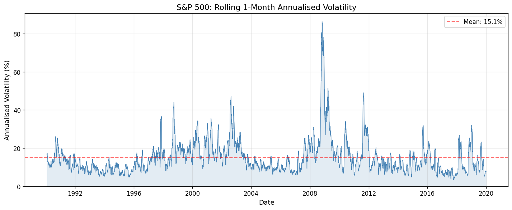
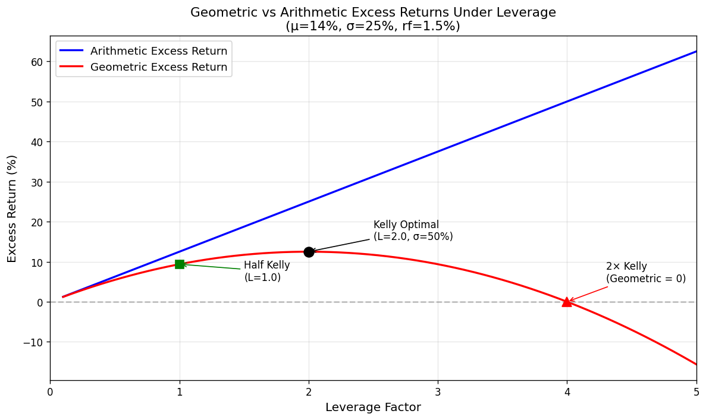

# Position Sizing, Leverage & Risk Targeting

- [Position Sizing, Leverage \& Risk Targeting](#position-sizing-leverage--risk-targeting)
  - [Volatility-Based Position Sizing](#volatility-based-position-sizing)
  - [Measuring Instrument Volatility](#measuring-instrument-volatility)
  - [Risk Targeting](#risk-targeting)
    - [Geometric Means](#geometric-means)
    - [Geometric Means and Leverage](#geometric-means-and-leverage)
    - [The Kelly Criterion](#the-kelly-criterion)
    - [Continuous Kelly Criterion](#continuous-kelly-criterion)
    - [Determining the Risk Target with Continuous Kelly](#determining-the-risk-target-with-continuous-kelly)
    - [Uncertainty and the Correct Risk Target](#uncertainty-and-the-correct-risk-target)
  - [Using Conviction in Position Sizing](#using-conviction-in-position-sizing)
  - [Margin and Leverage Constraints](#margin-and-leverage-constraints)

## Volatility-Based Position Sizing

There are four factors that determine position size:

1. **The riskiness of the instrument** being traded
2. **The level of risk** to be targeted
3. **The conviction** in the forecast
4. **Constraints** relating to margin or leverage

**Example:** Suppose the appropriate risk measure is annualised standard deviation of returns. A long position in VIX futures is desired. The standard deviation of VIX is approximately 31% per year, and the value of one VIX contract is around \$10,000. The expected standard deviation of returns from holding one VIX contract is $31\% \times \$10{,}000 = \$3{,}100$ per year.

With \$200,000 in capital and a risk target of \$100,000 per year:

$$\text{Number of contracts} = \frac{\$100{,}000}{\$3{,}100} = 32.3 \approx 32 \text{ contracts}$$

These would have a notional value of $32 \times \$10{,}000 = \$320{,}000$.

However, this ignores the conviction in the forecast (discussed below) and constraints on margin. The margin per VIX contract is \$5,650, so 32 contracts would require \$180,800 in margin — nearly all available capital. The leverage is $\$320{,}000 / \$200{,}000 = 160\%$.

## Measuring Instrument Volatility

From earlier sections, forecasting return volatility is relatively straightforward: using return volatility measured over the last month provides an excellent forecast of future near-term volatility (predictive regression $R^2 \approx 0.6$). This can be further improved by:

- Using **exponential weighting** of recent returns when calculating standard deviation
- Using a more complex model such as **GARCH** or **stochastic volatility**
- Deriving volatility forecasts from **implied volatility** (e.g. from option prices or VIX derivatives)

**Caveat on low-volatility regimes:** Because position size is inversely related to standard deviation, very low volatility leads to larger positions. This is potentially dangerous — LTCM assumed a period of low volatility would continue and took on substantial leverage as a result.

In the short term, low volatility follows low volatility, and vice versa. But in the medium term, volatility tends to **mean-revert**: low volatility in late 2019 was followed by extreme risk in March 2020.

A more complex model such as GARCH would help, as it forecasts that volatility will rise when it is relatively low.

## Risk Targeting

The risk target (measured as an annualised standard deviation of returns) needs to be determined. To understand this, some theory relating to geometric means and the Kelly criterion is required.

### Geometric Means

The more commonly used arithmetic mean of returns does not accurately reflect the final portfolio value. Consider the following sequence of returns: +100%, +100%, −74%. The arithmetic mean is $(100 + 100 - 74)/3 = 42\%$. However, investing £1,000:

|     Year      |            Value             |
| :-----------: | :--------------------------: |
| End of Year 1 | £1,000 × (1 + 1.0) = £2,000  |
| End of Year 2 | £2,000 × (1 + 1.0) = £4,000  |
| End of Year 3 | £4,000 × (1 − 0.74) = £1,040 |

This is clearly much lower than an average return of 42% per year would suggest.

The **geometric mean** is defined as the consistent return that gives the correct final portfolio value:

$$\mu_g = \left[\prod_{t=1}^{T}(1 + r_t)\right]^{1/T} - 1 = \exp\left(\frac{1}{T}\sum_{t=1}^{T}\ln(1 + r_t)\right) - 1$$

Using the example: $\mu_g = (1.04)^{1/3} - 1 = 1.32\%$

**Key properties of geometric returns:**

- They are always **lower** than arithmetic returns (except when all returns in a series are identical)
- The larger the volatility, the larger the gap between arithmetic and geometric means
- For Gaussian normal returns, the geometric mean can be approximated as:

$$\mu_g \approx \mu_a - \frac{1}{2}\sigma^2$$

Where $\mu_g$ and $\mu_a$ are the geometric and arithmetic means, and $\sigma$ is the standard deviation. Note: this approximation is not accurate for non-normal returns, particularly those with negative skew.

### Geometric Means and Leverage

Geometric means do **not** scale linearly with leverage, unlike arithmetic means. This is because geometric means penalise volatility, whereas arithmetic means do not.

Consider an asset with Gaussian normal returns, an annualised arithmetic mean of 14%, standard deviation of 25%, and a risk-free rate of 1.5%:

$$\text{Excess return (leverage 1.0)} = 14\% - 1.5\% = 12.5\%$$

Generally, excess return scales linearly with leverage:

$$\text{Excess return} = L(\mu - r_f)$$

The Sharpe Ratio is unchanged by leverage: $12.5\% / 25\% = 0.5$, and $25\% / 50\% = 0.5$.

However, geometric returns behave very differently:

| Leverage Factor | Arithmetic Excess Return | Geometric Excess Return |
| :-------------: | :----------------------: | :---------------------: |
|       1.0       |          12.5%           |          9.4%           |
|       1.5       |          18.8%           |          11.7%          |
|       2.0       |          25.0%           |          12.5%          |
|       2.5       |          31.3%           |          11.7%          |
|       3.0       |          37.5%           |          9.4%           |
|       3.5       |          43.8%           |          5.5%           |
|       4.0       |          50.0%           |          0.0%           |
|       4.5       |          56.3%           |          −7.0%          |

**Key observations:**

- There is a leverage level that **maximises** the geometric return (leverage factor 2.0). This is the **Kelly optimal bet size**.
- The corresponding optimal risk is a standard deviation of 50%, which equals the Sharpe Ratio (0.5). **This is a general result.**
- Beyond Kelly optimal, geometric returns decline
- At precisely **twice** the Kelly optimal risk, geometric return is zero
- At **half Kelly** (leverage factor 1.0), the geometric mean is exactly three-quarters of the full Kelly geometric mean

### The Kelly Criterion

The Kelly optimal bet size (also known as Kelly criterion, Kelly formula, or optimal $f$) was developed by Kelly in 1956. It determines the correct proportion of wealth to bet given expectations of the outcome and odds.

> **Reference:** Kelly, J. (1956) "A new interpretation of Information Rate" _Bell System Technical Journal_ 35. The idea of maximising geometric mean was originally proposed by Daniel Bernoulli in 1738.

Under the Kelly criterion, the aim is to **maximise the logarithm of final wealth**. This is equivalent to maximising the geometric mean.

### Continuous Kelly Criterion

For continuous returns, to maximise geometric return the following fraction of wealth $f$ should be bet:

$$f = \frac{\mu - r_f}{\sigma^2}$$

Where $\mu$ is the arithmetic mean, $\sigma$ is the standard deviation, and $f$ is the leverage factor ($f = 1$ implies no leverage, $f = 2$ implies doubling position size, etc.).

> **Reference:** Thorp, E. (1997) "The Kelly Criterion" presented at the 10th International Conference on Gambling and Risk Taking

Rearranging:

$$f\sigma = \frac{\mu - r_f}{\sigma} = \text{SR}$$

Where $f\sigma$ is the standard deviation of the portfolio after leverage is applied. **To achieve Kelly optimality, leverage should be set such that the expected portfolio standard deviation equals the Sharpe Ratio.**

At twice the Kelly optimal risk, the geometric return is zero.

### Determining the Risk Target with Continuous Kelly

In theory, the expected Sharpe Ratio of the trading strategy is estimated (via backtesting), and the appropriate risk target is derived. For example, if the Sharpe Ratio is 0.5, then Kelly-optimal risk targeting implies a standard deviation of 50% per year.

In practice, **full Kelly is considered far too aggressive** (50% standard deviation is roughly 4 times riskier than the S&P 500 and nearly as volatile as Bitcoin). Since half Kelly results in a geometric mean only a quarter lower, the vast majority of traders use **"half Kelly"** — setting the standard deviation to half the level implied by the Sharpe Ratio.

### Uncertainty and the Correct Risk Target

Sharpe Ratios are extremely difficult to predict. A strategy with independent Gaussian returns and a Sharpe Ratio of 0.5 based on 20 years of data has a 95% confidence interval of approximately (0.035, 0.964). Under half Kelly, the correct standard deviation target is somewhere in the range 1.75% to 48.2%.

A trader using a cautious half Kelly standard deviation of 25% could find their leverage factor to be $0.25 / 0.035 = 7.1$ times larger than Kelly optimal if the true Sharpe Ratio turns out to be at the low end.

For this reason, most institutional funds and professional traders run at relatively low risk targets: **10% to 20% annualised standard deviation is typical**. As long as realised Sharpe Ratios exceed 0.20, the strategy will not exceed the Kelly optimum.

All the calculations above **ignore skew**. Institutional investors running negative-skew strategies typically use even lower risk targets (10% or below).

> **Reference:** Sinclair, E. and Brooks, R. — see additional reading on the effect of skew on position sizing.

## Using Conviction in Position Sizing

The calculations above assume a constant Sharpe Ratio. In practice, many trading strategies can be formulated such that the expected Sharpe Ratio varies over time.

**Example — VIX Carry Strategy:**

With one-month VIX futures, if the spot VIX index level is unchanged over the next month, the future would move from 10.95 to 10.60 — a movement of 0.35, or a return of $0.35 / 10.95 = 3.2\%$. Annualised: $12 \times 3.2\% = 38.4\%$. With a standard deviation of 31%, the expected Sharpe Ratio is $38.4\% / 31\% = 1.24$.

This forecasted Sharpe Ratio differs from backtested Sharpe Ratios in two important ways:

1. It is the expected Sharpe Ratio **for a particular day**, not the long-run average
2. It is not known whether this Sharpe Ratio would actually be achieved in a backtest

The solution is to calculate a **correction factor** equal to the current forecasted Sharpe Ratio divided by the average forecasted Sharpe Ratio. The position is then multiplied by this correction factor.

**Example calculation:**

- Average forecasted Sharpe Ratio on VIX: 1.1
- Current forecasted Sharpe Ratio: 1.25
- Correction factor: $1.25 / 1.1 = 1.126$
- Base position: 32.3 contracts
- Adjusted position: $32.3 \times 1.126 = 36.4 \approx 36$ contracts

This technique works for any trading rule whose forecast is proportional to the Sharpe Ratio. Formulating trading rule forecasts as:

$$\text{Forecast} = \frac{\text{Price difference}}{\text{Standard deviation of returns}}$$

ensures this proportionality always holds.

## Margin and Leverage Constraints

The calculations above assume positions of any size can be taken freely. In practice, two constraints apply:

1. **Margin requirements:** Required for all leveraged positions (futures, options, CFDs, short positions, margin-purchased stock, etc.)
2. **Prudent leverage limits:** Even if margin is available, excessive leverage may be imprudent

In the VIX example, the margin requirement of \$180,800 leaves only 9.6% of capital to sustain losses. With a 50% annualised standard deviation target (approximately 14% per month), a loss of 9.6% in a month is virtually guaranteed in the near future.

**Dealing with leverage risk:** Consider the largest feasible adverse move, determine tolerance to such an event, and adjust leverage accordingly.

**Example:** To survive a 30% market fall (as on Black Monday, 19 October 1987) with half of capital intact:

$$\text{Maximum leverage factor} = \frac{0.5}{0.3} = 1.667$$
