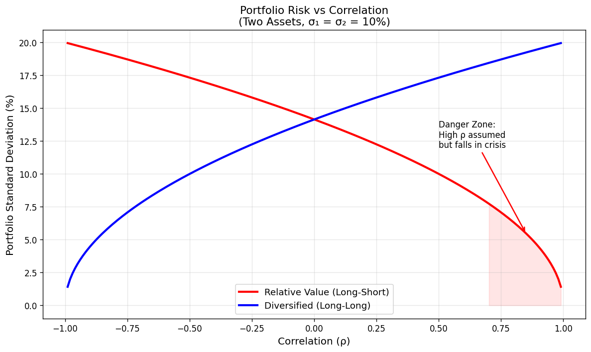
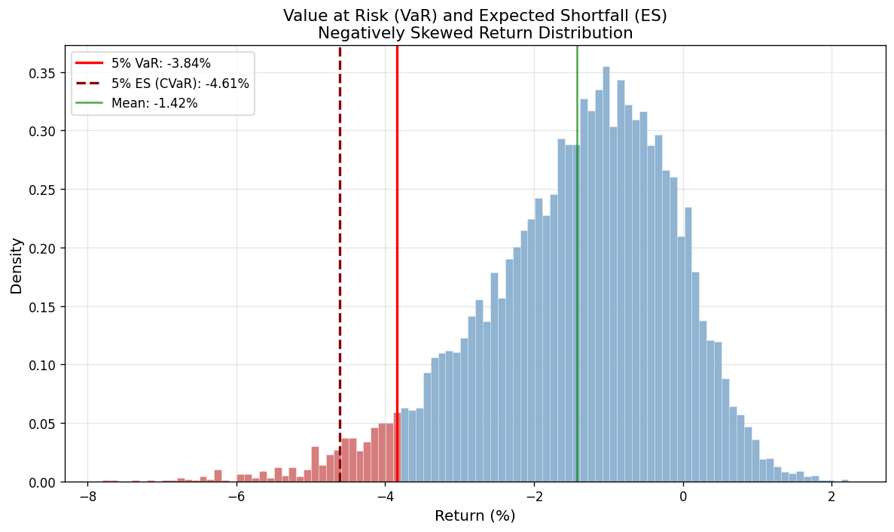

# Measuring & Managing Risk

- [Measuring \& Managing Risk](#measuring--managing-risk)
  - [Types of Risk](#types-of-risk)
  - [The Risk Management Process](#the-risk-management-process)
  - [Standard Deviation as a Risk Measure](#standard-deviation-as-a-risk-measure)
  - [The Effect of Correlation Changes on Portfolio Risk](#the-effect-of-correlation-changes-on-portfolio-risk)
  - [Using Standard Deviation for Loss Probabilities](#using-standard-deviation-for-loss-probabilities)
  - [Value at Risk (VaR)](#value-at-risk-var)
    - [VaR and Standard Deviation](#var-and-standard-deviation)
    - [VaR for Non-Gaussian Returns](#var-for-non-gaussian-returns)
  - [Expected Shortfall](#expected-shortfall)
  - [Other Risk Measures](#other-risk-measures)

## Types of Risk

In financial trading, there are several types of risk:

| Risk Type                         | Description                                                                                   | Example                                          |
| :-------------------------------- | :-------------------------------------------------------------------------------------------- | :----------------------------------------------- |
| **Market risk**                   | Adverse price movements, quantified using a statistical model                                 | Equity market crash                              |
| **Market risk model risk**        | The statistical risk model itself is wrong                                                    | Long Term Capital Management                     |
| **Credit / counterparty risk**    | A counterparty cannot pay on a successful trade                                               | Numerous Bitcoin exchange failures               |
| **Liquidity risk**                | Inability to trade when exiting a position                                                    | LTCM; Brian Hunter's natural gas bet at Amaranth |
| **Funding risk**                  | Funding for a leveraged position is withdrawn, mismatched, or becomes prohibitively expensive | UK LDI crisis, September 2022                    |
| **Valuation model risk**          | The valuation model for assets is incorrect                                                   | Gaussian copula model failures pre-2008          |
| **Operational / IT / Legal risk** | Process failures behind the trade                                                             | Robinhood halting GameStop trading, January 2021 |
| **Reputational risk**             | Applies primarily to institutional traders                                                    | Goldman Sachs ABACUS CDO, 2007                   |

This section focuses on **market risk**, but it is vital not to forget the other categories.

## The Risk Management Process

Market risk management follows a systematic process:

1. **Identify** the risks of concern
2. **Set up measurements** to monitor each risk, and define action thresholds
3. **Monitor** the risk measures on an ongoing basis
4. **Take action** if a risk level is exceeded
5. **Reverse the action** once the situation normalises

**Simple example:**

- A portfolio with a 10% risk target (annualised standard deviation, assuming Gaussian returns) where current risk varies with forecasts
- If risk exceeds 20%, reduce positions proportionally until expected risk returns to 20%
- Once risk falls below 20%, restore positions to original levels

## Standard Deviation as a Risk Measure

Standard deviation is only a valid risk measure if returns are Gaussian normal. For non-Gaussian returns (especially those with strong negative skew), the alternative measures discussed below are more appropriate.

**Time horizon considerations:**

- Standard deviation depends on the measurement period
- Using a short period (e.g. one day) may **underestimate** potential losses if positions cannot be closed before the next day
- Using a long period may **overestimate** potential losses
- **Rule of thumb:** Use half the expected holding period as the risk horizon (e.g. for a two-week holding period, use a one-week risk horizon)

**Time scaling caveats:**

- Standard deviation can only be time-scaled if returns are independent and Gaussian
- If returns exhibit positive autocorrelation (trending), longer-horizon standard deviations will be **higher** than implied by scaling
- If returns exhibit negative autocorrelation (mean reversion), longer-horizon standard deviations will be **lower**

**Measuring portfolio standard deviation:**

Rather than using backtested returns (which may reflect varying portfolio composition, risk levels, and forecast strength over time), a forward-looking statistical model should be used:

$$\sigma_p = \sqrt{\mathbf{w}^T \Sigma \mathbf{w}}$$

For two assets:

$$\sigma_p = \sqrt{w_1^2\sigma_1^2 + w_2^2\sigma_2^2 + 2w_1 w_2 \sigma_1 \sigma_2 \rho_{1,2}}$$

## The Effect of Correlation Changes on Portfolio Risk

Standard deviations of individual assets can be forecast with reasonable accuracy. Correlations are less reliable, and changes in correlation can have a large impact on portfolio risk.

The key portfolio types where correlations are critical:

- **Relative value portfolios** with offsetting positions and high correlation (e.g. weights +1, −1)
- **Leveraged long-only portfolios** with low or negative correlations (e.g. weights +1, +1)

Assuming each asset has the same standard deviation (10% annually):

| Correlation | Relative Value $\sigma_p$ | Long Only $\sigma_p$ |
| :---------: | :-----------------------: | :------------------: |
|    −0.95    |           19.7%           |         3.2%         |
|    −0.70    |           18.4%           |         7.7%         |
|    −0.50    |           17.3%           |        10.0%         |
|    −0.30    |           16.1%           |        11.8%         |
|    0.00     |           14.1%           |        14.1%         |
|    0.30     |           11.8%           |        16.1%         |
|    0.50     |           10.0%           |        17.3%         |
|    0.70     |           7.7%            |        18.4%         |
|    0.95     |           3.2%            |        19.7%         |

> Note: Correlations of exactly ±1 are not practically achievable and are excluded.

The most dangerous scenario is for **relative value portfolios** that assume a correlation of ~0.95 and then see it fall to 0 or lower during a crisis. However, estimated correlation of US stocks and bonds has touched −0.5 in recent years, so a long-only portfolio constructed using that estimate could also see significant risk increases.

## Using Standard Deviation for Loss Probabilities

With a Gaussian distribution, the probability of a given loss can be calculated. Suppose weekly returns with a Sharpe Ratio of 0.5 and a risk target of 20%:

- Mean weekly return: $10\% / 52 \approx 0.2\%$
- Weekly standard deviation (time-scaled): $20\% / \sqrt{52} = 2.77\%$
- Probability of a loss ≥ 2σ below the mean: $0.2\% - 2 \times 2.77\% = -5.35\%$ (approximately 2.2% probability)

**Key distribution points:**

| Tail Probability | Distance Below Mean |
| :--------------: | :-----------------: |
|        5%        |    $1.64\sigma$     |
|        1%        |    $2.32\sigma$     |

**Effect of underestimating risk due to correlation shifts:**

For a relative value portfolio with assumed correlation 0.95, the annualised $\sigma_p$ is 3.16% (0.443% weekly). The 1% weekly tail would be at a loss of approximately 1%.

If the correlation drops to zero, $\sigma_p$ rises to 14.1%. The 1% weekly tail becomes a loss of 4.4%. With constant risk targeting at 10% and leverage of $10/3.16 = 3.16$, the 1% weekly tail would increase to an alarming 14% loss.

## Value at Risk (VaR)

**Value at Risk** is probably the most popular risk model in the financial industry. VaR is defined as the **loss at some confidence level** over a given holding period.

> Example: If the 5% daily VaR is \$10,000, there is a 5% chance of losing **at least** \$10,000.

Typical confidence intervals: 1%, 5%, or 10%.

VaR was developed by JP Morgan in the early 1990s due to the poor track record of Gaussian normality in measuring risk of real financial assets, and the growth of non-linear derivatives. VaR was officially adopted as part of the **2004 Basel II** framework.

> **Reference:** VaR featured in the film _Margin Call_ (2011) about the 2008 financial crisis.

### VaR and Standard Deviation

If returns are Gaussian normal, VaR is simply the tail loss already discussed. Like standard deviation, VaR is dependent on the measurement horizon and has the same time-scaling properties.

**Example** (weekly returns, SR = 0.5, risk target = 20%):

- 5% VaR: $0.2\% - 1.64 \times 2.77\% = -4.34\%$
- 1% VaR: $0.2\% - 2.32 \times 2.77\% = -6.22\%$

### VaR for Non-Gaussian Returns

VaR has an advantage over standard deviation for non-Gaussian returns, as it actually **measures** the tail probability from the distribution rather than inferring it.

**Example:** Consider ten returns: +2%, +2%, +2%, +2%, +1%, +1%, +1%, +1%, −3%, −9%. The mean is zero and the standard deviation is 3.50%.

| Measure  | Using $\sigma$ (Gaussian assumption) | Using actual VaR |
| :------- | :----------------------------------: | :--------------: |
| 20% tail |                −2.35%                |      −3.0%       |
| 10% tail |                −4.5%                 |      −9.0%       |

The Gaussian assumption significantly **underestimates** tail risk for negatively-skewed distributions.

VaR is an estimate based on a return distribution and therefore has its own parameter uncertainty.

## Expected Shortfall

One of the biggest criticisms of VaR is misinterpretation: a 5% VaR of \$10,000 does **not** mean there is a 5% chance of losing exactly \$10,000. It means there is a 5% chance of losing **at least** \$10,000. With fat tails or negative skew, the actual loss could be far greater.

The **Expected Shortfall** (ES; also known as Expected Loss or Conditional VaR / CVaR) is the expected value of all losses at or beyond a given confidence interval.

**Example** (same ten returns as above):

- 20% VaR = −3%
- 20% ES = average of 3% and 9% = **6%**
- Interpretation: there is a 20% chance of losing an **average** of 6%

This aligns with the intuitive way most people think about losses.

**ES for Gaussian distributions:**

| Tail Probability | VaR (in $\sigma$) |   ES (in $\sigma$)   |
| :--------------: | :---------------: | :------------------: |
|       20%        |   $0.84\sigma$    | $\approx 1.4\sigma$  |
|       10%        |   $1.28\sigma$    | $\approx 1.75\sigma$ |
|        5%        |   $1.64\sigma$    | $\approx 2.0\sigma$  |
|        1%        |   $2.32\sigma$    | $\approx 2.65\sigma$ |

Note: at more extreme confidence intervals, the ratio of ES to VaR decreases.

## Other Risk Measures

| Measure                        | Description                                                                                |
| :----------------------------- | :----------------------------------------------------------------------------------------- |
| **Maximum / Average Drawdown** | Expected cumulative loss over a given period                                               |
| **Beta**                       | Exposure to market risk (extendable to multiple risk factors)                              |
| **Duration Risk**              | Exposure to interest rate movements                                                        |
| **Option Greeks**              | Sensitivity to option pricing inputs ($\Delta$, $\Gamma$, $\Theta$, $\mathcal{V}$, $\rho$) |

Risk management is a vast and complex subject, and this section has only scratched the surface.
