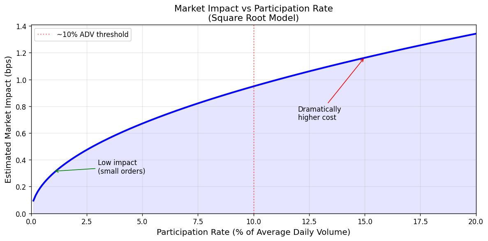
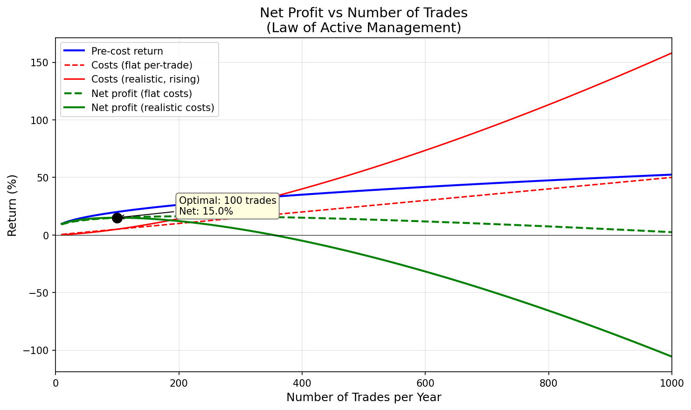
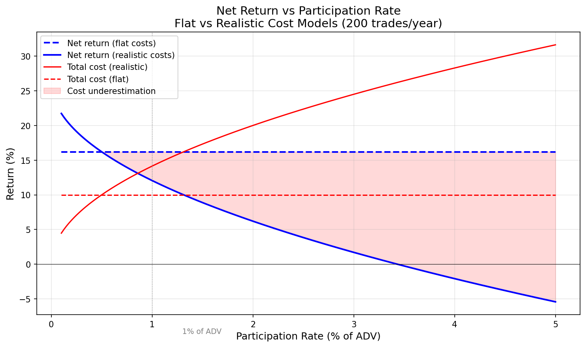
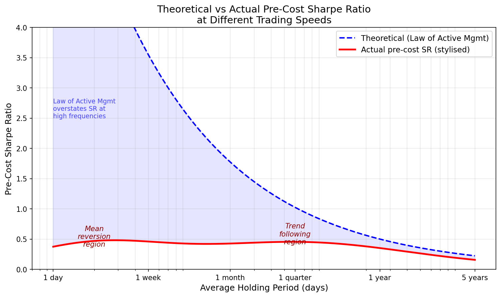

# Trading Speed, Execution & Costs

- [Trading Speed, Execution \& Costs](#trading-speed-execution--costs)
  - [Does Trading Faster Improve Returns?](#does-trading-faster-improve-returns)
  - [Measuring Costs](#measuring-costs)
  - [Execution Costs and the Order Book](#execution-costs-and-the-order-book)
    - [Sources of Execution Cost Data](#sources-of-execution-cost-data)
  - [Strategy Types and Cost Assumptions](#strategy-types-and-cost-assumptions)
    - [High-Frequency Trading (HFT)](#high-frequency-trading-hft)
    - [Intra-Day Trend Following (Non-HFT)](#intra-day-trend-following-non-hft)
    - [Mean Reversion Strategies](#mean-reversion-strategies)
    - [Slower Strategies](#slower-strategies)
  - [Normalising Execution Costs](#normalising-execution-costs)
  - [Strategy Cost Calculation](#strategy-cost-calculation)
  - [How Fast Should Trading Be?](#how-fast-should-trading-be)
    - [Costs Are Not Fixed](#costs-are-not-fixed)
    - [Markets Are Not Fractal](#markets-are-not-fractal)
    - [Uncertainty of Returns vs Certainty of Costs](#uncertainty-of-returns-vs-certainty-of-costs)
  - [Reducing Costs](#reducing-costs)

## Does Trading Faster Improve Returns?

Naïvely, one might assume that if \$10,000 per month can be earned trading once per day, then \$20,000 could be earned trading twice per day, or \$1 million trading 100 times per day. Trading faster _might_ generate more revenue, but it will **definitely** cost more.

## Measuring Costs

There are two main categories of cost: **holding costs** and **trading costs**. Holding costs are incurred regardless of whether additional trading occurs after the initial investment. They are important for longer-term investors but are not directly relevant to the question of trading speed.

**Trading cost categories:**

| Cost Type                     | Description                                                     |
| :---------------------------- | :-------------------------------------------------------------- |
| **Taxes**                     | E.g. stamp duty in the UK                                       |
| **Brokerage commissions**     | Fee paid to the broker                                          |
| **Exchange fees and rebates** | Fee paid to (or received from) the exchange                     |
| **Execution cost**            | Difference between the mid-price and the actual execution price |

For smaller investors, taxes, commissions, and exchange fees dominate. For larger investors (or anyone trading in volume or illiquid markets), **execution cost** becomes more significant — and is much harder to forecast.

## Execution Costs and the Order Book

The execution cost is the difference between the traded price and the market's mid-price. To understand this, consider a simple order book:

| Bid Price | Size |     | Offer Price | Size |
| :-------: | :--: | --- | :---------: | :--: |
|  \$1.50   |  50  |     |   \$1.51    |  25  |
|  \$1.49   | 100  |     |   \$1.52    |  50  |
|  \$1.48   |  75  |     |   \$1.53    | 200  |

The **mid-price** is the average of the best bid and best offer: $(\$1.50 + \$1.51) / 2 = \$1.505$.

- Buying ≤ 25 shares costs \$1.51 per share
- Selling ≤ 50 shares yields \$1.50 per share
- Buying 200 shares: $(25 \times \$1.51 + 50 \times \$1.52 + 125 \times \$1.53) / 200 = \$1.525$ — 2 cents above mid
- Selling 200 shares: $(50 \times \$1.50 + 100 \times \$1.49 + 50 \times \$1.48) / 200 = \$1.49$ — 1.5 cents below mid
- Average execution cost for 200-share trades: approximately 1.75 cents worse than mid

> The term **market impact** is sometimes used to refer to execution costs.

### Sources of Execution Cost Data

| Source                           | Advantages                                                                        | Disadvantages                                           |
| :------------------------------- | :-------------------------------------------------------------------------------- | :------------------------------------------------------ |
| **Measured actual traded costs** | Accounts for order book changes; allows testing of different execution strategies | Requires trading history; may lag if style/size changes |
| **Inferred from order book**     | No trading history needed; can model size/style changes                           | Does not capture live market reactions to orders        |

In practice, experienced fund managers use a combination of both sources.

## Strategy Types and Cost Assumptions

Different strategies trade in different ways and require different cost assumptions:

### High-Frequency Trading (HFT)

- Difficult to model execution costs when trading affects the order book
- Very difficult to backtest — profit structure is determined by fill quality
- Strategies must be actually traded to assess viability
- Statistical significance is quickly achieved due to thousands of daily trades
- Average HFT Sharpe Ratio ≈ 4; firms running multiple strategies achieve SR of 10–100

> **Reference:** Baron, M. et al. (2014) "Risk and Return in High Frequency Trading"

Strategies have a relatively short half-life and are quickly discovered by other participants.

### Intra-Day Trend Following (Non-HFT)

- Relatively expensive: fast turnover with short holding periods (minutes)
- Always trades in the direction of the market (buying in rising markets, selling in falling)
- Cannot afford to wait; must pay at least half the bid-ask spread plus any price movement during execution

### Mean Reversion Strategies

- Can place **limit orders** and wait for the market to reach the desired level
- In theory, the trader _earns_ half the bid-ask spread on each trade
- Larger traders must spread purchases across prices, showing only the nearest order
- **Risk:** If the market moves against the position (e.g. selling into a rising market that keeps rising), a **stop-loss** exit is required — which is expensive as it involves urgent trading in the prevailing direction

### Slower Strategies

- Holding periods of days, weeks, or months
- Can be patient when establishing positions (e.g. trading gradually over several days)
- **Execution algorithms** can reduce costs by intelligently switching between limit and market orders based on order book state

## Normalising Execution Costs

Execution costs vary across instruments, time of day, weekday, month, and market environment. To enable comparison:

1. **Normalise quantity by daily volume** — the **participation rate.** Trading 100,000 shares of BP (~0.25% of 40 million daily volume) is much easier than trading 10 shares of a small-cap stock (~1.3% of 750 daily volume).

2. **Normalise cost by price volatility** — though this is less common. Trading is usually more expensive during volatile periods.

> **Reference:** Frazzini, A. et al. (2014) "Trading Costs of Asset Pricing Anomalies"

Market impact increases as participation rate rises, typically modelled as a **concave function**. However, impact increases dramatically above ~10% of daily volume.

## Strategy Cost Calculation

**Example — Eurodollar futures:**

The bid-ask spread is normally 0.005 (e.g. inside spread 97.835–97.840). Half the spread is 0.0025. Adding estimated market impact of 0.0075 gives a total execution cost of 0.01 per trade.

Since each 1-point move in the Eurodollar is worth \$2,500, the cost per buy or sell is \$25.

With \$1,000,000 in capital, a 10% standard deviation target, and an expected 1,000 contracts traded per year:

- Total annual cost: $1{,}000 \times \$25 = \$25{,}000$
- As annualised return: $\$25{,}000 / \$1{,}000{,}000 = 2.5\%$
- In Sharpe Ratio units: $2.5\% / 10\% = 0.25$

> Note: Doubling the trading volume approximately doubles costs (and more than doubles for large funds due to increased market impact).

## How Fast Should Trading Be?

From the **Law of Active Management**, the information ratio increases by the square root of the number of independent trading opportunities:

> **Reference:** Grinold, R. and Kahn, R. (1999) _Active Portfolio Management_, McGraw-Hill

**Example:** 15% pre-cost returns over benchmark, 5% benchmark return, 5% costs for 100 trades/year. Post-cost return: $15\% + 5\% - 5\% = 15\%$. Doubling trades gives $15\% \times \sqrt{2} = 21.2\%$ over benchmark, total $26.2\%$, less doubled costs of 10%: net $16.2\%$.

### Costs Are Not Fixed

Doubling turnover does not simply double costs, because cost per trade rises with participation rate.

**Example:**

- At 0.5% of ADV: cost = 0.05% per trade → 100 trades → 5% total
- At 1.0% of ADV: cost rises to ~0.075% per trade → 200 trades → 15% total (3× cost, not 2×)

Pre-cost excess return rises from 15% to $15\% \times \sqrt{2} = 21.2\%$, but post-cost return falls from 15% to $21.2\% + 5\% - 15\% = 11.2\%$.

### Markets Are Not Fractal

The law of active management assumes that the number of profitable opportunities scales with trading frequency. This is not true — market behaviour varies with time scale.

**Illustration:** Warren Buffett has an information ratio of ~0.70 with an average holding period of ~5 years. If the law of active management held at all frequencies, becoming an HFT trader (holding period ~1 second) would imply an information ratio of ~4,250. The most successful HFT firm on the planet achieves approximately 100.

This absurdity ignores several facts:

1. Trading at different speeds requires different skills, knowledge, and technology
2. The number of profitable opportunities does not scale uniformly
3. Style drift concerns from investors
4. **Markets are not fractal** — behaviour at one time scale does not replicate at another

From the EWMAC fitting analysis: at slower frequencies, trend following is more profitable. At the fastest speeds, mean reversion becomes more profitable. The transition means that speeding up a trend-following rule eventually _reduces_ pre-cost performance.

### Uncertainty of Returns vs Certainty of Costs

Pre-cost returns carry considerable uncertainty (as established in earlier sections), whereas costs are known with much greater precision.

**Key principle:** Given two strategies with identical expected post-cost returns, the strategy with **lower costs** should be favoured. The lower-cost strategy has less uncertain net returns.

## Reducing Costs

Several execution tactics can reduce trading costs:

| Tactic                              | Description                                                                                                          |
| :---------------------------------- | :------------------------------------------------------------------------------------------------------------------- |
| **Trading more slowly**             | Lower participation rate reduces market impact                                                                       |
| **Limit orders** (vs market orders) | Potentially earn the spread rather than pay it                                                                       |
| **Execution algorithms**            | Split orders into pieces; adapt to order book state; switch between aggressive and passive execution                 |
| **Smoothing**                       | Adjust positions gradually rather than immediately; works best for strategies with long investment horizons          |
| **Buffering**                       | Ignore small position adjustments; trade only when position is significantly different from optimal (e.g. >10% away) |

**Buffering example:** If the desired unrounded position is 133.48 Italian government bond futures (133 rounded), and it changes to 133.52 (134 rounded), buying one contract for such a small change is not worthwhile after accounting for commission and spread. With a 10% buffer, the target position would need to reach 147 before a trade is placed. Buffering significantly reduces costs with negligible impact on pre-cost performance.

> Not all tactics work for every strategy type. Fast trend-following strategies cannot afford to trade slowly or use limit orders. Mean reversion strategies can use limit orders except when implementing a stop-loss.
